# My-Agent: Design & Architecture

A terminal-native AI coding agent built with TypeScript and Bun. It combines an extensible agent loop, a rich Ink/React TUI, persistent memory, skill injection, tiered context compaction, and a composable tool dispatch system into a single CLI application.

---

## Table of Contents

- [Overview](#overview)
- [Project Structure](#project-structure)
- [Runtime Assembly](#runtime-assembly)
- [Configuration](#configuration)
- [Core Types](#core-types)
- [The Agent Loop](#the-agent-loop)
- [Context & Token Management](#context--token-management)
- [Tool System](#tool-system)
- [Tool Dispatch Pipeline](#tool-dispatch-pipeline)
- [Context Compaction](#context-compaction)
- [Providers](#providers)
- [Sub-Agent Delegation](#sub-agent-delegation)
- [Memory System](#memory-system)
- [Skills System](#skills-system)
- [Todo System](#todo-system)
- [Session System](#session-system)
- [Trace System](#trace-system)
- [Self-Evolution System](#self-evolution-system)
- [Terminal UI (TUI)](#terminal-ui-tui)
- [Data Flow](#data-flow)
- [Architecture Rules](#architecture-rules)
---

## Terminology

### Agent Loop

| Term | Definition |
|------|-----------|
| **Agent Loop** | The async generator in `Agent.runAgentLoop()` that cycles through Phase 1 (setup) → Phase 2 (LLM turn) → Phase 3 (tool execution) → repeat/teardown. |
| **Run** | A single `agent.runAgentLoop()` invocation — one complete agent session from user input to final response. |
| **Turn** | One LLM invocation + its tool executions. A run contains multiple turns. |
| **Tool Execution** | A single tool call within a turn. Has name, success/failure, duration, and optional error message. |
| **Onion Middleware** | Composable middleware where each layer wraps the next: outer runs first → inner runs last → result flows back. |
| **Agent Middleware** | Onion-pattern hooks: `beforeAgentRun`, `beforeCompress`, `beforeModel`, `afterModel`, `beforeAddResponse`, `afterAgentRun`. |
| **Tool Middleware** | Onion-pattern tool wrappers: `PermissionMiddleware` → `ReadCacheMiddleware` → `TraceToolMiddleware` → `tool.execute()`. |

### Context & Compaction

| Term | Definition |
|------|-----------|
| **Token Budget** | Maximum tokens allowed for conversation context. Tracked incrementally for O(1) budget checks. |
| **Compaction** | Multi-tier context compression: snip → summarize → truncate → collapse. Triggered when token usage exceeds thresholds. |
| **Compaction Tier** | One of 5 levels: 0 (none, <60%), 1 (snip, 60-75%), 2 (auto-compact, 75-95%), 3 (reactive, API error), 4 (collapse, >95%). |
| **Ephemeral Reminder** | Injected context that does not persist in message history (e.g., retrieved memories, MCP resource catalogs). |

### Memory

| Term | Definition |
|------|-----------|
| **Semantic Memory** | User preferences and reusable facts ("user prefers TypeScript", "project uses pnpm"). ~200 entry limit. |
| **Episodic Memory** | Past conversation records and decisions. ~500 entry limit, LRU eviction. |
| **Project Memory** | Project-specific facts, architecture notes, conventions. Stored in `.my-agent/memory-project.json`. |
| **Memory Extraction** | LLM-based process that extracts key facts from conversation and writes them to memory stores. Triggered by explicit trigger words ("记住", "remember"). |

### Skills

| Term | Definition |
|------|-----------|
| **Skill** | A markdown file (`SKILL.md` with YAML frontmatter) that teaches the agent a reusable workflow or domain knowledge. |
| **Skill Injection** | The process of listing/presenting available skills to the LLM in the system prompt. Uses progressive loading: metadata always visible, full content loaded on demand. |
| **Skill Source** | Where a skill is loaded from: `skills/` (project, user-created) or `~/.my-agent/skills/auto/` (auto-generated). Project overrides auto for same-name skills. |

### Trace & Evolution

| Term | Definition |
|------|-----------|
| **Trace** | The structured record of a run (TraceRun): all turns, tool executions, token usage, timing, and outcome. Persisted as NDJSON in `~/.my-agent/traces/`. |
| **Nudge** | A signal generated after a run completes, indicating the trace contains a pattern worth reviewing. Three signals: error burst, complex task, periodic. |
| **Review Agent** | A lightweight background agent (Phase 2) that analyzes a trace when a nudge fires, producing auto-generated skills. |
| **Auto Skill** | A skill created by the Review Agent in `~/.my-agent/skills/auto/`. Tracked for effectiveness; user can approve or delete via `/review`. |
| **Effectiveness Score** | `successful_runs / total_runs_with_skill` for an auto skill. Low scores trigger Tier 2 LLM analysis (Phase 3). |
| **Tier 1 / Tier 2** | Tier 1 = mechanical scoring (success rate). Tier 2 = LLM deep analysis triggered when Tier 1 score is low. |
| **Evolution** | The full closed loop (trace → nudge → review → skill → measurement → feedback) that enables the agent to self-improve. |

### MCP

| Term | Definition |
|------|-----------|
| **MCP (Model Context Protocol)** | External tool/resource/prompt servers connected via stdio, SSE, or HTTP transport. Tools are namespace-prefixed (`mcp__<server>__<tool>`). |
| **MCP Transport** | Connection method: stdio (local child process), SSE (remote Server-Sent Events), or streamable-http. |

### Other

| Term | Definition |
|------|-----------|
| **Sub-Agent** | An independent Agent instance spawned by `SubAgentTool` with isolated context, filtered tools, and reduced token limit. Parent and child linked by `parentRunId` in traces. |
| **Session** | A named, persistable conversation. Saved as JSONL in `~/.my-agent/sessions/`. Auto-saved after each run. |
| **Todo** | A task list item tracked throughout conversation turns. States: pending → in_progress → completed / cancelled. |
| **Provider** | LLM backend implementation (Claude or OpenAI). Implements `stream()` and `getModelName()`. |
| **Tool Registry** | The set of all registered tools available to the agent, keyed by tool name. |
| **Tool Dispatcher** | Executes tool calls with three modes: sequential, parallel batch, parallel streaming. |

---

## Overview

My-Agent is an AI assistant that runs in your terminal. You type instructions, it reasons about them, calls tools (reading files, running commands, searching code), and responds. It can remember things across sessions, learn domain-specific skills, manage task lists, and delegate complex work to sub-agents — all while keeping the conversation within token limits through a multi-tier compaction system.

The project has two run modes:

- **Headless** (`bin/my-agent.ts`) — runs the agent loop without a UI, useful for scripting
- **TUI** (`bin/my-agent-tui-dev.ts`) — full interactive terminal interface with streaming output, syntax highlighting, and tool status display

---

## Project Structure

```
my-agent/
  bin/                        # CLI entry points (thin wrappers, no logic)
  src/
    agent/                    # Core agent loop and orchestration
      compaction/             # Multi-tier context compression
        tiers/                # Compaction tier implementations
      tool-dispatch/          # Tool execution pipeline
        middlewares/          # Permission, read-cache middleware
    cli/tui/                  # Ink/React terminal UI
      views/                  # View components organized by purpose
        chrome/               # InputBox, Footer, StreamingIndicator, Header
        final/                # FinalItemView dispatch + per-kind views (AssistantMessageView, AssistantHeaderView, CommittedBlockView, ToolCallFinalView, AssistantTailView, UserMessageView, FinalToolCallView, etc.)
        active/               # ActiveAssistantView, LiveTextSegment (tail-only)
        overlay/              # FocusedToolDetail, AskUserQuestionPrompt, PermissionPrompt
      components/             # Shared components (CommandList, CodeBlock, HighlightedInput, FilePicker)
      hooks/                  # Agent subscription, command input, permission, bracketed paste
      commands/               # Slash command handlers (session, mcp, diagnostic, review, compact)
      state/                  # Zustand store + types
    config/                   # YAML-based configuration system
    evolution/                # Self-evolution: review agent, effectiveness tracking, skill analysis
    mcp/                      # MCP client (server lifecycle, tool adapter, prompts, resources)
    memory/                   # Persistent memory (semantic, episodic, project)
    providers/                # LLM providers (Claude, OpenAI)
    session/                  # Conversation session persistence
    skills/                   # Skill file loading and injection
    todos/                    # Task list management
    tools/                    # Built-in tool implementations
    trace/                    # Trace recording: buffer, store, redactor, nudge engine, middleware
    utils/                    # Shared utilities (debug logging, file detection)
    runtime.ts                # Single assembly point for the full agent runtime
    types.ts                  # Shared type definitions
  tests/                      # Test suite (mirrors src/ structure)
  skills/                     # Skill definition files (SKILL.md per skill)
```

---

## Runtime Assembly

Everything wires together in one place: `src/runtime.ts` exports a single function, `createAgentRuntime()`. This is the **only** way to assemble the application. CLI entry points in `bin/` parse arguments and call it — they never construct core objects directly.

```typescript
const { agent, provider, toolRegistry, contextManager, sessionStore, shutdown } =
  await createAgentRuntime({ tokenLimit, defaultSystemPrompt, hooks });
```

The assembly process:

1. **Create a Provider** (Claude or OpenAI) from settings and environment variables
2. **Build the compaction manager** (multi-tier compression if enabled)
3. **Create the ContextManager** — the message store and token budget tracker
4. **Build the ToolRegistry** and register all built-in tools (bash, read, grep, glob, ls, text_editor, ask_user_question)
5. **Wire up Todo** — creates the `todo_write` tool and a middleware that injects reminders
6. **Create and register the SubAgentTool** — isolates tool registry to prevent recursive spawning
7. **Assemble MCP Client** — load server configs from settings, register management tools immediately, start connections in background (non-blocking, 10s timeout per operation), register server-specific tools/prompts/resources via `onReady` callback as they become available
8. **Set up Memory** — three JSONL stores (semantic, episodic, project), keyword retriever, LLM extractor, and injection middleware
9. **Set up Skills** — loads `SKILL.md` files, creates middleware that lists them for the model
10. **Set up Session** — auto-save hook persists conversation after each run
11. **Build the tool middleware chain** — Permission guard, ReadCache, Trace tool middleware
12. **Wire Trace + Evolution** — createTraceMiddleware for trace recording + NudgeEngine; initEvolution for background review + effectiveness tracking (if enabled)
13. **Create the Agent** with all components
14. **Return** the assembled runtime

The `AgentRuntime` interface exposes everything callers need — `agent`, `provider`, `toolRegistry`, `contextManager`, `sessionStore`, `memoryMiddleware`, `skillLoader`, `mcpManager` (if MCP enabled), and `shutdown`.

---

## Configuration

The configuration system loads settings from three layers (lowest to highest priority):

1. **Built-in defaults** (`src/config/defaults.ts`) — sensible values for all settings
2. **Project config** (`./settings.yml`) — per-repository overrides
3. **User config** (`~/.my-agent/settings.yml`) — personal preferences
4. **Environment variables** — `MODEL`, `ANTHROPIC_API_KEY`, `OPENAI_API_KEY`, `DEBUG` etc.

All settings are validated through Zod schemas (`src/config/schema.ts`). The `getSettings()` function caches the loaded config after first access.

### Key Settings Groups

| Group | What it controls |
|-------|-----------------|
| `llm` | Provider, model, API key, base URL, max tokens, temperature |
| `context` | Token limit, budget guard thresholds |
| `memory` | Base directory, max entries per store, extraction model |
| `skills` | Base directory, auto-injection, inject-on-mention |
| `mcp` | Enabled, server list, tool timeout, reconnect attempts/delay |
| `tui` | Input history (enabled, max lines), session directory |
| `subAgent` | Auto-trigger threshold, worktree isolation |
| `security` | Allowed filesystem roots |
| `compaction` | Thresholds, summary provider/model, enabled tiers |
| `trace` | Trace recording (enabled, max runs, redaction mode, nudge, review settings) |

---

## Core Types

The shared type system lives in `src/types.ts`. The most important types:

- **`Message`** — Unified message with `role` (system/user/assistant/tool), `content`, optional `tool_calls` and `tool_call_id`. Every message gets a nanoid.
- **`AgentContext`** — The context object that flows through every hook and middleware. Contains `messages[]`, `config`, `metadata` (including todo state), optional `systemPrompt` and `response`.
- **`Provider`** — Interface for LLM backends: `registerTools()`, `stream()`, `getModelName()`.
- **`Middleware`** — Onion-style hook: `(ctx, next) => Promise<AgentContext>`.
- **`AgentHooks`** — Six hook points: `beforeAgentRun`, `beforeCompress`, `beforeModel`, `afterModel`, `beforeAddResponse`, `afterAgentRun`.
- **`ToolCall`** — `id`, `name`, `arguments` (the arguments are passed to the tool implementation).
- **`ToolImplementation`** — Interface for tools: `getDefinition()` returns JSON Schema, `execute(params, ctx)` runs the tool.
- **`ToolContext`** — Per-tool execution environment: abort signal, budget info, cwd, agent type, side-effect sink.

---

## The Agent Loop

The central execution engine is `Agent.runAgentLoop()` in `src/agent/Agent.ts`. It's an **async generator** that yields `AgentEvent` objects, consumed by the TUI or headless runner.

### Conceptual Overview

**The Metaphor**: An autopilot with brakes, gearbox, and circuit breakers. User input in → feed to LLM → LLM returns tool_calls → execute tools → feed results back → loop until LLM has no more tools to call. Every turn is wrapped in middleware, timeouts, abort signals, compaction checks, and budget guards.

**Key Files**:

| File | LOC | Purpose |
|---|---|---|
| `Agent.ts` | 91 | Facade. Holds provider, contextManager, hooks, dispatcher |
| `agent-loop.ts` | 244 | Main loop. Setup → while(turn<max && !done && !aborted) → cleanup |
| `single-turn.ts` | 310 | One turn: beforeCompress → compact → beforeModel → stream → afterModel |
| `run-tools.ts` | 200 | Execute tool_calls via budget check + wave scheduling |
| `dispatch.ts` | 116 | planExecution: split tool_calls into waves, readonly tools parallel |
| `budget-guard.ts` | 273 | Token budget fuse: proceed / delegate-to-sub-agent / compact-first |
| `loop-utils.ts` | 65 | Retry classification, exponential backoff, ephemeralReminders truncation |
| `sub-agent-tool.ts` | 363 | Spawns fresh Agent + ContextManager for isolated subtasks |
| `rate-limiter.ts` | 93 | Token-bucket rate limiter wrapping the Provider |

**Data Flow (one turn)**:

```
userMessage → runAgentLoop()
  setup
  while(...) {
    runSingleTurn: compress → beforeModel(skill/memory inject) → stream → afterModel
    if (toolCalls) {
      runTools: checkBudget → planExecution(waves) → dispatch → append results
    } else done
  }
  afterAgentRun → trace commit → Self-Evolution
```

**Trade-offs**: AgentLoop holds a singleton `activeLoop` — same instance can't process two inputs concurrently (fine for CLI, sub-agents use fresh instances). Budget-guard estimates tool output sizes via lookup table (read=3000 tokens, bash=2000) — real large files can overflow the window. planExecution's side-effect model only covers known tools; custom tools default to serial execution.

### Four-Phase Architecture

**Phase 1 — Setup (`runSetup`)**
- Adds the user's message to the context
- Runs `beforeAgentRun` hooks (skills pre-load, session init)

**Phase 2 — LLM Turn (`runSingleTurn`)**
- Runs `beforeCompress` hooks, then checks if context needs compaction
- Runs `beforeModel` hooks (skill injection, memory retrieval, todo reminders)
- Streams from the provider, yielding `text_delta` events as they arrive
- Runs `afterModel` and `beforeAddResponse` hooks
- Adds the assistant's response (including any tool calls) to context
- Returns `{ toolCalls, done }` — done is true if the model responded without tool calls

**Phase 3 — Tool Execution (`runTools`)**
- Runs budget guard to check if there's enough context space for tool output
- If budget is tight: may delegate to a sub-agent or compact first
- Dispatches tools through the `ToolDispatcher`, yielding `tool_call_start` and `tool_call_result` events
- Adds tool results to context
- If `toolErrorStrategy` is `halt` and a tool fails, throws immediately

**Phase 4 — Teardown (`runTeardown`)**
- Runs `afterAgentRun` hooks (memory extraction, session auto-save)
- Yields `agent_done` with the completion reason

### Loop Configuration

| Setting | Default | Purpose |
|---------|---------|---------|
| `maxTurns` | 25 | Max conversation turns |
| `timeoutMs` | 600000 | Overall loop timeout (10 min) |
| `toolTimeoutMs` | 120000 | Per-tool timeout (2 min) |
| `maxToolOutputChars` | 102400 | Truncation threshold (100 KB) |
| `parallelToolExecution` | true | Run independent tools in parallel |
| `yieldEventsAsToolsComplete` | true | Stream results as they finish |
| `toolErrorStrategy` | `continue` | `continue` or `halt` on tool error |

### Event Types

The loop yields a discriminated union of 16 event types:

| Event | When |
|-------|------|
| `text_delta` | Each chunk of streaming LLM output |
| `thinking_delta` | Each chunk of streaming reasoning/thinking content |
| `thinking_done` | End of reasoning block (includes optional signature) |
| `tool_call_start` | Tool execution begins |
| `tool_call_result` | Tool execution completes (includes duration, result, errors) |
| `turn_complete` | LLM turn finishes (includes token usage) |
| `agent_done` | Entire loop complete |
| `agent_error` | Fatal error in the loop |
| `sub_agent_start` | Sub-agent delegation begins |
| `sub_agent_nested` | Events from within a sub-agent |
| `sub_agent_done` | Sub-agent delegation completes |
| `budget_delegation` | Budget guard redirected a tool to a sub-agent |
| `budget_compact` | Budget guard triggered context compaction |
| `context_compacted` | Context was compressed (includes token counts) |
| `mcp_status` | MCP server connection status change |
| `evolution_review_done` | Evolution review completed, produced a new skill |

---

## Context & Token Management

`ContextManager` (`src/agent/context.ts`) is the conversation's memory. It manages:

- **Message storage** — the full conversation history
- **Token counting** — incremental cache for O(1) budget reads
- **System prompt** — dynamic injection point for skills and memory
- **Todo state** — task list that persists alongside messages
- **Compression** — delegates to the compaction strategy when over budget

### Incremental Token Cache

A key performance optimization: rather than re-counting all message tokens every time the budget guard checks remaining space (which was O(N) and blocked the event loop for ~1-2 seconds on large conversations), the cache updates incrementally. When a message is added, only that message's tokens are counted and added to the running total. The full recount only happens on infrequent operations (compaction, system prompt changes, clear).

### Budget Methods

- `getRemainingBudget()` — how many tokens are left before hitting the limit
- `getUsageRatio()` — 0-1 ratio of used to total
- `getAccumulatedOutputTokens()` — total output tokens across all turns

---

## Tool System

### Base Class

All tools extend `ZodTool<T>` (`src/tools/zod-tool.ts`), which converts Zod schemas to JSON Schema for LLM function calling definitions. The `execute()` method validates arguments against the schema, then delegates to the abstract `handle()` method.

### Built-in Tools

| Tool | Description |
|------|-------------|
| **bash** | Executes shell commands with timeout, output truncation, working directory restrictions |
| **read** | Reads files with line ranges, encoding detection, binary file detection |
| **grep** | Text/regex search with file filtering, context lines |
| **glob** | Find files by pattern with exclusions and depth limits |
| **ls** | List directory contents with sorting and metadata |
| **text_editor** | View, create, string-replace, and write file operations |
| **ask_user_question** | Present multi-choice questions to the user (1-4 parallel questions) |
| **memory** | Search, add, list, forget, and consolidate memories |
| **todo_write** | Task list management with merge behavior |
| **sub_agent** | Delegate self-contained tasks to an isolated sub-agent |
| **mcp_list_servers** | List all configured MCP servers and their connection status |
| **mcp_add_server** | Connect to a new MCP server and register its tools/prompts (persisted to settings) |
| **mcp_remove_server** | Disconnect and unregister an MCP server (persisted to settings) |
| **mcp_read_resource** | Read MCP resource contents by server name and URI |

### What Makes a Tool?

Each tool implements `ToolImplementation`:

```typescript
interface ToolImplementation<TParams = unknown, TResult = unknown> {
  getDefinition(): Tool;       // JSON Schema for the LLM
  execute(params: TParams, ctx: ToolContext): Promise<TResult>;
}
```

The `ToolContext` provides the tool with an abort signal, a read-only snapshot of the agent's context, budget information, the current working directory, and a side-effect sink (for tools like `todo_write` that modify state beyond their return value).

---

## Tool Dispatch Pipeline

`ToolDispatcher` (`src/agent/tool-dispatch/dispatcher.ts`) manages tool execution with three modes.

### Conceptual Overview

**The Metaphor**: A restaurant pass with multi-burner kitchen. The LLM can fire multiple tool calls at once. planExecution splits them into waves — cold dishes (read) can share a station, stir-fry (write/execute) needs its own burner. Each tool gets middleware wrappers, a timer, and an isolated metadata workspace.

**Key Files**:

| File | LOC | Purpose |
|---|---|---|
| `tool-registry.ts` | 82 | name → ToolImplementation map with definitions cache |
| `dispatcher.ts` | 338 | Three modes: sequential, parallel-batch, parallel-streaming |
| `types.ts` | 110 | ToolContext, ToolSink, ToolEvent, side-effect classification |
| `middleware.ts` | 20 | ToolMiddleware interface: (toolCall, ctx, next) |
| `dispatch.ts` | 116 | planExecution: wave scheduling + side-effect conflict detection |

**Tool Adjectives**: each tool declares `readonly?: boolean` (parallel-safe) and `conflictKey?(args): string|null` (return null = wave-compatible, string = exclusive). For example, sub_agent returns `null` for read_only profile, `'fs:global'` for code_editor, `'agent:global'` for general.

**Full Dispatch Flow**: runTools → planExecution (resolve conflicts → waves) → for each wave: dispatcher.dispatch → executeSingle (registry lookup → copy metadata → build middleware chain → timeout wrapper → serializeAndTruncate → collect sink._todoUpdates → ToolExecutionResult).

**Trade-offs**: `getSideEffects` is a hardcoded switch — custom tools default to either readonly-parallel or own-wave-serial, no path-aware parallelism. Timeout is per-tool, not per-wave; one slow tool blocks subsequent waves. serializeAndTruncate silently drops fields from large objects — the LLM sees an incomplete result. ToolNotFound returns a plain error string (not an exception), so typos are silently swallowed.

1. **Sequential** — one at a time, yields `start` then `result` for each
2. **Parallel Batch** — all start at once via `Promise.allSettled`, yield results after all complete
3. **Parallel Streaming** — all start at once, yield each result as it completes via `ReadableStream`

### Middleware Chain

Tool middleware follows the same onion pattern as agent hooks:

```
PermissionMiddleware → ReadCacheMiddleware → TraceToolMiddleware → tool.execute()
```

- **PermissionMiddleware** — blocks `sub_agent` and `ask_user_question` tools in sub-agent contexts (prevents recursion and nested prompts)
- **ReadCacheMiddleware** — caches file reads keyed by (path, line range, mtime) with LRU eviction at 100 entries
- **TraceToolMiddleware** — records tool execution metadata (name, success/failure, duration) for telemetry and evolution

Each middleware can short-circuit by not calling `next()`, or modify the result before returning.

---

## MCP Client

The agent can connect to external tools, resources, and prompts via the [Model Context Protocol](https://modelcontextprotocol.io/). Each connected MCP server's capabilities are adapted into the agent's native tool system.

### Design: `xxx-as-Tool`

A core design pattern: MCP resources are not separate abstractions — everything is a tool. The LLM only knows `function_call`, so every MCP capability must be discoverable and invocable through the tool interface:

| MCP Capability | How it becomes a tool |
|----------------|----------------------|
| **Tools** | Each MCP server tool becomes a `McpToolAdapter` registered as `mcp__<server>__<tool>`. Calls are forwarded through the SDK Client to the external server. |
| **Prompts** | MCP prompts are registered as standalone tools via `McpPromptRegistry.registerAsTool()`. When invoked, the prompt template is filled with the model's arguments server-side and the result is returned like a tool output. |
| **Resources** | A `createMcpResourceMiddleware()` injects a resource catalog into `ephemeralReminders` via the `beforeModel` hook, so the model knows what's available. A dedicated `mcp_read_resource` tool lets the model fetch resource contents by `<server, uri>`. |
| **Server management** | Three management tools (`mcp_list_servers`, `mcp_add_server`, `mcp_remove_server`) give the LLM self-service access to add/remove/list MCP servers at runtime. |

### Concurrency Control

`stdio` transports are process-spawning operations. To avoid resource spikes at startup, `McpManager.start()` uses `p-limit` to cap concurrent stdio connections at `MAX_STDIO_CONNECTIONS` (4). SSE and streamable-http connections are not limited.

### Failure Recovery

When a connected server's transport closes unexpectedly (`transport.onclose`), `McpManager` marks it as `error`, then attempts automatic reconnection with **exponential backoff**: `baseDelay * attempt` for up to `reconnectAttempts` (default 3). Explicit disconnects (`/mcp-disconnect`) suppress this — they mark the state as `disconnected` before closing the transport.

### Lifecycle

1. **Startup**: `assembleMcp()` reads `mcp.servers` from settings, creates `McpManager`, connects all servers with `autoStart !== false`.
2. **Runtime**: `McpManager` is stored as a singleton (`setMcpManagerInstance`) so TUI slash commands can access it. Tools and prompts are registered into the shared `ToolRegistry` and `McpPromptRegistry`.
3. **Adding servers**: Both the `/mcp-add` TUI slash command and the `mcp_add_server` AI tool call `manager.connectServer()`, register resulting tools/prompts, and persist the server config to `~/.my-agent/settings.yml` so it survives restarts.
4. **Shutdown**: `runtime.shutdown()` calls `manager.shutdown()` which disconnects all servers and clears the singleton references.

### Signal Propagation

`McpToolAdapter.execute()` forwards `ctx.signal` (the agent's abort signal) through to the SDK's `client.callTool()` as `RequestOptions.signal`. This means aborting the agent run also cancels in-flight MCP tool calls.

### Transport Types

| Transport | Use case | Connection |
|-----------|---------|------------|
| `stdio` | Local MCP servers (spawned as child processes) | `StdioClientTransport` with command + args, env inheritance from `process.env` merged with optional `config.env` |
| `sse` | Remote MCP servers over Server-Sent Events | `SSEClientTransport` at a URL |
| `streamable-http` | Remote MCP servers over the newer streamable HTTP protocol | `StreamableHTTPClientTransport` at a URL |

### TUI Integration

Five slash commands manage MCP at runtime:

| Command | Function |
|---------|----------|
| `/mcp` | Show all server connection states with tool/resource/prompt counts |
| `/mcp-add <json>` | Add and connect a server; persist to `~/.my-agent/settings.yml` |
| `/mcp-remove <name>` | Disconnect, unregister tools, and remove from settings |
| `/mcp-connect <name>` | Placeholder stub — prints an error directing users to re-add the server |
| `/mcp-disconnect <name>` | Disconnect but keep tools registered (soft disconnect) |

### Tool Naming Convention

MCP tools are prefix-namespaced: `mcp__<server_name>__<tool_name>`. Server names must not contain `__` (enforced by Zod validation). The `conflictKey` for write-tool serialization is `mcp:<serverName>`, ensuring tools from different servers can execute concurrently while tools within the same server are serialized.

---

## Context Compaction

When the conversation grows too large for the model's context window, the compaction system reduces it. It uses a **least-destructive-first** approach with five tiers:

| Tier | When | Strategy |
|------|------|----------|
| 0 — None | < 60% usage | No action needed |
| 1 — Snip | 60-75% | Truncate large tool outputs (keep head 40 + tail 10 lines) |
| 2 — AutoCompact | 75-95% | LLM summarizes old messages with a cheap model |
| 3 — Reactive | API error | Emergency: aggressive truncation when API returns `context_length_exceeded` |
| 4 — Collapse | > 95% | Nuclear: system prompt + summary + last 2 messages only |

The system also includes a fallback `TrimOldestStrategy` that removes old messages while preserving the current turn (an assistant message with tool calls is always removed together with its tool results).

---

## Providers

Two LLM backends implement the `Provider` interface:

- **ClaudeProvider** (`src/providers/claude.ts`) — wraps `@anthropic-ai/sdk`, converts internal message format to Claude API format, system prompt extracted separately
- **OpenAIProvider** (`src/providers/openai.ts`) — parallel implementation for OpenAI-compatible APIs

The factory `createProviderFromSettings()` selects the provider based on settings, with API key fallback to environment variables.

---

## Sub-Agent Delegation

`SubAgentTool` (`src/agent/sub-agent-tool.ts`) spawns an independent agent to handle self-contained tasks. Key design decisions:

- **Filtered tool registry** — sub-agents cannot spawn further sub-agents (prevents recursion) and cannot ask user questions
- **Isolated context** — fresh `ContextManager` with its own message history
- **Smaller context window** — sub-agents get a reduced token limit
- **Abort propagation** — aborting the parent aborts all sub-agents
- **Event bubbling** — sub-agent events are wrapped and forwarded to the parent's event stream

Sub-agents can also be triggered automatically by the budget guard when a large read or search would consume too much of the main conversation's remaining token budget.

---

## Memory System

### Conceptual Overview

**The Metaphor**: Three notebooks — semantic (knowledge/preferences), episodic (events/conversation snippets), project (repo-level rules in `.my-agent/memory-project.json`). Plus AGENT.md injected directly into the system prompt.

**Key Files**:

| File | Purpose |
|---|---|
| `types.ts` | MemoryEntry: id, type, title, content, tags, importance, usageCount |
| `store.ts` | JsonlMemoryStore: append-only, global at `~/.my-agent/memory/`, project at `.my-agent/` |
| `extractor.ts` | LlmExtractor using DEFAULT_SUMMARY_MODEL, triggered by keywords ("remember", "记住") |
| `retriever.ts` | KeywordRetriever: keyword 0.35 + tag 0.25 + recency 0.20 + intrinsic 0.10 + usage 0.10 |
| `middleware.ts` | Injects AGENT.md, user_preferences, retrieved memory into beforeModel |
| `tool.ts` | Memory tool for LLM-initiated writes |

**Trigger Mode**: Explicit only. afterAgentRun checks if the last user message contains trigger words — match triggers extractor → store.append. No "auto-learn" mode to prevent the model from filling memory on its own.

**Module Boundaries**:

| Dimension | Memory | Skill | Self-Evolution |
|---|---|---|---|
| What it stores | Facts (preferences, conventions) | Methods (how to do X) | Methods (produce skills) |
| Who writes | User / LLM extract | Human + Self-Evolution | Tier 0 learns from traces |
| Injection point | system + ephemeral | system catalog + ephemeral hint | Output lands in skill/auto |
| Trigger | Keywords / keyword retrieval | /tag / substring / keywordScore | idle / event / cron / threshold / manual |

**Trade-offs**: embedding field is defined but retriever doesn't use it — semantic search needs an external vector store. JsonlMemoryStore is append-only with no dedup or TTL — scanning slows over time. Extractor fires async with `void` — failures are silently lost. Project memory writes to `.my-agent/` directory, isolated from Claude Code's `.claude/`.

The agent can remember information across sessions using three memory stores:

| Store | What it holds | Typical entries |
|-------|--------------|-----------------|
| **Semantic** | User preferences, coding style, reusable knowledge | ~200 entries |
| **Episodic** | Past conversations, decisions, debugging sessions | ~500 entries |
| **Project** | Project-specific facts, architecture notes | ~50 entries |

### Architecture

1. **Storage** — `JsonlMemoryStore` uses JSONL files (semantic, episodic) and JSON files (project) in `~/.my-agent/memory/`
2. **Retrieval** — `KeywordRetriever` tokenizes queries into English words and Chinese characters, scores by keyword match (40%), tag match (30%), recency (20%), weight (10%)
3. **Extraction** — `LlmExtractor` uses a cheap model (e.g., Haiku) to extract memories from conversation and consolidate duplicates
4. **Injection** — `MemoryMiddleware` retrieves relevant memories before each model call and injects them into the system prompt inside a `<memory>` block
5. **Tool access** — The `memory` tool lets the model explicitly search, add, list, forget, and consolidate memories

---

## Skills System

### Conceptual Overview

**The Metaphor**: A wall covered in sticky notes. Each note (SKILL.md) has a front (name + description — the catalog card) and a back (full instructions). The agent normally only scans the fronts. When a user mentions a skill by name or `/tag`, the full note gets pulled into the prompt.

**Key Files**:

| File | LOC | Purpose |
|---|---|---|
| `loader.ts` | 162 | SkillLoader: two sources (`<project>/skills/` + `~/.my-agent/skills/auto/`), `gray-matter` frontmatter parsing |
| `middleware.ts` | 322 | Two-layer progressive injection |

**Two-Layer Progressive Loading**:

| Layer | Location | Content | Trigger | Cache |
|---|---|---|---|---|
| Layer 1: catalog | system prompt | name + description for ALL skills (truncated to 500 chars, XML tags sanitized) | `preloadAll()` at startup | version hash, long-lived |
| Layer 2: hint | ephemeralReminders | Full body of matched skills ONLY | Per-turn scan of user message | Per-turn, auto-cleared |

**Matching Rules** (`findMentionedSkills`): Layer A — `/skill-name` explicit syntax, no upper limit. Layer B — substring match → keywordScore (query/description word overlap) → sorted → top `maxInjectedSkills=3`.

**Auto-Skills** (Self-Evolution output): `SkillLoader.checkAutoSkills()` watches `~/.my-agent/skills/auto/` mtime. Changed → `clearCache()`. `getAutoSkillNames()` used by Self-Evolution for "what was just learned" stats.

**Trade-offs**: Path traversal fixed via `validateSkillPath`, but frontmatter `name` has no length limit. Keyword matching degrades for non-English languages (no tokenization). maxInjectedSkills=3 is a hard cap — 4th tag silently dropped. Cache invalidation by directory mtime: one skill change triggers full reload. No versioning or conflict detection — project skill silently overrides auto skill with same name.

Skills are markdown files that teach the agent domain-specific workflows. Each skill lives in `skills/<name>/SKILL.md` with optional YAML frontmatter.

### Loading

`SkillLoader` reads skills from disk, parses frontmatter (via `gray-matter`), and caches results. Skills are pre-loaded at startup.

### Injection

`createSkillMiddleware()` injects a `<skill_system>` block into the system prompt that:
- Lists all available skills with their names and descriptions as a JSON array
- Tells the model it can read the full skill content by calling `text_editor` on the skill file
- Detects when the user mentions a skill name and triggers auto-injection

This progressive loading pattern keeps the system prompt small by not loading every skill's full content upfront — the model requests what it needs.

---

## Todo System

The agent maintains a task list throughout conversation turns:

```typescript
interface TodoItem {
  id: string;
  content: string;
  status: 'pending' | 'in_progress' | 'completed' | 'cancelled';
}
```

- **`todo_write` tool** — `merge=true` updates by ID (add/change/remove), `merge=false` replaces all
- **`beforeModel` middleware** — increments step counters, injects reminders every 10 steps, prompts when all tasks are complete
- **State persistence** — stored in `AgentContext.metadata.todo`, synced through `ToolContext.sink.updateTodos()`

---

## Session System

Conversations can be saved, loaded, and resumed:

- **`SessionStore`** — persists messages as JSONL and metadata as JSON in `~/.my-agent/sessions/`
- **Auto-save** — an `afterAgentRun` hook saves the session after each agent run
- **Session commands** — `/resume [id]` (list or load by prefix match), `/save` (force-save current), `/forget <id>` (delete by prefix match) (TUI only)

---

## Terminal UI (TUI)

The TUI is built with [Ink](https://github.com/vadimdemedes/ink) (React for terminals) and uses [Zustand](https://github.com/pmndrs/zustand) for state management via `useTuiStore` (`src/cli/tui/state/store.ts`). View components live in `src/cli/tui/views/` organized by purpose: `chrome/`, `final/`, `active/`, `overlay/`. Shared components (CommandList, CodeBlock, HighlightedInput, FilePicker) live in `src/cli/tui/components/`.

### Core Rendering Architecture: Static vs Dynamic

The terminal is split into two rendering regions with fundamentally different performance characteristics:

- **Static (scrollback)** — Ink's `<Static>` component renders each item **once**, then never touches it again. Once written to the terminal, items are immutable. This is the key performance mechanism: past content never triggers Yoga re-layouts.
- **Dynamic (bottom area)** — Everything below `<Static>` is re-rendered by Ink's Yoga layout engine on every state change. During streaming, only the growing text tail and running tool spinners live here.

The fundamental design challenge: **how to move content from dynamic to static as soon as it's "settled"**, without duplicating output or breaking visual order.

### Granular FinalItem Architecture

Instead of waiting for an entire assistant turn to complete before moving it to `<Static>`, settled content is pushed to the `finalized` array incrementally as **granular FinalItem variants**. Each variant carries its own styling (notably `paddingLeft=1` for indentation) so that stacked together they are visually equivalent to a single `AssistantMessageView`.

#### FinalItem Variants

| Kind | When pushed | What it renders | Styling |
|------|------------|-----------------|---------|
| `banner` | App init | Header with model name, session ID | — |
| `user-message` | On user submit | User input text | — |
| `assistant-header` | `turnStart` | `< assistant:` label | Dim prefix + bold label |
| `committed-block` | `commitAdvance` | Settled markdown block (parsed once) | `paddingLeft=1` |
| `tool-call-final` | `toolDone` | `● tool_name Xms` + result summary | `paddingLeft=1` |
| `assistant-tail` | `turnDone` | Uncommitted text remainder | `paddingLeft=1`, raw text |
| `assistant-message` | Resume path only | Full message with all segments | `paddingLeft=1`, fancy markdown |
| `divider` | `/clear`, `/compact` | Visual separator | — |
| `system-notice` | On command output | Caption text | — |

**Key invariant**: `<Static>` is append-only. Items are never removed or mutated after insertion. This is why `committed-block`, `tool-call-final`, and `assistant-tail` exist as separate items — they represent the smallest units that can be pushed to scrollback without later modification.

#### Diagram 1: State Machine — Finalized Evolution Within a Turn

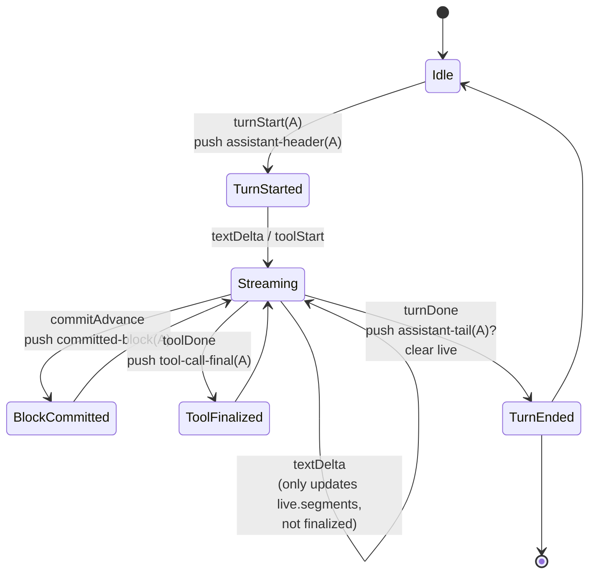

#### Diagram 2: Data Flow — From Stream Event to Screen

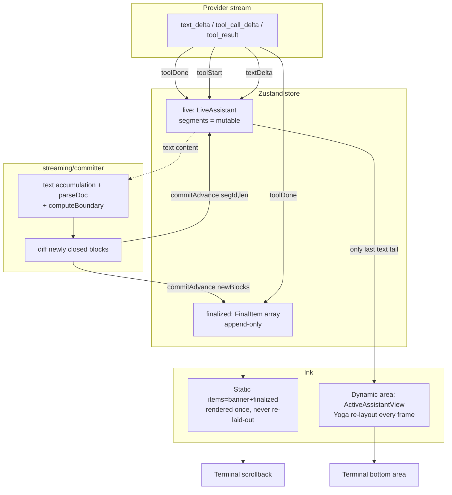

#### Diagram 3: Sequence — A Complete Turn

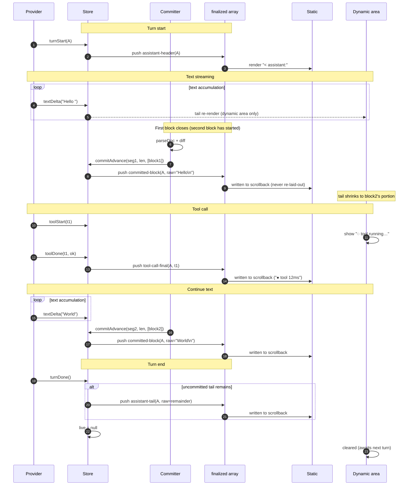

#### Diagram 4: Scrollback Layout

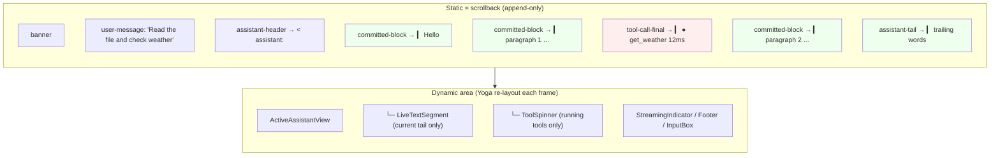

Visual consistency is achieved by every content item carrying `paddingLeft=1`. Stacked together, they are visually equivalent to a single `AssistantMessageView`, but each item is append-only friendly.

#### Diagram 5: Visual Consistency Convention

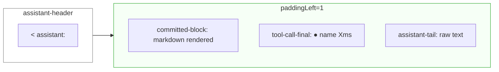

#### Diagram 6: /clear Three-Step Clearing

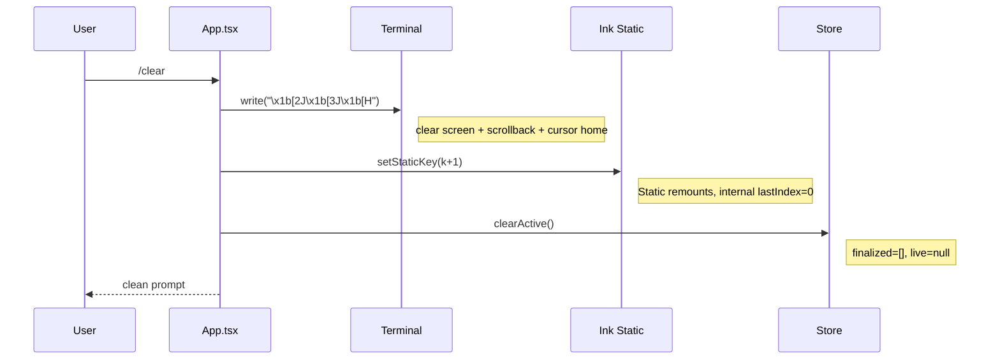

All three steps are necessary: omitting ANSI codes leaves visible lines; omitting the remount causes Ink to skip new items (it believes they are already rendered); omitting the store reset causes duplicate items on the next turn.

#### Diagram 7: Resume / Historical Message Rendering Paths (Coexistence)

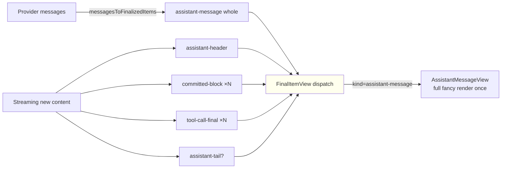

The `assistant-message` variant is only produced by `messagesToFinalizedItems()` for the resume/session-load path. During live streaming, content is always broken into granular items. Both paths render through `FinalItemView` which dispatches to the appropriate component.

#### Diagram 8: Key Invariants

| # | Invariant | Enforcement |
|---|-----------|-------------|
| I1 | text/tool items in finalized are strictly ordered by occurrence time | `toolDone` pushes immediately; `commitAdvance` pushes newly closed blocks in order |
| I2 | Exactly one `<assistant:` label per turn | `turnStart` pushes `assistant-header` once; subsequent final items never carry the label |
| I3 | No duplicate output | `turnDone` only pushes the tail; never pushes a complete `assistant-message` when granular items exist |
| I4 | Dynamic area never renders settled content | `LiveTextSegment` only draws the tail; tool spinners only show while running |
| I5 | Resume/historical path is unaffected | `assistant-message` branch retained, only used by `messagesToFinalizedItems` |

### The Committer

The committer (`src/cli/tui/streaming/committer.ts`) bridges the gap between the high-frequency text delta stream and the store's incremental finalized updates. It:

1. **Accumulates text** via `onDelta()` calls (throttled at 33ms)
2. **Parses markdown** into blocks via `parseDoc()` (with reparse heuristics: new `\n\n` or ≥80 char growth)
3. **Computes commit boundary** — a block is "committed" only when a subsequent block has started (≥2 blocks exist), ensuring we don't commit a block that's still growing
4. **Diffs newly closed blocks** — when `committedLength` advances, finds blocks whose `endOffset` falls within the advance range
5. **Calls `commitAdvance(segId, newCommittedLength, newBlocks)`** — advances the segment's committed length and pushes `committed-block` items to `finalized`
6. **Notifies React listeners** via `setImmediate` (separate tick from store update) to avoid blocking stdin I/O

### LiveAssistant vs FinalItem

During streaming, the live assistant message is stored as `LiveAssistant` (type defined in `store.ts`, not part of `FinalItem`):

```typescript
interface LiveAssistant {
  kind: 'assistant-message';
  id: string;
  segments: AssistantSegment[];
  status: 'streaming';
}
```

`LiveAssistant` is the mutable scratchpad for the current turn. It's never pushed to `<Static>` directly. Instead, granular items are extracted from it incrementally:

- `committed-block` items are derived from `commitAdvance`'s `newBlocks` parameter
- `tool-call-final` items are pushed when `toolDone` fires
- `assistant-tail` captures any text not yet committed when `turnDone` fires

The `live.segments` array serves as an in-progress index for:
- Finding the currently streaming text tail (rendered by `LiveTextSegment`)
- Showing running tool spinners in the dynamic area
- Powering `FocusedToolDetail` overlay search

### Actual Component Tree (AppV2)

```
AppV2
 ├─ Static key={staticKey} items={staticItems}
 │   └─ FinalItemView  (dispatches to)
 │       ├─ AssistantMessageView  (resume path: full message, fancy markdown)
 │       ├─ AssistantHeaderView   (streaming path: "< assistant:" label)
 │       ├─ CommittedBlockView    (streaming path: settled markdown, paddingLeft=1)
 │       ├─ ToolCallFinalView     (streaming path: completed tool result, paddingLeft=1)
 │       ├─ AssistantTailView     (streaming path: uncommitted text remainder, paddingLeft=1)
 │       ├─ UserMessageView       (user input)
 │       ├─ DividerView           (clear/compact separators)
 │       └─ SystemNoticeView      (command output captions)
 ├─ ActiveAssistantView         (only renders during streaming)
 │   ├─ LiveTextSegment         (growing text tail only)
 │   └─ ActiveToolCallSegment   (running tool spinners only, done tools are in Static)
 ├─ StreamingIndicator          (animated dots during streaming)
 ├─ FocusedToolDetail           (expanded tool call detail overlay)
 ├─ ReviewNotifications         (evolution review result cards)
 ├─ AskUserQuestionPrompt       (modal for multi-choice questions)
 ├─ PermissionPrompt            (modal for tool permission requests)
 ├─ InputBox                    (prompt input with autocomplete)
 │   ├─ CommandList             (slash-command dropdown)
 │   └─ HighlightedInput        (cursor-position-highlighted text)
 └─ Footer                      (token bar, usage stats, context gauge)
```

### `/clear` Three-Step Clearing

See [Diagram 6](#diagram-6-clear-three-step-clearing) above for the visual sequence. The three steps (ANSI clear, Static remount via `staticKey`, store reset) are all required — see the diagram notes for why omitting any step breaks the clear.

### Slash Commands

Built-in commands registered via `getBuiltinCommands()` in `src/cli/tui/command-registry.ts`:

| Command | Description |
|---------|-------------|
| `/clear`, `/cls` | Clear screen + scrollback + store (three-step) |
| `/exit`, `/quit` | Exit the TUI session |
| `/help` | List available slash commands |
| `/compact` | Force context compaction immediately |
| `/cost` | Show current session token usage and cost |
| `/tools` | List all registered tools |
| `/resume [id]` | List saved sessions or resume by ID prefix match |
| `/save` | Force-save current session |
| `/forget <id>` | Delete a saved session by ID prefix match |
| `/review <sub>` | Manage auto-generated skills (list/view/keep/delete) |
| `/mcp` | Show MCP server connection states |
| `/mcp-add <json>` | Add and connect an MCP server |
| `/mcp-remove <name>` | Disconnect and remove an MCP server |
| `/mcp-connect <name>` | Placeholder stub |
| `/mcp-disconnect <name>` | Soft-disconnect an MCP server |

Skill commands (one per loaded skill) are also available as slash commands with autocomplete.

### Performance Design

- **Granular finalized items** — content moves from dynamic to `<Static>` as early as possible, preventing Yoga re-layouts of settled content
- **Zustand with fine-grained selectors** — `useLiveItem()`, `useFrozenItems()`, `useStreaming()` isolate rendering to only the components that need the changed data
- **`Static` component** — finalized items are rendered once and never re-rendered. `CommittedBlockView`, `ToolCallFinalView`, and `AssistantTailView` all use `React.memo`
- **Committer throttling** — 33ms throttle with trailing edge ensures at most ~30 commits/second
- **`setImmediate` notification** — React listener notifications are deferred to a separate tick so the store update tick stays short (<2ms), keeping stdin I/O responsive
- **`useMemo`** — static items array and command lists are memoized to prevent unnecessary re-renders
- **Structure-key subscriptions** — `useLiveItem()` only re-renders on structural changes (new segment, tool result), not on every text delta

### State Management

The Zustand store (`useTuiStore`) holds all TUI state: finalized message items (append-only), live streaming assistant (mutable), streaming flag, context tokens, focus/expand state for tool calls, pending input queue, and notification queues. Hooks in `src/cli/tui/hooks/` encapsulate side effects:

| Hook | Purpose |
|------|---------|
| `useAgentSubscription` | Subscribes to agent event stream, dispatches to Zustand |
| `useCommandInput` | Input handling, autocomplete, history navigation |
| `useAskUserQuestionManager` | Buffers AskUserQuestion prompts during streaming |
| `usePermissionManager` | Buffers tool permission prompts during streaming |
| `useInputEditor` | Pure editor state transformations (cursor, selection) |
| `useInputHistory` | Persistent input history with file storage |
| `useBracketedPaste` | Terminal bracketed paste mode detection |
| `useTerminalWidth` | Terminal resize tracking |

---

## Data Flow

A complete turn through the system, showing how content flows from the LLM stream into both the static scrollback and the dynamic bottom area. The detailed TUI rendering flow is covered in [Diagram 3](#diagram-3-sequence-a-complete-turn) within the TUI section.

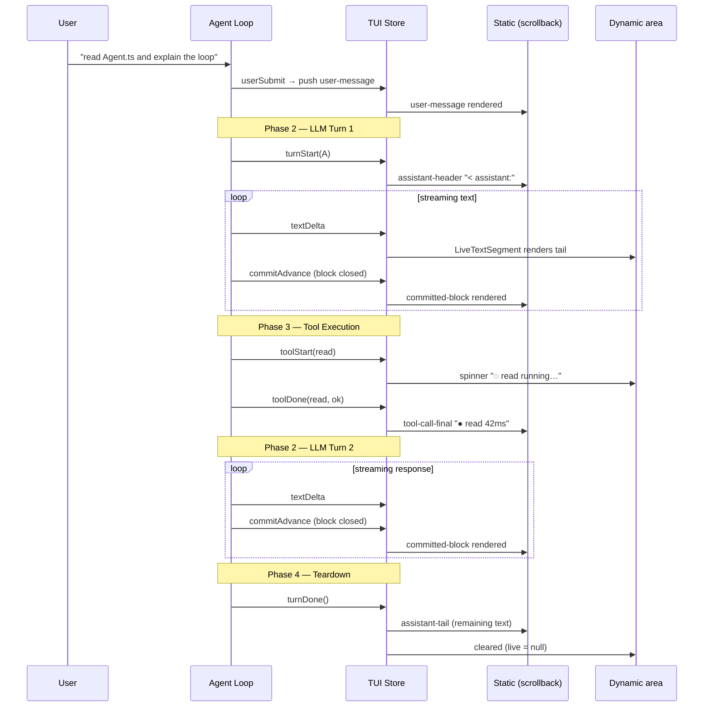

**Final scrollback state** after the turn completes:

| Static item | Rendered as |
|-------------|-------------|
| `user-message` | `> user Read Agent.ts and explain the loop` |
| `assistant-header` | `< assistant:` |
| `committed-block` | ` ▎ Let me read that file...` |
| `tool-call-final` | ` ▎ ● read 42ms` |
| `committed-block` | ` ▎ The agent loop works in four phases...` |
| `assistant-tail` | ` ▎ ...and that's how it works.` |

---

## Trace System

The Trace System (Phase 1) records agent loop execution for self-evolution. It captures every turn, tool call, LLM response, token usage, and error — persisting each run as incremental NDJSON in `~/.my-agent/traces/`.

### Architecture

```
src/trace/
  types.ts              # TraceRun, TraceTurn, TraceSummary, NudgeResult, NudgeState
  trace-buffer.ts       # Per-run accumulator, stored in AgentContext.metadata._traceBuffer
  store.ts              # TraceStore — NDJSON append + finalize + retention (max 50/session)
  redactor.ts           # DefaultRedactor — secret pattern masking + path truncation
  tool-middleware.ts    # TraceToolMiddleware — records tool execution (name, success, timing)
  agent-middleware.ts   # TraceAgentMiddleware — 3 hooks
  nudge-engine.ts       # 3-signal trigger + fingerprint dedup
  index.ts              # createTraceMiddleware() factory
```

### Hooks Used

| Hook | Action |
|------|--------|
| `beforeAgentRun` | Create TraceBuffer per-run, store in `metadata._traceBuffer` |
| `beforeAddResponse` | Record LLM response (tools called, usage, redacted text) |
| `afterAgentRun` | `setImmediate` → finalize trace + nudge check |

### Nudge Engine — Three Signals

| Signal | Condition | Rationale |
|--------|-----------|-----------|
| Error burst | `errors >= 2` AND `errors/turns >= 0.3` | Capture failure patterns while context is fresh |
| Complex task | `turns >= 5` AND `errors = 0` | Successful multi-step tasks are skill candidates |
| Periodic | Accumulated turns >= `reviewInterval` (default 10) | Catch-all for long sessions |

Fingerprint dedup prevents the same error pattern from triggering review twice. Minimum 5-minute interval between reviews.

### Data Flow

```
beforeAgentRun → beforeAddResponse → TraceToolMiddleware → afterAgentRun
     │                  │                    │                    │
  new buffer       recordModelResp    recordToolExec    setImmediate:
  → ctx.metadata   (redacted)         (timing + error)  finalize + nudge
```

---

## Self-Evolution System

The Evolution System closes the loop: agent traces → pattern detection → background review → auto-generated skills → quality measurement → iterative improvement. Phases A–F implemented, with Tier3 full pipeline deferred.

### Conceptual Overview

**What it does**: After every agent run, the system analyzes the trace. If it spots a reusable pattern (e.g. "the agent took 4 turns to figure out macOS grep flags"), it spawns a review agent to write a skill. That skill then gets mechanically scored (Tier 1) and, if underperforming, judged by an LLM referee (Tier 2). If the referee says "edit", the skill gets rewritten. The entire pipeline is backed by a persistent queue so crashes don't lose tasks, and defended by 5 layers plus per-tier circuit breakers.

**From demo to production — what each phase fixed**:

| Phase | Status | Before | After |
|---|---|---|---|
| A | Done | Tier 2 ran on empty data, files polluted cwd, path traversal bug | Real trace data, `~/.my-agent/feedback/`, name validation |
| B | Done | No concurrency control, review could fire during streaming | IdleGate, ReviewSlot, backoff, CircuitBreaker |
| C | Done | Review couldn't be cancelled mid-run | TaskRunner with softCancel + hard abort, SettledDetector |
| D | Done | Tasks lost on crash, single breaker for all tiers | PersistentQueue with O_EXCL, TierBreaker per-tier, Drainer with quotas |
| E | Done | Only nudge signals triggered review | 5 trigger types with allowedKinds filtering |
| F | WIP | No prompt self-improvement | F1 CronScheduler done, F2 Tier2 dispatcher done, F3/F4 Tier3 stubs |

**Core trade-offs that shaped the design**:
- **Fast path skips disk I/O**: nudge-triggered reviews that pass all defenses execute immediately without queuing. Crash loses one task — acceptable because the nudge re-fires next loop_settled.
- **Files as a queue**: No Redis, no SQLite. O_EXCL is POSIX-guaranteed atomic. Directory scan is O(n) but the queue is never large (tens of tasks, not thousands).
- **Dual Tier 2 paths**: trackStats fires Tier 2 directly (fast path for immediate feedback); the queue also supports cron-driven Tier 2 (slow path for scheduled review). Slightly inconsistent, but each serves its purpose.
- **Long-cycle cron via nextRunAt**: No background daemon. Daily/weekly tasks are enqueued with a future `nextRunAt`. The Drainer naturally picks them up when the user next opens a session. Late is OK — these aren't real-time deadlines.
- **Tier3 stubs are honest**: Rather than half-build a prompt optimizer without the LLM agent infrastructure it needs, the Tier3 dispatchers are clean stubs with documented pipeline steps. They'll work when the infrastructure exists.

### Architecture Overview

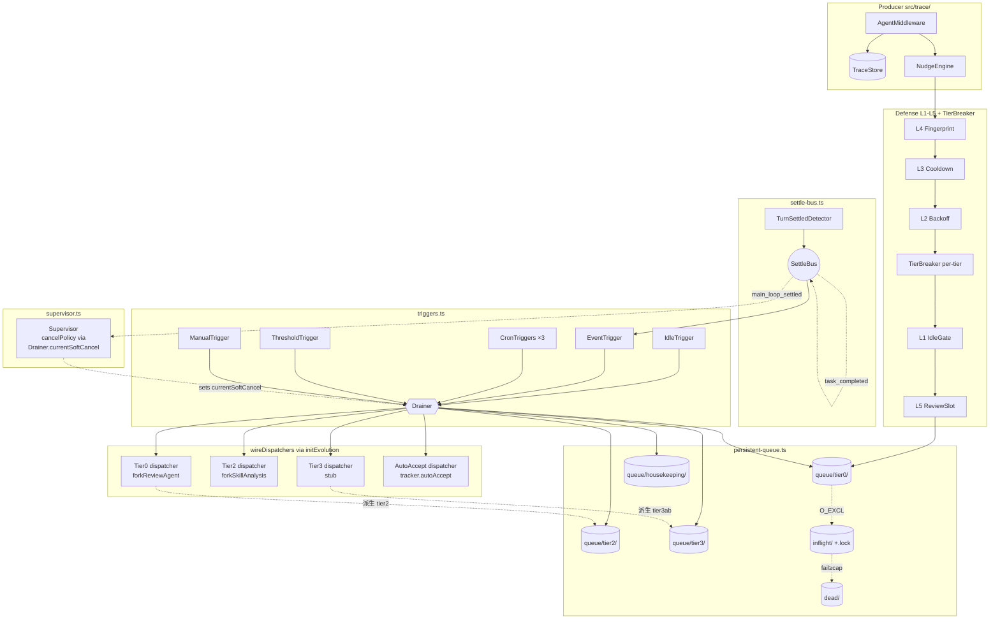

### Tiered Review Pipeline

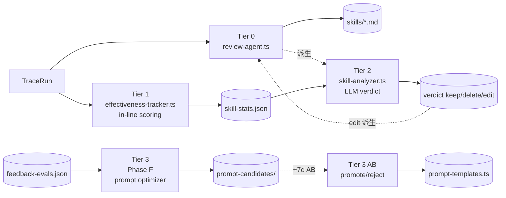

### Defense Decision Tree

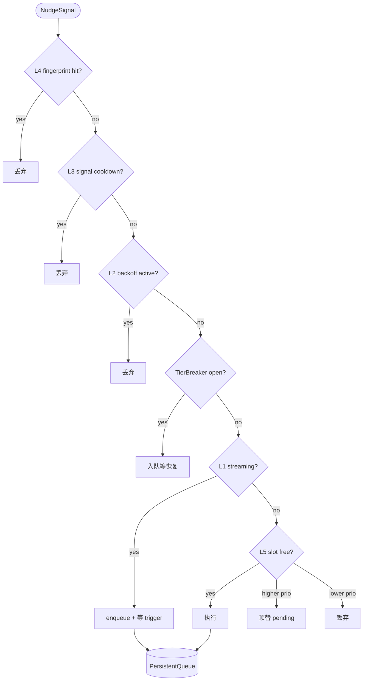

### Queue State Machine

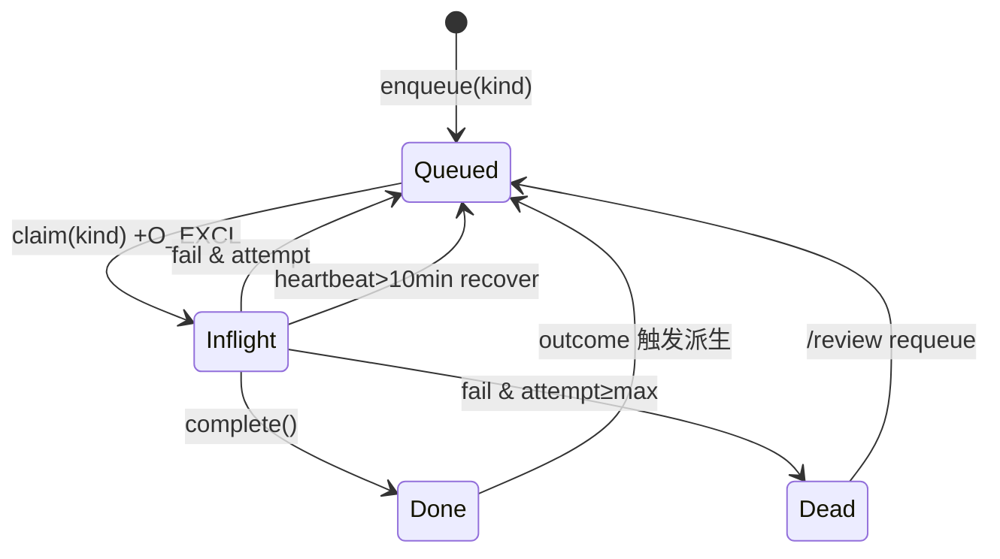

### Trigger × Tier Matrix

| Trigger | Timing | tier0 | tier2 | tier3opt | tier3ab | auto_accept |
|---|---|---|---|---|---|---|
| **IdleTrigger** | idle ≥ 30s | x | x | - | - | - |
| **EventTrigger** | loop_settled +1s | x | - | - | - | - |
| **Cron */15min** | every 15min | x | x | - | - | - |
| **Cron daily 03:00** | daily | - | - | - | x | x |
| **Cron weekly Sun** | weekly | - | - | x | - | - |
| **ThresholdTrigger** | queue per-kind ≥10 | x | x | x | - | - |
| **ManualTrigger** | /review run-now | x | x | x | x | x |

### File Layout

```
src/evolution/
  types.ts                  # ReviewConfig, SkillStats, SkillStatus, EvolutionCallback
  index.ts                  # initEvolution() factory — wires all modules
  ── Tier 0 ──
  prompt-templates.ts       # buildReviewPrompt() — 3 templates
  review-agent.ts           # forkReviewAgent() — Agent fork + system prompt
  review-tools.ts           # CreateReviewSkillTool — SKILL.md with dedup
  ── Tier 1 ──
  effectiveness-tracker.ts  # Mechanical scoring + auto-accept sweep
  ── Tier 2 ──
  skill-analyzer.ts         # forkSkillAnalysis + buildAnalysisPrompt + verdicts
  ── Queue ──
  persistent-queue.ts       # File-per-task JSON, O_EXCL claim, heartbeat, backoff
  drainer.ts                # Per-kind dispatch, quota consumption, mutex
  ── Defense ──
  idle-gate.ts              # Blocks review while streaming/compacting
  review-slot.ts            # Single pending slot with priority override
  review-backoff.ts         # Exponential backoff 30s→15min
  circuit-breaker.ts        # Global breaker (3 fails → 1h)
  tier-breaker.ts           # Per-tier breaker (tier0=3/1h, tier2=3/30min, tier3=2/1week)
  ── Runner ──
  review-runner.ts          # Generic TaskRunner + RunnerOutcome + RunnerContext
  supervisor.ts             # CancelPolicy dispatch (preempt/graceful/finish)
  settle-bus.ts             # Event bus (main_loop_settled, task_completed, etc.)
  ── Scheduling ──
  cron-scheduler.ts          # parseCron() + nextFire(). Short: setTimeout, long: nextRunAt enqueue
  triggers.ts                # IdleTrigger, EventTrigger, CronTriggers, ThresholdTrigger, ManualTrigger
```

### Data Flow

```
NudgeSignal → Defense(L4→L3→L2→TB→L1→L5)
    │                              │
    │ pass                         │ blocked
    ▼                              ▼
 直接执行                    PersistentQueue.enqueue(tier0)
 (fast path)                        │
    │                         Drainer.tryDrain(kinds)
    │                               │
    │                     wireDispatchers lookup by task.kind
    │                               │
    └───────────────┬───────────────┼──────────────┬──────────┘
                    ▼               ▼              ▼           ▼
              tier0_review   tier2_verdict   tier3_*    auto_accept
              forkReview     forkSkill       stub       tracker.autoAccept
                    │               │
              skill.md         verdict
                    │
              derive tier2 (deferred)
```
Supervisor: SettleBus main_loop_settled → reads Drainer.currentSoftCancel → applies cancelPolicy

### Implementation Status

| Phase | Status | Key Modules |
|---|---|---|
| **A** P0 Fixes | Done | TUI decoupling, path validation, neutral aborted, store injection |
| **B** Defense | Done | IdleGate, ReviewSlot, Backoff, CircuitBreaker, per-signal cooldown |
| **C** Lifecycle | Done | TaskRunner, TurnSettledDetector, expanded outcomes |
| **D** Queue | Done | PersistentQueue, TierBreaker, Drainer, Supervisor, SettleBus |
| **E** Triggers | Done | 5 triggers, dispatcher routing, AutoAcceptRunner |
| **F** Prompt Evolve | In Progress | F1 CronScheduler done, F2 Tier2 dispatcher done, F3/F4 Tier3 stubs, guards deferred |

### Skill Source Priority

```
skills/                          # Project skills (user-created) — highest priority
~/.my-agent/skills/auto/         # Auto-generated by Review Agent — overridden by project
```

`SkillLoader` scans both sources. Same-name project skill wins.

---

## Architecture Rules

The [Architecture Constitution](./ARCHITECTURE-CONSTITUTION.md) defines non-negotiable rules. Key ones:

1. **Single assembly point** — `createAgentRuntime()` is the only way to wire the application. CLI scripts in `bin/` must not instantiate core classes directly.

2. **No `any` without justification** — unsafe type casts need an explanatory comment. New `any` types block CI.

3. **No new `syncTodoFromContext` call sites** — todo sync is restricted to existing integration points.

4. **`debugLog` over `console.log`** — all debugging output uses the structured logger.

5. **File size limits** — files > 400 lines and functions > 80 lines need explicit justification.

6. **Public API testing** — new public methods require unit tests.

7. **Frozen hook surface** — the six agent hooks and dispatcher methods are the only extension points. New hooks require an RFC.

---

## Further Reading

- [ARCHITECTURE-CONSTITUTION.md](./ARCHITECTURE-CONSTITUTION.md) — binding code rules
- [CLAUDE.md](./CLAUDE.md) — development commands and file map
- [README.md](./README.md) — project overview and getting started
