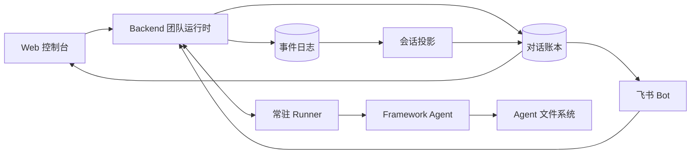

# my-agent-team

`my-agent-team` 是一个用 TypeScript + Bun 写的多智能体协作运行时。它要解决的核心问题是：当一个对话里同时坐着「人」和「多个 Agent」，而且对话要在 Web 和飞书两个端上同时可见、Agent 又是在独立进程里异步执行时，怎么让所有人看到一致、不丢、不重的对话历史。

整个仓库围绕一条主线展开：**把「对话事实」和「运行事实」彻底分开，再用一座单向的桥把后者投影到前者。**

- **对话账本（Conversation Ledger）** 记录一个共享对话里发生了什么——谁说了什么、@了谁。这是人能看到的历史。
- **事件日志（EventLog）** 记录一次 Agent 运行内部发生了什么——调了哪个模型、用了哪个工具、什么时候被中断。这是排障用的执行流水。
- **会话投影（Conversation Projection）** 是后端独占的那座桥：它在运行产出 `message` 事件、且事件已写进 EventLog 之后，挑出「对话可见」的那部分，包上 `runId` 写进账本，并广播进每个成员各自的线程投影。
- **常驻 Runner** 只负责执行 Agent、上报事件，它不知道对话语义、不知道飞书的去重规则。
- **Web 和飞书** 只是「端」：它们渲染账本、采集输入，但都不是事实来源。

## 一张图看懂



## 快速开始

```bash
bun install
bun run dev
```

常用命令：

```bash
bun run format
bun run lint
bun run typecheck
bun run test
bun run build
```

## 仓库结构

```text
apps/
  backend/    团队运行时，HTTP/SSE 服务，拥有对话、运行、事件、投影
  web/        Web 控制台与对话 UI
  lark-bot/   飞书端适配器
  cli/        本地 CLI 入口

packages/
  core/                   运行时原语：Message、Tool、ChatModel、Thread
  framework/              Agent 主循环、插件、上下文管理、Checkpointer
  harness/               把文件/工具/插件装配成一个可运行 Agent
  adapter-anthropic/      Anthropic 模型适配
  conversation/           成员、@提及、按成员视角投影的纯函数
  event-log/              EventLog 持久化与订阅
  runner-daemon/          常驻 Runner 进程
  runner-protocol/        Backend ↔ Runner 的消息协议
  agent-spec/             AgentSpec 模式（V1 旧版 / V2 现行）
  agent-fs/               逻辑文件系统与挂载
  plugin-fs-memory/       文件型长期记忆插件
  plugin-progressive-skill/ 渐进式技能加载插件
  plugin-task-guard/      任务规划与防早停插件
  runtime-observability/  运行可观测性数据模型
```

## 文档导航

给人读：

- 架构 Wiki 首页：`docs/architecture/README.md`
- 系统总览：`docs/architecture/system-overview.md`
- 跨页地图：`docs/architecture/map.md`

给 LLM 读：

- LLM 入口索引：`docs/architecture/index.llm.md`
- 概念图谱：`docs/architecture/concepts.json`
- 事实与投影：`docs/architecture/foundations/facts-and-projections.md`

未来方向和已知缺口被有意从这份 README 里拿掉了，集中放在 `docs/architecture/roadmap/future-work.md`，以及每页的「当前缺口」小节。

## 给改代码的人三条底线

1. 对话账本和 EventLog 是两类事实，不要混。
2. 端（Web/飞书）可以展示，但不要让端把 Agent 产出直接当成对话历史写下去。
3. Runner 的代码不要依赖 Web/飞书的展示规则。
