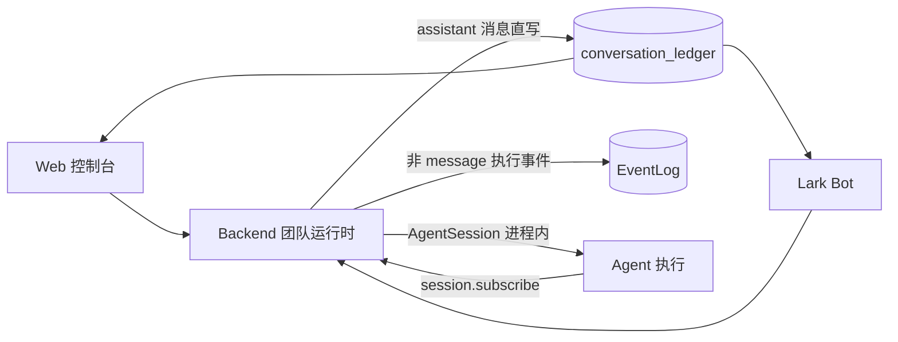

# my-agent-team

`my-agent-team` 是一个 TypeScript + Bun 的多 Agent 协作运行时。解决的问题：一个对话里同时有「人」和「多个 Agent」，对话要在 Web 和飞书（Lark IM）两个端上同时可见，Agent 在进程内异步执行——怎么让所有人看到一致、不丢、不重的对话历史。

核心设计：**把「对话事实」和「运行事实」分开——assistant 消息直写对话账本，运行内部的 execution detail 单独进 EventLog。**

- **对话账本（conversation_ledger）** 记录共享对话里发生了什么——谁说了什么、@了谁。这是对话消息的 canonical store。
- **EventLog（event_log）** 记录一次 Agent 运行内部发生了什么——调了哪个模型、用了哪个工具、什么时候被中断。这是排障用的 execution log，只含非 message 事件。
- **AgentSession** 在 backend 进程内编排 Agent + Checkpointer + PluginRunner + ContextManager，通过 `session.subscribe()` 将消息事件直写 ledger，完成事件统一经 `supervisor.notifyRunComplete` 触发投影与锁释放。
- **Web 和 Lark** 只是「端」：渲染账本、采集输入，都不是事实来源。

## 一张图看懂



## 快速开始

```bash
bun install
bun run dev
```

常用命令：

```bash
bun run format
bun run lint
bun run typecheck
bun run test
bun run build
```

## 仓库结构

```text
apps/
  backend/    团队运行时，HTTP/SSE 服务，拥有对话、运行、事件
  web/        Web 控制台与对话 UI
  lark-bot/   Lark 端适配器

packages/
  core/                   运行时原语：Message、Tool、ChatModel
  framework/              Agent 主循环、插件、上下文管理、Checkpointer
  harness/               AgentSession 编排，compaction
  adapter-anthropic/      Anthropic 模型适配
  conversation/           成员、@提及、账本 codec
  message/                消息类型与合并
  tools-common/           通用工具（bash/grep/glob/web、cwd 工具工厂）
  plugin-fs-memory/       文件型长期记忆插件
  plugin-progressive-skill/ 渐进式技能加载插件
  plugin-task-guard/      任务规划与防早停插件
  plugin-identity/        Agent 身份插件（SOUL/USER/记忆）
  plugin-conversation-context/ 对话上下文注入插件
  runtime-observability/  运行可观测性
  test-helpers/           测试工具（echoModel）
```

## 文档导航

给人读：

- 架构 Wiki 首页：`docs/architecture/README.md`
- 系统总览：`docs/architecture/system-overview.md`
- 跨页地图：`docs/architecture/map.md`

给 LLM 读：

- LLM 入口索引：`docs/architecture/index.llm.md`
- 概念图谱：`docs/architecture/concepts.json`
- 事实与投影：`docs/architecture/foundations/facts-and-projections.md`

未来方向和已知缺口在 `docs/architecture/roadmap/future-work.md` 以及各页的「当前缺口」小节。

## 三条底线

1. 对话账本和 EventLog 是两类事实，不要混。
2. 端（Web/Lark）可以展示，但不要让端把 Agent 产出直接当对话历史写下去。
3. 插件只收接口不依赖调用方（backend → plugin，不是反过来）。
