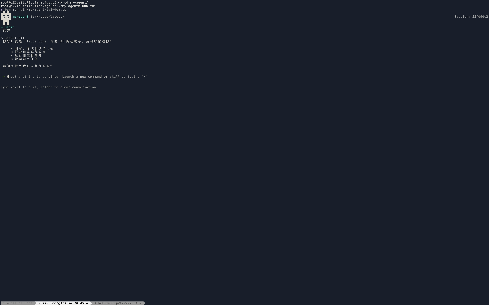

# my-agent

A TypeScript-based AI agent framework built with Bun, featuring a modular architecture for extending functionality through skills and an interactive terminal UI (TUI) powered by Ink.


## Features

- **Modular Skill System**: Extend functionality by adding skills in the `skills/` directory
- **Interactive Terminal UI**: Built with [Ink](https://github.com/vadimdemedes/ink), React-based terminal UI
- **Headless CLI Mode**: Run the agent without the TUI for scripting/automation
- **Slash Command Autocomplete**: Fuzzy filtering and keyboard navigation for commands (tasks, memory, compact)
- **Input History**: Persistent command history browsing
- **Multiple AI Providers**: Supports Claude and OpenAI out of the box
- **Markdown Rendering**: Syntax-highlighted code blocks in the terminal
- **Automatic Context Compression**: Multi-tiered context management with multiple strategies
  - Token budget-based automatic compression
  - Summarization of old messages
  - Tool output compaction
  - Reactive strategy selection
- **Token Budget Management**: Guardrails to prevent context overflow
- **Tool Execution Middleware**: Permission checking, logging, caching, and budget guards
- **Persistent Memory System**: Store user preferences and project context
- **Task Management System**: Built-in todo tracking via middleware



## Installation

```bash
# Clone the repository
git clone https://github.com/Chengchcc/my-agent-dev.git
cd my-agent-dev

# Install dependencies with Bun
bun install
```

## Configuration

Copy the `.env.example` to `.env` and add your API key:

```bash
cp .env.example .env
# Edit .env to add ANTHROPIC_API_KEY or OPENAI_API_KEY
```

## Usage

### Run the TUI

```bash
bun run tui
```

Or install globally:

```bash
bun install -g .
my-agent-tui
```

### Run Headless CLI (Script Mode)

```bash
bun run agent "your prompt here"
```

Or install globally:

```bash
bun install -g .
my-agent "your prompt here"
```

### Build

```bash
bun run tsc
```

## Project Structure

```
my-agent/
├── src/
│   ├── agent/                    # Core agent functionality
│   │   ├── compaction/          # Context compression system (multi-tier)
│   │   │   ├── tiers/           # Compaction strategy implementations
│   │   │   └── strategies/      # Individual compression strategies
│   │   ├── tool-dispatch/       # Tool execution middleware pipeline
│   │   │   └── middlewares/     # Budget, permission, logging, cache
│   │   ├── Agent.ts             # Main agent loop implementation
│   │   ├── context.ts           # Context management with compression
│   │   └── sub-agent-tool.ts    # Sub-agent delegation tool
│   ├── cli/tui/                 # Terminal UI implementation (Ink/React)
│   │   ├── components/          # React components (InputBox, CommandList, etc.)
│   │   ├── hooks/               # Custom React hooks (use-command-input, use-agent-loop)
│   │   ├── commands/            # Slash command implementations
│   │   └── command-registry.ts  # Slash command filtering and matching
│   ├── config/                  # YAML-based configuration system
│   ├── memory/                  # Persistent memory system (store, extract, retrieve)
│   ├── providers/               # AI provider implementations (Claude, OpenAI)
│   ├── session/                 # Session management and hooks
│   ├── skills/                  # Skill management system (loader, middleware)
│   ├── todos/                   # Task management system
│   ├── tools/                   # Built-in tools (bash, read, edit, grep, etc.)
│   ├── utils/                   # Utility functions (debug, file detection)
│   ├── runtime.ts               # Unified runtime configuration entry
│   ├── types.ts                 # Global type definitions
│   └── index.ts                 # Public API exports
├── skills/                       # Place your skills here (each in own directory)
├── bin/
│   ├── my-agent.ts              # Headless CLI entry point
│   ├── my-agent-tui-dev.ts      # Development TUI entry
│   └── my-agent-tui             # Production TUI entry
└── tests/                        # Test suite
```

## Adding Skills

Skills are loaded from the `skills/` directory. Each skill should be in its own directory with a `SKILL.md` file containing frontmatter:

```markdown
---
name: my-skill
description: Description of what my skill does
---

# Skill content goes here
```

The framework automatically discovers and loads skills at startup.

## Architecture

- **Pure Functional State**: Editor transformations are pure functions for predictability
- **React Hooks**: Custom hooks separate state management from UI rendering
- **Middleware Composition**: Agent middleware pipeline for memory, skills, and todos
- **Tool Dispatch Pipeline**: Extensible tool execution with permissions and logging
- **Multi-Tier Compaction**: Progressive context compression based on token budget
- **TypeScript**: Fully typed codebase
- **Ink TUI**: React components for interactive terminal interface

## Development

- TypeScript: `^6.0.3`
- Bun: Latest version recommended
- React: `^18.3.1`
- Ink: `^5.0.1`

## License

MIT
