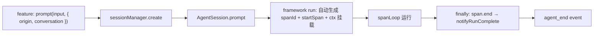

# ADR 0009: SessionManager + ctx.span — 身份自洽，追踪归 framework，业务上浮，harness 不泄

## 状态

Accepted

## 上下文

ADR 0008 决定塌缩 harness 调用层，删除 `SessionFactory` / `SessionSpec` / `executeAgentRun`，sessionId 改为 ULID 去语义。但 0008 有四个缺口：

**缺口 1：session 复用断裂。** 决策 4 提出 `conversation_session` 表做映射，但 plan 延后。span 表存 `spanId → sessionId`，从 `conversationId` 要先查最近 spanId 再拿 sessionId——拿错表。进程重启后 conversation 第一条新消息生成新 ULID → 新 sessionId → checkpointer 旧历史成孤儿 → **agent 失忆**。

**缺口 2：身份泄漏到 caller。** `deriveSessionId(conversationId, memberId) = ${conversationId}:${memberId}` 用确定性拼接「假装」不需要持久化。每多一个使用 session 的 feature，就要发明一套拼接规则。`Checkpointer` 虽然是 framework 接口，但不拥有 sessionId——caller 要自己算出 sessionId 才能调 checkpointer。身份和持久化被割裂。

**缺口 3：追踪逻辑散到每个 feature。** `executeAgentRun` 绑定了 DB 追踪（insertSpanOrigin）、run/attempt 生命周期（startMainRun/notifyRunComplete）、session 创建+执行。删掉 executeAgentRun 后，追踪逻辑散到 conversation/cron/orchestrator 三处复制粘贴。

**缺口 4：技术概念泄漏到 feature，业务概念被困在技术组装里。** feature 层 `insertSpanOrigin`（技术操作）和 `startSpan` 注入（技术注入）重复出现在每个 feature。同时 `conversationContextPlugin` 把 per-run 业务数据（conversationId/surface/senderName/input）烤进 per-session plugin 的 systemPrompt——第二条消息的 agent 看到第一条消息的 trigger。

## 决策

**技术概念下压到 framework/SessionManager，业务概念上浮到 prompt opts/ctx。**

### 原则

```
技术概念 → 下压：spanId 生成、insertSpanOrigin、startMainRun/notifyRunComplete、startSpan 注入、checkpointer 创建
业务概念 → 上浮：origin 数据（conversationId/agentMemberId/surface/originKind）、conversation 上下文（trigger 信息）
业务投影 → 留 feature：@mention 扫描、ledger 写入、todo 累积（这些是 conversation 专属业务逻辑）
```

### 分层职责

```
core / run()             — 运行时引擎。吃 messages 吐 model stream，执行 tools。

framework / Agent        — ctx.span 自动 start/end。spanId 自动生成（opts 不传则 uuid）。
                           定义 RunSpan 接口，不知道追踪实现。
                           ctx 透传业务上下文（origin/conversation），不解析。

harness / AgentSession   — 拥有身份和记忆。内部持有 checkpointer。
                           config.startSpan?.() 每次 run 时创建 RunSpan 挂到 ctx。
                           prompt opts 透传 origin/conversation 到 ctx。

backend / SessionManager — create/open/get/dispose。统一注入 startSpan。
                           不认识业务 ID。

backend / SpanSupervisor — startSpan(spanId, sessionId, origin?) 返回 RunSpan。
                           origin 透传给 insertSpanOrigin（span 不理解字段含义）。
                           span.end() 内部调 notifyRunComplete。

conversation/cron/orch   — 写业务绑定（通过 prompt opts.origin 上浮，不调 opsStore）。
                           订阅业务事件（投影逻辑）。prompt。
                           不碰 opsStore/supervisor/startSpan/spanId/crypto。
```

### SessionManager 接口

```typescript
interface SessionManager {
  create(config: Omit<AgentSessionConfig, "sessionId" | "checkpointer">): AgentSession;
  open(sessionId: string, config: Omit<AgentSessionConfig, "sessionId" | "checkpointer">): AgentSession;
  get(sessionId: string): AgentSession | undefined;
  dispose(sessionId: string): void;
}
```

SessionManager 统一注入 `startSpan`——feature 不传，create/open 内部接：

```typescript
class SqliteSessionManager {
  #supervisor: SpanSupervisor;
  create(config) {
    return new AgentSession({
      ...config,
      sessionId: ulid(),
      checkpointer: sqliteCheckpointer({ db: ... }),
      startSpan: (sid, sid2, origin?) => this.#supervisor.startSpan(sid, sid2, origin),
    });
  }
}
```

### OTel 式 ctx.span + 业务上下文上浮

借鉴 OpenTelemetry 的 Context + Span 模式：span 和业务上下文都挂在 ctx 上，framework 透传不解析，plugin/consumer 运行时读。



**framework 定义接口**：

```typescript
// RunSpan 接口
export interface RunSpan {
  spanId: string;
  sessionId: string;
  end(status: "succeeded" | "error" | "interrupted", errorMessage?: string): void;
}

// HookContext 加 span + conversation（OTel 式：ctx 挂载，plugin 运行时读）
export interface HookContext {
  sessionId: string;
  span?: RunSpan;              // ← 追踪（framework 自动管理）
  conversation?: unknown;      // ← 业务上下文（prompt opts 透传，framework 不解析）
  signal?: AbortSignal;
  logger: Logger;
  checkpointer: Checkpointer;
  contextManager: ContextManager;
  emit?(event: AgentEvent): void;
}

// AgentSessionConfig 加 startSpan 注入点
export interface AgentSessionConfig {
  // ... 现有字段
  startSpan?: (spanId: string, sessionId: string, origin?: unknown) => RunSpan;
}

// PromptOptions 加 origin + conversation（业务数据上浮）
export interface PromptOptions {
  signal?: AbortSignal;
  spanId?: string;             // 不传则自动生成（技术下压）
  origin?: unknown;            // ← 业务绑定上浮（透传给 startSpan → insertSpanOrigin）
  conversation?: unknown;      // ← 业务上下文上浮（透传到 ctx.conversation）
}
```

**framework run() 自动管理**：

```typescript
async *run(input, opts) {
  const spanId = opts.spanId ?? crypto.randomUUID();           // ← 自动生成（技术下压）
  ctx.span = config.startSpan?.(spanId, thread.id, opts.origin); // ← 创建 span + 写 span_origin
  ctx.conversation = opts.conversation;                        // ← 业务上下文挂 ctx
  let runStatus = "succeeded";
  let lastError: string | undefined;
  try {
    // ... spanLoop
  } catch (err) {
    runStatus = opts.signal?.aborted ? "interrupted" : "error";
    lastError = err instanceof Error ? err.message : String(err);
    throw err;
  } finally {
    ctx.span?.end(runStatus, lastError);                       // ← span.end → notifyRunComplete
    yield { type: "agent_end", spanId, status: runStatus };
    ctx.span = undefined;
    ctx.conversation = undefined;
    running = false;
  }
}
```

**backend supervisor.startSpan 透传 origin**：

```typescript
startSpan(spanId: string, sessionId: string, origin?: unknown): RunSpan {
  if (origin) {
    // origin 是 opaque 的——span 不理解字段含义，透传给 insertSpanOrigin
    this.#opsStore.insertSpanOrigin({ spanId, ...(origin as SpanOriginInput), ... });
  }
  // 写 run/attempt + 返回 RunSpan
}
```

### conversationContextPlugin 改为 ctx-based

当前 `buildAgentConfig` 把 per-run 业务数据（conversationId/surface/senderName/input）烤进 per-session plugin 的 systemPrompt。改为 ctx-based：plugin 在 `beforeModel` 运行时从 `ctx.conversation` 读。

```typescript
// 旧（烤死，per-session，有 bug：第二条消息看到第一条的 trigger）
conversationContextPlugin({
  tools: convTools,
  systemPrompt: `<conversation><id>${conversationId}</id>...<message>${input}</message>...`,
})

// 新（运行时读 ctx，per-run 正确）
const conversationContextPlugin = definePlugin({
  name: "conversation-context",
  tools: convTools,  // read_conversation_history 等（不依赖 per-run 数据）
  hooks: {
    beforeModel(ctx, messages) {
      const conv = ctx.conversation as { id: string; surface: string; senderName: string; input: string } | undefined;
      if (!conv) return messages;
      return [...messages, { role: "system", text: `<conversation><id>${conv.id}</id>...<message>${conv.input}</message>...` }];
    },
  },
});
// plugin 在 buildAgentConfig 里创建（不传 per-run 数据），conversation 上下文通过 prompt opts 传
```

### todo_update 事件加 spanId

`todo_update` 事件当前没有 spanId 字段。spanId 自动生成后，feature 的 subscribe 回调需要从 event 拿 spanId 关联 accumulator。给 `todo_update` 加 `spanId` 字段，emit 时从 `ctx.span?.spanId` 取。

### Feature 层调用（最终形态）

```typescript
// conversation startAgentRun — 纯业务，不碰技术概念
const existingSid = convPort.getMemberSessionId(conversationId, agentMemberId);
const session = existingSid
  ? sessionManager.open(existingSid, agentConfig)
  : sessionManager.create(agentConfig);
if (!existingSid) convPort.updateMemberSessionId(conversationId, agentMemberId, session.sessionId);

// 业务投影（留 feature——@mention 扫描、ledger 写入、todo 累积）
session.subscribe(event => {
  if (event.type === "message_update" || event.type === "message")
    void handleAssistantMessage(conversationId, agentMemberId, event.payload.spanId ?? "", event.payload);
  if (event.type === "todo_update")
    getOrCreateAccumulator(event.spanId, agentMemberId).lastTodoUpdate = { todos: event.payload.todos };
});

// 纯业务执行 — 不传 spanId（自动生成），不碰 opsStore/supervisor
void session.prompt(input, {
  origin: { conversationId, agentMemberId: agentId, surface, originKind: "manual" },  // 业务绑定上浮
  conversation: { id: conversationId, surface, senderName: agentMemberId, input },     // 业务上下文上浮
});
```

feature 不再 import：`opsStore`、`supervisor`、`crypto`。全是业务。

### Feature 层持久化绑定

| feature | 绑定存储 | 复用 | origin 内容 |
|---------|---------|------|------------|
| conversation | `member.session_id`（新增字段） | 是 | `{ conversationId, agentMemberId, surface, originKind: "manual" }` |
| cron | 无 | 否 | `{ agentMemberId, originKind: "cron", cronJobId }` |
| loop | 无 | 否 | `{ agentMemberId, originKind: "loop" }` |

### 进程恢复路径

```
conversation 第二条消息（进程重启后）
  → conversation 查 member.session_id    ← feature 层持久化
  → 拿到 sessionId = "01JX..."
  → sessionManager.open("01JX...", config) ← SessionManager
    → 内存 Map 未命中 → new AgentSession({ sessionId, checkpointer })
    → prompt() → checkpointer.load("01JX...") → 历史恢复
```

### Checkpointer 的定位

`Checkpointer` 是 AgentSession 的持久化后端，不是独立一层：

- **framework** 定义接口 + 提供 `sqliteCheckpointer` 实现
- **SessionManager** 创建 checkpointer 并注入 AgentSession
- **AgentSession** 使用它（prompt 前 load、结束后 save、interrupt）
- **caller** 永远碰不到它

与 pi 的对比：pi 把身份和存储合一（SessionManager 就是 JSONL 文件）。我们拆开——SessionManager 拥有 sessionId，Checkpointer 存消息，两者以 sessionId 连接。拆开的原因是 checkpointer 还存 interrupt state / checkpoint events，跟「session 管理」是不同关注点。

### 实现可演进

SessionManager 接口不变，实现可换：

| 实现 | 身份 | 存储 |
|------|------|------|
| `SqliteSessionManager`（当前） | ULID | sqliteCheckpointer + 内存 Map |
| `InMemorySessionManager`（测试） | ULID | inMemoryCheckpointer + Map |
| `JsonlSessionManager`（未来，pi 式） | ULID | JSONL 文件（身份+消息自洽） |

### 与 ADR 0008 的差异

| | ADR 0008 | 本 ADR |
|---|---|---|
| sessionId | ULID，caller 拿到后自己用 | ULID，**SessionManager 生成** |
| spanId | feature `crypto.randomUUID()` | **framework 自动生成**（opts 不传则 uuid） |
| checkpointer | caller 可见 | **SessionManager 内部** |
| insertSpanOrigin | feature 调 opsStore | **startSpan 内部**（origin 数据从 prompt opts 上浮） |
| startMainRun/notifyRunComplete | 散到每个 feature | **framework 自动**（ctx.span + startSpan 注入） |
| conversation 上下文 | 烤进 per-session plugin（有 bug） | **prompt opts → ctx**（per-run 正确） |
| tracePlugin | wrapper 模式 | **不需要**（span 自动管理） |
| 绑定表 | `conversation_session`（延后） | **各 feature 自己表字段**，本次必做 |
| `deriveSessionId` / `parseSessionId` | 删 | 删 |
| session 复用 | 裸 Map，无持久化 | SessionManager 内存 Map + feature 持久化绑定 |
| 进程重启 | agent 失忆 | checkpointer load 恢复历史 |

### 补充决策（2026-07-06 深化）

实现和审查中发现原有决策在两处不够彻底：**harness 的出口接口泄漏了内部事件类型给上游**，**AgentSessionConfig 把 caller 配置和 SessionManager 注入混在同一个类型里**。

#### A. AgentSessionConfig 拆分为 SessionConfig + SessionEnv

原有 `AgentSessionConfig` 包含三类字段：caller 传入的业务能力声明（model/tools/plugins/contextManager）、SessionManager 注入的技术字段（sessionId/checkpointer/startSpan）、可选的 harness 内部配置（retry/compaction/maxSteps）。三者混在一个 interface 里，靠 `Omit` 做 caller 侧的防御——脆弱且不自我文档化。

**决策**：拆为两个类型。

```typescript
// ── caller 传入：业务能力声明 ──
interface SessionConfig {
  model: ChatModel;
  tools?: Tool[];
  plugins?: Plugin[];
  contextManager?: ContextManager;
  systemPrompt?: string;
}

// ── SessionManager 注入 + harness 内部默认 ──
// sessionId, checkpointer, startSpan, maxSteps, retry, compaction
// 这些 caller 不传、不感知
```

`retry/compaction/maxSteps` 从 caller 可见接口中移除——它们是 harness 内部机制，AgentSession 自己管理默认值。

#### B. subscribe(AgentEvent) → onMessage/onTodoUpdate/onEnd

`session.subscribe(event: AgentEvent)` 暴露了 11 种事件类型给 feature 层——包括 compaction_start、auto_retry_start、queue_update、interrupted 等 harness 内部事件。feature 被迫过滤无关事件，且 AgentEvent 类型变更会直接影响 feature。

**决策**：feature 只注册它关心的回调。

```typescript
// ── 旧：feature 看到全部 11 种事件 ──
session.subscribe(event => {
  if (event.type === "message_update") { ... }
  if (event.type === "todo_update") { ... }
});

// ── 新：feature 只注册三个回调 ──
session.onMessage(fn);       // message_update / message
session.onTodoUpdate(fn);    // todo_update
session.onEnd(fn);           // agent_end
```

compaction、retry、queue_update、interrupted、agent_start——全部留在 harness 内部。Caller 看不见。

#### C. buildAgentConfig 删除——feature 内联组装

`buildAgentConfig`（原名 `buildSessionSpec`）是 session-factory 模式的残留。它把 7 个参数打包成一个袋子返回 `{ model, tools, plugins, contextManager }`——但内部只用到 `agent.modelName` 一个字段，`agent.modelProvider` 零引用，`agent.modelBaseUrl` 被 config 覆盖。`agent` 和 `agentId` 重复（agentId 只用于算 cwd）。

**决策**：删整个文件。各 feature 用纯函数内联组装。

```typescript
// 纯函数（各自独立、可测试）
function createModel(modelName: string, config: BackendConfig): ChatModel;
function defaultTools(cwd: string): Tool[];
function convTools(port: ConversationPort, cid: string): Tool[];
function defaultPlugins(cwd: string, workspaceRoot: string, skillRoots?: SkillRoots): Plugin[];
function defaultContextManager(): ContextManager;

// feature 内联组装
const session = sessionManager.create({
  model: createModel(agent.modelName, config),
  tools: [...defaultTools(cwd), ...convTools(convPort, conversationId)],
  plugins: [...defaultPlugins(cwd, config.workspaceRoot), conversationContextPlugin()],
  contextManager: defaultContextManager(),
});
```

Agent 实体不再出现在 session 创建路径上——feature 取 `agent.modelName` 后丢弃 AgentRow。

#### D. 命名泄漏修正

| 原命名 | 泄漏方式 | 新命名 |
|---|---|---|
| `HookContext.conversation` | framework 类型叫业务名字 | `HookContext.context` |
| `startSpan` 参数 `origin` | framework 接口暴露业务概念 | `opts` |
| `PromptOptions.conversation` | 同上 | `PromptOptions.context` |

#### E. Config 重建策略——不持久化

session 恢复时 `sessionManager.open(sid, config)` 的 config 是**重新组装**的，不是持久化恢复的。持久化的只有 `sessionId`（存在各 feature 的领域表）。进程重启后从 agent 表 + backend config 重新组装 model/tools/plugins。Agent 配置变更时天然拿到最新配置，sessionId 不变、checkpointer 记忆连续。

```typescript
// restart 后恢复
const agent = await agentSvc.getById(agentId);
const existingSid = convPort.getMemberSessionId(conversationId, agentMemberId);
const session = existingSid
  ? sessionManager.open(existingSid, { model: createModel(agent.modelName, config), ... })
  : sessionManager.create({ ...same config... });
// create 和 open 共享同一段组装——不重复
```

## 后果

- framework: `HookContext` 加 `span?: RunSpan` + `context?: unknown`（原名 conversation，修正命名泄漏）
- framework: `AgentSessionConfig` 拆为 `SessionConfig`（caller 传）+ 内部注入（SessionManager 补 sessionId/checkpointer/startSpan）
- harness: `retry/compaction/maxSteps` 从 caller 可见接口移除，AgentSession 内部默认
- harness: `subscribe(event: AgentEvent)` 改为 `onMessage/onTodoUpdate/onEnd` 三个回调，harness 内部事件不上浮
- framework: `startSpan` 参数改名 `origin` → `opts`，修正命名泄漏
- framework: `PromptOptions.origin?` 保留原意（业务绑定），`conversation?` → `context?`
- framework: `todo_update` 事件加 `spanId` 字段
- backend: 删 `buildAgentConfig` / `agent-config.ts`（原 `session-factory.ts`），feature 内联组装
- backend: `supervisor.startMainRun()` 改为 `startSpan(spanId, sessionId, opts?)` 返回 `RunSpan`
- backend: 新增 `SessionManager`（替代 `SessionFactory`）
- backend: `member` 表加 `session_id` 字段
- 删除 `deriveSessionId` / `parseSessionId` / `SessionSpec` / `executeAgentRun` / `span-executor.ts`
- config 重建非持久化——sessionId 是持久句柄，model/tools/plugins 从 agent 表 + backend config 重新组装
- 进程重启后 conversation 记忆连续（checkpointer + 持久化 sessionId 绑定）
## 关联

- [ADR 0008](./0008-collapse-harness-invocation-layer.md) — 塌缩 harness 调用层（本 ADR 修正其复用缺口 + 追踪散落 + 技术泄漏问题）
- [设计哲学 §2](../architecture/design-philosophy.md) — 暴露业务，隐藏机制
- [OpenTelemetry Context & Span](https://opentelemetry.io/docs/concepts/context-propagation/) — ctx.span + ctx.conversation 设计灵感
