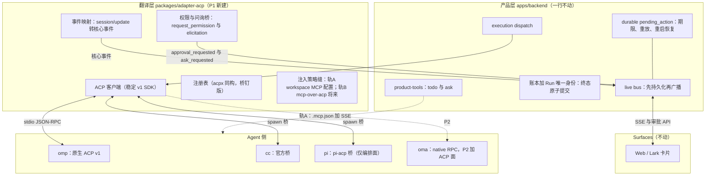
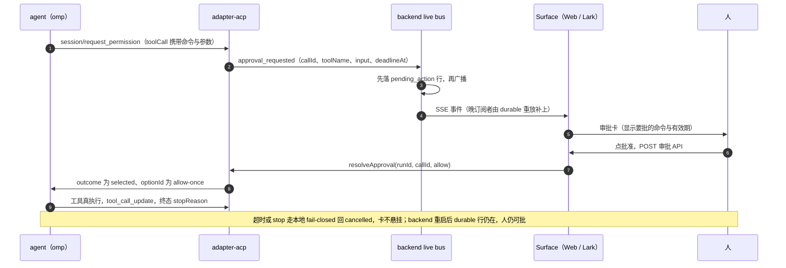

# 审批请求是产品的一等契约

> 状态：**Accepted**（2026-09-28；2026-09-29 设计收敛修订见决策 4 与附录二、附录三；三家缝的实测契约见文末附录，落地进度见「后果」）。

## 背景

审批这件事今天只有 oma 能用。`resolveApproval` 只有 oma 适配器实现；审批请求的事件名 `backend.oma.approval_request` 被四处按名字识别；另外三个 CLI 后端跑的是 headless print 模式，**没有权限通道**：实测 `claude -p --permission-mode default` 遇到需要授权的命令直接拒绝（"requires approval in this environment and wasn't authorized"），omp 与 pi 的 print 模式连这个开关都没有。

产品侧那套东西却已经与后端无关：durable `pending_action`、卡片、期限、重放（`pendingActionEvents`）、ADR 0038 的重启恢复，全是产品能力。差异化的部分都在这里，所以要统一的正是这一层。

三家的第一方缝各长在不同地方，第三方桥的覆盖有洞：`pi-acp` 的 `request_permission` 只服务 pi 的扩展 UI 确认，且不接 MCP 服务器，pi 经桥拿不到工具审批；`claude-agent-acp` 则完整，权限、client MCP servers、`loadSession` 都有。

## 决策

1. **审批请求进核心事件集。** `approval_requested` / `ask_requested` 与 `native_tool_started` 同级，不再挂在 `backend.oma.*` 名下。oma 的 wire 名字不动，映射留在适配器内（ADR 0038 的既有行为不碰）。

2. **「先持久化、再广播」只允许一处实现。** 这条顺序保证今天写在 oma 事件的形状里（live bus 的 `broadcast`），抽象之后仍只保留 live bus 这一处；适配器不得自己做持久化，否则报文的可见顺序会跟着各家实现漂。

3. **各后端经 ACP 接入，自制缝降为 fallback（2026-09-29 重写；原案实测契约仍存附录一）。**

   - oma：保持 native RPC，P2 并行加 ACP 面（最终去留 P5 验收后定）；
   - cc：经官方桥 `@agentclientprotocol/claude-agent-acp`（组织维护，其内部就是 cc SDK 的 `canUseTool`，翻译为 `request_permission`）；
   - pi：经 `pi-acp` 桥获得编排面（会话、事件、恢复）；审批天然缺席，不硬凑；
   - omp：原生 `omp acp`（注意必须 `--approval-mode always-ask` 才发权限请求）。

   原案（2026-09-28）为每家自制缝：cc 用 `--permission-prompt-tool` 挂我们的 MCP 工具、pi 写 `on("tool_call")` 扩展。决策 4 修订后两者均降级为应急路径——桥由官方组织维护后，自制缝只剩「桥不可用」的场景价值。

4. **传输统一：采纳 ACP 为目标协议，分相落地（2026-09-28 修订，取代「有触发条件才做」的原案）。** 原案把 `acp` kind 押后到「两个以上原生 ACP agent 或桥补齐」；复审时生态已过拐点：ACP 官方组织自己维护 cc 与 codex 的桥（`@agentclientprotocol/claude-agent-acp` ^0.76、`@agentclientprotocol/codex-acp` ^1.1.5），gemini / cursor / copilot / qwen 等约二十个 agent 原生 `--acp`，acpx（MIT，3.3k 星，0.19.x）证明一个客户端可驱动整个生态。产品要的是协议层的统一与可扩展，因此直接以 ACP 为目标传输。实现取「自建薄客户端于官方 `@agentclientprotocol/sdk`」，不嵌入 acpx/runtime：它自带会话持久层，会与「账本加 Run 是唯一执行身份」冲突，且 pre-1.0、要求 Node 22.13。acpx 作为参考实现借三样东西（见附录二）。

   目标定位（2026-09-28 明确）：要造的是**编排协议层本身**——一个客户端驱动所有 ACP agent 的会话、轮次、事件流、权限与恢复，达到 acpx 的成熟度；审批在各端一致只是这个层的顺带结果，不是目的。因此「不强行对齐」只限定于各端本来就没有的能力（pi 核心无审批策略，便无审批可对齐）；传输面的统一照常覆盖 pi（经 `pi-acp` 桥获得会话、事件、恢复的编排一致性）。`acp` kind 对所有原生 ACP agent 开放，不为我们四家私有。
   版本定位（2026-09-29 收敛）：**线说 v1，形状按 v2。** 今天零个第三方 agent 说 v2（omp 原生 v1、cc 桥 v1、pi-acp 停在旧 v1），v2 规范与 SDK 均为 draft/experimental；而 v1 线已具备我们需要的全部机制（会话、事件流、权限、elicitation、恢复，以及事实可用的扩展载体）。因此客户端与 oma 的 ACP 面都建在稳定 v1 SDK 上，扩展一律按 v2 扩展规范的形状命名（下划线方法、`_meta`、capabilities 声明），v2 普及之日只改握手里的一个数字。

   扩展载体（2026-09-29 收敛，全部为规范内行为，零私有分叉）：
   - 自定义方法一律下划线前缀；steer 直接采纳既有约定名 `_session/steering`（官方 cc 桥已实现，握手经 `InitializeResponse._meta.steering.supported` 声明），不另造 `_oma/steer`。
   - 恢复时的决定注入优先骑标准 `session/load`（v2 名 `session/resume`）params 的 `_meta`；自定义方法只作对端不支持 `_meta` 时的兜底。
   - oma 的私有事件（todo、委派）走 `_oma/update` 自定义通知；v1 SDK 的 `sessionUpdate` 是封闭联合，自定义标签会被解析丢弃，不得塞入标准联合。
   - 入站 `elicitation/create`（v1 规范已有，form/url 双模式）映射到问答卡管线；oma↔自家 backend 的 ask 继续走 product-tools MCP（表单更富：多题数组、allowOther、推荐标记、校验）。
   - 能力发现以握手声明为准，不猜；对端未声明的扩展一律不发。


5. **恢复跟状态所有权走**（沿用 ADR 0038 的判据）：action 记录、期限、卡片、答案归产品；agent 自己的策略（例如 cc 的 `PermissionUpdate` durable 规则）归 agent；产品只如实展示「将创建什么规则」，不假装能撤销。

6. **A2A 是另一个轴，不依赖 ACP。** 把 backend 暴露成 A2A agent 复用同一份契约：run 的 `waiting` 对应 A2A 的 `input-required`。任何非 loopback 暴露先过 ADR 0026 的检查项；A2A 作 client 是未来的第五个 `AgentBackend` 实现。

7. **不做：** 不做通用协议插件系统；不给 `pi-acp` 的洞打补丁（2026-09-29 注：pi 无审批可对齐，桥只承担编排面，洞不再影响我们）；不动 oma 的 RPC 与恢复机制（P2 只并行加 ACP 面，不替换）。

## 模块分工（图解）

分层总图：产品层一行不动（差异化全在这里），翻译层是唯一新建（P1），agent 侧各按其力。



一次审批的完整往返（理解各层怎么接力）：



## 后果

- **收益（2026-09-29 重写）**：oma、cc、omp 三家的 HITL 行为一致——同一套卡、同一个期限、同一份重放与重启恢复（pi 无审批策略，如实缺席）；任何原生 ACP agent 以注册表一行接入（acpx 注册表约二十五家）；oma 经 ACP 面反向可被生态客户端（Zed 等）编排；A2A 的 `input-required` 顺带具备；现有产品的 durable 机制一行不用改。
- **代价（2026-09-29 重写）**：一个 ACP 客户端（acp kind：客户端 + 注册表 + 事件映射 + conformance 收编）；oma 的 ACP server（P2，含 `_session/steering`、`_meta` 决定注入、mcp-over-acp 先行者）；桥的版本钉扎与漂移管理；注入双轨的过渡期维护。原案的「cc 加 MCP 工具与启动参数、pi 加扩展」不再需要。
- **风险（2026-09-29 重写）**：桥与 agent 的版本耦合（cc 桥 ^0.76 滚动、pi-acp 0.0.x 且停更风险——备选是围绕 `pi -p --mode json` 自造薄壳，方言已被 adapter-pi 证明）；v2 与 MCP-over-ACP RFCD 仍在演进（已以「线说 v1、形状按 v2」与「实验性 SDK 不作地基」对冲）；扩展机制依赖对端握手声明的诚实性；A2A 规范演进，只做我们需要的三样（Task、`input-required`、流式）。

- **落地进度（2026-09-28）**：决策 1 已落地。`approval_requested` / `ask_requested` 进核心事件集（`packages/agent-contract/src/event.ts`），oma 子进程的帧名不动，翻译在 `packages/adapter-acp/src/event-mapping.ts`；后端四处硬编码的名字收口（bus 识别、重放合成、ask 广播、telemetry 白名单），其中重放合成从盲信 `action.payload` 改为校验读取，缺身份的旧行不再变成无法解决的卡；Web 与飞书改订新名，Web 那条裸字符串的订阅并回类型化客户端。决策 2 本就成立（顺序保证只在 live bus）。决策 3 的四个后端适配与决策 4 的通用 `acp` kind 尚未开工；同日决策 4 修订为「ACP 为目标传输、分相落地」，相位与依据见决策 4 与附录二。2026-09-29 设计收敛：版本定位（线 v1、形状 v2）、扩展载体五条、注入双轨、pi 表述修正（审批不对齐、传输照迁）写入决策 4 与附录二、附录三。同日 P1 落地：`packages/adapter-acp`（注册表 + 事件映射 + AcpBackend + 假 agent 进程内单测 18 条）接入 backendKind `acp`；隔离栈真机验收通过——omp 经 ACP 全链路（事件流进 SSE、审批卡 approval_requested→人批→allow-once、工具真执行、`session/load` 续会话往返、cliSessionRef=ACP sessionId、usage 透传）。已知 P1 边界：elicitation 入站礼貌 decline（等端口扩展）；skills 链接落 `.acp`（omp 不读，待注册表携带真实 kind 目录）；steer 显式拒绝（排队语义，握手 gating 随 P2 oma server 一起做）。复审修正（同日双轴 review）：late-click 的 409/timeout 收尾从只认 oma 错误类扩到 acp；run 终态清空挂起审批（连接死于请求中不留悬空 promise 与定时器）；审批载荷的 toolName 改为身份字段（name→kind 兜底），title 归入 reason；恢复决定已按扩展载体规则骑 session/load 的 `_meta`（namespaced key，语义由 P2 oma server 定义）；注册表删去无人消费的注入轨字段（轨 B 落地时成形）。记债：createActiveRun/withTimeout 已是第 5 份拷贝，应提升进 agent-contract。

- **落地进度（2026-09-29 P2）**：oma 长出 ACP 面（`apps/oh-my-agent/src/modes/acp/acp-mode.ts`，复用 rpc-mode 的会话文件真值、停靠标记、插件装配与审批停靠）——标准面 `initialize` / `session.new` / `session.load` / `session.prompt` / `session.cancel`；审批门经 `session/request_permission` 上浮，期限 fail-closed；`_session/steering` 约定（握手 `_meta.steering.supported` 声明）接 runtime live input；oma 私事件走 `_oma/update` 自定义通知；恢复决定读 `session/load` 的 `_meta["my-agent-team/resume"]` 并在下一轮 prompt 预供（ADR 0038 的 ACP 形状）。隔离栈真机验收：backend 经 adapter-acp 驱动自家 oma ACP server，审批卡 → 批准 → 工具真执行 → `completed`。P2 未竟：mcp-over-acp 消费（`mcpCapabilities.acp` + `mcp/message`）未实现；session/load 恢复与实时 steering 仅单测覆盖，待真机验收。真机另暴露并已修三处：stdio 方向镜像（服务端写 stdout 读 stdin）、CLI 入口应为 `cli.ts`、适配器 spawn ENOENT 会杀死 backend 进程（折进 exit promise 并加回归钉）。

- **落地进度（2026-09-29 P2 续）**：重启恢复在 ACP 传输上真机验收通过。先补一个真缺口：run 停靠时被杀的分支没有 `cliSessionRef`，适配器只能开新会话，human 会被重问一次——客户端改为在 `session/new` 的 `_meta["my-agent-team/resume"]` 声明 `adopt:"last-interrupted"` 与 decisions，oma 侧采纳停靠会话并预供决定。另一真缺口：MCP 白名单没走 ACP 路径，`${PRODUCT_TOOLS_RUN_TOKEN}` 被 mcp-mount 拒展、产品工具挂不上；现经 `OMA_MCP_EXPANDABLE_VARS`/`OMA_CONSENTED_MCP_TOOLS` 随 spawn env 传递（与 oma 适配器同渠道）。验收证据（隔离栈，OMA_DEBUG=1）：`recover_parked pending=1` → 批准 200 → `resume_parked decisions=1` → `[acp] adopted interrupted session …` → 同一 callId 的工具直接执行、无第二次权限请求 → `completed` + `terminal_commit`。方法学教训：崩溃模拟必须**先杀后端**（子进程变孤儿）；先杀子进程等于让适配器合法结算 run，测的就不是崩溃场景了。适配器新增 transport 退出日志（code/signal）用于区分“agent 死了”与“我们关了连接”。

## 附录：三家缝的实测契约

2026-09-28 在本机（deepseek 网关 + omp 18.2.10 + claude 2.1.229）跑通，帧与返回值如下。

**cc `--permission-prompt-tool mcp__<server>__<tool>`**
入参：`{ tool_name, input, tool_use_id }`，另有 `_meta["claudecode/toolUseId"]` 与 `progressToken`。
返回：结果的 text 内容须是 JSON：`{"behavior":"allow","updatedInput"?}` 或 `{"behavior":"deny","message"}`；返回非 JSON 会被判失败并 fail-closed（模型收到错误）。
行为：allow 后工具真执行，deny 后不执行。
基线：不给该 flag 时，`-p --permission-mode default` 直接拒绝危险命令。

**cc 官方 SDK 的 `canUseTool(toolName, input)`**
`@anthropic-ai/claude-agent-sdk` 在 Bun 上可跑；回调返回 `{behavior:"allow", updatedInput}` 即放行。VS Code 官方扩展走的就是这条缝（其 bundle 里 `canUseTool` 出现 14 次，`--permission-prompt-tool` 由 SDK 拼给 CLI）。

**omp `omp acp`**
`initialize` 声明 `loadSession: true`；权限请求形如：

```
session/request_permission {
  toolCall: { toolCallId, title, kind:"execute", status:"pending",
              rawInput:{ command, timeout, cwd, pty, async }, content:[{type:"content",…}] },
  options: [allow_once, allow_always, reject_once, reject_always]
}
```

客户端回 `{outcome:{outcome:"selected", optionId}}` 或 `{outcome:{outcome:"cancelled"}}`。
开关：`--approval-mode always-ask`；默认配置会静默放行，根本不发权限请求。
续跑：新进程 `session/load {sessionId, cwd, mcpServers}` 能恢复旧会话。

**pi 扩展的 `on("tool_call")`**
pi 核心没有工具审批策略（`approvalMode` 一类配置不存在）。扩展收到 `{ type:"tool_call", toolCallId, input }`，返回 `{ block?: boolean, reason?: string }` 即可拦住。`pi-acp` 桥的 `request_permission` 只覆盖扩展 UI 确认，不覆盖工具审批，也不接 MCP 服务器。


## 附录二：acpx 精读（2026-09-28，/root/acpx @ ee6090d，v0.19.3）

openclaw/acpx 是 ACP 的无头客户端（MIT，3.3k 星），自带可嵌入 runtime（`acpx/runtime`）与约二十五个 agent 的注册表。精读结论与可借之物：

- **注册表格式（直接镜像）**：`AGENT_DEFINITIONS: Record<name, {argv, installedArgv, requiredCommands, package}>`，桥走 npm 范围钉版（`pi-acp ^0.0.33`、`codex-acp ^1.1.5`、`claude-agent-acp ^0.76.0`，后两者由 @agentclientprotocol 官方组织发布）。我们的 `acp` kind 用同构表，acpx 已知的 agent 即插即用。
- **权限回调设计（照抄语义）**：宿主 `onPermissionRequest(request, {signal}) => Promise<decision | undefined>` 拿首答权，不答落策略；**回合结束即取消**，迟到的回答不能批准已退役的请求（fail-closed）。这与我们的 `requestApproval`（durable pending_action + 期限 + 人答）语义一致，适配层只需把回调接到 pending_action 管线上。
- **conformance 用例（当验收件）**：`conformance/cases/*.json` 二十条（握手、session/new、单轮/多轮、update 流终止、在途取消、权限拒绝/读批/写批、未知会话、非法参数、后台轮完成、结构化 prompt 块）。每个新接入的 ACP agent 先跑这套；将来 oma 自己的 ACP server 也用它验。
- **事件形状（映射参考）**：`AcpRuntimeEvent` 与核心事件几乎同构——`text_delta`（分 output/thought 两流）、`tool_call`（含 title/kind/locations/rawInput/content）、`plan`（整表替换，即我们的计划条）、`usage_update`、终态 `completed/cancelled/failed + stopReason`。`session/update` 到核心事件的映射按这张表写。
- **会话模型**：`persistent | oneshot` 两态，`resumeSessionId` 对应我们的 `cliSessionRef` 回传。我们只用 oneshot + 自己的 Run 身份，不用它的持久层（`~/.acpx` 记录）。
- **能力差修订（2026-09-29 复核规范与桥源码，取代本附录早先两条断言）**：
  - steer：官方 cc 桥已实现 `_session/steering` 约定方法（下划线扩展方法，握手经 `InitializeResponse._meta.steering.supported` 声明，底层是 cc SDK 的抢占式原生注入）。早先「ACP 没有 mid-turn steer」的记录源自 acpx 自身 runtime 的排队语义，已过时；oma 的 ACP 面将直接采纳该约定名。
  - elicitation：现行 v1 规范已含 `elicitation/create`（form/url 双模式，基于 MCP 2026-07-28 锁定 RC，与 v2 页面逐字相同）。「v1 无问信息通道 / elicitation 不稳定」为过时结论，源自旧草案方法名 `session/create_elicitation` 时代的观察。adapter-acp 的入站映射 elicitation→问答卡在 v1 线即可实现；oma↔自家 backend 的 ask 仍走 product-tools MCP（理由只剩表单更富：多题数组、allowOther、推荐标记、校验）。
  - fs/terminal 回调可关（我们关掉，agent 用自己的文件工具）。
- **产品工具注入（2026-09-29 补，MCP-over-ACP RFCD）**：注入的终态方向是 backend 成为进程内 MCP provider（`session/new` 声明 `type:"acp"`，agent 经 `mcp/message` 调用，每请求自带 MCP 2026-07-28 上下文；ask 即 held-open 请求）。今天零 agent 声明 `mcpCapabilities.acp`（omp 仅 http/sse），且 SDK 的 mcp/message 只在 experimental/v2、其 connect/disconnect 方法与 RFCD 不同步，故 adapter-acp 的注入做成策略缝：现状走 workspace MCP 配置加既有 product-tools SSE；对端声明能力后切 ACP 中继，两轨共用同一 product-tools 服务接口。oma 的 ACP 面（P2）率先实现该能力自证。

  **oma 侧落地（2026-09-29，P2）**：`initialize` 声明 `mcpCapabilities.acp`；`session/new` 里 `{type:"acp", name, serverId}` 的声明被接住，随后按 RFCD 形状经 `mcp/message` 拉 `tools/list`、跑 `tools/call`（信封为 `serverId` 加逻辑 `requestId`，方法名与参数扁平放，每个内层请求自带 MCP 2026-07-28 的 `_meta`；内层错误骑在外层成功里，来源信息因此不丢）。工具复用 `adaptMcpTool`，命名与所有其他挂载一样是 `mcp__<server>__<tool>`，于是权限门、审批卡、工具表一处都不用改。声明形状与 RFCD 一致，而且已经在稳定线 SDK 里（`zMcpServerAcp` 就两个字段 `name` 与 `serverId`）；停在 experimental 的只有消息信封（`MessageMcpRequest` 带 `connectionId`，是 RFCD 之前的草案）。两端都归我们，所以按 RFCD 实现，分叉记在这里。
  **provider 侧落地（2026-09-29，P2）**：adapter-acp 现在按握手声明选轨。`initialize` 回包里出现 `agentCapabilities.mcpCapabilities.acp`（v1）或 `capabilities.session.mcp.acp`（v2 形状）时，`session/new` 与 `session/load` 带上 `{type:"acp", name, serverId}`，随后进来的 `mcp/message` 由 adapter 用**同一份** product-tools 分派就地应答：内层结果骑外层成功，绑定失败才是 ACP 错误（-32602，data 里带两个 server id）。SSE 轨的 bearer、端口与工作区入口点在这条轨上全不需要，而两轨共用分派意味着授权规则与幂等键规则只有一份（`dispatch.ts`）。oma 侧收紧一条：**客户端声明的同名服务器优先**，工作区配置里的同名条目直接丢弃，否则同一个服务器会挂两次，一次走声明，一次去拨那条本不该需要的端口。
  **真机验收（2026-09-29，隔离栈）**：栈里**故意不配** `PRODUCT_TOOLS_MCP_URL`，既没有 SSE 服务，也没有工作区里的产品工具入口点，因此工具的唯一来源只能是 ACP 连接。agent 走 acp kind（`acp/oma`），跑完一轮后：子进程日志出现 `[acp] mcp-over-acp product-tools: 8 tools`；`OMA_FAKE_TOOLS_RECORD` 记下的模型工具表含全部 8 个 `mcp__product-tools__*`；模型调用后 `tool_end error=false`；后端 `product_tool_call` 落表 `status=completed`，result 就是写进去的待办项。同一轮里也留了个对照：adapter 未重建时（跑的是旧 `dist/`），模型照样能调工具，但每次都 `error=true`。
  **live steering 与恢复的验收（2026-09-29，同一套隔离栈）**：`_session/steering` 在握手处声明 `_meta.steering.supported` ✓；一轮流式输出途中（注入应答先于 `model_end turn=1`）注入文本被接受，落进会话文件成为一条 user 消息，并驱动了下一轮 —— 即中途到达的输入按停靠语义成为下一轮，不做逐步拼接。恢复半程：同一会话连发两条消息，两跳都 completed，且**两跳的 ACP 会话 id 相同**（`acp-9c248531-…`），证明第二跳走的是 `session/load` 而非新建；恢复后的会话上重新声明并取到全部 8 个产品工具，`todo_write` 四次调用 `error=false`。
  **只在真机暴露的坑（2026-09-29）**：后端消费工作区包读的是 `dist/`，改了 adapter 不先 `bun run build` 就会跑旧代码，而单测走 `src` 全绿。现象是「工具被调用但永远失败」。凡动 `packages/*` 再做真机验收，先重建。
  **已知差异（2026-09-29）**：SSE 轨的 `callId` 取自子进程的工具调用 id，重试可重放；ACP 轨暂时由分派端生成（`runId:uuid`）。要恢复重放语义，得把工具调用 id 从 `adaptMcpTool` 的调用缝里递出来，那条缝现在只收 `{name, arguments}`。等有必须重放的产品工具走这条轨时再加，当前走的是读面与 `todo_write`/`ask_question`。
  **顺带修掉的真缺陷（2026-09-29）**：ask 模式下，名字以 `mcp__` 开头的插件工具会被问两次，会话权限门一次、代码插件包装器再一次，因为高危名单与会话门的判据各写了一份。后果是同一个 callId 出两张卡，后端还会多一条悬空 pending action。修法是把判据收口成单个 `isAskGatedName`，会话门与包装器共用，包装器只包会话门不管的工具。回归钉两条放在 `create-runtime-permission.test.ts`，变异验证有牙。
- **为什么不嵌入**：acpx runtime 自带会话持久与重连，叠在我们的账本/Run 之上就是第二执行身份（Phase 6 教训）；Node ≥22.13 与我们的 Bun 栈有门槛；pre-1.0 的 runtime API 演进快。官方 `@agentclientprotocol/sdk`（1.5.x，纯 TS、stdio JSON-RPC）是我们真正依赖的那一层；其 Bun 兼容性已于 2026-09-28 实测通过（spike：Bun 下经 SDK 驱动 `omp acp --approval-mode always-ask`，initialize / newSession / prompt / 全量 session/update 流 / request_permission 浮到宿主回调并回 allow_once / end_turn，19 秒一轮，脚本存 /tmp/acp-spike/spike.ts，P1 开工时收编为种子）。

### 落地相位（决策 4 修订版）

```
P1  acp 编排层：稳定 v1 SDK 薄客户端（initialize / session / prompt / 事件流 /
    request_permission / elicitation 入站 / 恢复）+ omp 端到端打通——
    验收是编排面工作，不止审批；注入走策略缝（现状 workspace MCP 配置 +
    product-tools SSE，见附录二的注入双轨）
P2  oma 的 ACP server：标准面给所有生态客户端（acpx / Zed 可驱动 oma）；
    扩展按上文载体规则落地，并率先实现 mcp-over-acp（mcpCapabilities.acp）
    自证注入终态
P3  cc 经 @agentclientprotocol/claude-agent-acp 接入（conformance 先行）
P4  pi 经 pi-acp 迁移（编排面统一；审批天然缺席，不硬凑）；
    workflow 的 agent 节点支持 acp kind（对应 acpx flows 的组合编排）
P5  逐个下线旧 native adapter（oma RPC 去留于 P2 验收后定）
```

每个相位先过 conformance 用例，再过我们的隔离验收（审批卡端到端），最后才进 live。

## 附录三：协议支持度普查（2026-09-29，实测与源码级确认）

| 对端 | ACP | 版本 | steer | elicitation | mcp-over-acp |
|---|---|---|---|---|---|
| omp | 原生 | v1（v2 握手实测失败：响应为 v1 形状，v2 客户端校验不过） | 核心有（pi 血统），ACP 面未接约定方法 | 未声明 | 否（`mcpCapabilities` 仅 http/sse） |
| cc | 官方桥（SDK 钉 1.5.0） | v1 线，已在用 v2 风格扩展 | ✅ `_session/steering` 已实现（`_meta.steering.supported` 声明，SDK 抢占式注入） | 桥源码含 elicitation 回调处理（steer 的 later 优先级会等待它） | 否 |
| pi | pi-acp 桥（SDK ^0.26.0；桥 0.0.34，2026-09-24 后未更新） | 旧 v1 | pi 核心有投递模式（`/steering all \| one-at-a-time`），桥面未接约定方法 | 未声明 | 否 |
| oma | 无（P2 自建） | 目标：v1 线 + v2 形状 | 自家 RPC 有；ACP 面将接 `_session/steering` 约定名 | P2 出站用 elicitation 表达提问 | P2 率先实现 |

SDK 状态（1.5.1 复核）：`zMcpServerAcp`（`{name, serverId}`）已在稳定线的类型里，只有 `mcp/message` 的信封仍标 experimental。稳定线 1.5.x（v1，Bun 下实测可跑，含 server 侧 AgentApp）；experimental/v2 含 `mcp/message` 但也有 RFCD 明言不存在的 `mcp/connect`/`mcp/disconnect`（实现与草案不同步），不作地基。附：未知自定义请求实测 omp 应答 -32603 而非规范的 -32601，勿依赖错误码值判能力；未知通知被无视且连接存活。

> 后续：surface 侧的收敛（AHP 取代自研事件词汇与 SSE）与两条轴的删除清单一并记在 [ADR 0040](./0040-run-contract-acp-surface-contract-ahp.md)。
