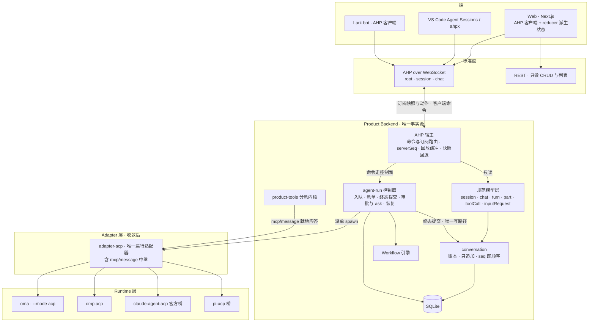
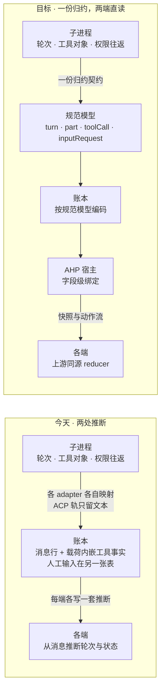

# 运行契约归 ACP，surface 契约归 AHP

> 状态：**Accepted**（2026-09-29。目标架构见「模块分工」；删除清单是验收条件；规范模型与账本编码对齐见决策三。）

## 背景

今天有两条自研方言。

运行轴上，`adapter-oma-agent`、`adapter-claude-agent`、`adapter-pi-agent`、`adapter-omp-agent` 各自用那个 CLI 自己的方言说话（oma 是 JSONL RPC，claude 是 stream-json，pi 与 omp 各自的 json），每个都在自己的方言里把同一批活重做一遍：事件映射、审批上浮、工具挂载、会话引用。ACP 轨已经在旁边建起来并验收过（`adapter-acp`、oma 的 ACP 面、审批与恢复与 steering 与 mcp-over-acp，见 [ADR 0039](./0039-approval-request-is-a-product-contract.md)），但两套并存没有期限。

surface 轴上，Web 与 Lark 走 HTTP/SSE，事件词汇是我们自研的。实测规模：契约类型 422 行（`packages/api-contract`）、核心事件 14 类、5 个 SSE 端点（`agent-run/http.ts:393`、`agent/http.ts:645`、`conversation/http.ts:1729`、`workflow/http.ts:2786` 与 `:2919`）、Web 侧 `EventSource` 管道 26 行、Lark 侧 2 处引用。

两条方言并存而删除没有期限，账就是净增。**接标准轨时必须同时写下它删掉什么、什么时候删，删不掉的部分就是负债。**

AHP（Agent Host Protocol）是同一道边界上的标准方言：微软维护，仓库 2026-03-12 建，半年 27 个发布，当前规范 0.9.0（2026-08-28）。它按频道给出会话状态与动作流，客户端用与上游同源的纯 reducer 推出状态；重连是 `serverSeq` 回放加快照回退加 `missing` 清单。上游把 reducer、可派发判定表（99 条）、五份 JSON Schema、283 条 reducer 向量与 57 条 round-trip 向量都作为公共 API 发布，但**只发布客户端 SDK，没有服务端 SDK**，VS Code 那份是参考实现。频道稳定性索引：root、session、chat、terminal、telemetry、resource-watch 为 2（Stable），changeset 为 1.2，annotations 为 1.1，automation 目录与 automation run 为 1.0，MCP 频道为 1.2。

### 粒度不对齐已经在漏事实

账本今天以「消息」为粒度：一条 canonical 消息一行，身份是 `(agent_run_id, message_index)`，内容是一份 `MessageRevision`（`blocks`、`tools` 内嵌）；没有轮次实体，工具调用不是一等对象，人工输入在 `pending_action` 且**解决结果不写回账本**。ACP 与 AHP 都是「轮次实体加类型化片段加一等工具对象」：

| | 账本 | ACP | AHP |
|---|---|---|---|
| 轮次 | 无实体，读时推断 | 一次 `session/prompt` 一轮 | `Turn` 实体，带 turnId、状态、usage |
| 内容片段 | `blocks` 贴在某条消息上 | update 流里的事件 | `ActiveTurn.responseParts` |
| 工具调用 | 消息载荷，无 status、无关联键 | 一等对象：`toolCallId`、status、kind、rawInput/rawOutput | 一等对象：`toolCallId`、status、title、intention |
| 人工输入 | 另一张表，解决后不留痕 | `request_permission` 一次往返 | 输入请求是片段，解决后落 `InputRequestResponsePart` |
| 顺序 | 对话内 `seq` | 子进程内部 | channel 内 `serverSeq` |

后果是实证的：ACP 轨的 `buildOutcomeMessages` 只产出 assistant 文本，于是四次 `todo_write` 在账本里一行都没留下（`product_tool_call` 有记录、日志有 `tool_end error=false`，账本零行），而 [conversation/history](../architecture/conversation/history.md) 声明工具消息应进 History。

（2026-09-29 S0 首刀已修：映射改为按到达顺序记产出片段，同一次 run 的四次工具调用现在提交九行账本，向量见 `packages/adapter-acp/src/event-mapping.test.ts` 的「durable tool facts」。）

## 决策

1. **目标态：运行契约归 ACP，surface 契约归 AHP；两条自研方言下线。** 运行轴只留 `adapter-acp`（其余 agent 经官方桥或原生 `--acp` 接入）；surface 轴只留 AHP，外加快照型 REST 承担 CRUD 与列表（agents、projects、skills、workflows、settings），AHP 不管这些。**每一个 surface 都走 AHP 客户端，包括 Web、Lark bot 与第三方 UI（VS Code、ahpx），不设「内部 feed」这类例外通道**：例外通道会让 surface 轴重新长出一条自研线，而本次的目的正是让它只剩一条。Lark 是 Bun 进程，官方客户端的 WebSocket 传输在 Node 21+ 与 Bun 下可用；鉴权沿用既有的「upgrade 时完成」模式。oma 自己的 RPC 模式保留为本地 CLI 与 TUI 的通道，它不对外。**删除清单见专节，且是每个相位的验收条件。**

2. **AHP 的位置、范围与维护契约。**

   - 位置：surface 层的契约，与现有 REST 并列，不新增层。它相对 ACP 正交：ACP 在 Adapter 与 Runtime 那条纵轴，AHP 在 Surfaces 那条横轴。
   - 范围：只做稳定性索引 ≥ 2 的频道，即 root、session、chat，terminal 随后。changeset、annotations、automation、MCP 频道不进这一轮。
   - 钉 0.9.x。升级是有意识动作：先跑自建互操作用例（我们的 server 对上游 TS 客户端），再看升级内容。
   - 服务端我们自己写（上游没有），复用其 reducer、可派发判定、JSON Schema 与一致性向量；能力一律先声明后使用，版本号不用于能力探测。

3. **规范模型与账本编码对齐（S0，AHP 宿主的前置）。** 定义唯一规范模型 `session` / `chat` / `turn` / `part` / `toolCall` / `inputRequest`，账本按它编码。字段名在概念相同时采用两协议既有的词（`toolCallId`、`turnId`、`status`、`inputRequest` 等），不做与模型无关的机械改名。五处调整：

   - 轮次实体就是 Run 行：`turnId` 即 `runId`，状态取 Run 状态，起止取 Run 的时间列。不另立实体、不新增列（Run 已经是那个显式身份），读取侧也不再从「用户消息加后续 assistant 消息」推断轮次；
   - 工具调用升为一等字段：`toolCallId`、`toolName`、`status`、`rawInput`、`rawOutput`，可仍挂在消息行上，但必须有 id 关联；
   - 人工输入以 `pending_action` 为权威（状态与答复都在那里），由规范模型挂到轮次与具体调用上，**不再往账本复制一份**：同一事实两处存放正是要消灭的形态，AHP 的 `InputRequestResponsePart` 在这里对应模型里的 `inputRequest` 片段；
   - 会话层级定为 session = agent 加工作区（project / worktree），chat = conversation，不需要新表；
   - 坐标权威定为对话内 `seq`，AHP 的 `serverSeq` 由它派生并加回放缓冲，子进程内部顺序不外泄。

   判据：两条协议的绑定退化成字段重命名级，映射里不出现推断或聚合；用一致性向量钉住（固定 facts 产出固定的 turn、part、toolCall、inputRequest 结构）。历史行不重写，读取侧容忍旧行。

   落地进度（2026-09-29，`feat/ahp2acp`）：协议层模型与配对规则在 `packages/message/src/session-model.ts`，后端派生在 `apps/backend/src/features/conversation/session-model.ts`（只吃普通行对象，不碰数据库），两侧共十条向量，其中一条就是「N 次工具调用必须留下 N 组工具事实」。工具调用的配对按 `tool_use_id` 完成，配不上 use 的 result 也保留成一次已结算的调用。

   - 上游一致性闸门（2026-09-29）：`apps/backend/src/features/ahp/conformance/` 钉着上游 `v0.9.0` 的 218 条 root/session/chat reducer 向量，逐条经我们的服务端重放（派发动作后新连接订阅，比对快照），覆盖播种、reduce、快照三件事。两条实测教训写在该文件的抬头：向量必须与钉住的依赖同源（仓库 HEAD 的向量包含了 0.9.0 自己都没实现的动作，会假红七十条），以及上游把「无值」序列化成显式 `null` 而 reducer 的内存结果缺键，比对要按同义归一。
   - 续接记录（原 `surface.control` 行，2026-09-29）：账本里只留规范事实，也就是旧会话续到了哪条新会话、由哪个 Run 请求；surface 方言串与 surface 自造的幂等键已删，幂等改按 Run 坐标判定。Lark 侧的改绑记账仍属 surface，等 S2 的 chat 状态落地后随它搬走。行的种类名暂留（改动它的代价是数据迁移加一条线词汇），它在 S3 随自研事件词汇一并退休。

4. **权威关系不变。** 账本加 Run 状态是唯一权威；宿主只有两条边——只读投影、命令进控制面，禁止直写账本；终态提交是唯一写路径。这与 [system-overview](../architecture/system-overview.md) 的不变量 3、4、5 一致，Run 仍是唯一执行身份。

6. **产品事实借 `_meta` 过到端上，不另开产品频道。** 协议为内存里的宿主会话设计，我们有的持久事实它没有位置放。开一条产品频道或者给协议加字段，等于让端同时读两条线再把它们对齐；`_meta` 是上游给宿主事实留的扩展点，也正好是端已经会解析的地方。约定如下，当前字段表与含义见 [AHP host](../architecture/surfaces/ahp.md)：`messageId`（账本行身份，端据此去重）、`seq`（账本坐标，寻址用）、`undone`（撤销标记）、`productRequest` 与 `productResponse`（审批与询问的载荷和答复）、`todos`（活跃轮次的 todo）、`newConversationId` 与 `requestedByRunId`（续接）。顺序不借 `_meta` 过：顺序由宿主定，端按状态里的次序铺，协议里的 `Turn` 没有每轮坐标，端也无从重排。

   落地进度（2026-09-29，`feat/ahp2acp`）：`messageId` 自 `be15ae54`、`seq` 自 `a204bfbf`、`undone` 自 `204e941e`、`productRequest` 与 `productResponse` 自 `5fef88be`、`todos` 自 `3d383bb6`、续接两个键自 `e99810b2`。写这一条时对表发现两个洞：动作那条边没有一处派发 `chat/inputRequested`，审批与询问卡片要等一次重新订阅才出现；`todos` 同样只在快照里。两者都记在 [AHP host](../architecture/surfaces/ahp.md) 的已知缺口里，前者按 HITL 控制面的优先级先修。

5. **替换而非并列。** 未完成替换前，不新增依赖旧方言的功能；每条标准轨的删除项与期限写在本 ADR 的删除清单里。

## 模块分工（图解）

目标架构：

粒度对齐前后的差别：

## 删除清单（验收条件）

| 轴 | 删除项 | 何时 |
|---|---|---|
| 运行 | `packages/adapter-oma-agent`、`adapter-claude-agent`、`adapter-pi-agent`、`adapter-omp-agent`，以及 `BackendKind` 里的 `oma` / `claude_code` / `pi` / `omp` | 该家经 ACP 通过 conformance 与隔离验收之后，逐家下线 |
| surface | 自研核心事件词汇（14 类）与 5 个 SSE 端点（`agent-run`、`agent`、`conversation`、`workflow` 两处） | Web 切到 AHP 客户端之后。**已删**（2026-09-30）：`conversation` 那条随会话状态切走先删，`agent-run` 这条连同 `runEvents` 词汇、只在迟到订阅路径上存在的服务面（`runEventStreamFor`／`subscribe`／`isParked`／`pendingActionEvents`）与总线的订阅扇出一并删除；运维瀑布图读的是落库的遥测（REST），不受影响。`workflow` 的执行那条也已删除：执行页改成按 1.5 秒轮询 `/trace`，内存里的执行事件总线（`ExecutionEventBus`）与它的扇出一并删掉，脚本日志改走落库；剩 `workflow` 的定义那条与 `agent-config`，它们的 MCP 提议先落成「待采纳提案」再切 |
| surface | Web 侧 `EventSource` 管道 | 同上 |
| surface | Lark 的 HTTP 事件消费与自研事件解析 | 改为 AHP 客户端订阅（与 Web 同时切换）。**已删**（2026-09-29）：跑动卡原先直连 `/api/agent-runs/:runId/events`，现改读 chat 状态（`cardStateFromChatTurn`），自研事件 reducer 与其测试一并删除，`apps/lark-bot` 内已无 `text/event-stream` 消费者 |

## 相位

| 相位 | 内容 | 验收 |
|---|---|---|
| S0 | 规范模型与账本编码对齐（决策三），含修 ACP 轨工具事实漏账 | 一致性向量；ACP 轨 N 次工具调用留 N 组工具事实 |
| S1 | AHP 最小面：root / session / chat，`initialize` / `subscribe` / `dispatchAction` / `reconnect` | 上游 TS 客户端互操作用例；官方语料 |
| S2 | Web 切到 AHP 客户端，状态由上游同源 reducer 派生；REST 不变 | Web 测试全绿且不再消费自研事件 |
| S3 | 删事件词汇与 SSE；Lark 切到 AHP 客户端 | 删除清单逐条勾掉 |
| R1 | cc 经官方桥、pi 经 `pi-acp` 接入 ACP | conformance 先行，再隔离验收 |
| R2 | Workflow 的 agent 节点支持 `acp` kind | 节点级端到端 |
| R3 | 逐个下线原生 adapter 与旧 kind | 删除清单逐条勾掉 |

R1 至 R3 承接 [ADR 0039](./0039-approval-request-is-a-product-contract.md) 的 P3 至 P5，本例只是把两条轴的删除并到同一份验收里。

## Web 侧还缺哪些事实

Web 的 run 流只剩三处消费者，都在 `apps/web/src/hooks/useConversation.ts`。查过来源之后，三条的情况不一样：

- `status`：不用补事实。轮次本就按 run 行构造，失败 run 的 `run:<id>:error` 行会折成轮次尾部的错误片段、轮次状态是 `error`，投影已经带着它，流里那份是重复的。
- `delegation_batch_started`、`delegation_agent_started`、`delegation_agent_completed`、`delegation_batch_completed`：面板按 `batchId` 分组，显示一批子代理的进度。它不是工作流引擎的事件，而是 oma 运行时编排脚本 spawn 子代理时发的（`apps/oh-my-agent/src/core/delegation/executor.ts`，TUI 也用同一批事件），事件里既没有工作流 id，产品侧也没有对应行。能走的路三条：把批次落一行（像 todo 那样给投影料）、投影从运行时的会话行里推（子代理各自都有会话行，缺的是与父 run 的关联）、或者认它是过渡面板——它自己的注释写着 durable truth 是工具结果消息，而那份消息本来就在转录里。
- `backend.oma.stream_rule_triggered`：模型这一轮输出被流规则判废、正在重试。后端只是转发这个运行时事件，产品里没有任何行记过它。要么把它落成一行（像失败那样，让投影折成通知片段），要么认它属于运行时细节、不上面——按「能不能当产品事实站住」来定，不按好不好做来定。

## 后果

收益：第三方客户端可以直接连（VS Code 的会话面板、ahpx），多客户端同步与重连语义不必自造；运行轴的方言从五套收敛到一套；surface 轴从自研词汇收敛到标准词汇；补齐投影层之后，前端状态变成可测试的纯函数。

代价：AHP 服务端要我们自建；上游处在 0.x，升级要跟；迁移期两条线并存，直到 S3 才回到一条。

风险与对策：接一半就成净负债，所以删除项写进验收；账本权威被绕过，所以宿主只保留两条边；上游发破坏性小版本，所以钉版本加互操作用例当闸门；历史行重写风险高，所以只对新写入生效。

## 关联

- [ADR 0039 审批请求是产品的一等契约](./0039-approval-request-is-a-product-contract.md)：运行轴（ACP）的目标与相位。
- [ADR 0038 HITL 与重启恢复](./0038-hitl-run-resume-after-restart.md)：审批与问答作为产品契约。
- [系统总览](../architecture/system-overview.md)：唯一执行链与不变量。
- [Conversation History](../architecture/conversation/history.md)：账本的现状与已知缺口。
- [Run 输出与实时更新](../architecture/runs/output-and-live-updates.md)：运行侧事件的现状。
