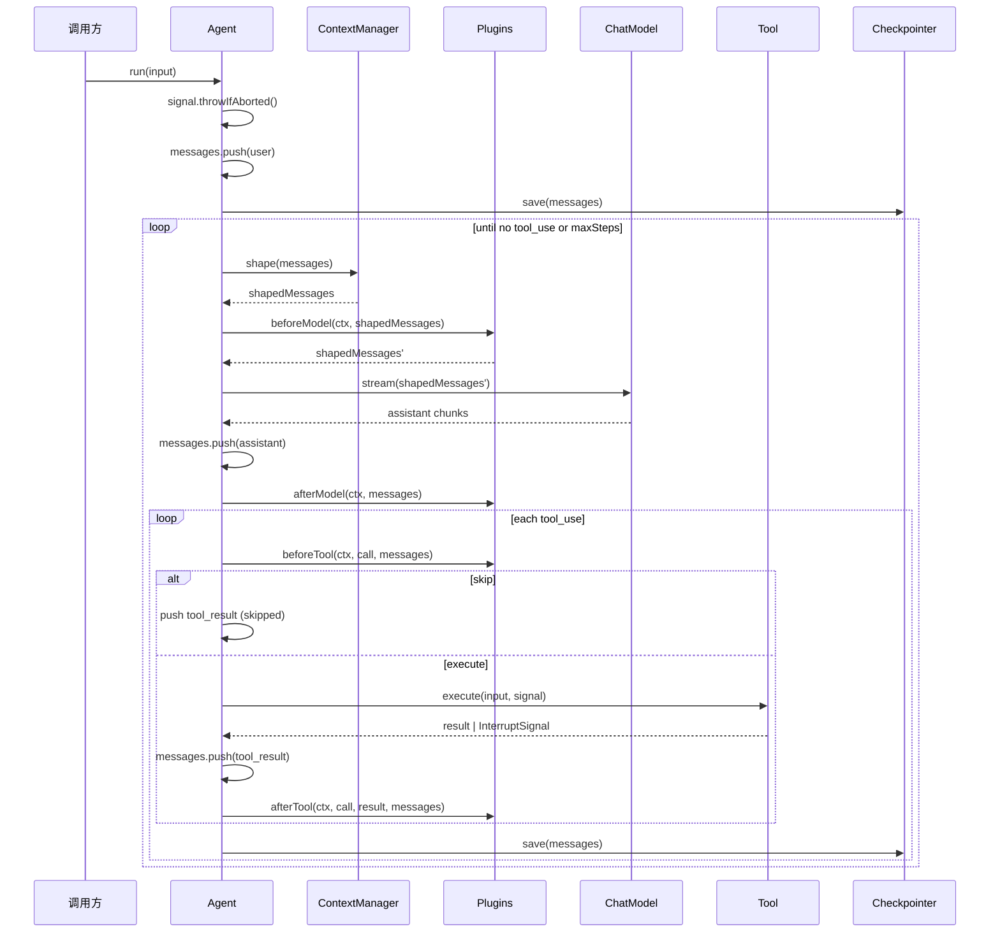

# Framework

The装配层。把 L2 [`run()`](./00-overview.md#runtime-契约) 这个裸的 async generator 包成一个可复用、可观测、可中断的 `Agent` 对象。

L2 的契约简单到只剩一个 generator——你每次都要自己提供 `model`、`tools`、`messages`，自己接住 yield 出来的 `Message`。这对单脚本能用，对长期对话/多用户/可恢复场景就不够了。Framework 把"装配"这件事抽出来，正交地补上三件事：

- **Thread** — 把 messages 装进一个有 id 的容器，方便 fork / 持久化 / 引用
- **Plugin** — 在 agent loop 的 4 个固定时刻插入横切逻辑（见 [Plugin](./03-plugin.md)）
- **Framework 内化能力** — Logger、[Checkpointer](./04-checkpointer.md)、[ContextManager](./05-context-manager.md)。三者是 framework 自身的一等组件，永远存在（不传 = 默认实现），不是 plugin

不引入新的心智模型。`agent.run()` 内部还是 while 循环调 L2 `run()`，没有图、没有状态机、没有 middleware 链。

---

## Agent

```ts
interface Agent {
  readonly thread: Thread;
  run(input: string, options?: RunOptions): AsyncIterable<AgentMessage>;
  resume(command: ResumeCommand, options?: RunOptions): AsyncIterable<AgentMessage>;
  fork(messages?: Message[], id?: string): Agent;
}

type AgentMessage =
  | Message
  | { type: 'interrupted'; pendingTool: ToolUseBlock; reason: string; meta?: unknown };

/** 调用方告诉 framework 怎么处理挂起的 tool —— 同意/拒绝二态。 */
interface ResumeCommand {
  approved: boolean;
  message?: string;          // 拒绝时给 LLM 的说明，或同意时附带的预先结果
}
```

`agent.thread.messages` 是真相，**状态归调用方**：调用方可以随时读、写、序列化、`fork`。framework 只 push（append-only），不 mutate 历史。

`resume()` 是配合 [Checkpointer](./04-checkpointer.md) 的 interrupt 通道使用的。framework 内部把 `ResumeCommand` 映射成一条 `tool_result`：

```
tool_result.is_error = !command.approved
tool_result.content  = command.message ?? (command.approved ? 'approved' : 'denied by user')
```

**单 agent 单 run**：同一 Agent 同时只能有一个 `run()` / `resume()` 在跑。第二次调用立刻抛 `Agent is already running. Use fork() for concurrent conversations.`——这是 fail-fast。要并发就 `fork()`，不要让 framework 替你做隐式队列。

**Abort**：signal 在 `run()` 入口先检查（已 abort 则不 push user 消息）。中途 abort 不 rollback——framework 不知道调用方意图是"重试"还是"撤销"，所以保留现场，由调用方决定 `messages.pop()` 还是再次 `run()`。

---

## Plugin

完整设计在 [Plugin](./03-plugin.md)，这里只摆接口：

```ts
interface Plugin { name: string; hooks: PluginHooks; }

interface PluginHooks {
  beforeModel?(ctx: HookContext, messages: readonly Message[]): Message[] | Promise<Message[]>;
  afterModel?(ctx: HookContext, messages: readonly Message[]): void | Promise<void>;
  beforeTool?(
    ctx: HookContext, call: ToolUseBlock, messages: readonly Message[],
  ): { skip?: boolean; input?: unknown; result?: string } | void | Promise<...>;
  afterTool?(
    ctx: HookContext, call: ToolUseBlock, result: ToolResultBlock, messages: readonly Message[],
  ): void | Promise<void>;
}
```

两类钩子，**类型即语义**：

- `before*` — transformer。返回值会被 framework 当作下一步输入。坏了 = 整轮 abort
- `after*` — observer。返回值忽略。坏了 = 吞掉 + warn

`ctx` 永远是第一个参数。`model` 不进 ctx——插件不需要内省 LLM，要 token 计数自己引 `tiktoken`。

### HookContext — Framework 给 plugin 的能力面板

```ts
interface HookContext {
  threadId: string;
  signal?: AbortSignal;

  // ↓ Framework 三大内化能力，plugin 直接用
  logger: Logger;
  checkpointer: Checkpointer;
  contextManager: ContextManager;
}
```

这三个字段不是"传出去看看"，是 plugin 真实要用的：

- `logger` — plugin 输出日志走 framework 的 logger 而不是直接 `console.log`，level 统一受控
- `checkpointer` — plugin 可以读 `appendEvent` / `readEvents` 做审计 UI 回放，也可以**只读**当前 thread 的 interrupt 状态。**不要双写 `save()`**——framework 已经在 tool 边界自动 save，plugin 再调一次就是冗余写
- `contextManager` — plugin 可以在 `beforeTool` 等位置主动调 `shape(ctx, msgs)` 看"如果现在送给 LLM 会是什么样"。例如 token 监控类 plugin 想统计"实际 LLM 看到的 token"而不是"thread 完整 token"

> 边界纪律：plugin 拿到这三个能力**不代表可以滥用**。`checkpointer.save()` / `saveInterrupt()` 是 framework 的职责，plugin 调 = 控制流双写。能力暴露是为了**读**和**派生**，不是为了**重写 framework 自己负责的事**。

---

## 执行流程



伪代码版本（去掉序列图细节，留下 framework 的循环骨架）：

```ts
async function* runAgent(input: string) {
  signal?.throwIfAborted();
  messages.push({ role: 'user', content: input });
  await checkpointer.save(threadId, messages);

  for (let step = 0; step < maxSteps; step++) {
    const shaped = await contextManager.shape(ctx, messages);
    const pluginShaped = await firePipeline('beforeModel', shaped);
    const assistant = await collectStream(model.stream(pluginShaped));
    messages.push(assistant);
    await fireObservers('afterModel', messages);
    yield assistant;

    const toolUses = assistant.content.filter(b => b.type === 'tool_use');
    if (toolUses.length === 0) break;

    for (const call of toolUses) {
      const decision = await firePipeline('beforeTool', call);
      const result = decision?.skip
        ? makeToolResult(call, decision.result ?? 'Tool skipped')
        : await tryExecute(tool, decision?.input ?? call.input);
      messages.push(wrapToolResult(result));
      await fireObservers('afterTool', call, result, messages);
      await checkpointer.save(threadId, messages);
      yield wrapToolResult(result);
    }
  }
}
```

---

## 语义细节

### beforeModel 每个 loop step 调一次

不是每个 chunk 调一次。`beforeModel` 看到的是 `ContextManager.shape()` 之后的 messages；plugin 在这个 shaped view 上做最后修饰（脱敏、注入时间戳……）。

### Checkpointer save 时机

在 `afterTool` 之后由 framework 调用，**不是** plugin 钩子。理由：那一刻 messages 末尾是 `user(tool_result)`，是合法 API 输入态。崩在这之后直接可恢复，不需要修复 messages。详见 [Checkpointer#时机契约](./04-checkpointer.md#时机契约强制写死不可配置)。

### before\* 管道链

多个 plugin 挂同一个 `before*` 时，按 plugins 数组顺序依次调用，上一个的返回值作为下一个的输入：

```ts
async function fireBeforeModel(plugins, ctx, msgs) {
  for (const p of plugins) {
    if (p.hooks.beforeModel) {
      msgs = (await p.hooks.beforeModel(ctx, msgs)) ?? msgs;
    }
  }
  return msgs;
}
```

`beforeTool` 同理，上一个 plugin 改写后的 `{ input }` 传给下一个。

### beforeTool skip 语义

| 返回值 | Framework 行为 |
|---|---|
| `{ skip: true }` | push `{ type: 'tool_result', tool_use_id, content: 'Tool skipped' }` |
| `{ skip: true, result: '权限被拒' }` | push `{ tool_use_id, content: '权限被拒', is_error: true }` |
| `{ skip: true, result: '后续再说' }` | push `{ tool_use_id, content: '后续再说' }` |
| `{ input: x }` | 用改写后的 input 执行 tool |
| `undefined` | 原样执行 |

`afterTool` **不在 skip 路径触发**——`afterTool` 语义是"tool 真的跑完了"，skip 时没跑，metrics/日志类 observer 不应当真。需要统计 skip 的话，从 Checkpointer 的事件流读 `tool_end{skipped: true}` 即可。framework 在 skip 路径仍 `appendEvent({ type: 'tool_end', durationMs: 0, meta: { skipped: true, reason } })` 保持事件流完整。

### 错误隔离

| 抛错位置 | Framework 处理 |
|---|---|
| `before*` | 整轮 abort，传播给调用方（transformer 返回的是关键数据，坏了无法继续） |
| `after*` | 吞掉 + `logger.warn`，带 plugin name |
| `checkpointer.save` | 吞掉 + `logger.warn`（一个坏的磁盘不该让 agent 不可用） |
| `ContextManager.shape` | 整轮 abort（与 `before*` 同性质，结果非法不能继续） |
| `tool.execute` 抛 `InterruptSignal` | 走 interrupt 流程，见 [Checkpointer](./04-checkpointer.md) |
| `tool.execute` 抛其他错 | 包成 `tool_result{is_error: true}`，让 LLM 看到 |

### Abort 的 messages 状态

入口 abort = user 消息不 push，thread 不受影响。中途 abort = 已 push 的内容保留，framework 不 rollback。调用方契约：

- 重试：messages 不变，再次 `run()` 同样 input
- 撤销：`thread.messages.pop()` 手动移除
- 不管：下次 `run()` 追一条新 user，API 会自然消化

---

## Logger

```ts
type LogLevel = 'debug' | 'info' | 'warn' | 'error' | 'silent';

interface Logger {
  level: LogLevel;
  debug(message: string, ...args: unknown[]): void;
  info(message: string, ...args: unknown[]): void;
  warn(message: string, ...args: unknown[]): void;
  error(message: string, ...args: unknown[]): void;
}
```

默认 `consoleLogger`（level=`info`，包装 `console`）。framework 内部用法：

- `logger.debug` — hook fire、loop step、shape 前后的 message 数
- `logger.info` — interrupt 触发 / resume 恢复
- `logger.warn` — `after*` 失败、`checkpointer.save` 失败
- `logger.error` — 整轮 abort 之前的最后一条信息

可注入替换（pino / winston）或禁用（`noopLogger`，level=`silent`）。

---

## Thread

```ts
interface Thread {
  id: string;
  messages: Message[];
}
```

纯数据，没有方法。Thread 是 messages 的命名容器，**id 是 Checkpointer 的存储 key**，也是 fork 的引用锚点。调用方可以直接读写 `thread.messages`——framework 不藏。

`agent.fork(messages?, id?)` 复用 model / tools / plugins / checkpointer / contextManager / logger，创建一个新 thread：

```ts
agent.fork()                              // 默认深拷贝当前 messages，新 id
agent.fork([], 'fresh-thread')            // 空白历史，指定 id
agent.fork(structuredClone(snapshot))    // 从快照恢复
```

适合：A/B 比较、并发对话、试探性分支。

---

## 内置实现一览

| 组件 | 默认 | 其他内置 | 详见 |
|---|---|---|---|
| Checkpointer | `inMemoryCheckpointer` | `fileCheckpointer({ dir })` | [04-checkpointer.md](./04-checkpointer.md) |
| ContextManager | `passthroughContextManager` | `slidingWindow` / `tokenBudget` / `toolResultTruncator` / `summarizing` / `pipeContextManagers` | [05-context-manager.md](./05-context-manager.md) |
| Logger | `consoleLogger` | `noopLogger` | 本页 §Logger |
| Plugin | 无 | 无内置——全由用户/harness 提供 | [03-plugin.md](./03-plugin.md) |

依赖方向：framework → core。framework 不依赖 adapter 或 tools。

---

## 与 L2 的关系

L2 `run(model, tools, messages)` 保持不变。L3 是对 L2 的装配层——每次 `agent.run()` 内部调一次 L2 `run()`。上层 ([Harness](./06-harness.md)) 可以替换 L3 或直接调 L2，两者独立。
