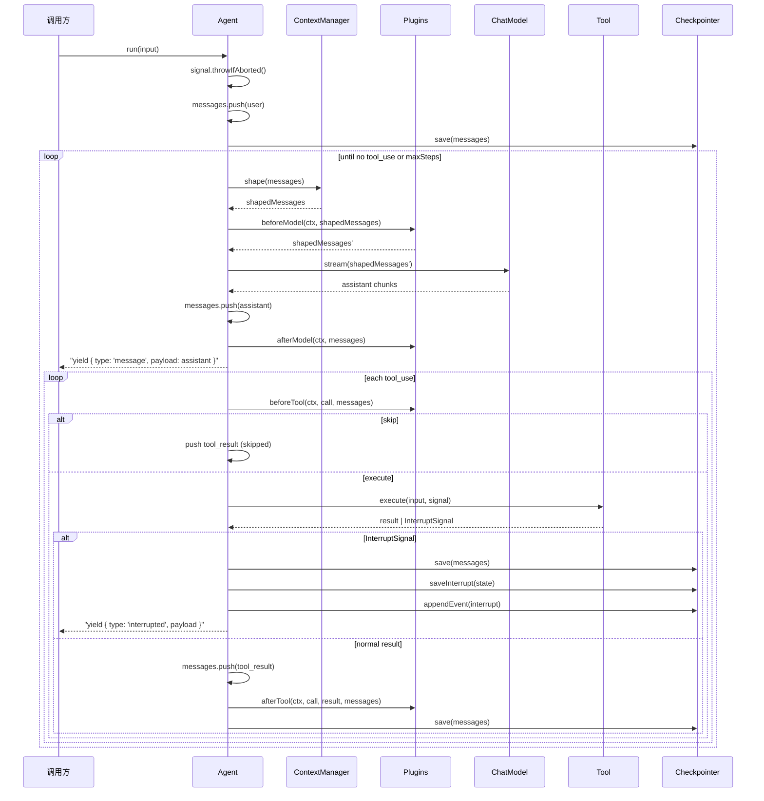

# Framework

装配层。把 L2 [`run()`](./00-overview.md#runtime-契约) 这个裸的 async generator 包成一个可复用、可观测、可中断的 `Agent` 对象。

L2 的契约简单到只剩一个 generator——你每次都要自己提供 `model`、`tools`、`messages`，自己接住 yield 出来的 `Message`。这对单脚本能用，对长期对话/多用户/可恢复场景就不够了。Framework 把"装配"这件事抽出来，正交地补上三件事：

- **Thread** — 把 messages 装进一个有 id 的容器，方便 fork / 持久化 / 引用
- **Plugin** — 在 agent loop 的 4 个固定时刻插入横切逻辑（见 [Plugin](./03-plugin.md)）
- **Framework 内化能力** — Logger、[Checkpointer](./04-checkpointer.md)、[ContextManager](./05-context-manager.md)。三者是 framework 自身的一等组件，永远存在（不传 = 默认实现），不是 plugin

不引入新的心智模型。`agent.run()` 内部还是 while 循环调 L2 `run()`，没有图、没有状态机、没有 middleware 链。

---

## Agent

```ts
interface Agent {
  readonly thread: Thread;
  run(input: string, options?: RunOptions): AsyncIterable<AgentEvent>;
  resume(command: ResumeCommand, options?: RunOptions): AsyncIterable<AgentEvent>;
  fork(messages?: Message[], id?: string): Agent;
}

type AgentEvent =
  | { type: 'message'; payload: Message }
  | { type: 'interrupted'; payload: Interrupt };

interface Interrupt {
  pendingTool: ToolUseBlock;
  reason: string;
  meta?: Record<string, unknown>;
}

/** 调用方告诉 framework 怎么处理挂起的 tool —— 同意/拒绝二态。 */
interface ResumeCommand {
  approved: boolean;
  message?: string;
}
```

**Envelope 设计**：所有 yield 都是 `{ type, payload }` 统一形状。调用方用 `switch (ev.type)` 判别，访问永远走 `ev.payload`。`Interrupt` 是纯领域类型（不含 envelope 元数据），Checkpointer 的 `InterruptState` 可直接复用。

`agent.thread.messages` 是真相，**状态归调用方**：调用方可以随时读、写、序列化、`fork`。framework 只 push（append-only），不 mutate 历史。

`resume()` 是配合 [Checkpointer](./04-checkpointer.md) 的 interrupt 通道使用的。framework 内部把 `ResumeCommand` 映射成一条 `tool_result`：

```
tool_result.is_error = !command.approved
tool_result.content  = command.message ?? (command.approved ? 'approved' : 'denied by user')
```

**单 agent 单 run**：同一 Agent 同时只能有一个 `run()` / `resume()` 在跑。第二次调用立刻抛 `Agent is already running. Use fork() for concurrent conversations.`——这是 fail-fast。要并发就 `fork()`，不要让 framework 替你做隐式队列。

**Abort**：signal 在 `run()` 入口先检查（已 abort 则不 push user 消息）。中途 abort 不 rollback——framework 不知道调用方意图是"重试"还是"撤销"，所以保留现场，由调用方决定 `messages.pop()` 还是再次 `run()`。

---

## Plugin

完整设计在 [Plugin](./03-plugin.md)，这里只摆接口：

```ts
interface Plugin {
  name: string;
  hooks: PluginHooks;
  tools?: readonly Tool[];   // 静态声明配套 tool，createAgent 启动时合并
}

interface PluginHooks {
  beforeModel?(ctx: HookContext, messages: readonly Message[]): Message[] | Promise<Message[]>;
  afterModel?(ctx: HookContext, messages: readonly Message[]): void | Promise<void>;
  beforeTool?(
    ctx: HookContext, call: ToolUseBlock, messages: readonly Message[],
  ): { skip?: boolean; input?: unknown; result?: string } | void | Promise<...>;
  afterTool?(
    ctx: HookContext, call: ToolUseBlock, result: ToolResultBlock, messages: readonly Message[],
  ): void | Promise<void>;
}
```

两类钩子，**类型即语义**：

- `before*` — transformer。返回值会被 framework 当作下一步输入。坏了 = 整轮 abort
- `after*` — observer。返回值忽略。坏了 = 吞掉 + warn

`ctx` 永远是第一个参数。`model` 不进 ctx——插件不需要内省 LLM，要 token 计数自己引 `tiktoken`。

### Plugin.tools 合并语义

某些 plugin 与一组 tool 强耦合（[fsMemoryPlugin](./06-plugin-fs-memory.md) 必带 memory tools、[progressiveSkillPlugin](./07-plugin-progressive-skill.md) 必带 `skill_load`）。framework 在 `createAgent` 入口收集所有 `plugin.tools` 并与 `config.tools` 合并：

```ts
const allTools = [
  ...(config.tools ?? []),
  ...plugins.flatMap(p => p.tools ?? []),
];

// 重名 fail-fast，不静默覆盖
const names = new Map<string, string>();  // name → source
for (const t of (config.tools ?? [])) names.set(t.name, 'config.tools');
for (const p of plugins) {
  for (const t of (p.tools ?? [])) {
    const prev = names.get(t.name);
    if (prev) throw new Error(
      `Tool name collision: '${t.name}' declared by both '${prev}' and plugin '${p.name}'`
    );
    names.set(t.name, `plugin:${p.name}`);
  }
}
```

合并发生在**构造期一次**，运行时不变——LLM 看到的 tool 集对调用方完全可预测。这与"plugin 不能动态加 tool"的纪律一致：静态声明 OK，运行时变更不行。

### HookContext — Framework 给 plugin 的能力面板

```ts
interface HookContext {
  threadId: string;
  signal?: AbortSignal;

  // ↓ Framework 三大内化能力，plugin 直接用
  logger: Logger;
  checkpointer: Checkpointer;
  contextManager: ContextManager;
}
```

这三个字段不是"传出去看看"，是 plugin 真实要用的：

- `logger` — plugin 输出日志走 framework 的 logger 而不是直接 `console.log`，level 统一受控
- `checkpointer` — plugin 可以读 `appendEvent` / `readEvents` 做审计 UI 回放，也可以**只读**当前 thread 的 interrupt 状态。**不要双写 `save()`**——framework 已经在 tool 边界自动 save，plugin 再调一次就是冗余写
- `contextManager` — plugin 可以在 `beforeTool` 等位置主动调 `shape(ctx, msgs)` 看"如果现在送给 LLM 会是什么样"。例如 token 监控类 plugin 想统计"实际 LLM 看到的 token"而不是"thread 完整 token"

> 边界纪律：plugin 拿到这三个能力**不代表可以滥用**。`checkpointer.save()` / `saveInterrupt()` 是 framework 的职责，plugin 调 = 控制流双写。能力暴露是为了**读**和**派生**，不是为了**重写 framework 自己负责的事**。

---

## 执行流程

### 三层架构：`run`/`resume` → `#runLoop` → `#executeOne`

```
run(input)                           resume(command)
  ↓ prep: push user message            ↓ prep: consumeInterrupt → push tool_result
  ↓ save + appendEvent                 ↓ save + appendEvent
  ↓                                    ↓
  └──────→ #runLoop() ←───────────────┘
              ↓
            shape → beforeModel → model.stream → yield message
              ↓
            has tool_use? ──No──→ return (run_end)
              ↓ Yes
            for each tool_use:
              #executeOne(call) → boolean (true=interrupted)
                ↓
              beforeTool → skip? → execute → InterruptSignal?
                ↓                        ↓ Yes → save+saveInterrupt → yield interrupted → return true
                ↓ No → push tool_result → afterTool → save → return false
```

**`#runLoop()` 入口契约**：调用前 `thread.messages` 末尾 ∈ {user(text), user(tool_result)} 且已 `checkpointer.save()`。`#runLoop` 不 push 前置消息，直接进入主循环。

三层职责不交叉：

| 层 | 方法 | 职责 |
|----|------|------|
| prep | `run()` / `resume()` | 接收外部输入 → 翻译成 Message → push → save → 委托 `#runLoop` |
| work | `#runLoop()` | shape → beforeModel → model.stream → yield message → delegate to `#executeOne` |
| inner step | `#executeOne(call)` | beforeTool → skip? → execute → catch InterruptSignal → push result → afterTool → save；返回 `boolean` |

`#executeOne` 用**布尔返回值**（非抛错）传递 interrupt 信号——避免 try/catch 穿透到 `run`/`resume` 层。

**`#runLoop` 四种退出**：
1. 正常完成（无 tool_use）→ `return`
2. maxSteps → `return`
3. Interrupted（`#executeOne` 返回 true）→ `return`
4. 抛错（beforeModel / CM.shape / model.stream / 非 InterruptSignal 的 tool 错误）→ 穿透到外层 finally



伪代码版本：

```ts
async function* run(input: string): AsyncGenerator<AgentEvent> {
  if (this.#running) throw new Error('Agent is already running');
  this.#running = true;
  try {
    signal?.throwIfAborted();
    thread.messages.push({ role: 'user', content: input });
    await checkpointer.save(threadId, thread.messages);
    await checkpointer.appendEvent?.(threadId, { type: 'user_input', content: input, ts: Date.now() });
    yield* this.#runLoop();
  } finally {
    this.#running = false;
  }
}

async function* resume(command: ResumeCommand): AsyncGenerator<AgentEvent> {
  if (this.#running) throw new Error('Agent is already running');
  this.#running = true;
  try {
    const it = await checkpointer.consumeInterrupt?.(threadId);
    if (!it) throw new Error('No pending interrupt for this thread');
    await checkpointer.appendEvent?.(threadId, { type: 'resume', ts: Date.now() });
    thread.messages.push({
      role: 'user',
      content: [{
        type: 'tool_result',
        tool_use_id: it.pendingTool.call.id,
        content: command.message ?? (command.approved ? 'approved' : 'denied by user'),
        is_error: !command.approved,
      }],
    });
    await checkpointer.save(threadId, thread.messages);
    yield* this.#runLoop();
  } finally {
    this.#running = false;
  }
}

async function* #runLoop(): AsyncGenerator<AgentEvent> {
  for (let step = 0; step < maxSteps; step++) {
    const shaped = await contextManager.shape(ctx, thread.messages);
    const pluginShaped = await firePipeline('beforeModel', shaped);
    const assistant = await collectStream(model.stream(pluginShaped));
    thread.messages.push(assistant);
    await fireObservers('afterModel', thread.messages);
    yield { type: 'message', payload: assistant };

    const toolUses = assistant.content.filter(b => b.type === 'tool_use');
    if (toolUses.length === 0) {
      await checkpointer.appendEvent?.(threadId, { type: 'run_end', reason: 'complete', ts: Date.now() });
      return;
    }

    for (const call of toolUses) {
      const interrupted = yield* this.#executeOne(call);
      if (interrupted) return;
    }
  }
  await checkpointer.appendEvent?.(threadId, { type: 'run_end', reason: 'maxSteps', ts: Date.now() });
}

async function* #executeOne(call: ToolUseBlock): AsyncGenerator<AgentEvent, boolean> {
  await checkpointer.appendEvent?.(threadId, { type: 'tool_start', call, ts: Date.now() });
  const decision = await firePipeline('beforeTool', call, thread.messages);

  if (decision?.skip) {
    const resultBlock = wrapToolResult(call, { content: decision.result ?? 'Tool skipped' });
    thread.messages.push({ role: 'user', content: [resultBlock] });
    await checkpointer.save(threadId, thread.messages);
    return false;
  }

  let resultBlock: ToolResultBlock;
  try {
    const result = await tool.execute(decision?.input ?? call.input, signal);
    resultBlock = wrapToolResult(call, result);
  } catch (err) {
    if (err instanceof InterruptSignal) {
      await checkpointer.save(threadId, thread.messages);
      if (!checkpointer.saveInterrupt) throw new Error('Tool requested interrupt but checkpointer does not support it. ...');
      await checkpointer.saveInterrupt(threadId, { pendingTool: { call, reason: err.reason }, ts: Date.now(), meta: err.meta });
      await checkpointer.appendEvent?.(threadId, { type: 'interrupt', pendingTool: call, reason: err.reason, ts: Date.now() });
      yield { type: 'interrupted', payload: { pendingTool: call, reason: err.reason, meta: err.meta } };
      return true;
    }
    resultBlock = wrapToolResult(call, { content: String(err), isError: true });
  }

  thread.messages.push({ role: 'user', content: [resultBlock] });
  await fireObservers('afterTool', call, resultBlock, thread.messages);
  await checkpointer.appendEvent?.(threadId, { type: 'tool_end', result: resultBlock, durationMs: Date.now(), ts: Date.now() });
  await checkpointer.save(threadId, thread.messages);
  return false;
}
```

注意 `#executeOne` 中 **InterruptSignal 的 catch 仅在 `tool.execute` 周围**——`firePipeline('beforeTool')` 抛 InterruptSignal 不被识别（走 before* 错误规则：整轮 abort）。这就是"识别边界（严格）"的落地方式——位置决定语义，不需要反射检测来源。
```

---

## 语义细节

### 变形职责分层

`thread.messages` 到 `model.stream` 之间有两层变形，顺序写死：

```
thread.messages (真实状态)
  → ContextManager.shape(...)   ← 答"哪些 message 进 LLM"（集合选择）
    → plugin.beforeModel(...)   ← 答"message 长什么样"（元素修饰）
      → model.stream(...)
```

| 改动语义 | 归属层 |
|----------|--------|
| 决定**哪些 message** 进 LLM（数量、配对、顺序、token 预算） | ContextManager |
| 决定**单条 message 长什么样**（内容修饰、注入字段、PII 脱敏） | Plugin.beforeModel |

ContextManager 答"集合问题"，beforeModel 答"元素问题"。两层正交，不重叠。

**beforeModel 白名单（文档纪律，非机制强制）**：
- ✓ 修饰单条 message 的 content（加时间戳、注入项目信息、PII 脱敏）
- ✓ 增加 system message（把动态 context 拼到 messages 头部）
- ✓ Map/transform 每条 message 但不增删
- ✗ 按数量/token 裁剪 messages → 交给 ContextManager
- ✗ 删除老消息 → 交给 ContextManager
- ✗ 摘要压缩 → 交给 ContextManager
- ✗ 跨 message 的配对感知操作 → 交给 ContextManager

自检决策树：
```
要变形 messages，问自己：
1. 我在决定"哪些 message 进 LLM" 吗？  →  ContextManager
2. 我在做 token / 数量 / 配对感知的裁剪吗？  →  ContextManager
3. 我在改单条 message 的 content / 加新 message 吗？  →  beforeModel
4. 我只是想观察，不改任何东西？  →  afterModel
5. 我同时想做 1+3？  →  分成两个组件，ContextManager 一个 + Plugin 一个
```

### ContextManager.shape 每次 loop step 调一次

不是每个 chunk 调一次。`shape` 看到的是完整 `thread.messages`；返回值不污染 `thread.messages`（framework 保证 push 的是 model 返回的新消息，不是 shape 后的）。Resume 路径也正常调 `shape`——不跳过。

### Checkpointer save 时机（5 个，写死不可配置）

| # | 时机 | messages 末尾状态 |
|---|------|-------------------|
| 1 | `run()` 入口 push user message 之后 | `user(text)` |
| 2 | 每个 tool 执行完成 push tool_result 之后 | `user(tool_result)` |
| 3 | 每轮 turn 结束（assistant 无 tool_use）之后 | `assistant(text only)` |
| 4 | Interrupt 发生时（**特殊**：末尾是 `assistant(tool_use)`，等 resume 修复） | `assistant(tool_use)` |
| 5 | Resume 时 push tool_result 之后 | `user(tool_result)` |

Save 频率 = tool 调用次数 + 2（首尾各一次）。`fileCheckpointer` 单次 save < 1ms（典型 messages），不构成瓶颈。需要优化的用户可自行包装 checkpointer 实现 debounce。

### before* 管道链

多个 plugin 挂同一个 `before*` 时，按 plugins 数组顺序依次调用，上一个的返回值作为下一个的输入：

```ts
async function fireBeforeModel(plugins, ctx, msgs) {
  for (const p of plugins) {
    if (p.hooks.beforeModel) {
      msgs = (await p.hooks.beforeModel(ctx, msgs)) ?? msgs;
    }
  }
  return msgs;
}
```

`beforeTool` 同理，上一个 plugin 改写后的 `{ input }` 传给下一个。

### beforeTool skip 语义

| 返回值 | Framework 行为 |
|---|---|
| `{ skip: true }` | push `{ type: 'tool_result', tool_use_id, content: 'Tool skipped' }` |
| `{ skip: true, result: '权限被拒' }` | push `{ tool_use_id, content: '权限被拒', is_error: true }` |
| `{ skip: true, result: '后续再说' }` | push `{ tool_use_id, content: '后续再说' }` |
| `{ input: x }` | 用改写后的 input 执行 tool |
| `undefined` | 原样执行 |

`afterTool` **不在 skip 路径触发**——`afterTool` 语义是"tool 真的跑完了"，skip 时没跑，metrics/日志类 observer 不应当真。

### beforeTool 阻止 tool 执行的三种方式

| 意图 | 用什么 |
|------|--------|
| 直接拒绝，告诉 LLM 失败原因 | `return { skip: true, result: '...' }` |
| 改 input 后执行 | `return { input: newInput }` |
| 停下来等人决定 | 用 [`withPermission(tool, gating, reason)`](./04-checkpointer.md#tool-端interruptsignal-用法) 包装器，在 execute 里抛 `InterruptSignal` |

`beforeTool` 抛 `InterruptSignal` **不会被识别为中断**——按 before* 错误规则整轮 abort。要做 permission 用 `withPermission` 包装 tool，让 `InterruptSignal` 从 `tool.execute` 内部抛出。

### 错误隔离

| 抛错位置 | Framework 处理 |
|---|---|
| `before*` | **短路**：第 N 个抛 → 第 N+1 起不调；整轮 abort，传播给调用方 |
| `after*` | **继续**：第 N 个抛 → `logger.warn(pluginName, err)`；第 N+1 起继续调 |
| `checkpointer.save` | 吞掉 + `logger.warn`（一个坏的磁盘不该让 agent 不可用） |
| `ContextManager.shape` | 整轮 abort（与 `before*` 同性质，结果非法不能继续） |
| `tool.execute` 抛 `InterruptSignal` | 走 interrupt 流程，见 [Checkpointer](./04-checkpointer.md) |
| `tool.execute` 抛其他错 | 包成 `tool_result{is_error: true}`，让 LLM 看到 |

不引入"可配置错误策略"——规则由 hook 类型（transformer vs observer）决定，这是 hook 设计根本。

### Abort 的 messages 状态

入口 abort = user 消息不 push，thread 不受影响。中途 abort = 已 push 的内容保留，framework 不 rollback。调用方契约：

- 重试：messages 不变，再次 `run()` 同样 input
- 撤销：`thread.messages.pop()` 手动移除
- 不管：下次 `run()` 追一条新 user，API 会自然消化

---

## Logger

```ts
type LogLevel = 'debug' | 'info' | 'warn' | 'error' | 'silent';

interface Logger {
  level: LogLevel;
  debug(message: string, ...args: unknown[]): void;
  info(message: string, ...args: unknown[]): void;
  warn(message: string, ...args: unknown[]): void;
  error(message: string, ...args: unknown[]): void;
}
```

默认 `consoleLogger`（level=`info`，包装 `console`）。framework 内部用法：

- `logger.debug` — hook fire、loop step、shape 前后的 message 数
- `logger.info` — interrupt 触发 / resume 恢复
- `logger.warn` — `after*` 失败、`checkpointer.save` 失败
- `logger.error` — 整轮 abort 之前的最后一条信息

可注入替换（pino / winston）或禁用（`noopLogger`，level=`silent`）。

---

## Thread

```ts
interface Thread {
  id: string;
  messages: Message[];
}
```

纯数据，没有方法。Thread 是 messages 的命名容器，**id 是 Checkpointer 的存储 key**，也是 fork 的引用锚点。调用方可以直接读写 `thread.messages`——framework 不藏。

`agent.fork(messages?, id?)` 共享所有能力引用（model / tools / plugins / checkpointer / contextManager / logger），创建新 thread：

```ts
agent.fork()                              // 默认深拷贝当前 messages，自动 randomUUID()
agent.fork([], 'fresh-thread')            // 空白历史，指定 id
agent.fork(structuredClone(snapshot))    // 从快照恢复
agent.fork(msgs, parentId)                // ❌ throw！同 id 不可 fork
```

**强制新 threadId**：不传 → `crypto.randomUUID()`；传父 threadId → throw。防止两 fork 同 id 互相覆盖 save。

适合：A/B 比较、并发对话、试探性分支。

---

## 内置实现一览

| 组件 | 默认 | 其他内置 | 详见 |
|---|---|---|---|
| Checkpointer | `inMemoryCheckpointer`（全 6 方法） | `fileCheckpointer({ dir })` | [04-checkpointer.md](./04-checkpointer.md) |
| ContextManager | `passthroughContextManager` | `slidingWindow` / `tokenBudget` / `toolResultTruncator` / `summarizing` / `pipeContextManagers` | [05-context-manager.md](./05-context-manager.md) |
| Logger | `consoleLogger` (level=`info`) | `noopLogger` (level=`silent`) | 本页 §Logger |
| Plugin | 无 | [fsMemoryPlugin](./06-plugin-fs-memory.md) / [progressiveSkillPlugin](./07-plugin-progressive-skill.md) | [03-plugin.md](./03-plugin.md) |

依赖方向：framework → core。framework 不依赖 adapter 或 tools。

---

## 与 L2 的关系

L2 `run(model, tools, messages)` 保持不变。L3 有自己的 loop（`#runLoop` / `#executeOne`），不调 L2 `run()`——L2 generator 太封闭，无法在中间 fire hooks。两者复用 `collectStream` 和 `ChatModel` / `Tool` 接口。上层 ([Harness](./08-harness.md)) 可以替换 L3 或直接调 L2，两者独立。
