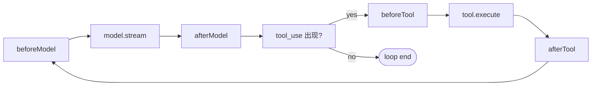

# Plugin

Framework 的**唯一扩展点**。一组事件钩子的封装——让外部代码在 agent loop 的关键时刻插入横切逻辑，不需要改 framework，也不需要改 agent。

---

## 为什么需要这个抽象

L2 的 [`run()`](./00-overview.md#runtime-契约) 是一条线性流水线：push user → loop（model → tool → tool_result）→ until done。真实场景里，你想在流水线的特定节点插横切逻辑：

| 场景 | 想插在哪 |
|---|---|
| PII 脱敏、注入元信息 | 调 model 之前 |
| token 用量上报 | model 返回之后 |
| 工具调用前请求 metrics 上下文 | tool 执行之前 |
| 任意 observer 类副作用 | 每一步之后 |

不引入 plugin 的替代方案只有三种，都不够：

1. **改 L2 `run()` 源码** — 每个需求一个 fork，不可复用
2. **包装 model / tool** — 看不到跨步骤的状态。比如"tool 执行后落盘整个 thread"，单个 tool 看不到 thread
3. **调用方在外面循环** — 等于放弃 framework，回到手写 L2

所以 plugin 的存在性来自一个第一性事实：**有些扩展逻辑必须看到 agent 内部的执行节点，且必须跨多个节点**。包装函数解决不了。

---

## 四个时机

plugin 只能在这 4 个时刻插入：



成对出现，**类型即语义**：

- **`before*` → Transformer**：返回值有语义，影响数据流。坏了 = 整轮 abort
- **`after*` → Observer**：返回值忽略，纯副作用。坏了 = 吞掉 + warn

完整接口和钩子签名见 [Framework#Plugin](./02-framework.md#plugin)。

### Transformer (before*)

```ts
beforeModel(ctx, messages) → 新 messages
beforeTool(ctx, call, messages) → { skip?, input?, result? }
```

典型用例：

- `redactor` — 调 LLM 前给 PII 打码
- `injectMetadata` — 给每条 user 消息拼接时间戳、项目信息
- `permissionGate` — `beforeTool` 检查是否需要中断（实际中断由 [InterruptSignal](./04-checkpointer.md#tool-端interruptsignal-用法) 表达，plugin 只做"判定+提示"）

### Observer (after*)

```ts
afterModel(ctx, messages) → void
afterTool(ctx, call, result, messages) → void
```

典型用例：

- `metricsPlugin` — 上报 token 用量到监控系统
- `traceExporter` — 把每步事件发给 OTel/Sentry
- `auditLog` — 把 tool 执行写到合规日志（与 [Checkpointer](./04-checkpointer.md) 内置事件流互补：plugin 出独立 sink）

> 上下文裁剪不是 plugin —— 那是 [ContextManager](./05-context-manager.md) 的事。落盘不是 plugin —— 那是 [Checkpointer](./04-checkpointer.md) 的事。日志不是 plugin —— 那是 framework 内化 [Logger](./02-framework.md#logger) 的事。三件事都从 plugin 中迁出了。

---

## HookContext — Plugin 拿到的能力

```ts
interface HookContext {
  threadId: string;
  signal?: AbortSignal;
  logger: Logger;                  // framework 内化
  checkpointer: Checkpointer;      // framework 内化
  contextManager: ContextManager;  // framework 内化
}
```

`ctx` 永远是第一个参数，事件特定 data 跟在后面。

`logger` / `checkpointer` / `contextManager` 三个内化能力直接暴露给 plugin。plugin 可以：

- 用 `ctx.logger.debug(...)` 打日志，level 受 framework 控制
- 用 `await ctx.checkpointer.readEvents(threadId)` 异步读事件流做审计 UI
- 用 `await ctx.contextManager.shape(ctx, messages)` 派生"实际送给 LLM 的视图"，做精确 token 统计

**但不能反客为主**：

| ✗ 错用 | ✓ 正用 |
|---|---|
| `ctx.checkpointer.save(...)` | framework 自动 save，plugin 只读不写 |
| `ctx.checkpointer.saveInterrupt(...)` | 通过 `tool.execute` 抛 `InterruptSignal` 表达中断 |
| 用 `shape` 改动后塞回 messages | shape 是只读派生；要改 messages 用 `beforeModel` 返回值 |

这是"能力暴露 vs 职责越界"的区别：plugin 能**读** framework 的内化能力，但不能**重写** framework 自己负责的事。

---

## 能力边界

plugin 只能做以下事：

1. 在 4 个固定时机被 framework 同步调用
2. 通过 `before*` 返回值修改数据流
3. 通过 `after*` 触发副作用
4. 读 `HookContext` 暴露的 framework 内化能力
5. **静态声明** 配套 tool（`Plugin.tools?: readonly Tool[]`），由 framework 在 `createAgent` 启动时一次性合并

plugin **不能做**的事（设计纪律）：

| 不能做 | 因为 |
|---|---|
| 拿到 `model` 对象本身 | plugin 不需要内省 LLM。要 token 计数自己引 tiktoken |
| **运行时动态注册/卸载 tool** | tool 集对 LLM 必须可预测；静态声明 OK，运行时变更不行 |
| emit 自定义事件给其他 plugin | 要通信 → 合并成一个 plugin。不给 framework 加 emit/pub-sub |
| 阻止 agent loop 退出 | 那是 agent 行为不是钩子的事 |
| 持有跨 agent 的全局状态 | 用 closure 自己存 |

### 静态 tool 声明

某些 plugin 与一组 tool 是**强耦合**的（[fsMemoryPlugin](./09-plugin-fs-memory.md) 必带 `memory_read/write/search`、[progressiveSkillPlugin](./10-plugin-progressive-skill.md) 必带 `skill_load`）。让调用方手动 spread 这些 tool 是把 plumbing 甩给用户：

```ts
// ✗ 产品化差
createAgent({
  tools: [...baseTool, ...memoryTools, ...skillTools],
  plugins: [memoryPlugin, skillPlugin],
});

// ✓ plugin 自带
createAgent({
  tools: [...baseTool],
  plugins: [fsMemoryPlugin({ dir }), progressiveSkillPlugin({ dir })],
});
```

接口：

```ts
interface Plugin {
  name: string;
  hooks: PluginHooks;
  tools?: readonly Tool[];   // ← 静态声明
}
```

合并语义见 [Framework#Plugin](./02-framework.md#plugin)：framework 在 `createAgent` 入口把所有 `plugins[i].tools` 与 `config.tools` 合并，**重名 fail-fast** 不静默覆盖。

**这与"plugin 不能动态加 tool"不冲突**——静态字段在 agent 构造时一次性确定，运行时不变；LLM 看到的 tool 集对调用方完全可预测。

---

## Plugin 不是什么

| 概念 | 与 Plugin 的区别 |
|---|---|
| **Middleware** | 洋葱模型，要 `next()`；plugin 没有 next，framework 自动推进 |
| **Decorator / Wrapper** | 包装单个对象（一个 model、一个 tool）；plugin 看的是 agent 整体执行流 |
| **Tool** | tool 是 LLM 主动调；plugin 是 framework 被动调 |
| **Event Listener** | listener 只能"知道发生了"；plugin 的 `before*` 可以 transform 数据流 |
| **Checkpointer** | checkpointer 是 framework 内化（持久化 + 中断），plugin 只是观察。详见 [Checkpointer vs Plugin 边界](./04-checkpointer.md#与-plugin-的协作边界) |
| **ContextManager** | context manager 决定"送给 LLM 的视图"；plugin 在那个视图上做最后修饰。详见 [边界](./05-context-manager.md#八contextmanager-vs-pluginbeforemodel-的边界) |

---

## 管道链与错误隔离

多个 plugin 挂同一个 `before*` 时，按 `plugins` 数组顺序依次调用，上一个的返回值作为下一个的输入：

```ts
async function fireBeforeModel(plugins, ctx, msgs) {
  for (const p of plugins) {
    if (p.hooks.beforeModel) {
      msgs = (await p.hooks.beforeModel(ctx, msgs)) ?? msgs;
    }
  }
  return msgs;
}
```

`beforeTool` 同理：前一个 plugin 改写后的 `{ input }` 传给下一个。

错误隔离规则：

```
before*  抛错 → 整轮 abort，传给调用方
after*   抛错 → 吞掉 + logger.warn(pluginName, err)
```

不引入"plugin 优先级"枚举——`plugins` 数组顺序就是调用顺序。

---

## definePlugin — 类型推导

```ts
export const myPlugin = definePlugin({
  name: 'redactor',
  hooks: {
    beforeModel(ctx, messages) {
      ctx.logger.debug('redacting', messages.length);
      return messages.map(redact);
    },
  },
});

// 带静态 tool 声明的形态：
export const fsMemoryPlugin = definePlugin({
  name: 'fs-memory',
  tools: [memoryReadTool, memoryWriteTool, memorySearchTool],
  hooks: {
    async beforeModel(ctx, messages) { /* 注入 MEMORY.md */ },
  },
});
```

只写关心的钩子和字段，其余类型自动推导。不需要手动 `import type { Plugin }`。

---

## 设计自检 checklist

设计或评审一个 plugin 时问：

1. **它真的需要看 agent 内部执行节点吗？** 不需要 → 写成 model/tool 的包装函数，不要做成 plugin
2. **它的逻辑能用 4 个钩子表达吗？** 不能 → 要么逻辑越界（去 [Harness](./06-harness.md) 层做），要么想偷塞中间件
3. **依赖什么？** 只依赖 `core` 类型 → 可入 framework 包；依赖具体 model / tool / fs / CLI → 入 harness
4. **多个实例需要互相通信吗？** 需要 → 合并成一个 plugin
5. **失败该不该阻塞？** before* 阻塞、after* 不阻塞，与类型语义一致

---

## 总结

Plugin = **framework 的扩展点** = **在 4 个固定时机插入横切逻辑的能力 + 静态声明配套 tool**。

- 存在性来自第一性事实：横切扩展无法用纯函数包装解决
- 能力边界严格收窄到 4 个钩子 + 1 个静态 tool 字段，故意不给更多
- 两类钩子（transformer / observer）语义不同，类型层面隔离
- 配套 tool 用静态字段声明（`Plugin.tools?`），framework 启动时合并，重名 fail-fast
- HookContext 暴露 framework 三大内化能力（logger / checkpointer / contextManager），plugin 可读不可越权
- 不是 middleware、不是 decorator、不是 event bus —— 是 framework 唯一的扩展点，没有第二种

---

## 已实现的 plugin

| Plugin | 包 | 用途 |
|---|---|---|
| [fsMemoryPlugin](./09-plugin-fs-memory.md) | `@my-agent-team/plugin-fs-memory` | 文件系统持久化记忆，自动注入 MEMORY.md 到 system 末尾 |
| [progressiveSkillPlugin](./10-plugin-progressive-skill.md) | `@my-agent-team/plugin-progressive-skill` | Skill 渐进式加载，注入索引 + `skill_load` 按需 fetch 正文 |
