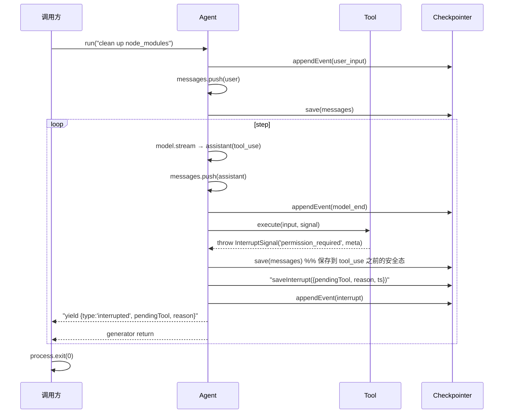
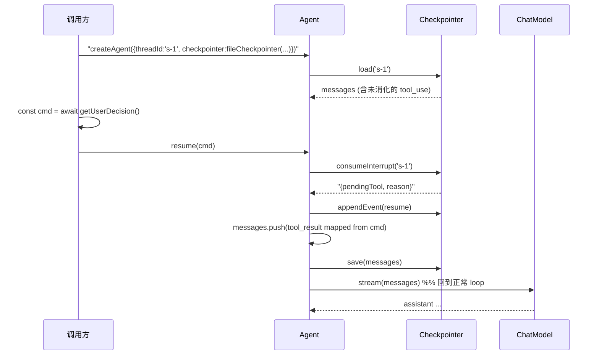

# Checkpointer

Framework 的**内化能力**，负责 agent 执行状态的**持久化与可恢复性**。它不是可选 plugin——永远存在，只是实现可替换（内存 / 文件 / Redis / 数据库）。

> **职责收窄**:Checkpointer **只服务 agent loop 自身的可恢复性**(快照续跑 + 中断恢复)。"UX 层读历史事件流做回放"这件事**已剥离到 [EventLog](./14-event-log.md)**——一个独立 port,带 `thread_id` 字段、可订阅、由 backend 持有。Checkpointer 由 **runner 注入(子进程内,backend 不碰)**;EventLog 由 **backend composition root 持有(投影端唯一数据源)**。两者职责正交、长期共存。下文的 Tier 3(`appendEvent`/`readEvents`)语义降级为"checkpointer 内部审计",**不再是 UX 投影的事实源**,详见 [14 §五](./14-event-log.md#五与-checkpointer-的职责切分对照表)。

解决两个第一性问题(原"执行流可观测"已移交 EventLog):

1. **状态持久化** — 进程崩溃后，下次启动能从最近的 tool 边界续跑
2. **可中断执行** — human-in-the-loop 场景下，agent loop 能暂停、退出进程、等待外部决策、新进程恢复

> **Checkpointer 是 resume 的唯一权威源,且 backend 经 re-fork 触发 resume**:
> - **唯一权威源**:`save` 存的是 agent loop **裁剪后的真实输入态**(token-budget / summarizing / sliding-window 之后)。[EventLog](./14-event-log.md) 记的是**未裁剪原始事件**,因丢失裁剪信息**不能**替代 checkpointer 做 resume(用它 replay 会与原始输入态分叉,触发 token 爆或 Anthropic 400)。详见 [14 §5.1](./14-event-log.md#51-为什么-eventlog-不能取代-checkpointer-做-resume)。
> - **backend 不持有 checkpointer,不调 `agent.resume()`**:durable runs 下 backend 收到 `POST /api/runs/:id/resume` 后,**fork 一个新 attempt 子进程**(spec 带 `mode='resume'` + `resumeCommand` + 原 `storage.checkpointer` 配置);子进程内才调 `agent.resume()` → `consumeInterrupt`。backend 只**转发** checkpointer 连接配置,**从不读其内容**(对 checkpointer 介质永久无感)。链路见 [12-backend §Resume](./12-backend.md#resumebackend-不-resume而是重新-fork-一个-attempt)。

---

## 模块边界

| 模块 | 职责 |
|---|---|
| `Checkpointer` | 接口定义 + 内置 `inMemoryCheckpointer` |
| `InterruptSignal` | Tool 抛出的中断信号 |
| `CheckpointEvent` | 事件流的类型定义（注意：与 framework yield 的 `AgentEvent` 不同） |
| `fileCheckpointer` | 文件实现（JSON state + JSONL events） |
| `redisCheckpointer` 等 | 其他持久层实现，独立适配包 |

依赖方向：framework → core。Checkpointer 实现不依赖 adapter / tools / harness。

---

## 接口设计

### 核心契约

```ts
interface Checkpointer {
  // ============== Tier 1: 必需 ==============
  save(threadId: string, messages: readonly Message[]): Promise<void>;
  load(threadId: string): Promise<Message[] | null>;

  // ============== Tier 2: Interrupt（成对）==============
  saveInterrupt?(threadId: string, state: InterruptState): Promise<void>;
  consumeInterrupt?(threadId: string): Promise<InterruptState | null>;

  // ============== Tier 3: Event Stream（成对）==============
  appendEvent?(threadId: string, event: CheckpointEvent): Promise<void>;
  readEvents?(threadId: string): AsyncIterable<CheckpointEvent>;
}
```

### 配套类型

```ts
interface InterruptState {
  pendingTool: { call: ToolUseBlock; reason: string };
  ts: number;
  meta?: Record<string, unknown>;   // tool 提供给前端展示用
}

type CheckpointEvent =
  | { type: 'user_input'; content: string; ts: number }
  | { type: 'model_start'; messageCount: number; ts: number }
  | { type: 'model_end'; blocks: ContentBlock[]; usage?: { input: number; output: number }; ts: number }
  | { type: 'tool_start'; call: ToolUseBlock; ts: number }
  | { type: 'tool_end'; result: ToolResultBlock; durationMs: number; ts: number }
  | { type: 'interrupt'; pendingTool: ToolUseBlock; reason: string; ts: number }
  | { type: 'resume'; ts: number }
  | { type: 'run_end'; reason: 'complete' | 'aborted' | 'maxSteps'; ts: number };

class InterruptSignal extends Error {
  constructor(public readonly reason: string, public readonly meta?: Record<string, unknown>) {
    super(`Interrupted: ${reason}`);
    this.name = 'InterruptSignal';
  }
}
```

---

## 能力分层（Capability Detection）

接口分三层，每层**成对**：要么两个方法都实现，要么都不实现。

| Tier | 方法 | 成对契约 | 不实现的后果 |
|------|------|----------|-------------|
| 1 — 基础持久化 | `save` / `load` | **强制**——不实现 = 不是 Checkpointer | — |
| 2 — Human-in-the-loop | `saveInterrupt` / `consumeInterrupt` | 必须成对 | Tool 抛 `InterruptSignal` 时 throw |
| 3 — 内部审计 | `appendEvent` / `readEvents` | 必须成对 | 不记录内部审计流，但 agent 正常运行 |

> **Tier 3 的定位**:UX 投影 / SSE 回放已由 [EventLog](./14-event-log.md) 承担。Tier 3 保留为"checkpointer 内部审计"可选能力,**backend 不再以它为数据源**。新部署可直接不实现 Tier 3,让 EventLog 独家负责事件流。

**`createAgent` 构造时校验成对契约**——fail fast：

```ts
function validateCheckpointer(cp: Checkpointer): void {
  const hasAppend = typeof cp.appendEvent === 'function';
  const hasRead = typeof cp.readEvents === 'function';
  if (hasAppend !== hasRead) {
    throw new Error(
      'Checkpointer event capability is partial: ' +
      `appendEvent=${hasAppend}, readEvents=${hasRead}. ` +
      'Both must be implemented or both omitted.'
    );
  }
  const hasSaveInt = typeof cp.saveInterrupt === 'function';
  const hasConsumeInt = typeof cp.consumeInterrupt === 'function';
  if (hasSaveInt !== hasConsumeInt) {
    throw new Error(
      'Checkpointer interrupt capability is partial: ' +
      `saveInterrupt=${hasSaveInt}, consumeInterrupt=${hasConsumeInt}. ` +
      'Both must be implemented or both omitted.'
    );
  }
}
```

framework 内部访问仍用可选链（`cp.appendEvent?.(...)`）——协议层强制成对让 `?` 实际要么 always-hit 要么 always-miss。

**Tier 2 缺失时的降级**：

```ts
if (!checkpointer.saveInterrupt) {
  throw new Error(
    'Tool requested interrupt but checkpointer does not support it. ' +
    'Use fileCheckpointer or implement saveInterrupt/consumeInterrupt.'
  );
}
```

---

## 内置实现

### `inMemoryCheckpointer`（默认）

```ts
export const inMemoryCheckpointer = (): Checkpointer => {
  const messages = new Map<string, Message[]>();
  const interrupts = new Map<string, InterruptState>();
  const events = new Map<string, AgentEvent[]>();

  return {
    async save(id, msgs) { messages.set(id, structuredClone([...msgs])); },
    async load(id) { return messages.get(id) ? structuredClone(messages.get(id)!) : null; },

    async saveInterrupt(id, state) { interrupts.set(id, state); },
    async consumeInterrupt(id) {
      const s = interrupts.get(id);
      interrupts.delete(id);
      return s ?? null;
    },

    async appendEvent(id, event) {
      if (!events.has(id)) events.set(id, []);
      events.get(id)!.push(event);
    },
    async *readEvents(id) {
      yield* events.get(id) ?? [];
    },
  };
};
```

`createAgent` 不传 checkpointer 时默认用它。进程退出 = 状态丢失，但接口完整，**保证 framework 行为统一**。适合单进程一次性任务、测试。

### `fileCheckpointer`

```ts
fileCheckpointer({ dir }): Checkpointer
```

**构造时 `mkdir(dir, { recursive: true })`**——fail fast。路径权限有问题立刻报，不会跑了 10 分钟到第一次 save 才崩。

文件布局：

```
${dir}/
├── ${threadId}.state.json        # messages 快照（原子写）
├── ${threadId}.interrupt.json    # 当前 interrupt（可能不存在）
└── ${threadId}.events.jsonl      # 事件追加流（append-only）
```

**原子写实现**（`node:fs/promises`）：

```ts
import { writeFile, rename, rm, appendFile, readFile, mkdir } from 'node:fs/promises';
import { join } from 'node:path';

async function atomicWriteJSON(target: string, data: unknown): Promise<void> {
  const tmp = `${target}.tmp.${process.pid}.${Date.now()}`;
  try {
    await writeFile(tmp, JSON.stringify(data));
    await rename(tmp, target);
  } catch (err) {
    await rm(tmp, { force: true }).catch(() => {});
    throw err;
  }
}
```

- **不 fsync**——接受极端断电丢最后一次 save，event log 兜底
- `rename(tmp, target)` 是 POSIX 原子操作——要么 target 完全新内容，要么完全旧内容，不存在半截文件
- `Bun.write` 自身不是原子写（等价 O_WRONLY|O_CREAT|O_TRUNC），所以 tmp + rename 是必须的
- tmp 文件名含 `pid + timestamp` 防止同进程并发 save 撞文件名
- **不主动清理 `.tmp.*` 残留**——进程被 kill 时 catch 跑不到，残留文件不影响正确性，文档提示可安全删除

**`consumeInterrupt` = readFile + unlink**：

```ts
async function consumeInterrupt(id: string): Promise<InterruptState | null> {
  const p = path(id, '.interrupt.json');
  try {
    const buf = await readFile(p, 'utf8');
    await rm(p);  // unlink; 失败则 throw（防止双消费）
    return JSON.parse(buf);
  } catch (err: any) {
    if (err.code === 'ENOENT') return null;
    throw err;
  }
}
```

**`appendEvent`**：`appendFile(path, JSON.stringify(event) + '\n')`。`O_APPEND` 保证单事件 < PIPE_BUF（4KB）时原子追加——多进程并发不会撕裂行。

**threadId 安全契约**（防御纵深）：

```ts
const VALID_ID = /^(?!\.)[A-Za-z0-9_\-.]{1,128}$/;

function assertId(id: string): void {
  if (!VALID_ID.test(id) || /^\.+$/.test(id)) {
    throw new Error(`Invalid threadId: ${JSON.stringify(id)}`);
  }
}
```

- 禁止以点开头（避免生成隐藏文件、与 dotfile 撞名）
- 禁止全点串（`.`, `..`, `....` 等虽不穿越路径但语义混乱）
- `/` 和 `\` 本就不在白名单，路径穿越被阻断
- **不做静默替换**——静默替换会让两个不同 threadId 落到同一文件

调用方提供自由格式 session id 时，推荐先 hash：`sha256(rawId).slice(0, 32)`。

适合 CLI、单机服务、本地开发。

### `redisCheckpointer`（独立适配包）

- `save` → `SET state:${id}`
- `appendEvent` → `XADD events:${id} *`（Redis Stream）
- `saveInterrupt` → `SET interrupt:${id}`

适合多进程 Web 服务、分布式 worker。

---

## Framework 集成点

### 时机契约（强制，写死，不可配置）

**Save 时机（5 个）**：

| # | Framework 调用 | 时机 | messages 末尾状态 |
|---|---------------|------|-------------------|
| 1 | `checkpointer.save(...)` | `run()` 入口 push user message 之后 | `user(text)` |
| 2 | `checkpointer.save(...)` | 每个 tool 执行完成 push tool_result 之后 | `user(tool_result)` |
| 3 | `checkpointer.save(...)` | 每轮 turn 结束（assistant 无 tool_use）之后 | `assistant(text only)` |
| 4 | `checkpointer.save(...)` → `checkpointer.saveInterrupt(...)` | 捕获 `InterruptSignal` 之后、yield interrupted 之前 | `assistant(tool_use)`（特殊） |
| 5 | `checkpointer.save(...)` | `resume()` push tool_result 之后 | `user(tool_result)` |
| — | `checkpointer.consumeInterrupt(...)` | `agent.resume()` 调用时 | — |
| — | `checkpointer.appendEvent?(...)` | 每个关键事件发生时 | — |

Save 频率 ≈ tool 调用次数 + 2（首尾各一次）。`fileCheckpointer` 单次 save < 1ms（典型 messages），不构成瓶颈。需要优化的用户可自行包装 checkpointer 实现 debounce。

**关键纪律**：`save` 时机只在 messages 处于**合法 API 输入态**时触发。即 messages 末尾必须是：

- `user(text)` — 首次输入
- `assistant(text only)` — 完成的轮次
- `user(tool_result)` — tool 执行完成

**Interrupt 时的特殊处理**：tool 抛 `InterruptSignal` 时，messages 末尾是 `assistant(tool_use)`——严格说是非法 API 状态。但中断时**不做回退**——保存当前完整 messages。`agent.resume()` 时 framework 会先补上 `tool_result`，让 messages 恢复合法后再继续 loop。这样不丢失 model 已产出的 tool_use，也避免了重新调 LLM。

### Agent API

详见 [Framework#Agent](./02-framework.md#agent)。`ResumeCommand` 表达"用户同意/拒绝"语义，比 LangChain Command 简单——没有 goto/update。framework 内部映射规则：

```
tool_result.is_error = !command.approved
tool_result.content  = command.message ?? (command.approved ? 'approved' : 'denied by user')
```

---

## Interrupt & Resume 流程

### 第一次执行 → 中断



### 新进程 → 恢复



伪代码补充（resume 关键部分）：

```ts
async function* resume(command: ResumeCommand) {
  const it = await checkpointer.consumeInterrupt?.(threadId);
  if (!it) throw new Error('No pending interrupt for this thread');

  await checkpointer.appendEvent?.(threadId, { type: 'resume', ts: Date.now() });

  messages.push({
    role: 'user',
    content: [{
      type: 'tool_result',
      tool_use_id: it.pendingTool.call.id,
      content: command.message ?? (command.approved ? 'approved' : 'denied by user'),
      is_error: !command.approved,
    }],
  });
  await checkpointer.save(threadId, messages);

  yield* runLoop();  // 复用主 loop
}
```

---

## Tool 端：InterruptSignal 用法

Tool 是中断的发起方，由 Tool 决定何时需要人介入：

```ts
import { InterruptSignal } from '@my-agent/framework';

export const bashTool: Tool = {
  name: 'bash',
  description: 'Run a shell command',
  inputSchema: { /* ... */ },

  async execute(input, signal) {
    const cmd = (input as { command: string }).command;

    if (isDangerous(cmd)) {
      throw new InterruptSignal('permission_required', {
        command: cmd,
        risk: 'destructive',
        prompt: `Allow running: ${cmd}?`,
      });
    }
    return runShell(cmd, signal);
  },
};
```

约定：

- `InterruptSignal` 是 framework 导出的特殊错误类，framework 识别它并走 interrupt 流程。其他错误正常 push `is_error: true` 的 tool_result
- `meta` 字段由 Tool 自由定义，**透传到 UX 层**给前端做权限询问 UI
- Tool 不知道有没有 checkpointer 支持 interrupt——它只管抛；framework 检查能力，不支持时 throw 降级

**识别边界（严格）**：framework 只在 **`tool.execute()` 抛出**的 `InterruptSignal` 上走中断流程。其他位置抛 `InterruptSignal` 一律按普通错误处理：

- ✗ Plugin `beforeTool` / `afterTool` 里抛 → 视作 plugin 故障（`before*` abort 整轮 / `after*` 吞掉 warn）
- ✗ `ContextManager.shape` 里抛 → 视作 shape 失败，整轮 abort
- ✗ `ChatModel.stream` 里抛 → 视作 model 故障
- ✓ 仅 `tool.execute(input, signal)` 直接抛出 → 走 `saveInterrupt` + yield `interrupted` + 退出 generator

理由：中断的语义是"tool 想要外部决策"。允许其他位置抛会让控制流分裂——丧失"中断点 = 当前 tool_use"这个清晰锚点。

**工具包装器——`withPermission`**（推荐 pattern，替代在 beforeTool 里抛 InterruptSignal）：

```ts
function withPermission<T extends Tool>(
  tool: T,
  shouldGate: (input: unknown) => boolean,
  reason: string = 'permission_required',
): Tool {
  return {
    ...tool,
    async execute(input, signal) {
      if (shouldGate(input)) throw new InterruptSignal(reason, { tool: tool.name, input });
      return tool.execute(input, signal);
    },
  };
}

const safeBash = withPermission(bashTool, (input) => isDangerous(input.command));
createAgent({ model, tools: [safeBash, readTool, writeTool] });
```

这彻底符合"中断 = tool.execute 抛"契约——`withPermission` 返回的就是一个 Tool，它的 `execute` 抛 `InterruptSignal` 完全合法。Plugin 想做审批/权限，用包装器而非在 `beforeTool` 里抛。

---

## 与 Plugin 的协作边界

Checkpointer **不是** plugin——它是 framework 内化。但 plugin 通过 [HookContext](./03-plugin.md#hookcontext--plugin-拿到的能力) 可以读 checkpointer 的事件流（`readEvents`），做审计 UI / metrics 派生。**不要双写 `save()`**。

| 场景 | Checkpointer 还是 Plugin |
|---|---|
| 持久化 messages 用于崩溃恢复 | **Checkpointer**（framework 自动调） |
| 持久化事件流给 UX 回放 | **Checkpointer**（`appendEvent`，framework 自动调） |
| 把每次 tool 调用上报到 metrics 系统 | **Plugin**（observer 模式） |
| 调 LLM 前裁剪 messages | **[ContextManager](./05-context-manager.md)** |
| 调 LLM 前修饰 messages（脱敏、注入信息） | **Plugin**（`beforeModel`） |
| 调 tool 前请求权限 | **Tool 抛 `InterruptSignal`** 或用 **`withPermission(tool)` 包装器** |

核心区分：

- **改变 agent 控制流**(暂停 / 恢复 / 状态持久化)→ Checkpointer
- **观察或 transform 数据**（log / metrics / 裁剪修饰）→ Plugin / ContextManager

Permission 这类需求**从 plugin 中迁出**——它本质上是控制流操作（暂停 loop、等待外部输入、恢复），不是数据 transform。

---

## 与 Backend ThreadProjection 的关系

M14.7 拆出 resident runner daemon 后，原「checkpointer」职责被拆成两个独立概念：

| 概念 | 所有权 | 存储 | 职责 |
|------|--------|------|------|
| **`ThreadProjection`** | Backend (`apps/backend/features/thread-projection/`) | `backend.db` | Conversation ledger → agent thread 的模型消息投影（`[User]: 你好`）。`broadcastMessage()` 在每次 ledger append 后写入 |
| **`Checkpointer`** | Runner daemon (`@my-agent-team/framework`) | `runners/<id>/state/checkpointer.sqlite` | Agent 运行时 checkpoint：save/load messages、saveInterrupt/consumeInterrupt、appendEvent。backend 不读不写 |

### 上下文 hydration 协议

Conversation-triggered run 启动时，通过 transport `preloadedMessages` hydrate runner 本地 checkpointer：

```text
forkRun() → threadProjectionRead.getMessages(threadId)
          → transport.send({ type:"start", preloadedMessages })
          → daemon.#checkpointer.save(threadId, msgs)
          → createGenericAgent() → checkpointer.load() 读到完整上下文
          → agent.continue()  （不追加空 user，直接用 checkpoint 消息进入 runLoop）
```

两 DB 文件保持独立，消息只在 run 启动时走 transport 层传递一次快照。

### 未来方向：checkpointer 子服务化

长期看 runner daemon 的 checkpointer 可能升级为 backend 内部 HTTP/RPC 子服务：

```text
sandbox runner ──HTTP/Unix-socket──> backend checkpointer service ──> SQLite/PG
```

- backend 自己持有 SQLite/Postgres 连接（不暴露给 runner）
- runner 通过狭窄的 HTTP 接口调 `save` / `load` / `appendEvent` / `saveInterrupt` / `consumeInterrupt`
- 鉴权用 spec 里的 short-lived token；threadId 范围由 backend 校验

**升级触发器（永久 invariant）**：**sandbox runner 启用前**需评估是否需要 checkpointer HTTP/RPC 化。当前 transport `preloadedMessages` hydration 协议已解决上下文传播问题，runner-local SQLite 适合单机部署。