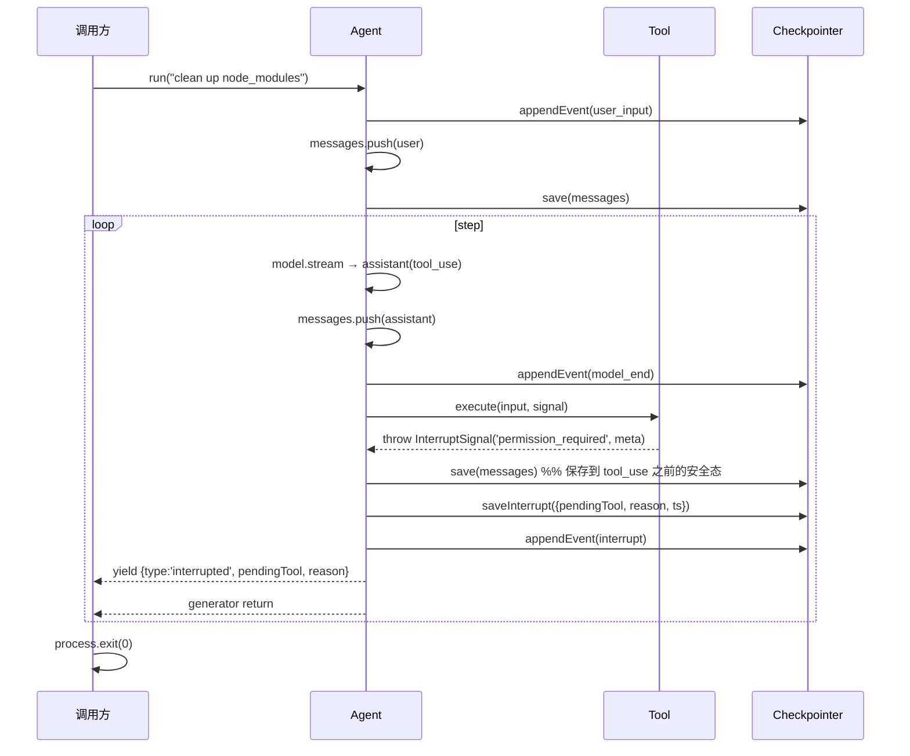
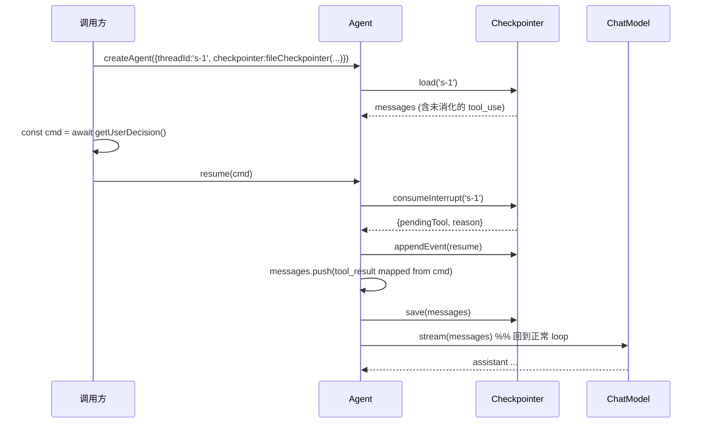

# Checkpointer

Framework 的**内化能力**，负责 agent 执行状态的**持久化与可恢复性**。它不是可选 plugin——永远存在，只是实现可替换（内存 / 文件 / Redis / 数据库）。

解决三个第一性问题：

1. **状态持久化** — 进程崩溃后，下次启动能从最近的 tool 边界续跑
2. **可中断执行** — human-in-the-loop 场景下，agent loop 能暂停、退出进程、等待外部决策、新进程恢复
3. **执行流可观测** — UX 层可以读取历史事件流，做时间轴回放

---

## 模块边界

| 模块 | 职责 |
|---|---|
| `Checkpointer` | 接口定义 + 内置 `inMemoryCheckpointer` |
| `InterruptSignal` | Tool 抛出的中断信号 |
| `AgentEvent` | 事件流的类型定义 |
| `fileCheckpointer` | 文件实现（JSON state + JSONL events） |
| `redisCheckpointer` 等 | 其他持久层实现，独立适配包 |

依赖方向：framework → core。Checkpointer 实现不依赖 adapter / tools / harness。

---

## 接口设计

### 核心契约

```ts
interface Checkpointer {
  // ============== 必需能力 ==============
  /** 保存 thread 当前完整 messages */
  save(threadId: string, messages: readonly Message[]): Promise<void>;
  /** 加载 thread 历史 messages，无则返回 null */
  load(threadId: string): Promise<Message[] | null>;

  // ============== 可选能力:Interrupt ==============
  saveInterrupt?(threadId: string, state: InterruptState): Promise<void>;
  consumeInterrupt?(threadId: string): Promise<InterruptState | null>;

  // ============== 可选能力:Event Stream ==============
  appendEvent?(threadId: string, event: AgentEvent): Promise<void>;
  readEvents?(threadId: string): AsyncIterable<AgentEvent>;
}
```

### 配套类型

```ts
interface InterruptState {
  pendingTool: { call: ToolUseBlock; reason: string };
  ts: number;
  meta?: Record<string, unknown>;   // tool 提供给前端展示用
}

type AgentEvent =
  | { type: 'user_input'; content: string; ts: number }
  | { type: 'model_start'; messageCount: number; ts: number }
  | { type: 'model_end'; blocks: ContentBlock[]; usage?: { input: number; output: number }; ts: number }
  | { type: 'tool_start'; call: ToolUseBlock; ts: number }
  | { type: 'tool_end'; result: ToolResultBlock; durationMs: number; ts: number }
  | { type: 'interrupt'; pendingTool: ToolUseBlock; reason: string; ts: number }
  | { type: 'resume'; ts: number }
  | { type: 'run_end'; reason: 'complete' | 'aborted' | 'maxSteps'; ts: number };

class InterruptSignal extends Error {
  constructor(public readonly reason: string, public readonly meta?: Record<string, unknown>) {
    super(`Interrupted: ${reason}`);
    this.name = 'InterruptSignal';
  }
}
```

---

## 能力分层（Capability Detection）

接口分**必需 / 可选**两层，framework 用方法存在性判断能力：

| 能力 | 方法 | 不实现的后果 |
|---|---|---|
| 基础持久化 | `save` / `load` | **强制**——不实现 = 不是 Checkpointer |
| Human-in-the-loop | `saveInterrupt` / `consumeInterrupt` | Tool 抛 `InterruptSignal` 时 throw |
| UX 回放 / 审计 | `appendEvent` / `readEvents` | 不记录事件流，但 agent 正常运行 |

framework 在调用前检查：

```ts
if (checkpointer.saveInterrupt) {
  await checkpointer.saveInterrupt(threadId, interruptState);
} else {
  throw new Error(
    'Tool requested interrupt but checkpointer does not support it. ' +
    'Use fileCheckpointer or implement saveInterrupt/consumeInterrupt.'
  );
}
```

---

## 内置实现

### `inMemoryCheckpointer`（默认）

```ts
export const inMemoryCheckpointer = (): Checkpointer => {
  const messages = new Map<string, Message[]>();
  const interrupts = new Map<string, InterruptState>();
  const events = new Map<string, AgentEvent[]>();

  return {
    async save(id, msgs) { messages.set(id, structuredClone([...msgs])); },
    async load(id) { return messages.get(id) ? structuredClone(messages.get(id)!) : null; },

    async saveInterrupt(id, state) { interrupts.set(id, state); },
    async consumeInterrupt(id) {
      const s = interrupts.get(id);
      interrupts.delete(id);
      return s ?? null;
    },

    async appendEvent(id, event) {
      if (!events.has(id)) events.set(id, []);
      events.get(id)!.push(event);
    },
    async *readEvents(id) {
      yield* events.get(id) ?? [];
    },
  };
};
```

`createAgent` 不传 checkpointer 时默认用它。进程退出 = 状态丢失，但接口完整，**保证 framework 行为统一**。适合单进程一次性任务、测试。

### `fileCheckpointer`

```ts
fileCheckpointer({ dir }): Checkpointer
```

文件布局：

```
${dir}/
├── ${threadId}.state.json        # messages 快照
├── ${threadId}.interrupt.json    # 当前 interrupt（可能不存在）
└── ${threadId}.events.jsonl      # 事件追加流
```

- `save` / `saveInterrupt`：原子写（`Bun.write(tmp, ...)` + `Bun.rename(tmp, target)`），防止写一半崩溃文件损坏
- `load` / `consumeInterrupt`：读对应 json 文件
- `appendEvent`：直接 append 一行 JSONL（丢一行事件可接受，不需要原子写）

**threadId 安全契约**：threadId 直接拼进文件路径，必须防止路径穿越（`../`、绝对路径、`\0`）和文件名非法字符。`fileCheckpointer` 在每次操作前对 threadId 校验：

- 允许字符：`[A-Za-z0-9_\-.]`，长度 1–128
- 不通过校验 → `throw new Error('Invalid threadId: ${id}')`，**不做静默替换**（静默替换会让两个不同 threadId 落到同一文件）

调用方负责提供合法的 threadId。如果上层有自由格式的 session id（UUID / 邮箱），应在交给 framework 前自行 hash（`sha256(rawId)`）。

适合 CLI、单机服务、本地开发。

### `redisCheckpointer`（独立适配包）

- `save` → `SET state:${id}`
- `appendEvent` → `XADD events:${id} *`（Redis Stream）
- `saveInterrupt` → `SET interrupt:${id}`

适合多进程 Web 服务、分布式 worker。

---

## Framework 集成点

### 时机契约（强制，写死，不可配置）

| Framework 调用 | 时机 | 目的 |
|---|---|---|
| `checkpointer.load(threadId)` | `createAgent` 后第一次 `run` 前 | 恢复历史 messages |
| `checkpointer.save(threadId, messages)` | 每次 tool 执行完成、tool_result 已 push 之后 | 状态落点必须是合法 API 输入 |
| `checkpointer.save(threadId, messages)` | 每次 model 返回纯文本（无 tool_use）loop 结束之后 | 收尾保存 |
| `checkpointer.saveInterrupt(...)` | 捕获 `InterruptSignal` 之后、退出 generator 之前 | 必须在 save 之后调，保证 interrupt 引用的 messages 已落盘 |
| `checkpointer.consumeInterrupt(...)` | `agent.resume()` 调用时 | 读出 pending tool 信息 |
| `checkpointer.appendEvent?(...)` | 每个关键事件发生时（model_start / tool_end / ...） | 可选记录 |

**关键纪律**：`save` 时机只在 messages 处于**合法 API 输入态**时触发。即 messages 末尾必须是：

- `user(text)` — 首次输入
- `assistant(text only)` — 完成的轮次
- `user(tool_result)` — tool 执行完成

**Interrupt 时的特殊处理**：tool 抛 `InterruptSignal` 时，messages 末尾是 `assistant(tool_use)`——严格说是非法 API 状态。但中断时**不做回退**——保存当前完整 messages。`agent.resume()` 时 framework 会先补上 `tool_result`，让 messages 恢复合法后再继续 loop。这样不丢失 model 已产出的 tool_use，也避免了重新调 LLM。

### Agent API

详见 [Framework#Agent](./02-framework.md#agent)。`ResumeCommand` 表达"用户同意/拒绝"语义，比 LangChain Command 简单——没有 goto/update。framework 内部映射规则：

```
tool_result.is_error = !command.approved
tool_result.content  = command.message ?? (command.approved ? 'approved' : 'denied by user')
```

---

## Interrupt & Resume 流程

### 第一次执行 → 中断



### 新进程 → 恢复



伪代码补充（resume 关键部分）：

```ts
async function* resume(command: ResumeCommand) {
  const it = await checkpointer.consumeInterrupt?.(threadId);
  if (!it) throw new Error('No pending interrupt for this thread');

  await checkpointer.appendEvent?.(threadId, { type: 'resume', ts: Date.now() });

  messages.push({
    role: 'user',
    content: [{
      type: 'tool_result',
      tool_use_id: it.pendingTool.call.id,
      content: command.message ?? (command.approved ? 'approved' : 'denied by user'),
      is_error: !command.approved,
    }],
  });
  await checkpointer.save(threadId, messages);

  yield* runLoop();  // 复用主 loop
}
```

---

## Tool 端：InterruptSignal 用法

Tool 是中断的发起方，由 Tool 决定何时需要人介入：

```ts
import { InterruptSignal } from '@my-agent/framework';

export const bashTool: Tool = {
  name: 'bash',
  description: 'Run a shell command',
  inputSchema: { /* ... */ },

  async execute(input, signal) {
    const cmd = (input as { command: string }).command;

    if (isDangerous(cmd)) {
      throw new InterruptSignal('permission_required', {
        command: cmd,
        risk: 'destructive',
        prompt: `Allow running: ${cmd}?`,
      });
    }
    return runShell(cmd, signal);
  },
};
```

约定：

- `InterruptSignal` 是 framework 导出的特殊错误类，framework 识别它并走 interrupt 流程。其他错误正常 push `is_error: true` 的 tool_result
- `meta` 字段由 Tool 自由定义，**透传到 UX 层**给前端做权限询问 UI
- Tool 不知道有没有 checkpointer 支持 interrupt——它只管抛；framework 检查能力，不支持时 throw 降级

**识别边界（严格）**：framework 只在 **`tool.execute()` 抛出**的 `InterruptSignal` 上走中断流程。其他位置抛 `InterruptSignal` 一律按普通错误处理：

- ✗ Plugin `beforeTool` / `afterTool` 里抛 → 视作 plugin 故障（`before*` abort 整轮 / `after*` 吞掉 warn）
- ✗ `ContextManager.shape` 里抛 → 视作 shape 失败，整轮 abort
- ✗ `ChatModel.stream` 里抛 → 视作 model 故障
- ✓ 仅 `tool.execute(input, signal)` 直接抛出 → 走 `saveInterrupt` + yield `interrupted` + 退出 generator

理由：中断的语义是"tool 想要外部决策"。允许其他位置抛会让控制流分裂—— plugin 可以伪造中断、context manager 可以打断未开始的 turn——丧失"中断点 = 当前 tool_use"这个清晰锚点。

---

## 与 Plugin 的协作边界

Checkpointer **不是** plugin——它是 framework 内化。但 plugin 通过 [HookContext](./03-plugin.md#hookcontext--plugin-拿到的能力) 可以读 checkpointer 的事件流（`readEvents`），做审计 UI / metrics 派生。**不要双写 `save()`**。

| 场景 | Checkpointer 还是 Plugin |
|---|---|
| 持久化 messages 用于崩溃恢复 | **Checkpointer**（framework 自动调） |
| 持久化事件流给 UX 回放 | **Checkpointer**（`appendEvent`，framework 自动调） |
| 把每次 tool 调用上报到 metrics 系统 | **Plugin**（observer 模式） |
| 调 LLM 前裁剪 messages | **[ContextManager](./05-context-manager.md)** |
| 调 LLM 前修饰 messages（脱敏、注入信息） | **Plugin**（`beforeModel`） |
| 调 tool 前请求权限 | **Tool 抛 `InterruptSignal`**（不是 plugin） |

核心区分：

- **改变 agent 控制流**（暂停 / 恢复 / 状态持久化）→ Checkpointer
- **观察或 transform 数据**（log / metrics / 裁剪修饰）→ Plugin / ContextManager

Permission 这类需求**从 plugin 中迁出**——它本质上是控制流操作（暂停 loop、等待外部输入、恢复），不是数据 transform。
