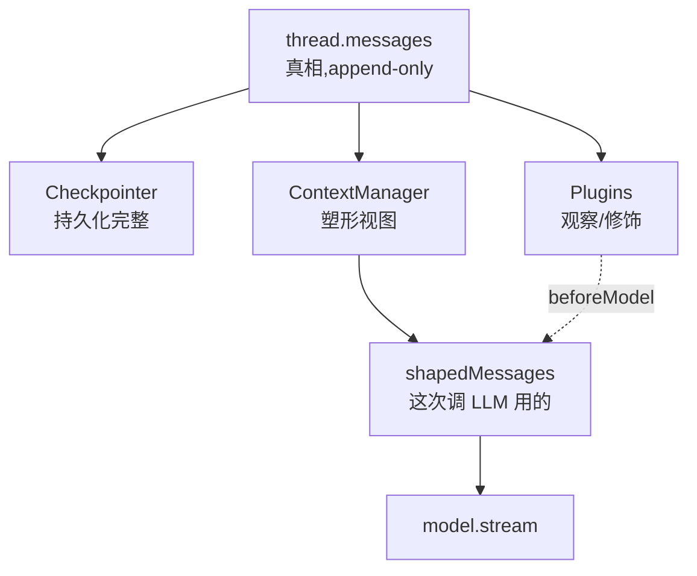

# ContextManager

Framework 的**内化能力**，在每次调 LLM 前决定"实际送进去的 messages 是什么"的策略层。它和 [Checkpointer](./04-checkpointer.md) 是兄弟——一个解决"状态在时间维度的持久与恢复"，一个解决"状态在空间维度的压缩与塑形"。

---

## 为什么需要这个抽象

LLM 调用有**输入长度上限**（context window）。Agent loop 跑得越久，messages 越长，最终撞墙。这是不可否认的事实。

最初方案：用一个 `slidingWindow` plugin 挂 `beforeModel` 钩子裁剪。随着场景变复杂，单一裁剪策略撑不住：

| 痛点 | slidingWindow plugin 的问题 |
|---|---|
| 不同 model 的 context window 不同 | plugin 不知道 model 容量，只能写死 turn 数 |
| 用户消息 + system + 工具结果各占多少 token | 简单 turn count 无法精确控制 |
| 长内容需要摘要而不是丢弃 | plugin 接口只能 transform messages，无法触发摘要子任务 |
| 工具结果太大（如读了个 10k 行的文件） | 不能简单丢，要替换成摘要引用 |
| 多轮过后老的 tool_use / tool_result 配对要一起删 | plugin 写裁剪逻辑容易留下孤儿 block |

**单个 plugin 解决不了，多个 plugin 互相影响会爆炸**——这是新抽象的信号。

Rule of three 检验：

1. **基于 token 数裁剪**（不是 turn 数） — 真实，每个 model 都需要
2. **保留首条 system message + 最近 N 条** — 真实，否则人格会丢
3. **大 tool 结果转摘要** — 真实，读完整个仓库的 grep 结果不能全塞

够 3 个，可以抽。

---

## 定位

**ContextManager = agent 在每次调 LLM 前，决定"实际送进去的 messages 是什么"的策略层。**

和 Checkpointer 的对照：

| 维度 | Checkpointer | ContextManager |
|---|---|---|
| 关注点 | 状态在**时间维度**上的持久与恢复 | 状态在**空间维度**上的压缩与塑形 |
| 时机 | tool 边界（save）、resume（load） | 每次 `model.stream` 之前 |
| 是否改 `thread.messages` | 不改（save 是只读 snapshot） | **不直接改**，只决定送给 LLM 的视图 |
| 默认实现 | `inMemoryCheckpointer` | `passthroughContextManager`（原样传） |
| 是否 framework 内化 | 是 | 是 |

---

## 关键设计：不能改 thread.messages

这是最容易踩的坑，必须先讲。

**反模式**：ContextManager 在 shape 里直接修改 `thread.messages`（删除老消息）。

**为什么不行**：

- `thread.messages` 是**真相** —— 持久化、UX 显示、fork 都依赖它
- 一旦真删，**不可恢复** —— 用户切回长上下文 model 也救不回
- 删除会破坏 Checkpointer 的"完整 thread"语义

**正确模型**：

```mermaid
flowchart TD
  TM["thread.messages<br/>（真相，append-only）"] -->|读| CM["ContextManager.shape<br/>（纯函数）"]
  CM -->|产出视图| MI[modelInput: Message[]]
  MI --> MS[model.stream]
  MS --> NA[新 assistant message]
  NA -->|append| TM
```

类比：`thread.messages` 是数据库表，ContextManager 是 SELECT 查询的 view。view 可以裁剪、聚合、变形，但不动表。

---

## 接口

### 核心契约

```ts
interface ContextManager {
  /**
   * 在每次调 LLM 前被 framework 调用。
   * @param ctx 上下文（threadId、signal）
   * @param messages 当前 thread.messages 的只读视图
   * @returns 实际送给 model.stream() 的 messages
   *   - 必须是合法的 API 输入序列（user/assistant 配对、tool_use/tool_result 配对）
   *   - 不能 mutate 入参
   */
  shape(
    ctx: ContextManagerContext,
    messages: readonly Message[],
  ): Message[] | Promise<Message[]>;
}

interface ContextManagerContext {
  threadId: string;
  signal?: AbortSignal;
}
```

`modelInfo` 和 `systemPrompt` 不进 ctx：token 限制在 ContextManager **构造时**传入（`tokenBudgetContextManager({ maxTokens, tokenizer })`），system prompt 直接从 `messages[0]` 取。

### 组合：pipeContextManagers

```ts
/** 把多个 ContextManager 串成管道，前一个的输出作为后一个的输入 */
export function pipeContextManagers(...managers: ContextManager[]): ContextManager {
  return {
    async shape(ctx, messages) {
      let current = [...messages];
      for (const m of managers) {
        current = await m.shape(ctx, current);
      }
      return current;
    },
  };
}
```

组合在 framework 层提供，不引入"插件优先级"概念。用户用 `pipeContextManagers(a, b, c)` 显式声明顺序。

**错误传播契约**：任何一个 manager 的 `shape()` 抛错，pipe 立刻 throw，**不吞、不降级、不跳过**。理由是 ContextManager 决定的是"送给 LLM 的内容"——一个 manager 失败意味着视图不完整或非法，继续往下传等于把损坏数据塞给 LLM。framework 收到错误后整轮 abort（与 `before*` 钩子抛错的处理一致）。要做"某个 manager 失败时跳过"，由用户在自己的 manager 内部 try/catch 包好——不要让 framework 默认吞错。

---

## 内置实现

### 1. `passthroughContextManager`（默认）

```ts
export const passthroughContextManager = (): ContextManager => ({
  async shape(_, messages) {
    return [...messages];
  },
});
```

`createAgent` 不传 contextManager 时默认用它。保证 framework 行为统一（永远有一层 shape 调用）。适合短对话、调试。

### 2. `slidingWindowContextManager`

```ts
slidingWindowContextManager({ maxTurns: 20, keepFirst: true }): ContextManager
```

保留最近 N 轮 user/assistant 对话。`keepFirst: true` 时保留首条（通常是 system 或 user 的设定）。**配对感知**：删除时不会留下孤儿 tool_use（删 assistant 时同步删后续 tool_result）。

### 3. `tokenBudgetContextManager`

```ts
tokenBudgetContextManager({
  maxTokens: 100_000,
  tokenizer: tiktoken('claude-sonnet-4'),
  reserveForOutput: 4096,
}): ContextManager
```

从尾部往前累加 token，直到接近 `maxTokens - reserveForOutput`。比 sliding window 精确，但需要引 tokenizer 依赖。**tokenizer 是参数**，framework 不强依赖 tiktoken。

### 4. `summarizingContextManager`

```ts
summarizingContextManager({
  triggerAt: 80_000,
  keepRecent: 10,
  summarizer: async (oldMessages) => {
    return { role: 'user', content: 'Summary: ...' };
  },
}): ContextManager
```

触发条件满足时，**异步**调用 `summarizer` 把老消息压缩成单条。summarizer 函数由用户提供（通常是再起一个 mini agent 跑摘要）。**不内置 LLM 调用**——framework 不知道用哪个 model 摘要，让用户给。

### 5. `toolResultTruncator`

```ts
toolResultTruncator({ maxBytesPerResult: 4000 }): ContextManager
```

扫描 messages，把超长的 `tool_result` content 截断 + 加 `...[truncated]` 标记。适合长文件读取、大 grep 结果场景。

---

## 典型使用形态

### 简单

```ts
createAgent({
  model, tools,
  contextManager: slidingWindowContextManager({ maxTurns: 20 }),
});
```

### 组合（coding harness 典型配置）

```ts
createAgent({
  model: anthropicModel,
  tools: codingTools,
  contextManager: pipeContextManagers(
    toolResultTruncator({ maxBytesPerResult: 8000 }),  // 先压每条
    tokenBudgetContextManager({                         // 再卡总量
      maxTokens: 180_000,
      tokenizer: tiktoken('claude-sonnet-4'),
      reserveForOutput: 8192,
    }),
  ),
});
```

执行顺序：thread.messages → truncate 长 tool result → 卡总 token → 送 LLM。

### 高阶（长对话 + 摘要）

```ts
createAgent({
  model, tools,
  contextManager: pipeContextManagers(
    summarizingContextManager({
      triggerAt: 100_000,
      keepRecent: 10,
      summarizer: async (old) => {
        const summary = await summaryAgent.run(`Summarize:\n${JSON.stringify(old)}`);
        return { role: 'user', content: `[Earlier conversation summary]: ${summary}` };
      },
    }),
    tokenBudgetContextManager({ maxTokens: 180_000, tokenizer }),
  ),
});
```

---

## Framework 集成点

### 时机契约

```ts
async function* runAgent(input) {
  messages.push({ role: 'user', content: input });
  await checkpointer.save(threadId, messages);   // 持久化完整版

  for (let step = 0; step < maxSteps; step++) {
    const shaped = await contextManager.shape(ctx, messages);   // ← 空间塑形
    const final = await firePipeline('beforeModel', shaped);    // plugin 再 transform
    const assistant = await model.stream(final);
    messages.push(assistant);                                   // 完整版仍 append
    // ... tools ...
  }
}
```

关键纪律：

1. **ContextManager 先于 plugin.beforeModel 执行** — ContextManager 是 framework 层，plugin 是扩展层
2. **shape 的结果不污染 thread.messages** — framework 保证 push 用的是 model 返回的新消息，不是 shape 后的
3. **shape 每次 loop step 调一次** — 不是每个 chunk 调一次

### Checkpointer 看到的是完整版

```
持久化：checkpointer.save(threadId, thread.messages)   # 完整 messages
喂 LLM：model.stream(contextManager.shape(messages))   # 裁剪视图
```

恢复时也是恢复完整版，下次 shape 时重新裁剪。**ContextManager 是无状态的**。

### Resume 与 ContextManager 的配对契约

`agent.resume()` 从 Checkpointer 读出完整 messages → 补 `tool_result` → 进入 loop → **正常调一次 `shape()`**。

这意味着 ContextManager 实现者必须保证 shape **幂等**且**结果与历史无关**：同一份 messages 在第一次执行时被 shape 成 X，崩溃恢复后再次被 shape 也必须是 X（或语义等价）。

- ✅ `slidingWindow` / `tokenBudget` / `toolResultTruncator` — 纯函数，天然满足
- ⚠️ `summarizingContextManager` — 若 summarizer 每次跑都生成不同摘要文本，resume 后 LLM 看到的"早期对话摘要"会变，但语义不变，**可接受**
- ❌ 在 closure 里维护"我已经裁过了"状态 — resume 后状态丢失，行为不可预测，**禁止**

framework **不**在 resume 路径上跳过 ContextManager——跳过会导致首条 model.stream 用完整 messages、超 token。统一走 shape 是唯一安全选择。

---

## ContextManager vs Plugin.beforeModel 的边界

| 维度 | ContextManager | Plugin.beforeModel |
|---|---|---|
| 数量 | **唯一**（一个 agent 一个） | 多个 |
| 职责 | **空间塑形**：裁剪、摘要、token 控制 | 内容修饰：脱敏、加 system context、注入信息 |
| 调用顺序 | **永远先于** plugin | 永远后于 ContextManager |
| 输出语义 | **完整、合法的 API 输入** | 仅做局部修改 |
| 是否 framework 内化 | 是（默认 passthrough） | 否（可选） |

### 判断标准

| 场景 | 用哪个 |
|---|---|
| 把 messages 砍到 20 轮 | ContextManager |
| 用 token 数控制长度 | ContextManager |
| 把老消息合并成摘要 | ContextManager |
| 给每次 user message 加上当前时间 | Plugin |
| 调 LLM 前给 PII 打码 | Plugin |
| 把 system prompt 拼到 messages 前 | Plugin |
| 注入项目元信息 | Plugin |

根本区别：

- **ContextManager 回答"这次调 LLM 用哪些消息"**
- **Plugin.beforeModel 回答"这些消息要不要做点修饰"**

第一个是**架构问题**（每个 agent 必须答），第二个是**业务问题**（可选）。

---

## 为什么不直接合并到 ChatModel

有人会问：context 管理是 model 的事，为什么不让 model adapter 自己处理？

反对理由：

1. **ChatModel 不该知道 messages 来源** — 它的契约是"给我 messages，我返回 chunks"。塞裁剪策略进 adapter，每个 adapter 都要实现一遍
2. **裁剪策略和 model 选择独立变化** — Anthropic 用户也可能想用 token budget；OpenAI 用户也可能想用 sliding window
3. **测试性** — ContextManager 是纯函数（in: messages, out: messages），易测；混进 model adapter 要 mock LLM
4. **多策略组合** — `pipeContextManagers` 在 ChatModel 里实现别扭

结论：**ContextManager 必须独立于 ChatModel 存在**。

---

## 设计纪律

1. **ContextManager 永远存在** — 不传 = `passthroughContextManager`，没有 `contextManager: undefined`
2. **shape 是纯函数** — 不 mutate 入参，不持久化状态（要状态用闭包）
3. **不改 thread.messages** — framework 用 shape 的结果调 model，thread.messages 是真相
4. **不引入"裁剪策略优先级"枚举** — 用 `pipeContextManagers` 显式组合
5. **不内置 tokenizer** — 用户传 `tokenizer: (text: string) => number`
6. **不内置 LLM 摘要** — `summarizer` 是用户提供的函数
7. **shape 返回的 messages 必须合法** — framework 不做二次校验（fail fast），文档要警告：tool_use 和 tool_result 必须配对

---

## 与三个核心组件的关系



三层职责：

- **[Checkpointer](./04-checkpointer.md)**：守住"完整真相"在时间上的可恢复性
- **ContextManager**（本页）：把完整真相塑形成"LLM 能装下"的视图
- **[Plugin](./03-plugin.md).beforeModel**：在视图上做最后的修饰（脱敏、注入信息）
