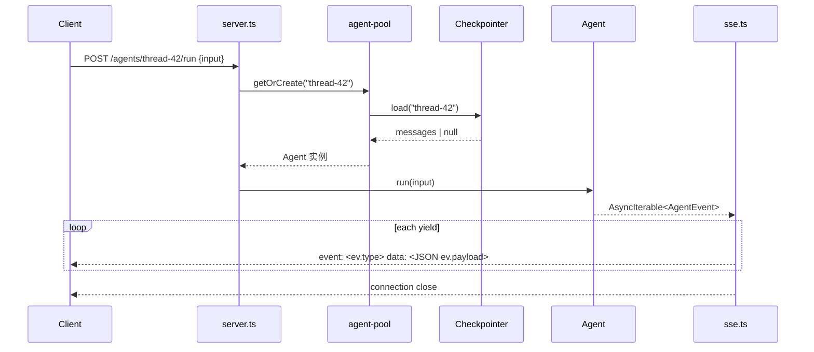
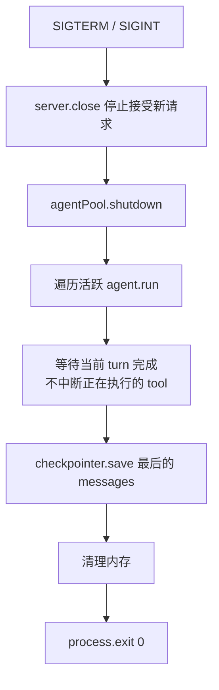

# Backend — Agent 托管服务

## 定位

Backend 是 agent 栈的**最顶层**——一个常驻进程，管理多个 agent 实例，通过 HTTP/RPC 暴露能力给前端。它是从"库"到"产品"的最后一步。

```
L5 Backend         ← 常驻服务。多 agent 管理 + HTTP/RPC + 鉴权 + 多租户
   ↑ 依赖
L4 Harness         ← 领域成品。coding agent / research agent
   ↑ 依赖
L3 Framework       ← 装配套件
   ↑ 依赖
L2 Runtime         ← 裸 run() 循环
   ↑ 依赖
L1 Protocols       ← 类型契约
```

**Backend 的独特性**：下面四层都是**库**（import 到代码里用），只有 Backend 是**进程**（跑在服务器上）。它是整个栈的运行时载体。

---

## 为什么需要 Backend

从第一性事实推导：

1. **Agent 是长时间运行的** —— 一次 `agent.run()` 可能执行几秒到几分钟，前端不能干等一个 HTTP response
2. **用户不止一个** —— 多用户同时对话，需要隔离各自的 thread
3. **Agent 不是一次性用完就丢** —— 同一个用户下次回来要继续对话（thread 持久化）
4. **Streaming 需要双向通道** —— LLM 流式输出要实时推到前端，HTTP/1.1 不够用
5. **部署是独立于库的决策** —— framework/harness 是库，不管怎么部署。Backend 是部署方案

---

## Backend 的职责（不是 framework 的职责）

| 职责 | 说明 |
|---|---|
| **Agent 生命周期管理** | 创建、恢复、运行、中断、销毁 agent 实例 |
| **会话路由** | threadId → agent 实例的映射，保证同一 thread 的请求打到同一实例 |
| **流式传输** | 把 `AsyncIterable<AgentMessage>` 转为 SSE/WebSocket，实时推给前端 |
| **多租户隔离** | 不同用户/API key 使用不同的 checkpointer 存储空间 |
| **鉴权** | API key 验证、速率限制 |
| **健康检查 + 优雅关闭** | SIGTERM 时等待正在运行的 agent 完成当前 turn 再退出 |

**Backend 不管的事**（那是 harness/framework 的事）：

- 不选 model、不选 tool、不写 system prompt —— harness 做
- 不管理 plugin、不管理 context 裁剪策略 —— framework 做
- 不定义 Message/ChatModel/Tool 协议 —— core 做

---

## 最小接口设计

```
POST   /agents/:id/run       — 发送 input，返回 SSE 流
POST   /agents/:id/resume    — 恢复中断，返回 SSE 流
GET    /agents/:id/thread    — 获取 thread 当前状态
DELETE /agents/:id            — 清理 agent 和 thread
GET    /health                — 健康检查
```

**`POST /agents/:id/run`**：

```
Request:  { "input": "add a unit test for utils.ts" }
Response: text/event-stream

event: message
data: {"role":"assistant","content":[{"type":"text","text":"Let me add that test"}]}

event: message
data: {"role":"assistant","content":[{"type":"tool_use","id":"t1","name":"read","input":{"path":"utils.ts"}}]}

event: message
data: {"role":"user","content":[{"type":"tool_result","tool_use_id":"t1","content":"..."}]}

event: message
data: {"role":"assistant","content":[{"type":"text","text":"Done"}]}

event: interrupted
data: {"pendingTool":{"type":"tool_use","id":"t2","name":"bash","input":{"command":"rm -rf /"}},"reason":"permission_required"}
```

**为什么是 SSE 不是 WebSocket**：

- Agent run/resume 返回 `AsyncIterable<AgentEvent>`——单向流（server → client），client 只发一次 input。SSE 比 WebSocket 简单一个量级
- `resume` 场景下 client 再次 POST，重新建立 SSE 流
- AgentEvent envelope `{ type, payload }` 直接映射 SSE `event:` + `data:`——机械转译，零分支
- WebSocket 留给未来双向实时场景（用户在 agent 运行中追加指令）

**SSE 事件与 framework 内部事件的关系**：

Framework 有两套事件体系，Backend SSE 转译的是对外 yield 的 `AgentEvent`：

| 名称 | 类型 | 谁产生 |
|------|------|--------|
| `AgentEvent` | `{ type: 'message' \| 'interrupted', payload }` | framework `agent.run()` / `agent.resume()` yield |
| `CheckpointEvent` | `user_input` / `model_start` / `model_end` / `tool_start` / `tool_end` / `interrupt` / `resume` / `run_end` | framework 调 `checkpointer.appendEvent` |

Backend **不直接**订阅 `checkpointer.appendEvent`。Backend 的事件源是 `agent.run()` 返回的 `AsyncIterable<AgentEvent>`。

**SSE 转译规则**（backend `sse.ts`）：

| AgentEvent | SSE |
|---|---|
| `{ type: 'message', payload: Message }` | `event: message` + `data: <JSON Message>` |
| `{ type: 'interrupted', payload: Interrupt }` | `event: interrupted` + `data: <JSON Interrupt>` |

Envelope `type` 直接映射到 SSE `event:` 字段，`payload` 直接序列化到 `data:`——机械操作，无需 switch 分支：

```ts
for await (const ev of agent.run(input)) {
  res.write(`event: ${ev.type}\ndata: ${JSON.stringify(ev.payload)}\n\n`);
}
```

**模型增量（`model_delta`）**：M1 的 `model.stream()` 已经按 block 粒度 yield 快照；backend 若要做 token 级 delta 推送，需要再包一层 diff（M5+ 再做，M3/M4 不强求）。

---

## 内部架构

```
apps/backend/
├── src/
│   ├── server.ts          # HTTP server 启动 + 路由
│   ├── agent-pool.ts      # threadId → agent 映射 + 生命周期
│   ├── sse.ts             # AgentMessage → SSE 事件序列化
│   ├── harness.ts         # 选择具体 harness（或直接用 framework）
│   └── main.ts            # 入口：读配置、创建 server、注册信号处理
├── package.json
└── tsconfig.json
```

**依赖**：

```json
{
  "dependencies": {
    "@my-agent-team/framework": "workspace:*",
    "@my-agent-team/adapter-anthropic": "workspace:*",
    "@my-agent-team/harness-coding": "workspace:*"   // M4 之后
  }
}
```

Backend 不直接依赖 `tools-common` —— 那是 harness 管的事。

---

## Agent Pool 设计

```ts
interface AgentPool {
  getOrCreate(threadId: string): Promise<Agent>;
  remove(threadId: string): Promise<void>;
  shutdown(): Promise<void>;
}
```

- `getOrCreate`：如果 thread 已存在（checkpointer.load 返回非 null），恢复 agent；否则 `createAgent` 新建
- `remove`：清理内存引用。thread 持久化由 checkpointer 保证
- `shutdown`：优雅关闭——等待所有正在执行的 `agent.run()` 完成当前 turn，persist，再退出

**并发模型**：

- 每个 `agent.run()` 内部已有 `#running` 保护（framework 层 fail-fast）
- Backend 不需要额外的并发控制——同一个 thread 的重复请求由 framework 的 `#running` guard 拦截
- 多用户/多 thread 天然并行（各自独立的 Agent 实例）

---

## 请求生命周期




---

## 配置

```ts
interface BackendConfig {
  port: number;                          // 默认 3000
  harness: 'coding' | 'generic' | AgentConfig;  // 选 harness 或直接配 framework
  checkpointer: Checkpointer;            // 持久化后端（生产用 Redis/file）
  logger?: Logger;                       // 默认 consoleLogger
  auth?: {                               // 可选鉴权
    apiKeys: string[];
  };
}
```

**为什么 Backend 要有自己的 checkpointer**：framework 的 checkpointer 是 agent 级别的。Backend 需要管理多个 agent 的 checkpointer 存储空间——同一个 Checkpointer 实例（如 Redis），不同的 threadId 前缀。

---

## 优雅关闭



不强行 abort——让正在跑的 agent 安全落盘。

---

## Backend 不是什么

| 不是 | 说明 |
|---|---|
| **不是 framework** | Backend 是进程，framework 是库 |
| **不是 harness** | harness 定义 agent 行为（prompt/tools），Backend 管理 agent 生命周期 |
| **不是 CLI** | CLI 是单用户临时脚本，Backend 是多用户常驻服务 |
| **不是 load balancer** | 不负责多实例分发。需要横向扩展时，前面加 nginx/HAProxy |
| **不是 auth service** | 最简单的 API key 验证。OAuth/JWT 等复杂鉴权交给 API Gateway |
