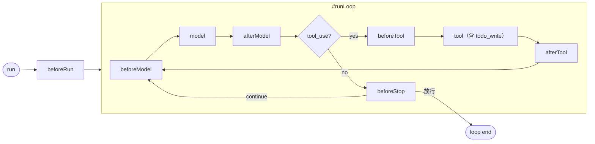
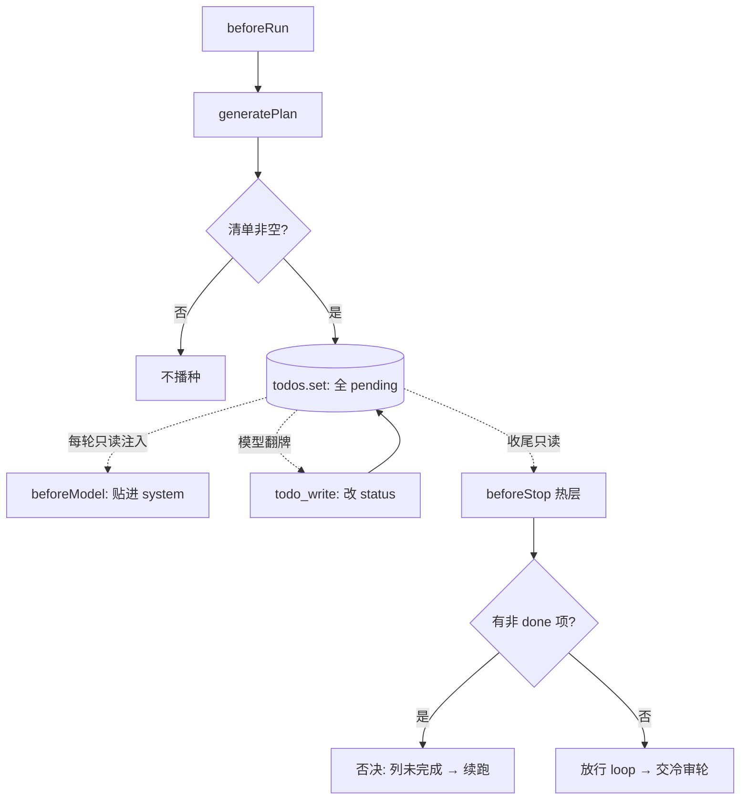
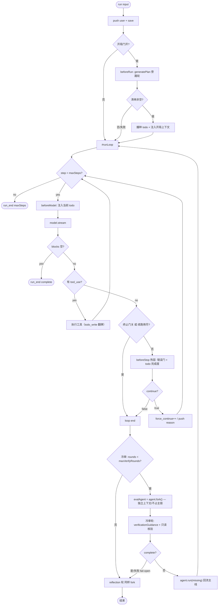

# Plugin: Task Guard

ReAct loop 有两个对称的缺口：**开局没想清就冲**（局部最优、漏全局），**收尾没做完就停**（调研一半、带病早停）。中间还有一个隐缺口：**进度无账本**——模型走到第几步、还剩什么，框架无从得知，只能靠收尾时再花一轮 LLM 去猜。

这一页用**一个插件 + 一道冷审轮**把三处都串起来：开局把任务拆成一份 **todo 清单**，中间让模型逐条翻牌，收尾分两层验收——**热层**在 loop 内对着同一份清单做零成本的确定性核对，**冷层**在 loop 外另起一轮独立上下文的 LLM 评估（reflection 的姐妹），专判"看起来做完了，是不是真做完了"。

```
run 入口 ─[beforeRun:播种 todo]─▶ loop（model→todo_write 翻牌→tool→…）─[beforeStop:热层确定性验收]─▶ loop end
          │                       同一份 todo 清单，三个视图                       │
          └───────────────────────────────────────────────────────────────────┘
                                                                                 ▼
                                                    [冷审评估轮：fork 独立上下文，一次 LLM]
                                                       ├─ 真完成 → 放行 → reflection 轮
                                                       └─ 没完成 → gap 回流主线（maxVerifyRounds 上限）
```

> 这是 [Plugin](./03-plugin.md) 的一个具体实现，走 [fsMemoryPlugin](./06-plugin-fs-memory.md) 同款范式：**一个插件 + closure 自持状态 + 多钩子/工具 + 一个内聚关切**。这里的关切是"任务进度"，状态是一份 todo 清单，钩子是 `beforeRun`/`beforeModel`/`beforeStop`，工具是 `todo_write`。而**冷审评估轮不在插件里**，它走 [reflection 同款编排](./10-harness-generic.md)：harness/runner 层 `agent.fork()` 另起一轮，独立上下文、不占主锁。

---

## 一、为什么是一个插件，不是三个

最初的直觉会拆三个插件：`planPlugin` 管开局、`todoPlugin` 管中间、`stopGatePlugin` 管收尾。但拆开立刻撞上 [Plugin 设计自检 #4](./03-plugin.md#设计自检-checklist)："多个实例需要互相通信吗？"——答案是**需要**，而这正是"应该合并"的信号。

第一性追问：开局的"计划"、中间的"进度"、收尾的"完成判据"，是三样东西吗？

> **不是。它们是同一份 todo 清单在三个时刻的三个视图**——开跑时是路线图（全 pending），执行中是进度条（陆续翻 done），收尾时是验收单（核对有没有剩 pending）。

```
beforeRun:   把任务拆成 todo[] ──┐
todo_write:  模型逐条翻牌      ──┼─ 同一份 todos（closure 状态）
beforeStop:  核对是否全 done   ──┘
```

如果拆三个插件，这份清单就得跨插件共享。但插件之间没有共享内存（[能力边界](./03-plugin.md#能力边界)：plugin 用 closure 自存、不在模块顶层放共享 Map），强行共享要么走全局变量（脏），要么 framework 替它们传（越权）。两条路都违背纪律。

合成一个插件，这份清单就是插件自己的 closure 状态——三个触点读写**同一个 `todos`**，天然同源。这与 [fsMemoryPlugin 用 closure 存 mtime cache](./06-plugin-fs-memory.md#九不做的事永久性技术契约) 是同一手法。

| 插件 | 关切 | 挂的钩子/工具 | closure 状态 |
|---|---|---|---|
| `fsMemoryPlugin` | 长期记忆 | `beforeModel` + 3 tools | mtime cache |
| **`taskGuardPlugin`** | **任务进度** | **`beforeRun`+`beforeModel`+`beforeStop` + `todo_write`** | **一份 todo 清单** |

### 为什么不做 Observation Validate

一个看似对称的中间方案是 **Observation Validate**：每个 tool 之后跑一轮 LLM 校验"这一步对不对"（挂 `afterTool`）。本插件**不做**它，理由是成本——烤进默认路径 = 每 tool 一次 LLM，太贵；真需要的具体 agent 用现成 `afterTool` 自插即可。

todo 是更优的"中间"机制：它判的是**进度走到第几步**（模型自报、近乎零成本），不是**每步对不对**（外部 LLM 当裁判、每 tool 一次）。用便宜的确定性进度信号替代昂贵的逐步语义校验——这正是奥卡姆剃刀的落点。

### 为什么完成度的语义判定不在插件里

"全 done 是不是真完成"需要一轮 LLM。但它**不该在 loop 内就地判**（理由见 §五），而该像 memory reflection 一样**另起一轮独立上下文**。这一轮不挂钩子、不持 closure 状态、跨 thread——天然不属于插件的关切，落在 harness/runner 层（§五）。所以插件只管**确定性的热层**，语义冷层是插件的外部姐妹。

---

## 二、Framework 提供的两个机制钩子

插件是策略，钩子是机制。framework 新增两个时机，守 loop 的入口和出口；中间的进度更新走插件自带的 `todo_write` 工具（不需要新钩子）。三处正交，可单开。



- **`beforeRun`** —— loop **之外**的前置，**每 run 触发一次**。落在 `run()` prep 阶段（push user 之后、`#runLoop` 之前）。transformer：返回的 `Message[]` 替换 thread.messages。
- **`beforeModel`**（已有）—— 每 step 触发。本插件借它把**当前 todo 状态注入 system 末尾**，让模型每轮都看见进度（同 [fs-memory 注入 MEMORY.md](./06-plugin-fs-memory.md#三注入策略)）。
- **`beforeStop`**（新增）—— 模型这一轮无 tool_use、循环即将终止时触发。返回 `StopDecision`，是唯一输出会改变控制流的终止判据。**本插件只在这里做确定性核对，不在这里调 LLM**（语义判定见 §五 冷审轮）。

```ts
export interface PluginHooks {
  beforeRun?(ctx: HookContext, messages: readonly Message[]): Message[] | Promise<Message[]>;
  beforeModel?(...): ...;  afterModel?(...): ...;
  beforeTool?(...): ...;   afterTool?(...): ...;
  beforeStop?(
    ctx: HookContext, messages: readonly Message[],
  ): StopDecision | undefined | Promise<StopDecision | undefined>;
}

/** continue=true → 否决停止，reason 作为下一轮输入；undefined/{continue:false} → 放行。*/
export type StopDecision = { continue: true; reason: string } | { continue: false };
```

### 为什么不复用 `beforeModel` 做计划

`beforeModel` 每 loop step 都触发。拿它做计划 = 每步重新规划，既贵又会 **goalpost moving**（每轮发明新要求，永远判不"完成"）。计划是**开局一次性**的事，所以必须有独立的 `beforeRun`。`beforeModel` 在本插件里只做**只读注入**（把已冻结的 todo 贴给模型看），不生成计划。

### 终止侧的强制续跑

`beforeStop` 否决时，framework 不终止，而是把否决理由转成下一轮输入：

```
verdict.continue === true
  ├─ thread.messages.push({ role: "user", content: reason })   # 续跑上下文（"还差这些 todo"）
  ├─ appendEvent(force_continue, { reason, attempt })          # 可观测
  └─ continue                                                  # 回到 model，给下一轮
```

### 防死循环：三道闸

1. **`maxSteps`（已有硬上限，默认 32）** — 续跑也消耗 step，物理上不可能无限。
2. **`maxForceContinues`（新增，默认 3）** — 单次 run 内 `beforeStop` 续跑累计上限；达上限即便仍否决也放行，记 `force_continue(exhausted)`。
3. **todo 冻结（§三）** — todo 清单开局定义一次，中间只翻状态不增删项；模型无法靠每轮换标准制造永不完成。

> 冷审轮的回流另有 `maxVerifyRounds` 上限（§五），与这三道闸正交：这三道管 loop **内**的续跑，`maxVerifyRounds` 管 loop **外**的重跑。

> `maxForceContinues = 0` ⟺ **关闭终止门**，行为与本特性引入前逐字节一致（零回归开关），也是 [reflection / genesis 等非任务轮](./10-harness-generic.md) 的豁免手段。`beforeRun` 无需续跑闸——每 run 只跑一次，不构成循环。

---

## 三、插件状态：一份 todo 清单，三处共用

插件的全部跨钩子状态就是一个 closure Map：

```ts
type Todo = { step: string; status: "pending" | "in_progress" | "done" };
const todos = new Map<string, Todo[]>();   // threadId → 这次 run 的 todo 清单
```

| 触点 | 对 todos 的操作 |
|---|---|
| `beforeRun` | 生成步骤 → **写入并冻结**（全 `pending`）。空清单 = 平凡任务，不播种 |
| `beforeModel` | **只读**当前清单 → 注入 system 末尾，模型每轮看见"待办/进行中/已完成" |
| `todo_write` 工具 | 模型**翻牌**：把某 step 标 `in_progress`/`done`。只改 status，不增删 step（冻结纪律） |
| `beforeStop` | **只读**清单 → 还有非 done 项？→ 否决续跑；全 done → 放行（语义复核交给冷审轮，§五） |

**冻结的是 step 集合，可变的是 status**。这是 todo 版相比纯 `string[]` 计划的关键升级：清单结构开局定死（根治 goalpost moving），但进度可在中间流动（提供实时信号）。

冻结带来三个连锁好处：

- **根治 goalpost moving** — step 集合开局定一次，全程不动。
- **`maxForceContinues` 退化为纯保险** — 清单稳定，几轮内必然收敛，上限只在异常兜底。
- **平凡任务零税** — "2+2 等于几"生成的清单天然为空，空清单短路：`beforeRun` 不播种、`beforeModel` 不注入、`beforeStop` 不拦、冷审轮也不起。



`beforeStop` 在"开局门关闭"或"resume 进来没经过本 run 的 beforeRun"时，会**现场生成并冻结** todo——保证终止侧永远有清单可量，且仍只生成一次。

---

## 四、三个触点的实现（插件内：开局 + 中间 + 热层收尾）

### beforeRun：播种 todo

```ts
beforeRun: async (ctx, messages) => {
  if (!model) return [...messages];                 // 拿不到 model → 降级放行
  let steps: string[];
  try { steps = await generatePlan(model, messages); }
  catch { return [...messages]; }                   // 生成失败 → fail-open
  if (steps.length === 0) return [...messages];     // 平凡任务 → 不播种
  todos.set(ctx.threadId, steps.map(s => ({ step: s, status: "pending" })));
  return [...messages, { role: "user", content: planGuidance(steps) }];
}
```

`generatePlan` 让模型把任务拆成有序步骤。三条纪律：**引导而非强制**（注入建议顺序，不是状态机，模型可偏离）、**平凡任务零税**（空清单短路）、**fail-open**（出错不播种、原样放行，绝不卡死启动）。

> **plan 注入是 user message，进 thread.messages**——这点对冷审轮至关重要：`agent.fork()` 复制 messages，冷审轮天然就带上了"原始任务 + 计划 + 全部工作轨迹"，无需访问插件 closure（§五）。

### beforeModel：注入当前进度（只读）

```ts
beforeModel: async (ctx, messages) => {
  const list = todos.get(ctx.threadId);
  if (!list?.length) return [...messages];
  const view = list.map(t => `- [${t.status === "done" ? "x" : " "}] ${t.step}`).join("\n");
  return injectIntoSystem(messages, `<todo>\n${view}\n</todo>`);   // 同 fs-memory 注入手法
}
```

每轮把 todo 贴进 system 末尾，模型始终看见"还剩哪些没打勾"——这是"中间"防漏的主力：进度可见，模型不易忘掉未完成项。注入是派生视图，**不进 thread.messages**（同 [fs-memory](./06-plugin-fs-memory.md#为什么没有幂等检查)）。

### todo_write：模型翻牌（中间）

```ts
// Plugin.tools 静态声明
{
  name: "todo_write",
  // 入参：{ updates: Array<{ step: string; status: "in_progress" | "done" }> }
  execute: ({ updates }, _signal, ctx) => {
    const list = todos.get(ctx.threadId);
    if (!list) return "no active todo list";
    for (const u of updates) {
      const t = list.find(x => x.step === u.step);
      if (t) t.status = u.status;          // 只改 status，找不到的 step 忽略（冻结：不新增）
    }
    return renderTodo(list);               // 回显当前清单，给模型确认
  },
}
```

模型每完成一步就调 `todo_write` 翻牌。**只认已有 step 的状态变更，不接受新增 step**——这把"冻结"落到工具层：模型不能借翻牌偷偷扩张任务清单。

### beforeStop：纯确定性热层收尾

```ts
beforeStop: async (ctx, messages) => {
  // 1) 确定性门：零 LLM，读 tool_result.is_error（带病早停）
  const errVerdict = unresolvedToolErrors(messages);
  if (errVerdict?.continue) return errVerdict;

  // 2) todo 门：零 LLM，读进度标志位
  let list = todos.get(ctx.threadId);
  if (!list) {                                        // resume/门关 → 现场生成并冻结
    if (!model) return undefined;
    try { list = (await generatePlan(model, messages)).map(s => ({ step: s, status: "pending" as const })); }
    catch { return undefined; }
    todos.set(ctx.threadId, list);
  }
  if (list.length === 0) return undefined;            // 平凡任务 → 放行
  const left = list.filter(t => t.status !== "done");
  if (left.length > 0) {
    return { continue: true, reason: `还有未完成的 todo：\n${left.map(t => `- ${t.step}`).join("\n")}` };
  }

  // 3) 全 done → 放行 loop。语义复核不在这里，交给 loop 外的冷审评估轮（§五）。
  return undefined;
}
```

热层只做两件**零 LLM、100% 确定性**的事：核结构性早停（工具报错没处理）+ 核进度标志位（还有 pending）。**它绝不在 loop 内调 LLM 判完成度**——这一删是本次设计的关键：

- 旧版在 `beforeStop` 就地调 `checkAgainst` 判完成度，但那一轮**带着主线程的全部推理上下文**，等于让"答题的人自己判卷"，乐观偏差严重（§五）。
- 现在热层退成纯确定性闸，语义判定整体搬到 loop 外的冷审轮，跑在**独立、未被主线推理污染的上下文**里。

### 两个 validator 的分工（热层内）

| validator | 判据来源 | 需 LLM | 确定性 | 覆盖的早停 |
|---|---|---|---|---|
| `unresolvedToolErrors` | 结构（`tool_result.is_error`） | 否 | 100% | 工具报错后直接放弃 |
| **todo 完成度** | 进度标志位 | **否** | **100%** | 还有 pending 就想停 |

热层两道都确定性、零成本；语义复核是第三道，但它在 loop 外（§五），不在此表。

### 旁路推理轮必须隔离

`generatePlan` 要再问一次模型。这个旁路轮**绝不能污染主线程，也不占 maxSteps**：插件内部局部构造 `[...messages, sidePrompt]` 传给 `model.stream`，结果只解析出计划，用完即弃。这与 `unresolvedToolErrors`、`todo_write` 只读写自己的 closure 状态、不碰 thread.messages 是同一种洁癖。

### Fail-open 原则

插件三处的所有失败路径——拿不到 model、计划生成失败、validator 抛错——**一律降级为放行/不注入**。验证门只能让"明显没做完"的情况续跑，**绝不能因为自己出错而卡死正常的启动或停止**。

---

## 五、冷审评估轮：独立上下文、不占主锁、reflection 的姐妹

热层判得了"还有 pending"和"工具报错"，判不了"全 done 是不是真完成"——后者要语义理解。但语义复核有一个隐患：**如果在 loop 内就地判，裁判带着答题者的全部推理上下文**，会被"我刚才论证过这步做完了"带跑，乐观地盖章通过（worker grades own exam）。

解法与 memory reflection 同构：**把这一轮搬出 loop，另起一个 `agent.fork()`，在独立上下文里冷启动一个"审稿人"**。它没看过主线的内心戏，只看得到产出物和计划，判得更狠、更接近真实完成度。

### 为什么用 fork：独立上下文 + 不占主锁

framework 有"单 agent 单 run"硬约束——第二次 `run()`/`resume()` 撞上 `#running` 会立刻抛 `Agent is already running. Use fork() for concurrent conversations.`（见 [02-framework §Agent](./02-framework.md#agent)）。reflection 就是用 `fork()` 绕开它的：

```ts
// runner-stdio entry.ts，reflection 现成模式（M11）
const reflectAgent = agent.fork();
for await (const ev of reflectAgent.run(reflectionGuidance(), { signal, maxSteps })) { ... }
```

`fork()` 创建**新 threadId、新 `#running`、深拷贝 messages**（[02-framework §Thread](./02-framework.md#thread)）。两个好处一次到手：

1. **不占主锁** — 冷审跑在 fork 的独立 `#running` 上，主 agent 的锁始终空闲，随时可被回流重跑。这正是"和 memory 一样的处理，不用占据上层的锁"。
2. **独立上下文 + 不污染账本** — 冷审的提问、读文件、裁决都落在临时 thread，永不进主线 checkpoint_messages（同 reflection）。

**fork 天然带 plan 上下文**：plan 经 `beforeRun` 以 user message 注入了主线 `thread.messages`（§四），`fork()` 复制 messages，于是冷审 agent 开局就持有：原始任务 + 计划/todo + 全部工作轨迹。冷审 guidance 直接引用"你被交付的计划"即可，**无需访问插件 closure**（closure 按 threadId 存，fork 换了 id 也读不到——而这恰好不需要）。

### 冷审轮跑什么：只读核验

冷审 agent 收到一段 `verificationGuidance()`（harness 层，reflect.ts 的姐妹文件 verify.ts），让它对照计划逐条核验产出物，并输出结构化裁决：

```ts
// @my-agent-team/harness，verify.ts（reflectionGuidance 的姐妹）
export function verificationGuidance(): string {
  return [
    "You are a cold reviewer. The conversation above is a task someone just",
    "claimed to finish, along with the plan they were given.",
    "",
    "Do NOT trust their narration. Re-open the artifacts they produced",
    "(read files, grep, re-run read-only checks) and verify each plan item",
    "is actually satisfied.",
    "",
    "Reply with a single JSON object: { \"complete\": boolean, \"missing\": string }.",
    "If complete=false, `missing` lists concretely what is still undone.",
  ].join("\n");
}
```

**只读核验**：冷审应只持读类工具（`read`/`grep`/`glob`），不持 `write`/`bash`。两层保险：

- 编排时给 fork 传只读工具子集（首选）；
- 即便给了全量 fork，其改动也落在临时 thread、随 fork 一起丢弃——但仍以只读为准，避免冷审"顺手把活干了"浪费 token。

> 冷审轮自身**不挂 taskGuard 的终止门**（`maxForceContinues: 0` 豁免，同 reflection），否则会递归地给"评估"再套一层 plan/stop-gate。

### 裁决回流：gap 重跑主线，maxVerifyRounds 兜底

冷审 agent 的末条 assistant 消息里解析出 `{ complete, missing }`：

```
complete === true   → 放行，进 reflection 轮
complete === false  → 把 missing 当新 input 重跑【主 agent】（不是 fork）：
                        agent.run(missing)  ← 主线继续干活，落主线账本
                        重跑后回到 loop（热层 beforeStop 再守一遍）
                        然后再起一轮冷审 …… 直到 complete 或轮数用尽
```

回流重跑落在**主 agent**（不是 fork），因为补的活要进真实 thread、要让用户看见。fork 只用于"审"，主 agent 用于"改"。由于冷审是 fork、自带锁，审完即释放，主 agent 的锁始终空闲可重跑——闭环成立。

`maxVerifyRounds`（harness 编排参数，默认 2）约束"冷审→重跑"循环次数：达上限即便仍判 not done 也放行，记 `verify_exhausted`。它与 loop 内的 `maxForceContinues` 正交——一个管 loop 外重跑，一个管 loop 内续跑。

### 谁编排：harness/runner，不是插件

和 reflection 完全一致——`verificationGuidance()` 放 harness（verify.ts），fork + 回流循环放 runner（entry.ts），跑在 reflection **之前**（完成度先落定，再让 reflection 记"学到了什么"）：

```ts
// runner-stdio entry.ts（在主 run 之后、reflection 之前）
let rounds = 0;
while (rounds < maxVerifyRounds) {
  const evalAgent = agent.fork();                       // 独立上下文，不占主锁
  let verdict;
  try { verdict = parseVerdict(await collect(
    evalAgent.run(verificationGuidance(), { signal, maxSteps, maxForceContinues: 0 })
  )); }
  catch { break; }                                      // 冷审失败 → fail-open 放行
  if (verdict.complete) break;
  rounds++;
  await collect(agent.run(verdict.missing, { signal, maxSteps }));  // gap 回流主线
}
// → 再跑 reflection（同样 fork）
```

冷审失败（解析非法 JSON / fork 抛错 / 拿不到 model）一律 **fail-open**：当作通过，绝不卡死收尾——和 reflection "best-effort, 非致命" 同纪律。

---

## 六、必须诚实标注的张力：todo 靠模型如实翻牌

todo 是**模型自报**的进度，模型可能提前把 step 标成 `done`——这跟早停是**同源的乐观问题**。所以本设计不把 todo 当真理，而是分层防御：

- **热层（loop 内，确定性）**：todo 给的是**便宜的确定性进度信号**（还有 pending 一定没完）——这一半 100% 可信，零 LLM。`unresolvedToolErrors` 同层兜"带病早停"。
- **冷层（loop 外，语义）**："全 done"不等于"真完成"，故由 §五 冷审轮在独立上下文做一次交叉核对，专防虚假打勾。冷审带着 fresh context、只读核验产出物，比 loop 内就地判（被主线推理带偏）更接近真实完成度。

三类问题、三层覆盖、全部 fail-open：热层 todo 治"漏步"，热层错误门治"带病停"，冷层冷审治"假完成"。

---

## 七、架构张力：plugin 不该碰 model，但插件与冷审都需要 model

[03-plugin §能力边界](./03-plugin.md#能力边界) 规定 **plugin 不能拿 `model`**（"plugin 不需要内省 LLM"）。而 `generatePlan`（插件内）和冷审轮都需要 model。化解靠**分层**——model 由 harness 层经 closure 注入，framework 钩子签名永不含 model：

```
framework 层（机制）
  beforeRun / beforeModel / beforeStop 签名只收发 Message[] / StopDecision
  HookContext 一个字不改，不暴露 model          ← 纪律保持
        │
        │ taskGuardPlugin 在 harness 层组装；冷审轮在 runner 层 fork
        ▼
harness 层（策略）
  createGenericAgent({ model, extraPlugins: [
    taskGuardPlugin({ model })   ← 插件 model 由 closure 自持（用于 generatePlan）
  ]})
runner 层（编排）
  evalAgent = agent.fork(); evalAgent.run(verificationGuidance())  ← 冷审用 fork 自带的 model
```

`createGenericAgent`（见 [10-harness-generic](./10-harness-generic.md)）本来就持有 `model`，组装插件时用 closure 传进去；冷审轮 `fork()` 自然继承主 agent 的 model，连传都不用传。这正符合 [03-plugin 设计自检](./03-plugin.md#设计自检-checklist) 第 3 条："依赖具体 model → 入 harness"。`todo_write` 工具的 `ctx` 由 framework 的 tool 执行上下文提供 threadId，不依赖 model。

---

## 八、控制流全貌



值得注意的不变量：

1. **`beforeRun` 每 run 只触发一次**（loop 外前置），区别于每 step 的 `beforeModel`。
2. **冷审/重跑/todo 注入与续跑均不进会话账本**：plan/force-continue 是 `role:"user"` 进 thread.messages（续跑消息）；todo 注入仅派生；冷审跑在 fork 的临时 thread。这些都**不 yield `message` 事件**，[backend 账本投影](./12-backend.md) 只读 `message` 事件，故对前端不可见。模型若想让用户看到进度，会在 assistant 回复里自己复述。
3. **空响应轮不过终止门**（`blocks` 空 → 直接 complete）。
4. **四道门关闭时各自直接放行**，零回归（`maxForceContinues:0` 关热层续跑，`maxVerifyRounds:0` 关冷审）。
5. **resume 轮**：热层默认启用（属任务轮）；开局门不重跑（todo 已在原 run 冻结，`beforeStop` 缺失时现场生成兜底）。reflection / genesis 用 `maxForceContinues:0` + `maxVerifyRounds:0` + 不挂本插件豁免。
6. **冷审是 fork、自带锁**：主 agent 锁始终空闲，回流 `agent.run(missing)` 可立即重跑——不会撞 "Agent is already running"。

---

## 九、边界：这一层不做什么

| 不做 | 为什么 |
|---|---|
| **Observation Validate（每 tool 后 LLM 校验）** | 每 tool 一次 LLM 太贵；todo 用零成本进度信号替代逐步语义校验。需要的 agent 用 `afterTool` 自插 |
| **在 loop 内就地判完成度（beforeStop 调 LLM）** | 带主线推理上下文 = 乐观偏差 = 自己判卷；语义判定搬到 loop 外冷审轮，独立上下文 |
| 每步重规划 / 每步重生成判据 | goalpost moving + 每步一次 LLM；todo step 集合 per-run 冻结，只翻 status |
| 强制模型逐条对齐 todo（enforcement） | 引导 ≠ 强制；现实会推翻计划。`todo_write` 只翻牌不卡执行，要强制的 agent 自行在 `beforeTool` 加 |
| todo_write 新增/删除 step | 冻结纪律落到工具层；只接受已有 step 的 status 变更 |
| 冷审轮持写类工具 / 占主线账本 / 占主锁 | 冷审是"审"不是"改"，只读核验；跑在 fork 临时 thread + fork 自带锁，同 reflection |
| 完成度打分 / quality_score 魔法数 | 不可复现；裁决只认 complete 的 pass/fail |
| Plan DAG / 任务图引擎 / Evidence Store / Policy Engine | todo 就是一段有序文本 + status；`thread.messages` + [EventLog](./14-event-log.md) 已是完整证据库 |
| 把计划/续跑/todo/冷审注入 push 成可见 assistant 消息 | 它们是内部上下文不是结论；模型想展示会自己复述 |

净结论：一套完整的 "Plan + Todo + 热层确定性验收 + 冷层语义评估 + Stop Gate" 设计，在本仓库坍缩为 **2 个机制钩子（`beforeRun`/`beforeStop`）+ 1 个续跑机制 + `force_continue`/`plan_injected`/`verify_*` 事件 + 1 个 `taskGuardPlugin`（计划生成 + `todo_write` 工具 + 进度注入 + 2 道确定性热门）+ 1 段 runner 编排的冷审轮（`verificationGuidance` + fork + maxVerifyRounds 回流，复用 reflection 同款 fork 机制）**。能用现有 `messages`/`eventLog`/`maxSteps`/`fork()` 解决的，绝不新建子系统。

---

## 十、设计自检对照

按 [Plugin 设计自检 checklist](./03-plugin.md#设计自检-checklist) 逐条对照：

1. **需要看 agent 内部执行节点吗？** 是——开局播种命中 `beforeRun`，进度注入命中 `beforeModel`，终止热层命中 `beforeStop`，均无法用纯 tool 替代。冷审轮**不需要**内部节点（它是 loop 外的独立 run），故落 runner 编排而非插件。
2. **能用钩子表达吗？** 插件部分能——三个时机钩子 + 一个自带工具；语义评估**不挂钩子**，走 fork 另起一轮。
3. **依赖什么？** 插件依赖 `model`（generatePlan）→ **harness 层装配**（closure 注入）；冷审依赖 `model` → fork 自然继承。`unresolvedToolErrors`、`todo_write`、todo 完成度判定都不依赖 model。
4. **多个实例需要互相通信吗？** 这正是合并成一个插件的理由——计划/进度/热层判据是同一份 todo closure 状态，跨钩子共享，**不跨插件**。冷审跨 thread，靠 fork 复制 messages 拿上下文，不靠 closure。
5. **失败该不该阻塞？** 永远 fail-open——插件三处、冷审轮都不能因自身故障卡死正常的启动或停止。
6. **平凡任务会被误拦吗？** 空清单短路，不给简单任务上税；空清单时冷审轮也不起。
7. **会 goalpost moving 吗？** todo step 集合 per-run 冻结，开局生成一次贯穿全程，工具层只允许翻 status。

---

## 十一、API

```ts
// @my-agent-team/plugin-task-guard
import type { Plugin, ChatModel, Message } from "@my-agent-team/framework";

export type StopValidator = (
  messages: readonly Message[],
) => StopDecision | undefined | Promise<StopDecision | undefined>;

export interface TaskGuardOptions {
  /** 计划生成所需的模型。由 harness 层注入（closure），framework 不传。 */
  model: ChatModel;
  /** 开局是否生成并播种 todo。默认 true */
  plan?: boolean;
  /** 是否每轮把 todo 注入 system（进度可见）。默认 true */
  showProgress?: boolean;
  /** 额外的确定性 stop validator（默认已含 unresolvedToolErrors）。 */
  extraValidators?: StopValidator[];
}

/** 自带 todo_write 工具，经 Plugin.tools 静态声明并合并。
 *  注意：插件只负责 loop 内的确定性热层；语义冷审轮在 harness/runner 层。 */
export function taskGuardPlugin(opts: TaskGuardOptions): Plugin;
```

```ts
// @my-agent-team/harness，verify.ts（reflect.ts 的姐妹）
/** 冷审轮注入的 guidance：冷启动审稿人，只读核验，输出 { complete, missing }。 */
export function verificationGuidance(): string;
```

装配（harness 层，model 经 closure 自持）：

```ts
createGenericAgent({
  workspace, model,
  extraPlugins: [taskGuardPlugin({ model })],   // 默认：播种 todo + 进度注入 + 热层收尾
});
```

冷审编排（runner 层，跑在主 run 之后、reflection 之前；与 reflection 同款 fork）：

```ts
// runner-stdio entry.ts
let rounds = 0;
while (rounds < maxVerifyRounds) {                 // maxVerifyRounds 默认 2
  const evalAgent = agent.fork();                  // 独立上下文 + 不占主锁
  let v; try { v = parseVerdict(await collect(
    evalAgent.run(verificationGuidance(), { signal, maxSteps, maxForceContinues: 0 })
  )); } catch { break; }                           // fail-open
  if (v.complete) break;
  rounds++;
  await collect(agent.run(v.missing, { signal, maxSteps }));   // gap 回流主线
}
// → reflection 轮（同样 fork）
```

> `maxForceContinues` 是 framework 的 run 选项（不在插件里），由 runner 透传：任务轮默认 3，reflection / 冷审轮传 0。`maxVerifyRounds` 是 runner 编排参数（不在 framework，也不在插件），默认 2，reflection / genesis 轮传 0。`todo_write` 工具随插件自动声明，调用方不必单独传（同 [fs-memory 三个 memory tools](./06-plugin-fs-memory.md#七api)）。

---

## 十二、不做的事（永久性技术契约）

- **HookContext 不暴露 model** — 插件需要的 model 走 harness 层 closure，冷审需要的 model 走 fork 继承，framework 钩子签名永不含 model。
- **不做 Observation Validate** — 不在 `afterTool` 烤进每步 LLM 校验。
- **beforeStop 不在 loop 内调 LLM** — 热层纯确定性；语义判定一律搬到 loop 外冷审轮。
- **冷审轮不占主线 thread、不占主锁** — 必用 `agent.fork()`，跑临时 thread + 独立 `#running`，同 memory reflection。
- **冷审轮只读核验** — 不持 write/bash；改动即便发生也随 fork 丢弃。
- **不持跨 agent 全局状态** — `todos` Map 是单插件实例内的 closure；不在模块顶层放共享 Map。
- **todo 只翻 status、不增删 step** — 冻结纪律落到工具层。
- **不打分** — 裁决是二元 complete pass/fail。
- **不强制对齐 todo** — 只引导。
- **注入/续跑/冷审消息不进账本** — 不 yield `message`。
- **续跑/重跑有界** — loop 内受 `maxSteps`（硬）+ `maxForceContinues`（默认 3）约束；loop 外冷审重跑受 `maxVerifyRounds`（默认 2）约束。

---

**Plugin 文档结束。** 兄弟文档：[fsMemoryPlugin](./06-plugin-fs-memory.md) / [progressiveSkillPlugin](./07-plugin-progressive-skill.md)。上游：[Framework](./02-framework.md)（`beforeRun`/`beforeStop` 钩子、续跑机制、`fork()`）/ [Plugin](./03-plugin.md)（能力边界）。下游：[Harness Generic](./10-harness-generic.md)（装配 model）/ [Backend](./12-backend.md)（runner 编排冷审轮，reflection 同款）。相关：[00-vision §八](./00-vision.md#八未明确的概念task长任务运行形态)（Task 形态对"先规划、跟进度、验完成"的诉求）。
