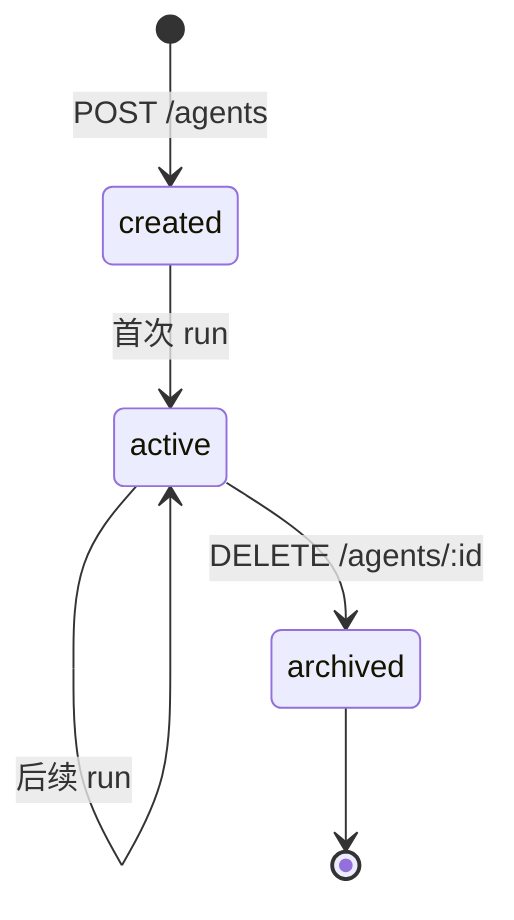
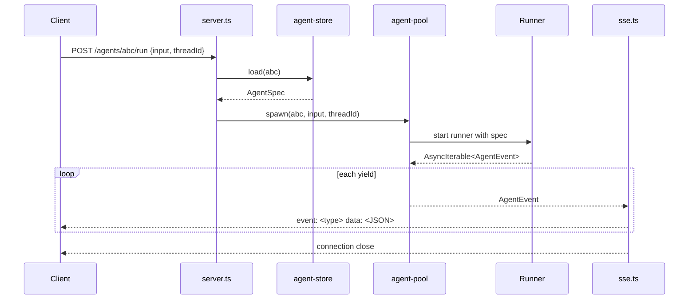
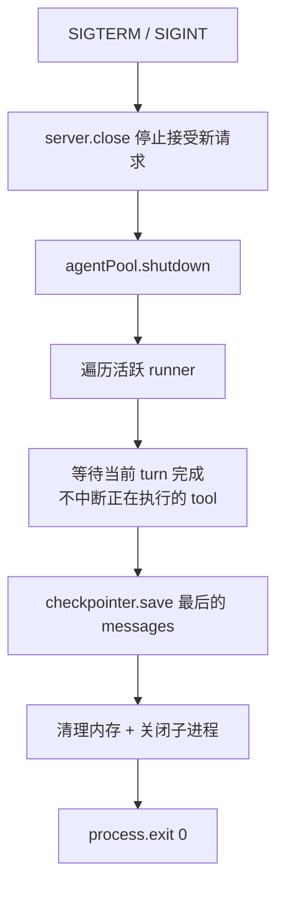

# Backend — Agent 托管服务

## 定位

Backend 是 agent 栈的**最顶层**——一个常驻进程，管理多个 agent 实例、维护 agentId 元数据、物化 workspace、把 [Harness](./08-harness.md) 通过 runner 装到任意部署形态（同进程 / 沙箱 / 远端）里跑，对前端暴露 HTTP/SSE。它是从"库"到"产品"的最后一步。

```
L5 Backend         ← 常驻服务。agentId 管理 + workspace 物化 + runner + HTTP/SSE
   ↑ 依赖
L4 Harness         ← 装配成品。createGenericAgent(workspace, model, ...)
   ↑ 依赖
L3 Framework       ← 装配套件
   ↑ 依赖
L2 Runtime         ← 裸 run() 循环
   ↑ 依赖
L1 Protocols       ← 类型契约
```

**Backend 的独特性**：下面四层都是**库**，只有 Backend 是**进程**。它是整个栈的运行时载体。

---

## 为什么需要 Backend

从第一性事实推导：

1. **Agent 是长时间运行的** — 一次 run 几秒到几分钟，HTTP/1.1 短连接不够用
2. **用户不止一个** — 多用户同时对话，需要 agentId 隔离
3. **Agent 不是一次性用完就丢** — 同一 agentId 下次回来要继续对话（thread 持久化）
4. **Streaming 需要事件流** — LLM 流式输出实时推到前端
5. **部署是独立于库的决策** — framework/harness 是库，不管怎么部署。Backend 决定部署
6. **Harness 不认识 agentId / 沙箱** — 必须有一层把 agentId 转成 workspace 路径、把进程装进沙箱

---

## Backend 的职责（明确边界）

| 职责 | 说明 |
|---|---|
| **agentId 表** | `agentId → AgentSpec` 映射的存储（DB / KV） |
| **Workspace 物化** | 首次创建 agent 时 `mkdir` + 从 template 复制 SOUL/AGENTS/MEMORY |
| **Agent 生命周期** | 创建、恢复、运行、中断、销毁、归档 workspace |
| **Runner 调度** | 选择 transport（in-proc / stdio / HTTP）和 sandbox 形态 |
| **会话路由** | threadId → 哪个 runner instance 的映射 |
| **流式传输** | 把 runner 输出的 `AgentEvent` 转 SSE/WebSocket，推给前端 |
| **多租户隔离** | 不同租户的 workspace 独立、checkpointer 独立 |
| **鉴权 + 配额** | API key 验证、QPS / token 配额 |
| **优雅关闭** | SIGTERM 时等待活跃 agent 完成当前 turn |

**Backend 不管的事**（属于下层）：

- 不选 tool、不写 system prompt — Harness 做（通过 workspace 文件）
- 不管理 plugin、不裁剪 context — Framework 做
- 不定义 Message/ChatModel/Tool 协议 — core 做

---

## Backend 不认识下层的什么

| Backend 不认识 | 因为 |
|---|---|
| `Plugin` 接口细节 | harness 已经把 plugin 编排好；backend 只关心 agent 入参 |
| message 拼接策略 | framework / context-manager 的事 |
| tool 调度顺序 | runtime 的事 |
| MEMORY.md / SKILL.md 格式 | 对应 plugin 的事 |

backend 看到的下层 API 就是：`createGenericAgent(spec) → AsyncIterable<AgentEvent>`。

---

## 跨进程隔离 = 通过 Runner 透明套上

harness 不感知进程边界，但 backend 必须决定 agent 跑在哪。**Runner = backend 提供的进程入口 + transport 适配器**，把 harness 装进具体部署形态。

### 四种 Runner 形态

| Transport | 场景 | Runner 实现要点 | Backend 通信 |
|---|---|---|---|
| **in-proc** | 本地 dev、单体部署 | 同进程函数调用 | 直接 `for await` |
| **stdio** | 本机沙箱（docker / firecracker） | 子进程 `bun entry.ts`，AgentSpec 通过 env / stdin 传 | 按行读 stdout |
| **HTTP/SSE** | 远端常驻服务 | `Bun.serve` + `text/event-stream` | `fetch` + 消费 SSE |
| **WebSocket** | 双向（中断、人工 approve） | `ws` server | 双向 send/onMessage |

### Runner Entry 范例（stdio）

```ts
// packages/runner-stdio/src/entry.ts
import { createGenericAgent } from '@my-agent-team/harness-generic';
import { AnthropicChatModel } from '@my-agent-team/adapter-anthropic';
import { AgentSpecV1 } from '@my-agent-team/agent-spec';

const raw = JSON.parse(process.env.AGENT_SPEC!);
const spec = AgentSpecV1.parse(raw);    // runtime validate，防止版本错配

const agent = createGenericAgent({
  workspace: spec.workspace,
  model: new AnthropicChatModel(spec.model),
  threadId: spec.threadId,
  permissionMode: spec.permissionMode,
});

for await (const event of agent.run(spec.input)) {
  process.stdout.write(JSON.stringify(event) + '\n');
}
```

Backend 侧：

```ts
const proc = Bun.spawn(['bun', 'entry.ts'], { env: { AGENT_SPEC: JSON.stringify(spec) } });
for await (const line of readLines(proc.stdout)) {
  const event = JSON.parse(line);
  sseEmit(client, event);
}
```

**核心约束**：entry 文件只做"反序列化 spec → 装配 agent → 序列化 event"三件事，**不写业务逻辑**。

---

## AgentSpec — Backend ↔ Runner 的契约

详细 schema 与版本演进策略见 [12-agent-spec.md](./12-agent-spec.md)。要点：

- 独立包 `@my-agent-team/agent-spec`，zod 定义 + type 导出
- 必带 `schemaVersion` 字段，runner 收到后 hard fail 不匹配的版本
- backend 和 runner 双向 validate
- harness **不依赖**这个包，入参是解构后的字段

---

## 沙箱透明套用

harness 和 runner entry 都不引入 sandbox SDK。backend 选择部署形态时：

1. 准备沙箱实例（firecracker / gvisor / 普通 docker）
2. 把 workspace 目录 bind-mount 到沙箱内固定路径（如 `/workspace`）
3. 在沙箱内 spawn `bun entry.ts`，把 `AgentSpec.workspace` 设为 `/workspace`
4. 通过 stdio / HTTP 把 event 拉回 backend

→ harness 进程里只看见"workspace = /workspace"这个普通路径。沙箱完全透明。换沙箱实现（wasm runtime / 远端 K8s pod）只改 backend 的 runner 选择逻辑，**harness 和 entry 都不改**。

---

## 最小接口设计

```
POST   /agents                — 创建 agent（分配 agentId、物化 workspace）
POST   /agents/:id/run        — 发送 input，返回 SSE 流
POST   /agents/:id/abort      — 中断当前 run（runner 收 abort signal）
POST   /agents/:id/resume     — 恢复中断的 run，返回 SSE 流
GET    /agents/:id/thread     — 获取 thread 当前状态
DELETE /agents/:id            — 销毁 agent + 归档 workspace
GET    /health                — 健康检查
```

### `POST /agents`

```
Request:
{
  "template": "coding",            // 可选，从 templates/coding/ 复制初始文件
  "model": { "provider": "anthropic", "model": "claude-sonnet-4" },
  "permissionMode": "ask"
}

Response:
{ "agentId": "abc123", "workspace": "/var/agents/abc123/workspace" }
```

Backend 做的事：

1. 生成 agentId
2. `mkdir -p /var/agents/${agentId}/workspace`
3. 若有 `template`，`cp -r templates/${template}/* /var/agents/${agentId}/workspace/`
4. 在 agentId 表里存 `{ agentId, workspace, modelConfig, permissionMode, createdAt }`

### `POST /agents/:id/run`

```
Request:  { "input": "add a unit test for utils.ts", "threadId": "t-42" }

Response: text/event-stream

event: message
data: {"role":"assistant","content":[{"type":"text","text":"Let me add that test"}]}

event: message
data: {"role":"assistant","content":[{"type":"tool_use","id":"t1","name":"read","input":{"path":"utils.ts"}}]}

event: interrupted
data: {"pendingTool":{...},"reason":"permission_required"}
```

Backend 做的事：

1. 查 agentId → spec
2. 选 runner（按 sandbox 策略）
3. 把 spec + input + threadId 组成 `AgentSpec` 喂给 runner
4. 把 runner 输出的 event 流转 SSE 推给 client

### 为什么是 SSE 不是 WebSocket（默认）

- run/resume 返回 `AsyncIterable<AgentEvent>` — 单向流，SSE 比 WS 简单一个量级
- abort 用独立 `POST /agents/:id/abort` 触发，不需要复用同一通道
- WS 留给"用户在运行中追加指令、人工 approve permission"等真正双向场景

### SSE 事件与 framework 内部事件的关系

Framework 有两套事件体系，Backend SSE 转译的是 `AgentEvent`：

| 名称 | 类型 | 谁产生 |
|------|------|--------|
| `AgentEvent` | `{ type: 'message' \| 'interrupted', payload }` | framework `agent.run()` / `agent.resume()` yield |
| `CheckpointEvent` | `user_input` / `model_start` / `tool_end` / ... | framework 调 `checkpointer.appendEvent` |

Backend **不直接**订阅 `checkpointer.appendEvent`。Backend 的事件源是 runner 输出的 event 流（runner 内部从 `agent.run()` 拿）。

**SSE 转译规则**（机械操作，无 switch）：

```ts
for await (const ev of runnerStream) {
  res.write(`event: ${ev.type}\ndata: ${JSON.stringify(ev.payload)}\n\n`);
}
```

---

## 内部架构

```
apps/backend/
├── src/
│   ├── server.ts            # HTTP server 启动 + 路由
│   ├── agent-store.ts       # agentId → AgentSpec 持久化（DB/KV）
│   ├── workspace.ts         # workspace 物化 / 归档 / 模板复制
│   ├── runner/
│   │   ├── in-proc.ts       # 同进程
│   │   ├── stdio.ts         # 子进程 stdio
│   │   └── http.ts          # 远端 HTTP（M9+）
│   ├── sse.ts               # AgentEvent → SSE 序列化
│   └── main.ts              # 入口
└── package.json

packages/
├── agent-spec/              # AgentSpec zod schema（backend + runner 共享）
├── runner-stdio/            # 独立的 stdio runner entry（M8 起）
└── runner-http/             # 独立的 http runner（M9+）
```

**依赖**：

```json
{
  "dependencies": {
    "@my-agent-team/agent-spec": "workspace:*",
    "@my-agent-team/harness-generic": "workspace:*",
    "@my-agent-team/adapter-anthropic": "workspace:*"
  }
}
```

Backend 不直接依赖 `framework` — 通过 harness 间接消费。

---

## Workspace 生命周期



| 状态 | Workspace 位置 | 说明 |
|---|---|---|
| created | `/var/agents/${agentId}/workspace` | mkdir + template 复制完成 |
| active | 同上 | 至少跑过一次 run；MEMORY.md / facts/ 可能有内容 |
| archived | `/var/agents/_archive/${agentId}.tar.gz` | 软删除，保留 30 天可恢复 |

**为什么 backend 而不是 harness 做 workspace 物化**：

1. harness 不应该 `mkdir` — 它假设 workspace 已存在，否则启动失败
2. 模板复制涉及"agentId 选择哪个模板"的策略，是产品决策不是装配决策
3. 多租户场景下 workspace 路径策略（`/var/agents/${tenant}/${agentId}`）是 backend 的事

---

## Agent Pool 设计

```ts
interface AgentPool {
  spawn(agentId: string, input: string, threadId: string): AsyncIterable<AgentEvent>;
  abort(agentId: string, threadId: string): Promise<void>;
  shutdown(): Promise<void>;
}
```

- `spawn`：查 agentId → spec，选 runner，启动/复用 runner instance，返回 event 流
- `abort`：找到对应 runner instance，发送 abort signal（in-proc 用 AbortController，子进程发 SIGTERM，HTTP 走 abort 端点）
- `shutdown`：等待所有活跃 runner 完成当前 turn，落盘，再退出

**并发模型**：

- 每个 `agent.run()` 内部已有 `#running` 保护（framework 层 fail-fast）
- 同 threadId 的并发请求由 framework 拦截
- 多 agentId / 多 thread 天然并行（各自独立 runner instance）

---

## 请求生命周期



---

## 配置

```ts
interface BackendConfig {
  port: number;                          // 默认 3000
  workspaceRoot: string;                 // 默认 /var/agents
  templateDir?: string;                  // 默认 ./templates
  agentStore: AgentStore;                // DB/KV 实现
  defaultRunner: 'in-proc' | 'stdio' | 'http';
  sandbox?: SandboxConfig;               // stdio/http runner 的沙箱选择
  logger?: Logger;
  auth?: { apiKeys: string[] };
}
```

**为什么 Backend 需要自己的 agentStore**：framework 的 checkpointer 是 agent 级别（per-thread messages）。Backend 需要 agent **元数据**层（agentId → spec），是不同维度。

---

## 优雅关闭



不强行 abort — 让正在跑的 agent 安全落盘。

---

## Backend 不是什么

| 不是 | 说明 |
|---|---|
| **不是 framework** | Backend 是进程，framework 是库 |
| **不是 harness** | harness 装配单个 agent，Backend 管多 agent 生命周期 + 部署 |
| **不是 runner** | Runner 是 backend 启动的进程入口；backend 选择/调度 runner |
| **不是 CLI** | CLI 是单用户临时脚本，Backend 是多用户常驻服务 |
| **不是 load balancer** | 不负责多实例分发；前面加 nginx/HAProxy |
| **不是 auth service** | 最简 API key；复杂鉴权交给 API Gateway |
| **不是 sandbox provider** | Backend 选择/调度 sandbox，不实现 sandbox |
