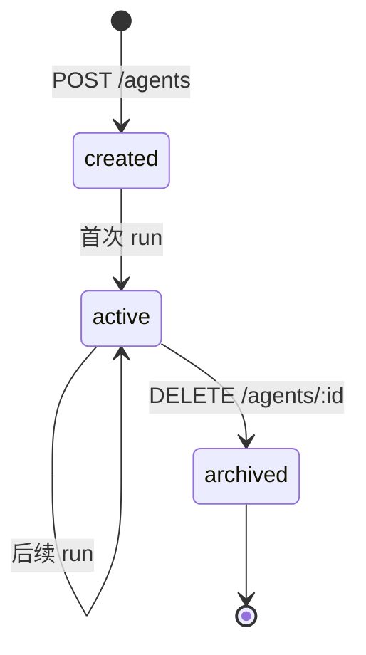
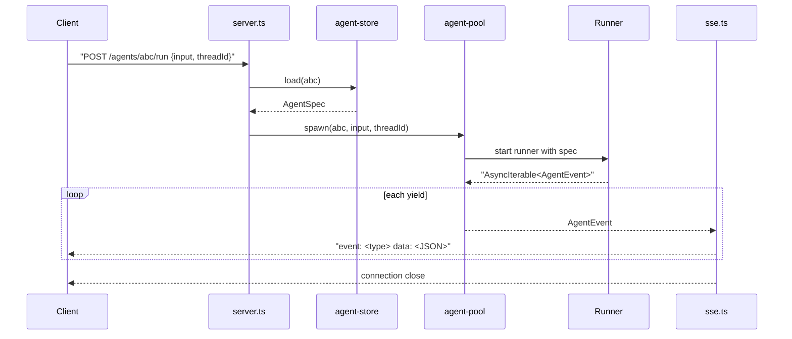
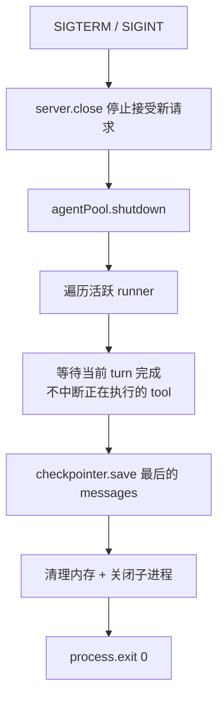

# Backend — Team Runtime（HTTP Server）

## 定位

Backend 是 agent 栈的 **L5 团队运行时**——一个常驻 HTTP 进程，管理多个 agent 实例、维护 agentId 元数据、持久化 thread、把 [Harness](./08-harness.md) 通过 runner 装到任意部署形态（同进程 / 子进程 / 远端）里跑，对上层 [L6 Surfaces](./00-vision.md#四当前分层架构)（frontend / IM bot / CLI）暴露 HTTP/SSE。

它是从"库"到"可被前端/bot 调用的服务"的关键一跳，但**不再是栈的最顶层**——上面还有 surface 层。

> **Durable Runs**:Backend 把 run 执行从"绑死在 HTTP SSE 流上的进程内 generator"重构为**独立子进程执行 + 事件落 [EventLog](./13-event-log.md) + SSE 只读投影**。三件事正交:**执行**(run 子进程)、**投影**(SSE)、**HTTP 连接生命周期**。客户端断连、backend 重启都不再中断执行。详见下文 [§ Durable Runs](#durable-runs)。

```
L6 Surfaces       ← frontend / IM bot / CLI
   ↑ HTTP / SSE / webhook
L5 Backend        ← 常驻 HTTP 进程。agent CRUD + thread 管理 + runner pool + SSE
   ↑ in-proc 或 spawn runner
L4 Harness        ← 装配成品。createGenericAgent(workspace, model, ...)
   ↑ 依赖
L3 Framework      ← 装配套件
   ↑ 依赖
L2 Runtime        ← 裸 run() 循环
   ↑ 依赖
L1 Protocols      ← 类型契约
```

**Backend 的角色**：L1–L4 是库，L6 是用户接触面，Backend 是把库装成可被多 surface 共用的常驻服务的中间层。

> **命名说明**：项目最终愿景是 my-agent-team（agent team 管理服务），其中真人与 agent 同为 first-class member。引入 `Member` / `Conversation` 抽象后，本层在概念上演进为 "team runtime"，但**进程名与代码包名继续叫 backend**——因为相对于 L6 frontend，它就是后端。

---

## 为什么需要 Backend

从第一性事实推导：

1. **Agent 是长时间运行的** — 一次 run 几秒到几分钟，HTTP/1.1 短连接不够用
2. **用户不止一个** — 多用户同时对话，需要 agentId 隔离
3. **Agent 不是一次性用完就丢** — 同一 agentId 下次回来要继续对话（thread 持久化）
4. **Streaming 需要事件流** — LLM 流式输出实时推到前端
5. **部署是独立于库的决策** — framework/harness 是库，不管怎么部署。Backend 决定部署
6. **Harness 不认识 agentId / 沙箱** — 必须有一层把 agentId 转成 workspace 路径、把进程装进沙箱

---

## Backend 的职责（明确边界）

| 职责 | 说明 |
|---|---|
| **agentId 表** | `agentId → AgentSpec` 映射的存储（DB / KV） |
| **Workspace 物化** | 首次创建 agent 时 `mkdir` + 从 template 复制 SOUL/AGENTS/MEMORY |
| **Agent 生命周期** | 创建、恢复、运行、中断、销毁、归档 workspace |
| **Runner 调度** | 选择 transport（in-proc / stdio / HTTP）和 sandbox 形态 |
| **会话路由** | threadId → 哪个 runner instance 的映射 |
| **流式传输** | 把 runner 输出的 `AgentEvent` 转 SSE/WebSocket，推给前端 |
| **多租户隔离** | 不同租户的 workspace 独立、checkpointer 独立 |
| **鉴权 + 配额** | API key 验证、QPS / token 配额 |
| **优雅关闭** | SIGTERM 时等待活跃 agent 完成当前 turn |

**Backend 不管的事**（属于下层）：

- 不选 tool、不写 system prompt — Harness 做（通过 workspace 文件）
- 不管理 plugin、不裁剪 context — Framework 做
- 不定义 Message/ChatModel/Tool 协议 — core 做

---

## Backend 不认识下层的什么

| Backend 不认识 | 因为 |
|---|---|
| `Plugin` 接口细节 | harness 已经把 plugin 编排好；backend 只关心 agent 入参 |
| message 拼接策略 | framework / context-manager 的事 |
| tool 调度顺序 | runtime 的事 |
| MEMORY.md / SKILL.md 格式 | 对应 plugin 的事 |

backend 看到的下层 API 就是：`createGenericAgent(spec) → AsyncIterable<AgentEvent>`。

---

## 跨进程隔离 = 通过 Runner 透明套上

harness 不感知进程边界，但 backend 必须决定 agent 跑在哪。**Runner = backend 提供的进程入口 + transport 适配器**，把 harness 装进具体部署形态。

### 四种 Runner 形态

| Transport | 场景 | Runner 实现要点 | Backend 通信 |
|---|---|---|---|
| **in-proc** | 本地 dev、单体部署 | 同进程函数调用 | 直接 `for await` |
| **stdio** | 本机沙箱（docker / firecracker） | 子进程 `bun entry.ts`，AgentSpec 通过 env / stdin 传 | 按行读 stdout |
| **HTTP/SSE** | 远端常驻服务 | `Bun.serve` + `text/event-stream` | `fetch` + 消费 SSE |
| **WebSocket** | 双向（中断、人工 approve） | `ws` server | 双向 send/onMessage |

### Runner Entry 范例（stdio）

```ts
// packages/runner-stdio/src/entry.ts
import { createGenericAgent } from '@my-agent-team/harness-generic';
import { AnthropicChatModel } from '@my-agent-team/adapter-anthropic';
import { AgentSpecV1 } from '@my-agent-team/agent-spec';

const raw = JSON.parse(process.env.AGENT_SPEC!);
const spec = AgentSpecV1.parse(raw);    // runtime validate，防止版本错配

const agent = createGenericAgent({
  workspace: spec.workspace,
  model: new AnthropicChatModel(spec.model),
  threadId: spec.threadId,
  permissionMode: spec.permissionMode,
});

for await (const event of agent.run(spec.input)) {
  process.stdout.write(JSON.stringify(event) + '\n');
}
```

Backend 侧：

```ts
const proc = Bun.spawn(['bun', 'entry.ts'], { env: { AGENT_SPEC: JSON.stringify(spec) } });
for await (const line of readLines(proc.stdout)) {
  const event = JSON.parse(line);
  sseEmit(client, event);
}
```

**核心约束**：entry 文件只做"反序列化 spec → 装配 agent → 序列化 event"三件事，**不写业务逻辑**。

---

## AgentSpec — Backend ↔ Runner 的契约

详细 schema 与版本演进策略见 [12-agent-spec.md](./12-agent-spec.md)。要点：

- 独立包 `@my-agent-team/agent-spec`，zod 定义 + type 导出
- 必带 `schemaVersion` 字段，runner 收到后 hard fail 不匹配的版本
- backend 和 runner 双向 validate
- harness **不依赖**这个包，入参是解构后的字段

---

## 沙箱透明套用

harness 和 runner entry 都不引入 sandbox SDK。backend 选择部署形态时：

1. 准备沙箱实例（firecracker / gvisor / 普通 docker）
2. 把 workspace 目录 bind-mount 到沙箱内固定路径（如 `/workspace`）
3. 在沙箱内 spawn `bun entry.ts`，把 `AgentSpec.workspace` 设为 `/workspace`
4. 通过 stdio / HTTP 把 event 拉回 backend

→ harness 进程里只看见"workspace = /workspace"这个普通路径。沙箱完全透明。换沙箱实现（wasm runtime / 远端 K8s pod）只改 backend 的 runner 选择逻辑，**harness 和 entry 都不改**。

---

## 最小接口设计

```
POST   /agents                — 创建 agent（分配 agentId、物化 workspace）
POST   /agents/:id/run        — 发送 input，返回 SSE 流
POST   /agents/:id/abort      — 中断当前 run（runner 收 abort signal）
POST   /agents/:id/resume     — 恢复中断的 run，返回 SSE 流
GET    /agents/:id/thread     — 获取 thread 当前状态
DELETE /agents/:id            — 销毁 agent + 归档 workspace
GET    /health                — 健康检查
```

> **破坏性 API 变更(Durable Runs)**:`POST .../run` 不再"返回 SSE 流",改为**启动 run 子进程后立即返回 `202 { runId }`**;事件改由独立的 **`GET /api/runs/:id/events`** SSE 投影端点消费(支持 `Last-Event-ID` 续读)。客户端从"POST 拿流"改为"POST 拿 runId → GET events 订阅"。实际 run 端点形态:

```
POST /api/threads/:id/runs    — 启动 run 子进程,返回 202 { runId }(不再绑 SSE)
GET  /api/runs/:id/events     — SSE 投影,支持 Last-Event-ID 续读/重连/冷读
POST /api/runs/:id/cancel     — 204,真正 SIGTERM 子进程 + AbortSignal 透传到模型 fetch
POST /api/runs/:id/resume     — 接 ResumeCommand,fork 新 attempt 子进程续跑(同 runId)
GET  /api/runs/:id            — (可选) run 元数据 status/时间 + 当前 attempt,供轮询
```

### `POST /agents`

```
Request:
{
  "template": "coding",            // 可选，从 templates/coding/ 复制初始文件
  "model": { "provider": "anthropic", "model": "claude-sonnet-4" },
  "permissionMode": "ask"
}

Response:
{ "agentId": "abc123", "workspace": "/var/agents/abc123/workspace" }
```

Backend 做的事：

1. 生成 agentId
2. `mkdir -p /var/agents/${agentId}/workspace`
3. 若有 `template`，`cp -r templates/${template}/* /var/agents/${agentId}/workspace/`
4. 在 agentId 表里存 `{ agentId, workspace, modelConfig, permissionMode, createdAt }`

### `POST /agents/:id/run`

```
Request:  { "input": "add a unit test for utils.ts", "threadId": "t-42" }

Response: text/event-stream

event: message
data: {"role":"assistant","content":[{"type":"text","text":"Let me add that test"}]}

event: message
data: {"role":"assistant","content":[{"type":"tool_use","id":"t1","name":"read","input":{"path":"utils.ts"}}]}

event: interrupted
data: {"pendingTool":{...},"reason":"permission_required"}
```

Backend 做的事：

1. 查 agentId → spec
2. 选 runner（按 sandbox 策略）
3. 把 spec + input + threadId 组成 `AgentSpec` 喂给 runner
4. 把 runner 输出的 event 流转 SSE 推给 client

### 为什么是 SSE 不是 WebSocket（默认）

- run/resume 返回 `AsyncIterable<AgentEvent>` — 单向流，SSE 比 WS 简单一个量级
- abort 用独立 `POST /agents/:id/abort` 触发，不需要复用同一通道
- WS 留给"用户在运行中追加指令、人工 approve permission"等真正双向场景

### SSE 事件与 framework 内部事件的关系

Framework 有两套事件体系，Backend SSE 转译的是 `AgentEvent`：

| 名称 | 类型 | 谁产生 |
|------|------|--------|
| `AgentEvent` | `{ type: 'message' \| 'interrupted', payload }` | framework `agent.run()` / `agent.resume()` yield |
| `CheckpointEvent` | `user_input` / `model_start` / `tool_end` / ... | framework 调 `checkpointer.appendEvent` |

> **事件源(重要)**:run 在独立子进程执行,子进程把 `AgentEvent` **直接 `append` 进 [EventLog](./13-event-log.md)**(事实源);Backend 的 SSE 投影端通过 **`eventLog.subscribe({ runId, afterSeq })`** 读取——即 Backend **确实订阅 EventLog**,但**不碰 Checkpointer**(Checkpointer 是 runner 注入、agent-resume 专用)。stdout 仅为可选的低延迟通知通道,DB 才是事实源。这样客户端断连 / backend 重启都不丢事件。

**SSE 转译规则**(机械操作,无 switch):

```ts
// 请求头 Last-Event-ID: <seq> → afterSeq;客户端断开 → req.signal 触发,只取消订阅不 abort run
for await (const rec of eventLog.subscribe({ runId, afterSeq }, req.signal)) {
  res.write(`id: ${rec.seq}\nevent: ${rec.event.type}\ndata: ${JSON.stringify(rec.event)}\n\n`);
}
```

---

## 内部架构

```
apps/backend/
├── src/
│   ├── server.ts            # HTTP server 启动 + 路由
│   ├── agent-store.ts       # agentId → AgentSpec 持久化（DB/KV）
│   ├── workspace.ts         # workspace 物化 / 归档 / 模板复制
│   ├── runner/
│   │   ├── in-proc.ts       # 同进程
│   │   ├── stdio.ts         # 子进程 stdio
│   │   └── http.ts          # 远端 HTTP
│   ├── sse.ts               # AgentEvent → SSE 序列化
│   └── main.ts              # 入口
└── package.json

packages/
├── agent-spec/              # AgentSpec zod schema（backend + runner 共享）
├── runner-stdio/            # 独立的 stdio runner entry
└── runner-http/             # 独立的 http runner
```

**依赖**：

```json
{
  "dependencies": {
    "@my-agent-team/agent-spec": "workspace:*",
    "@my-agent-team/harness-generic": "workspace:*",
    "@my-agent-team/adapter-anthropic": "workspace:*"
  }
}
```

Backend 不直接依赖 `framework` — 通过 harness 间接消费。

---

## Workspace 生命周期



| 状态 | Workspace 位置 | 说明 |
|---|---|---|
| created | `/var/agents/${agentId}/workspace` | mkdir + template 复制完成 |
| active | 同上 | 至少跑过一次 run；MEMORY.md / facts/ 可能有内容 |
| archived | `/var/agents/_archive/${agentId}.tar.gz` | 软删除，保留 30 天可恢复 |

**为什么 backend 而不是 harness 做 workspace 物化**：

1. harness 不应该 `mkdir` — 它假设 workspace 已存在，否则启动失败
2. 模板复制涉及"agentId 选择哪个模板"的策略，是产品决策不是装配决策
3. 多租户场景下 workspace 路径策略（`/var/agents/${tenant}/${agentId}`）是 backend 的事

---

## Agent Pool 设计

```ts
interface AgentPool {
  spawn(agentId: string, input: string, threadId: string): AsyncIterable<AgentEvent>;
  abort(agentId: string, threadId: string): Promise<void>;
  shutdown(): Promise<void>;
}
```

- `spawn`：查 agentId → spec，选 runner，启动/复用 runner instance，返回 event 流
- `abort`：找到对应 runner instance，发送 abort signal（in-proc 用 AbortController，子进程发 SIGTERM，HTTP 走 abort 端点）
- `shutdown`：等待所有活跃 runner 完成当前 turn，落盘，再退出

**并发模型**：

- 每个 `agent.run()` 内部已有 `#running` 保护（framework 层 fail-fast）
- 同 threadId 的并发请求由 framework 拦截
- 多 agentId / 多 thread 天然并行（各自独立 runner instance）

---

## 请求生命周期



---

## Durable Runs

run 执行从"绑死在 SSE 流上的进程内 generator"重构为**独立子进程执行 + 事件落 [EventLog](./13-event-log.md) + SSE 只读投影**。

### 执行解耦

```
POST /api/threads/:id/runs
   │
   ├─ fork ──► runner-stdio 子进程(独立 PID)
   │              │ 每个 AgentEvent: eventLog.append(threadId, runId, event)
   │  写 runs 台账 │ (子进程自持 EventLog 句柄,直写 DB)
   │  pid/running  ▼
   │           RunSupervisor(进程内): 解析 stdout 作低延迟通知(可选优化)
   ▼
返回 202 { runId }       (不再绑 SSE)

GET /api/runs/:id/events  ── eventLog.subscribe({ runId, afterSeq }) ──► 只读投影
```

- **执行者**(子进程)只 `append`,**投影者**(SSE)只 `subscribe`,两者互不认识,只经 EventLog 通信(EventLog 四铁律,见 [13 §二](./13-event-log.md#二解耦铁律))。
- **写 EventLog 的是 runner entry,不是 harness**:`agent.run()` 只 yield 事件,entry 消费 yield 后 `append`(见 [13 §六](./13-event-log.md#六写入路径谁产生事件-vs-谁写-eventlog))。EventLog 概念绝不下沉到 framework/harness。
- 客户端断连 → `subscribe` 的 `AbortSignal` 触发 → **只取消订阅,不 abort run**。长任务(数小时)继续跑完。

### 数据模型:run（逻辑）/ attempt（物理执行）

一个逻辑 run 经 interrupt→resume 会**跨越多个子进程**,所以把"逻辑 run"和"物理进程"拆成两张表(避免 pid 列语义漂移,详见 [13 §10.2](./13-event-log.md#102-实体拆分run逻辑--attempt物理执行)):

```sql
CREATE TABLE runs (        -- 逻辑 run:跨多次 interrupt/resume
  run_id TEXT PRIMARY KEY, thread_id TEXT, status TEXT, started_at INTEGER, ended_at INTEGER
);
CREATE TABLE attempts (    -- 物理执行:单个子进程的一次执行
  attempt_id TEXT PRIMARY KEY, run_id TEXT, pid INTEGER,
  heartbeat_at INTEGER, started_at INTEGER, ended_at INTEGER
);
```

- 一个 run 有 1..N 个 attempt;interrupt→resume = 同 run_id 起一个**新 attempt**。
- EventLog 事件带 `run_id`(所有 attempt 共享)→ 前端按 run_id 订阅,看到的是**一条不断的流,哪怕中间换了子进程**。

### Cancel 透传（真停）

`POST /api/runs/:id/cancel` → RunSupervisor 对当前 attempt 子进程发 `SIGTERM` → 子进程 entry 捕获 → 调用注入 agent.run 的 `AbortSignal` → **adapter 把 signal 透传给底层 `fetch({ signal })`**,in-flight 模型调用即时取消。`cancelGraceMs` 后未退则 `SIGKILL`,写 `status='aborted'`。

### 崩溃恢复（backend 重启重新发现）

backend 启动时扫描 `runs.status='running'` 及其活跃 `attempts`。**存活判定单一真相源 = `attempts.heartbeat_at` 新鲜度,废弃 `kill(pid,0)`**(pid 跨重启不可靠,PID 复用;heartbeat 才是权威,详见 [13 §10.1](./13-event-log.md#101-存活判定单一真相源-heartbeat_at废弃-killpid0)):

- 子进程 entry 定期 `UPDATE attempts SET heartbeat_at = now()`(它本就连着 DB)。
- **heartbeat 新鲜** → **重新发现**:backend 不重连已断的 stdout 管道,而是认领该 run_id,通过 `eventLog.subscribe({ runId, afterSeq=高水位 })` 续读子进程仍在直写的事件。**子进程直写 EventLog(铁律 4)是这一招成立的前提**。
- **heartbeat 过期** → 标记该 attempt `ended`、run `status='interrupted'`,发终态事件。
- 子进程**不探测 backend 死活**;孤儿回收交给独立超时(`cancelGraceMs×N` 无人 cancel 即自杀),与 backend 解耦。

### 运行期 Liveness Reaper（主动收割卡死的 run）

> **第一性问题**:`child.on("exit")` 只能抓住"进程真的退出"的 run;一个 runner **进程没死但任务卡死**(模型 fetch 永久挂起、工具调用不返回、死循环)既不触发 exit、也(若心跳仍是独立定时器)照常打卡——backend 会**永远以为它在干活**。对长任务,这意味着 [M10 单活跃 run 锁](./14-conversation.md#四防失控两道安全阀)永不释放,整个 conversation 被一个僵尸 run 冻死。原 `rediscover` 的判活逻辑**只在 backend 重启时触发一次**,补不上这个洞。

修正方向不是新造协议,而是**激活已有的那根心跳 + 把它从"liveness"升级到"progress"**,两刀:

**第一刀:backend 运行期周期收割(reaper)。** 把 `rediscover` 的判活逻辑从"仅重启时"提升为**运行期周期性扫描**(`RunSupervisor` 内一个 `setInterval`,周期约 `heartbeatTimeoutMs / 2`):

```
每 reaperIntervalMs:
  SELECT * FROM attempt WHERE ended_at IS NULL
  age = now - heartbeat_at
  if age > heartbeatTimeoutMs:
     attempt.ended_at = now;  run.status = 'interrupted'
     发终态事件(append EventLog,SSE 投影看到 run 结束)
     触发 onRunComplete(threadId, runId)   ← 关键:复用既有回调链
```

`onRunComplete` 是 reaper 与 M10 的**强联动点**——它既释放 [M10 `activeConversations` 会话锁](./14-conversation.md#四防失控两道安全阀)(否则僵尸 run 永久占住会话),也让"成长"那条 run 结束反思钩子知道这次执行已流产。**零新表、零新协议**:只是把已有判活 SQL 的触发时机从"重启一次"改为"运行期周期跑",并接进已有的 `onRunComplete` 多播。

**第二刀:心跳语义从"进程存活"升级为"任务推进"。** 现状 `heartbeat_at` 由一个**独立 `setInterval`** 更新——它只证明 runner 进程的事件循环还活着(liveness),**不**证明 agent 真的在推进(progress)。卡死在单个工具调用里时,事件循环仍转、定时器照打卡 = **假阳性**。修正:把 `heartbeat_at` 的更新**从独立定时器移到 agent loop 的每步推进**(每产出一个 `AgentEvent` / 每完成一次 `sink.append()` 打一次心跳),**不保留兜底定时器**(否则退回 liveness 假阳性)。`stepStallTimeoutMs`(默认 300s)作为 reaper 判死的**二次校验窗口**——reaper 发现 heartbeat 过期后 `kill(pid,0)` 探进程 + 等 stepStallTimeoutMs 确认才判死——**仅存 BackendConfig,不进 AgentSpec**(runner 不感知)。

```
旧:setInterval(() => UPDATE heartbeat_at)          // liveness:进程没死
新:每个 AgentEvent 产出 → UPDATE heartbeat_at      // progress:任务在推进
   + 独立硬超时 stepStallTimeoutMs 兜底单步卡死
```

动的仍是 `heartbeat_at` **同一列**——奥卡姆意义上是"同一根管子换个驱动源",不引入新字段/通道。升级后 reaper 的 `age > heartbeatTimeoutMs` 判据自动从"进程多久没打卡"变成"任务多久没推进",真正抓住长任务卡死。

> **不变量守住**:reaper 是 backend 侧纯读 + 状态收敛,不向 runner 发任何指令(不做双向 ping);心跳仍是 runner **单向**写共享 DB 列。存活判定继续**收敛到 `heartbeat_at` 单一真相源**(见 [13 §10.1](./13-event-log.md#101-存活判定单一真相源-heartbeat_at废弃-killpid0)),只是消费时机从"重启时"扩展到"运行期周期 + 重启时"。stdout/RPC 一概不碰。

### Resume：backend 不 resume，而是重新 fork 一个 attempt

`agent.resume()` 必须在**持有 checkpointer 的子进程里**调用(要 `consumeInterrupt`);backend 不持有 checkpointer,所以 backend 的工作是**装配一个新 attempt 子进程并标注这是一次 resume**:

```
前端 POST /api/runs/:id/resume {approved, message}
   │
backend: 查该 run 的原 AgentSpec(含 storage.checkpointer 连接配置 + threadId)
   │       fork 新 attempt 子进程,spec.mode="resume" + spec.resumeCommand
   ▼
runner entry: agent.resume(cmd)
   └─ checkpointer.consumeInterrupt(threadId)   ← 在子进程内读,backend 不碰
   └─ push tool_result → 续跑 loop
   └─ 每个事件 append → EventLog(同 run_id)
   ▼
backend 投影端: subscribe({runId}) 无缝续推(同一条 SSE 流)
```

要点:

1. **backend 只是装配器 + 转发器**:转发 `ResumeCommand`、原样转发原 spec 的 checkpointer 连接配置,**自己从不读 checkpointer 内容**(对 checkpointer 介质永久无感)。
2. **checkpointer 是 resume 唯一权威源**:EventLog 因丢失 context 裁剪信息**不能**替代 resume(详见 [13 §5.1](./13-event-log.md#51-为什么-eventlog-不能取代-checkpointer-做-resume))。
3. **复用原 run_id**:resume 是同一逻辑 run 的延续 → 同 run_id、新 attempt;前端 `subscribe({runId})` 不变,SSE 流连续。
4. resume 端点用 `POST /api/runs/:id/resume`(对前端即"继续这个 run",backend 内部映射到 threadId)。

### 并发控制

- `maxConcurrentRuns` 在 fork 前检查活跃 attempt 数;超限 `POST /runs` 返回 **429**(不排队,队列暂不在范围内)。
- 同 thread 单活跃 run 约束保留,超限 **409**。两维度独立。

详见 [13-event-log.md](./13-event-log.md)。

---

## 配置

```ts
interface BackendConfig {
  port: number;                          // 默认 3000
  workspaceRoot: string;                 // 默认 /var/agents
  templateDir?: string;                  // 默认 ./templates
  agentStore: AgentStore;                // DB/KV 实现
  defaultRunner: 'in-proc' | 'stdio' | 'http';
  sandbox?: SandboxConfig;               // stdio/http runner 的沙箱选择
  eventLog: EventLog;                    // 事件投影事实源(composition root 唯一实例化)
  maxConcurrentRuns?: number;            // 全局并发上限,超限 429
  cancelGraceMs?: number;                // SIGTERM → SIGKILL 宽限
  heartbeatTimeoutMs?: number;           // heartbeat 多久没更新 → 判死(reaper + 重启发现共用),默认 60_000
  reaperIntervalMs?: number;             // 运行期收割扫描周期,默认 min(heartbeatTimeoutMs/2, 30_000)
  stepStallTimeoutMs?: number;           // 判死二次校验硬超时(仅 BackendConfig,不传 runner),默认 300_000
  logger?: Logger;
  auth?: { apiKeys: string[] };
}
```

**为什么 Backend 需要自己的 agentStore**：framework 的 checkpointer 是 agent 级别（per-thread messages）。Backend 需要 agent **元数据**层（agentId → spec），是不同维度。

> **存储职责**:Backend 持有 **EventLog**(投影事实源),但**不持有 Checkpointer**(那是 runner 注入、agent-resume 专用)。这是解耦的关键——见 [13 §一](./13-event-log.md#一为什么从-checkpointer-里拆出来)。

---

## 优雅关闭



不强行 abort — 让正在跑的 agent 安全落盘。

---

## Backend 不是什么

| 不是 | 说明 |
|---|---|
| **不是 framework** | Backend 是进程，framework 是库 |
| **不是 harness** | harness 装配单个 agent，Backend 管多 agent 生命周期 + 部署 |
| **不是 runner** | Runner 是 backend 启动的进程入口；backend 选择/调度 runner |
| **不是 frontend / IM bot / CLI** | 这些是 L6 Surfaces，调 backend 的 HTTP API；Backend 自己不渲染 UI、不接 IM webhook 业务逻辑 |
| **不是 load balancer** | 不负责多实例分发；前面加 nginx/HAProxy |
| **不是 auth service** | 最简 API key；复杂鉴权交给 API Gateway |
| **不是 sandbox provider** | Backend 选择/调度 sandbox，不实现 sandbox |
| **不是 team 语义层（暂时）** | 引入 Member/Conversation 抽象前，backend 只管 agent 维度；多方协作语义在后续阶段加入 |