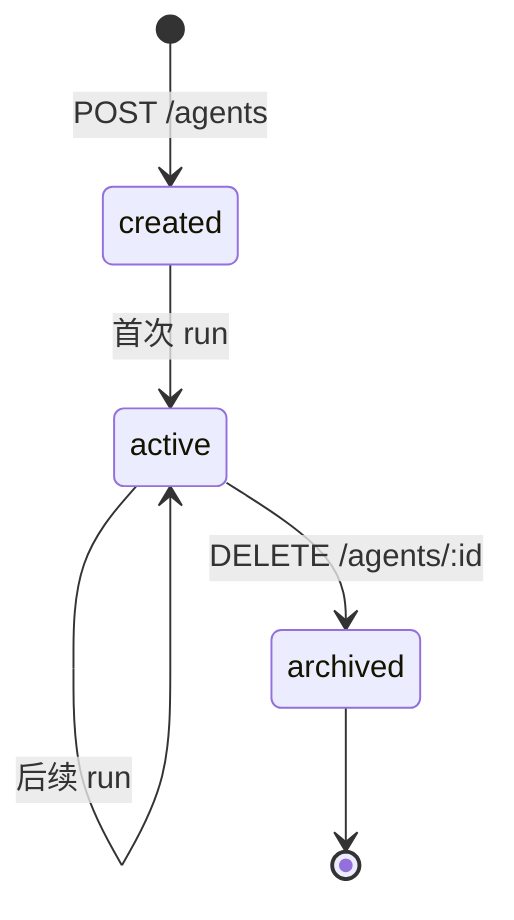
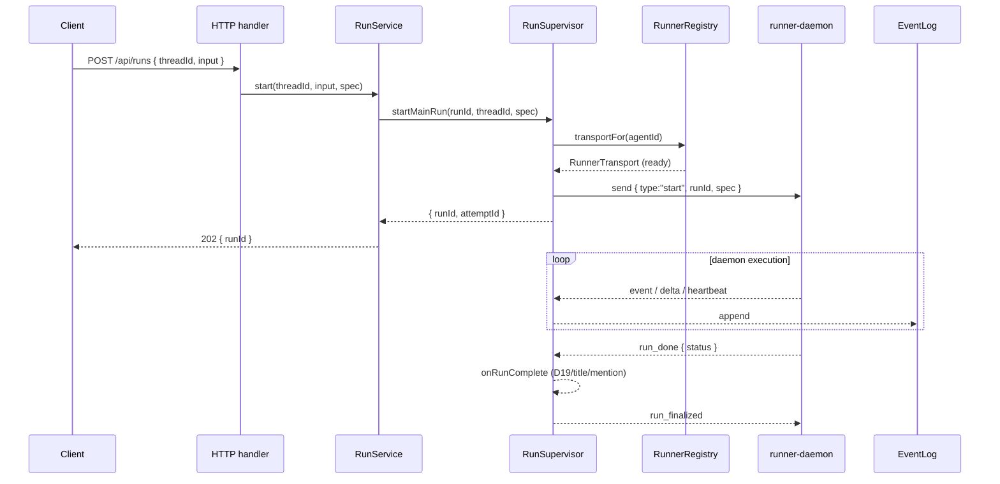
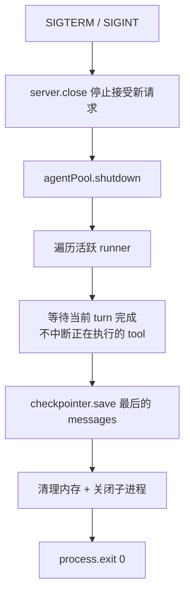

# Backend — Team Runtime（HTTP Server）

## 定位

Backend 是 agent 栈的 **L5 团队运行时**——一个常驻 HTTP 进程，管理多个 agent 实例、维护 agentId 元数据、通过 [RunnerRegistry](./16-resident-runner.md) 寻址 agent-scoped daemon 并收发 transport 消息，对上层 [L6 Surfaces](./00-vision.md#四当前分层架构)（frontend / IM bot / CLI）暴露 HTTP/SSE。

它是从"库"到"可被前端/bot 调用的服务"的关键一跳，但**不再是栈的最顶层**——上面还有 surface 层。

> **M14.7 Resident Runner**: run 执行已从 fork-per-run 子进程收敛为**常驻 daemon 进程 + Transport 协议**。三件事正交：**执行**（daemon agent loop）、**投影**（SSE 从 EventLog 读）、**生命周期**（RunSupervisor 编排 run/attempt/session）。详见 [16-resident-runner.md](./16-resident-runner.md)。

```
L6 Surfaces       ← frontend / IM bot / CLI
   ↑ HTTP / SSE / webhook
L5 Backend        ← 常驻 HTTP 进程。agent CRUD + thread 管理 + runner pool + SSE
   ↑ Transport 协议 (NDJSON over Unix Socket)
L4 Harness        ← 装配成品。createGenericAgent(workspace, model, ...)
   ↑ 依赖
L3 Framework      ← 装配套件
   ↑ 依赖
L2 Runtime        ← 裸 run() 循环
   ↑ 依赖
L1 Protocols      ← 类型契约
```

**Backend 的角色**：L1–L4 是库，L6 是用户接触面，Backend 是把库装成可被多 surface 共用的常驻服务的中间层。

> **命名说明**：项目最终愿景是 my-agent-team（agent team 管理服务），其中真人与 agent 同为 first-class member。引入 `Member` / `Conversation` 抽象后，本层在概念上演进为 "team runtime"，但**进程名与代码包名继续叫 backend**——因为相对于 L6 frontend，它就是后端。

---

## 为什么需要 Backend

从第一性事实推导：

1. **Agent 是长时间运行的** — 一次 run 几秒到几分钟，HTTP/1.1 短连接不够用
2. **用户不止一个** — 多用户同时对话，需要 agentId 隔离
3. **Agent 不是一次性用完就丢** — 同一 agentId 下次回来要继续对话（thread 持久化）
4. **Streaming 需要事件流** — LLM 流式输出实时推到前端
5. **部署是独立于库的决策** — framework/harness 是库，不管怎么部署。Backend 决定部署
6. **Harness 不认识 agentId / 沙箱** — 必须有一层把 agentId 转成 workspace 路径、把进程装进沙箱

---

## Backend 的职责（明确边界）

| 职责 | 说明 |
|---|---|
| **agentId 表** | `agentId → AgentSpec` 映射的存储（DB / KV） |
| **Workspace 物化** | 首次创建 agent 时 `mkdir` + 从 template 复制 SOUL/AGENTS/MEMORY |
| **Agent 生命周期** | 创建、恢复、运行、中断、销毁、归档 workspace |
| **Runner 调度** | 通过 `RunnerRegistry.transportFor(agentId)` 获取 transport |
| **会话路由** | threadId → 哪个 runner instance 的映射 |
| **流式传输** | 把 runner 输出的 `AgentEvent` 转 SSE/WebSocket，推给前端 |
| **多租户隔离** | 不同租户的 workspace 独立、checkpointer 独立 |
| **鉴权 + 配额** | API key 验证、QPS / token 配额 |
| **优雅关闭** | SIGTERM 时等待活跃 agent 完成当前 turn |

**Backend 不管的事**（属于下层）：

- 不选 tool、不写 system prompt — Harness 做（通过 workspace 文件）
- 不管理 plugin、不裁剪 context — Framework 做
- 不定义 Message/ChatModel/Tool 协议 — core 做

---

## Backend 不认识下层的什么

| Backend 不认识 | 因为 |
|---|---|
| `Plugin` 接口细节 | harness 已经把 plugin 编排好；backend 只关心 agent 入参 |
| message 拼接策略 | framework / context-manager 的事 |
| tool 调度顺序 | runtime 的事 |
| MEMORY.md / SKILL.md 格式 | 对应 plugin 的事 |

backend 看到的下层 API 就是：`createGenericAgent(spec) → AsyncIterable<AgentEvent>`。

---

## M14.7 Resident Runner — 常驻 daemon + Transport 协议

harness 不感知进程边界，但 backend 必须决定 agent 跑在哪。M14.7 把 runner 从 fork-per-run 子进程收敛为**常驻 daemon 进程**——一个 agent 一个 daemon，多个 run 复用同一个进程。

### RunnerRegistry — backend → daemon 的唯一入口

```
backend (RunSupervisor)
    → RunnerRegistry.transportFor(agentId)
    → RunnerTransport (unix socket / NDJSON)
    → runner-daemon (agent-scoped)
```

| 实现 | 场景 | 行为 |
|------|------|------|
| `DevRunnerRegistry` | 本地开发 | lazy spawn daemon，pidfile 清理，dispose 杀进程 |
| `ProdRunnerRegistry` | 生产部署 | resolve 已有 endpoint，不 spawn |

### Transport 协议（NDJSON over Unix Socket）

```
Host → Runner:  start | abort | run_finalized
Runner → Host:  run_started | event | delta | heartbeat | run_done
```

关键语义：
- `start { runId, spec }` — daemon `safeParse(spec)` 后启动 run
- `abort { runId }` — 透传 AbortSignal 到 agent loop
- `run_done { runId, status }` — daemon 通知 backend run 结束
- `run_finalized { runId }` — backend 确认所有副作用（D19/title/mention）完成后发送
- daemon 收到 `run_finalized` 后才启动 reflect（如有）

### Runner Daemon 入口

```ts
// packages/runner-daemon/src/runner-daemon.ts
const daemon = new RunnerDaemon({
  agentId: opts.agentId,
  workspace: makeAgentFsHandle({ sharedRoot, privateRoot }),
  checkpointer: sqliteCheckpointer({ db: openCheckpointerDb(stateRoot) }),
  modelFactory: { create: (m) => new AnthropicChatModel(m) },
});
```

daemon 启动后绑定 unix socket，等待 backend `start` 消息。收到后：
1. `AgentSpecV2.safeParse(spec)` 单点校验
2. `spec.agentId === this.#agentId` 身份校验
3. `createGenericAgent({ workspace, model, threadId, ... })` 装配 agent
4. `agent.run()` / `agent.resume()` 执行
5. event → transport.send 回传 backend

详细设计见 [16-resident-runner.md](./16-resident-runner.md)。

---

## AgentSpec V2

M14.7 引入 `AgentSpecV2` discriminated union。详细 schema 见 [13-agent-spec.md](./13-agent-spec.md)。要点：

- `mode` 必填判别键（`"run"` | `"resume"` | `"reflect"`）
- `agentId` 必填 — daemon 用其校验身份
- `workspace` 字段删除 — daemon 自己持有 `AgentFsHandle`
- `storage` 字段删除 — checkpointer 是 daemon-local SQLite
- daemon 用 `safeParse` 单点校验，失败即回 `run_done error`

---

## 最小接口设计

```
POST   /agents                — 创建 agent（分配 agentId、物化 workspace）
POST   /agents/:id/run        — 发送 input，返回 SSE 流
POST   /agents/:id/abort      — 中断当前 run（runner 收 abort signal）
POST   /agents/:id/resume     — 恢复中断的 run，返回 SSE 流
GET    /agents/:id/thread     — 获取 thread 当前状态
DELETE /agents/:id            — 销毁 agent + 归档 workspace
GET    /health                — 健康检查
```

> **M14.7 Durable Runs**: `POST .../run` 返回 `202 { runId }`；事件由独立的 `GET /api/runs/:id/events` SSE 投影端点消费（支持 `Last-Event-ID` 续读）。run 在常驻 daemon 中执行，backend 通过 `RunnerTransport` 收发 lifecycle 消息。

```
POST /api/runs                — 启动 run,返回 202 { runId } (不绑 SSE)
GET  /api/runs/:id/events     — SSE 投影,支持 Last-Event-ID 续读/重连/冷读
POST /api/runs/:id/cancel     — 204,发送 abort 到 daemon transport
POST /api/runs/:id/resume     — 接收 ResumeCommand,恢复中断的 run
GET  /api/runs/:id            — run 元数据 status/时间,供轮询
```

### `POST /agents`

```
Request:
{
  "template": "coding",            // 可选，从 templates/coding/ 复制初始文件
  "model": { "provider": "anthropic", "model": "claude-sonnet-4" },
  "permissionMode": "ask"
}

Response:
{ "agentId": "abc123", "workspace": "/var/agents/abc123/workspace" }
```

Backend 做的事：

1. 生成 agentId
2. `mkdir -p /var/agents/${agentId}/workspace`
3. 若有 `template`，`cp -r templates/${template}/* /var/agents/${agentId}/workspace/`
4. 在 agentId 表里存 `{ agentId, workspace, modelConfig, permissionMode, createdAt }`

### `POST /agents/:id/run`

```
Request:  { "input": "add a unit test for utils.ts", "threadId": "t-42" }

Response: text/event-stream

event: message
data: {"role":"assistant","content":[{"type":"text","text":"Let me add that test"}]}

event: message
data: {"role":"assistant","content":[{"type":"tool_use","id":"t1","name":"read","input":{"path":"utils.ts"}}]}

event: interrupted
data: {"pendingTool":{...},"reason":"permission_required"}
```

Backend 做的事：

1. 查 agentId → spec
2. 选 runner（按 sandbox 策略）
3. 把 spec + input + threadId 组成 `AgentSpec` 喂给 runner
4. 把 runner 输出的 event 流转 SSE 推给 client

### 为什么是 SSE 不是 WebSocket（默认）

- run/resume 返回 `AsyncIterable<AgentEvent>` — 单向流，SSE 比 WS 简单一个量级
- abort 用独立 `POST /agents/:id/abort` 触发，不需要复用同一通道
- WS 留给"用户在运行中追加指令、人工 approve permission"等真正双向场景

### SSE 事件与 framework 内部事件的关系

Framework 有两套事件体系，Backend SSE 转译的是 `AgentEvent`：

| 名称 | 类型 | 谁产生 |
|------|------|--------|
| `AgentEvent` | `{ type: 'message' \| 'interrupted', payload }` | framework `agent.run()` / `agent.resume()` yield |
| `CheckpointEvent` | `user_input` / `model_start` / `tool_end` / ... | framework 调 `checkpointer.appendEvent` |

> **事件源**: daemon 通过 transport 发送 `event`/`delta` 消息；backend 在 `#handleRunnerMessage` 中 `append` 到 EventLog。SSE 投影端从 EventLog 读取，支持 `Last-Event-ID` 续读。Checkpointer 是 daemon-local SQLite，backend 不感知。

**SSE 转译规则**(机械操作,无 switch):

```ts
// 请求头 Last-Event-ID: <seq> → afterSeq;客户端断开 → req.signal 触发,只取消订阅不 abort run
for await (const rec of eventLog.subscribe({ runId, afterSeq }, req.signal)) {
  res.write(`id: ${rec.seq}\nevent: ${rec.event.type}\ndata: ${JSON.stringify(rec.event)}\n\n`);
}
```

---

## 内部架构

```
apps/backend/
├── src/
│   ├── server.ts                     # HTTP server 启动 + 路由
│   ├── features/
│   │   ├── agent/                    # Agent CRUD + workspace 物化
│   │   ├── run/
│   │   │   ├── supervisor.ts         # RunSupervisor — run 生命周期编排
│   │   │   ├── runner-registry.ts    # DevRunnerRegistry / ProdRunnerRegistry
│   │   │   ├── service.ts            # RunService — start/resume + autoTitle
│   │   │   └── http.ts               # run SSE + cancel + resume HTTP
│   │   ├── conversation/             # Conversation + Member 抽象 (M10)
│   │   └── checkpoint/               # Checkpoint read/write adapter
│   ├── http/router.ts                # 路由装配
│   └── main.ts                       # 入口 — 组装 registry/supervisor/services
└── package.json

packages/
├── agent-spec/              # AgentSpecV2 zod schema（backend + daemon 共享）
├── runner-protocol/         # Transport 契约 + socket/memory transport 实现
├── runner-daemon/           # 常驻 daemon 进程入口
└── agent-fs/                # AgentFS mount table + backend + AgentFsHandle
```

**依赖**：

```json
{
  "dependencies": {
    "@my-agent-team/agent-spec": "workspace:*",
    "@my-agent-team/harness-generic": "workspace:*",
    "@my-agent-team/adapter-anthropic": "workspace:*"
  }
}
```

Backend 不直接依赖 `framework` — 通过 harness 间接消费。

---

## Workspace 生命周期



| 状态 | Workspace 位置 | 说明 |
|---|---|---|
| created | `/var/agents/${agentId}/workspace` | mkdir + template 复制完成 |
| active | 同上 | 至少跑过一次 run；MEMORY.md / facts/ 可能有内容 |
| archived | `/var/agents/_archive/${agentId}.tar.gz` | 软删除，保留 30 天可恢复 |

**为什么 backend 而不是 harness 做 workspace 物化**：

1. harness 不应该 `mkdir` — 它假设 workspace 已存在，否则启动失败
2. 模板复制涉及"agentId 选择哪个模板"的策略，是产品决策不是装配决策
3. 多租户场景下 workspace 路径策略（`/var/agents/${tenant}/${agentId}`）是 backend 的事

---

## RunSupervisor — run 生命周期编排

```ts
interface RunSupervisor {
  startMainRun(runId, threadId, spec): Promise<RunHandle>;
  resumeRun(runId, threadId, spec): Promise<RunHandle>;
  beginReflectRun(runId, threadId, parentRunId, spec): Promise<RunHandle>;
  cancel(runId): boolean;
  cancelAll(): void;
  onRunComplete(fn): void;
}
```

- `startMainRun`：INSERT run + attempt → registry.transportFor(agentId) → send start
- `resumeRun`：UPDATE run status + new attempt → send start
- `beginReflectRun`：INSERT reflect run (kind='reflect', parentRunId) → send start
- `cancel`：session.transport.send("abort") — 不杀进程，只发 abort 消息
- `onRunComplete`：terminal hook — 所有状态（success/error/aborted/interrupted）都触发，释放 thread lock

**并发模型**：

- 每个 daemon 内 `#running` 保护（framework 层）
- `RunSupervisor.#active` Map 追踪活跃 run → Session
- 多 agentId 天然并行（各自独立 daemon）

---

## 请求生命周期（M14.7）



---

## Durable Runs（M14.7）

run 执行收敛为**常驻 daemon + Transport 协议**：backend 不再 fork 子进程，而是通过 `RunnerRegistry` 获取 per-agent transport，经 NDJSON socket 收发 lifecycle 消息。

### 执行解耦

```
POST /api/runs
   │
   ├─ RunSupervisor.startMainRun(runId, threadId, spec)
   │    ├─ registry.transportFor(agentId)  → RunnerTransport (ready)
   │    ├─ INSERT run + attempt
   │    └─ transport.send({ type:"start", runId, spec })
   ▼
返回 202 { runId }

daemon:  transport.onMessage → #onStart
   ├─ AgentSpecV2.safeParse(spec)
   ├─ createGenericAgent({ workspace, model, ... })
   └─ agent.run() → transport.send(event/delta/heartbeat/run_done)

GET /api/runs/:id/events  ── eventLog.subscribe({ runId, afterSeq }) ──► SSE 投影
```

- **daemon 执行** agent loop，通过 transport 回传 event/delta/heartbeat
- **backend 投影**：`#handleRunnerMessage` 收到 `event` → `eventLog.append`；SSE 端从 EventLog 订阅
- 客户端断连 → 只取消 SSE 订阅，不 abort run

### 数据模型：run（逻辑）/ attempt（物理执行）

```sql
CREATE TABLE run (
  run_id     TEXT PRIMARY KEY, thread_id TEXT, agent_id TEXT,
  kind       TEXT DEFAULT 'main', parent_run_id TEXT,
  status     TEXT DEFAULT 'running', started_at INTEGER, ended_at INTEGER
);
CREATE TABLE attempt (
  attempt_id   TEXT PRIMARY KEY, run_id TEXT REFERENCES run(run_id),
  heartbeat_at INTEGER, started_at INTEGER, ended_at INTEGER
);
```

- 一个 run 有 1..N 个 attempt；interrupt→resume = 同 run_id 新 attempt
- `pid` 列仍存在（迁移兼容），但 daemon 路径不再写入
- heartbeat 由 daemon 定期发送，reaper 按超时收割僵死 run

### Cancel 透传

`POST /api/runs/:id/cancel` → `session.transport.send({ type:"abort", runId })` → daemon 收到后 `AbortController.abort()` → adapter `fetch({ signal })` 即时取消 in-flight 模型调用。

### 崩溃恢复（backend 重启重新发现）

backend 启动时扫描 `runs.status='running'` 及其活跃 `attempts`。**存活判定单一真相源 = `attempts.heartbeat_at` 新鲜度,废弃 `kill(pid,0)`**(pid 跨重启不可靠,PID 复用;heartbeat 才是权威,详见 [14 §10.1](./14-event-log.md#101-存活判定单一真相源-heartbeat_at废弃-killpid0)):

- 子进程 entry 定期 `UPDATE attempts SET heartbeat_at = now()`(它本就连着 DB)。
- **heartbeat 新鲜** → **重新发现**:backend 不重连已断的 stdout 管道,而是认领该 run_id,通过 `eventLog.subscribe({ runId, afterSeq=高水位 })` 续读子进程仍在直写的事件。**子进程直写 EventLog(铁律 4)是这一招成立的前提**。
- **heartbeat 过期** → 标记该 attempt `ended`、run `status='interrupted'`,发终态事件。
- 子进程**不探测 backend 死活**;孤儿回收交给独立超时(`cancelGraceMs×N` 无人 cancel 即自杀),与 backend 解耦。

### 运行期 Liveness Reaper（主动收割卡死的 run）

> **第一性问题**:`child.on("exit")` 只能抓住"进程真的退出"的 run;一个 runner **进程没死但任务卡死**(模型 fetch 永久挂起、工具调用不返回、死循环)既不触发 exit、也(若心跳仍是独立定时器)照常打卡——backend 会**永远以为它在干活**。对长任务,这意味着 [M10 单活跃 run 锁](./15-conversation.md#四防失控两道安全阀)永不释放,整个 conversation 被一个僵尸 run 冻死。原 `rediscover` 的判活逻辑**只在 backend 重启时触发一次**,补不上这个洞。

修正方向不是新造协议,而是**激活已有的那根心跳 + 把它从"liveness"升级到"progress"**,两刀:

**第一刀:backend 运行期周期收割(reaper)。** 把 `rediscover` 的判活逻辑从"仅重启时"提升为**运行期周期性扫描**(`RunSupervisor` 内一个 `setInterval`,周期约 `heartbeatTimeoutMs / 2`):

```
每 reaperIntervalMs:
  SELECT * FROM attempt WHERE ended_at IS NULL
  age = now - heartbeat_at
  if age > heartbeatTimeoutMs:
     attempt.ended_at = now;  run.status = 'interrupted'
     发终态事件(append EventLog,SSE 投影看到 run 结束)
     触发 onRunComplete(threadId, runId)   ← 关键:复用既有回调链
```

`onRunComplete` 是 reaper 与 M10 的**强联动点**——它既释放 [M10 `activeConversations` 会话锁](./15-conversation.md#四防失控两道安全阀)(否则僵尸 run 永久占住会话),也让"成长"那条 run 结束反思钩子知道这次执行已流产。**零新表、零新协议**:只是把已有判活 SQL 的触发时机从"重启一次"改为"运行期周期跑",并接进已有的 `onRunComplete` 多播。

**第二刀:心跳语义从"进程存活"升级为"任务推进"。** 现状 `heartbeat_at` 由一个**独立 `setInterval`** 更新——它只证明 runner 进程的事件循环还活着(liveness),**不**证明 agent 真的在推进(progress)。卡死在单个工具调用里时,事件循环仍转、定时器照打卡 = **假阳性**。修正:把 `heartbeat_at` 的更新**从独立定时器移到 agent loop 的每步推进**(每产出一个 `AgentEvent` / 每完成一次 `sink.append()` 打一次心跳),**不保留兜底定时器**(否则退回 liveness 假阳性)。`stepStallTimeoutMs`(默认 300s)作为 reaper 判死的**二次校验窗口**——reaper 发现 heartbeat 过期后 `kill(pid,0)` 探进程 + 等 stepStallTimeoutMs 确认才判死——**仅存 BackendConfig,不进 AgentSpec**(runner 不感知)。

```
旧:setInterval(() => UPDATE heartbeat_at)          // liveness:进程没死
新:每个 AgentEvent 产出 → UPDATE heartbeat_at      // progress:任务在推进
   + 独立硬超时 stepStallTimeoutMs 兜底单步卡死
```

动的仍是 `heartbeat_at` **同一列**——奥卡姆意义上是"同一根管子换个驱动源",不引入新字段/通道。升级后 reaper 的 `age > heartbeatTimeoutMs` 判据自动从"进程多久没打卡"变成"任务多久没推进",真正抓住长任务卡死。

> **不变量守住**:reaper 是 backend 侧纯读 + 状态收敛,不向 runner 发任何指令(不做双向 ping);心跳仍是 runner **单向**写共享 DB 列。存活判定继续**收敛到 `heartbeat_at` 单一真相源**(见 [14 §10.1](./14-event-log.md#101-存活判定单一真相源-heartbeat_at废弃-killpid0)),只是消费时机从"重启时"扩展到"运行期周期 + 重启时"。stdout/RPC 一概不碰。

### Resume：backend 不 resume，而是重新 fork 一个 attempt

`agent.resume()` 必须在**持有 checkpointer 的子进程里**调用(要 `consumeInterrupt`);backend 不持有 checkpointer,所以 backend 的工作是**装配一个新 attempt 子进程并标注这是一次 resume**:

```
前端 POST /api/runs/:id/resume {approved, message}
   │
backend: 查该 run 的原 AgentSpec(含 storage.checkpointer 连接配置 + threadId)
   │       fork 新 attempt 子进程,spec.mode="resume" + spec.resumeCommand
   ▼
runner entry: agent.resume(cmd)
   └─ checkpointer.consumeInterrupt(threadId)   ← 在子进程内读,backend 不碰
   └─ push tool_result → 续跑 loop
   └─ 每个事件 append → EventLog(同 run_id)
   ▼
backend 投影端: subscribe({runId}) 无缝续推(同一条 SSE 流)
```

要点:

1. **backend 只是装配器 + 转发器**:转发 `ResumeCommand`、原样转发原 spec 的 checkpointer 连接配置,**自己从不读 checkpointer 内容**(对 checkpointer 介质永久无感)。
2. **checkpointer 是 resume 唯一权威源**:EventLog 因丢失 context 裁剪信息**不能**替代 resume(详见 [14 §5.1](./14-event-log.md#51-为什么-eventlog-不能取代-checkpointer-做-resume))。
3. **复用原 run_id**:resume 是同一逻辑 run 的延续 → 同 run_id、新 attempt;前端 `subscribe({runId})` 不变,SSE 流连续。
4. resume 端点用 `POST /api/runs/:id/resume`(对前端即"继续这个 run",backend 内部映射到 threadId)。

### 并发控制

- `maxConcurrentRuns` 在 fork 前检查活跃 attempt 数;超限 `POST /runs` 返回 **429**(不排队,队列暂不在范围内)。
- 同 thread 单活跃 run 约束保留,超限 **409**。两维度独立。

详见 [14-event-log.md](./14-event-log.md)。

---

## 配置

```ts
interface BackendConfig {
  port: number;                          // 默认 3000
  workspaceRoot: string;                 // 默认 /var/agents
  templateDir?: string;                  // 默认 ./templates
  agentStore: AgentStore;                // DB/KV 实现
  defaultRunner: 'in-proc' | 'stdio' | 'http';
  sandbox?: SandboxConfig;               // stdio/http runner 的沙箱选择
  eventLog: EventLog;                    // 事件投影事实源(composition root 唯一实例化)
  maxConcurrentRuns?: number;            // 全局并发上限,超限 429
  cancelGraceMs?: number;                // SIGTERM → SIGKILL 宽限
  heartbeatTimeoutMs?: number;           // heartbeat 多久没更新 → 判死(reaper + 重启发现共用),默认 60_000
  reaperIntervalMs?: number;             // 运行期收割扫描周期,默认 min(heartbeatTimeoutMs/2, 30_000)
  stepStallTimeoutMs?: number;           // 判死二次校验硬超时(仅 BackendConfig,不传 runner),默认 300_000
  logger?: Logger;
  auth?: { apiKeys: string[] };
}
```

**为什么 Backend 需要自己的 agentStore**：framework 的 checkpointer 是 agent 级别（per-thread messages）。Backend 需要 agent **元数据**层（agentId → spec），是不同维度。

> **存储职责**:Backend 持有 **EventLog**(投影事实源),但**不持有 Checkpointer**(那是 runner 注入、agent-resume 专用)。这是解耦的关键——见 [14 §一](./14-event-log.md#一为什么从-checkpointer-里拆出来)。

---

## 优雅关闭



不强行 abort — 让正在跑的 agent 安全落盘。

---

## Backend 不是什么

| 不是 | 说明 |
|---|---|
| **不是 framework** | Backend 是进程，framework 是库 |
| **不是 harness** | harness 装配单个 agent，Backend 管多 agent 生命周期 + 部署 |
| **不是 runner** | Runner 是 backend 启动的进程入口；backend 选择/调度 runner |
| **不是 frontend / IM bot / CLI** | 这些是 L6 Surfaces，调 backend 的 HTTP API；Backend 自己不渲染 UI、不接 IM webhook 业务逻辑 |
| **不是 load balancer** | 不负责多实例分发；前面加 nginx/HAProxy |
| **不是 auth service** | 最简 API key；复杂鉴权交给 API Gateway |
| **不是 sandbox provider** | Backend 选择/调度 sandbox，不实现 sandbox |
| **不是 team 语义层（暂时）** | 引入 Member/Conversation 抽象前，backend 只管 agent 维度；多方协作语义在后续阶段加入 |