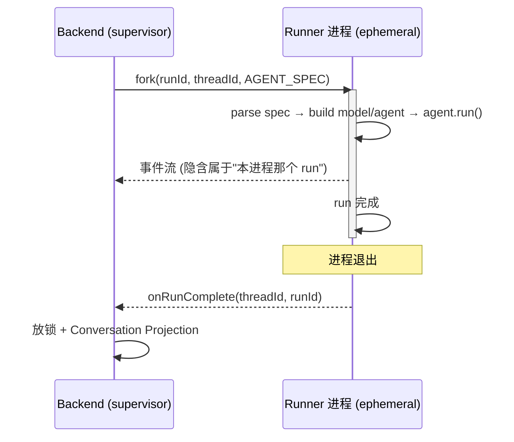
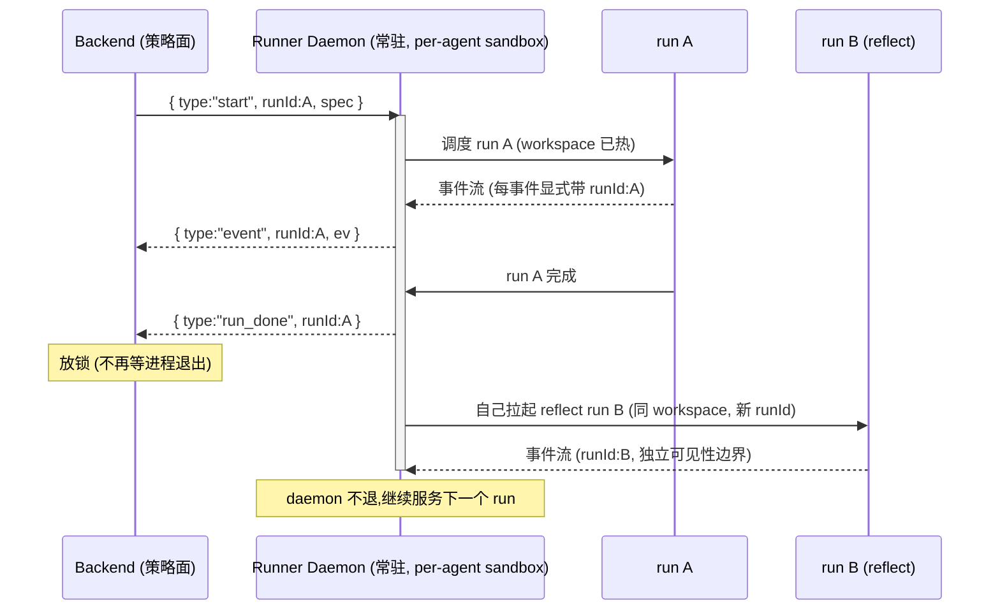

# Resident Runner — 从「进程即 run」到「常驻 sandbox 守护进程」

> 今天的 Runner 是 ephemeral 的：**1 个进程 = 1 次 run**，run 结束进程就退。本文讲清楚这个形态借了哪些"进程生命周期"当免费信号，为什么要改成**一个 sandbox 里的常驻守护进程管多个 run**，以及迁移时哪些是会变的实现、哪些是不能破的不变量。
>
> 关联：[Backend — Team Runtime](./12-backend.md)（触发方）· [AgentSpec](./13-agent-spec.md)（启动契约）· [EventLog](./14-event-log.md)（事件可见性边界）· [plugin-fs-memory](./06-plugin-fs-memory.md)（workspace 级存储）· [18-im-adapter](./18-im-adapter.md)（per-agent L6 兄弟进程，与本层同属 agent 进程组但分层不同）· [M14.3 Reflection 后置](../superpowers/specs/2026-06-10-m14.3-reflection-post-run.md)（锁与 run 边界的先例）。

---

## 一、一句话

把 Runner 从「**进程即 run**」改成「**常驻 sandbox 守护进程**」：一个 sandbox（对应一个 agent 的 workspace）长期存活，服务该 agent 的所有 run。代价是——今天靠"进程退出"免费表达的一切语义（放锁、abort、崩溃隔离、资源回收），都要改成**显式协议消息**。

---

## 二、今天的形态：进程生命周期 == run 生命周期



整个生命周期搭在「1 进程 = 1 run」这块承重墙上。下面这些语义，**全是借进程生命周期免费表达的**：

| 语义 | 今天怎么实现 | 信号来源 |
|---|---|---|
| run 结束 / 放锁 | `onRunComplete` 回调 | **进程退出** |
| spec 注入 | 启动时读 `process.env.AGENT_SPEC` 一次 | 进程启动 |
| abort | `SIGTERM` 杀进程 | OS 信号 |
| 事件归属 | 每事件隐含"属于本进程那个 runId" | 进程单一性 |
| 资源开关 | DB / checkpointer / fs-memory cache 进程级开关 | 进程退出即回收 |
| 崩溃隔离 | 一个 run 炸只炸自己进程 | **OS 进程边界** |
| 并发治理 | framework `#running` 锁（单 agent 单 run） | 进程内只有 1 个 run |

**关键观察**：这些都不是"设计出来的机制"，而是"碰巧进程帮我们做了"。常驻化要做的，本质是把每一条**从隐式信号翻译成显式契约**。

---

## 三、为什么要改：ephemeral 的三笔账

1. **冷启动税**。每次 run 都要重新 init model client、`checkpointer.load(threadId)`、初始化 plugin、预热 fs-memory cache。对一个高频对话的 agent，这是每轮都付的固定成本。
2. **沙箱部署诉求**。Runner 未来要跑在隔离 sandbox（可能是 docker）里，部署放开。容器的自然单位是"长期存活的服务"，而不是"每次任务起一个又杀掉"——per-run 容器等于把现状容器化，拿不到任何常驻收益。
3. **心智模型对齐**。[愿景](./00-vision.md)里 agent 是「一个有 workspace、长期存在的实体」。但今天进程模型是 ephemeral 的，和这个心智错位。常驻化后 **agent 就住在它的 sandbox 里**，进程模型第一次和领域模型对齐。

---

## 四、目标形态：常驻守护进程



守护进程内部需要一个 **run registry**：多路复用 N 个并发 run，每个 run 有自己的 runId / thread / 取消句柄，共享 sandbox 级的 workspace 文件、checkpointer 连接、memory cache。

### sandbox 粒度：per-agent（= per-workspace）

| 候选粒度 | 评价 |
|---|---|
| per-run | 把现状容器化，无常驻收益 ❌ |
| per-conversation | 不同 agent 的 workspace 混进一个 sandbox，文件归属混乱 ❌ |
| **per-agent** | 一个 sandbox = 一个 agent 的 workspace，服务该 agent 所有 run ✅ |

选 **per-agent** 的硬理由：[fs-memory](./06-plugin-fs-memory.md) 是 **workspace 级**的——`SOUL.md` / `USER.md` / `memory/` 都挂在 workspace 上。一个 sandbox 对应一个 workspace，文件、checkpointer、memory cache 全程热着，冷启动税一次付清。

**落地决策**：daemon 是 **agent-scoped**（一个 daemon 绑定一个 agent，`--agent-id` 启动参数）。dev 下 `DevRunnerRegistry` lazy spawn 本地 daemon；prod 下 `ProdRunnerRegistry` 只解析已有 endpoint。daemon 生命周期由 registry 管理，不在 dev.sh 里手动 spawn/pkill。

---

## 五、契约变更：把隐式信号显式化

这是迁移的真正工作量。逐项把"进程帮我们做的"翻译成协议：

| 维度 | 今天（隐式，靠进程） | 常驻后（显式，靠协议） |
|---|---|---|
| run 结束 | 进程退出 → `onRunComplete` | runner 发 `{type:"run_done", runId}` |
| spec 注入 | 启动读 `AGENT_SPEC` 一次 | 双工通道收 `{type:"start", runId, spec}`，可多次 |
| abort | `SIGTERM` 杀进程 | `{type:"abort", runId}` 单 run 级中止，不波及其他 run |
| 事件归属 | 每事件隐含属于本进程 run | **每事件必须显式携带 runId** |
| 资源 | DB / 缓存进程级开关 | daemon 启动建一次，run 之间共享（连接池） |
| 崩溃隔离 | OS 进程边界免费给 | daemon 内 supervision：一个 run 的未捕获异常不能拖垮整个 daemon |
| 并发 | `#running` 单 run | run registry，多 run / 多 thread 并发治理 |
| **Checkpointer** | runner 开 backend.db 读写 | **两份独立存储**：backend 侧 `ThreadProjection`（conversation ledger → agent thread 投影）写 `backend.db`，daemon 侧 `SQLiteCheckpointer`（runtime 执行态）写 `state/checkpointer.sqlite`。上下文经 transport `preloadedMessages` 在 run 启动时 hydrate，两 DB 不互通 |

**两个最难、今天 OS 免费给、常驻后必须自建的**：

- **崩溃隔离** — daemon 内要捕获每个 run 的异常边界，一个 run 崩了只标记该 run failed，daemon 继续。
- **资源核算** — 没有进程退出来回收，一个 run 的内存泄漏会累积到整个 daemon 生命周期，需要 per-run 资源上界 + 主动回收。

---

## 六、为什么 per-event runId 归属是常驻化的地基

在 ephemeral 模型里，"每事件属于哪个 run"是隐式的——一个进程只跑一个 run，所有事件自然属于同一个 runId。事件路由代码可以用 `spec.runId` 硬编码，因为 spec 在整个进程生命周期内不变：

```ts
// entry.ts —— 今天能"碰巧正确"，纯因为 1 进程只有 1 个 runId
await sink.append(spec.threadId, spec.runId ?? spec.threadId, ev);
```

**"每事件带正确 runId"在 ephemeral 模型里是边角约束，在常驻模型里是核心不变量**：daemon 一个进程多路复用 N 个 run 的事件流，run A 的事件错标成 run B 就是跨会话串台。

典型反模式：反思（reflection）或冷审（cold-verify）等**辅助 run** 在主 run 完成后被拉起。如果它们的事件共享主 run 的 `spec.runId`，会导致：

1. **conversation projection 污染**：辅助 run 的 tool_use / text 被投影进主 conversation ledger，与主 run 产出混在一起
2. **前端错位**：turn 分组把同 sender 的辅助消息和主消息合成一个 turn，真正的结论被折叠
3. **锁无法释放**：如果辅助 run 内联在主 runner 进程里跑，进程不退出 → `onRunComplete` 不触发 → 锁不释放

**正确做法**：辅助 run 必须有自己的独立 runId，事件写在这个 runId 下，与主 run 的 EventLog 物理隔离。这正是常驻模型的中心范式——daemon 内的 run registry 分配 runId，每个 run 的事件流带上自己的 runId 标签，"碰巧正确"退场。

所以在常驻化之前，先把 per-event runId 归属从"隐式硬编码"收敛到"显式标注"，不是打补丁，而是**给常驻化打地基**。

---

## 七、反思在常驻模型里的归宿

per-agent 常驻给反思一个漂亮的解。反思有两个看似冲突的需求：

1. 需要**同一个 workspace 的 memory / SOUL / USER**（才能反思出有用的东西）；
2. 必须是**独立 runId / 独立可见性**（否则混进主 turn，造成 conversation projection 污染和前端折叠）。

常驻模型里这两点天然统一：

> 反思 = **同一个 sandbox（同 workspace 文件，热的）+ 新开一个 runId 的 run**。

而且常驻 runner 本身就是 manager，它完全能在自己发出主 run 的 `run_done`（= 放锁）**之后**，自己拉起这个 reflect run。于是反思的**触发**从 backend 下沉到 daemon 控制环，backend 退到只剩**策略**（要不要反思、何时反思）——这正是 [Backend](./12-backend.md) "只是协调者"定位的兑现。

`orchestrateReflection` 现在的 deps 注入形态（`genId` / `fork` / `buildSpec` 三个口子，不耦合 backend 具体实现）已经朝这个方向设计，迁移时签名基本不动，只是调用方从 backend 换成 daemon 的控制环。

---

## 八、不变量（无论怎么改都成立）

这两条是**语义约束**，与部署形态无关——ephemeral、backend 触发、daemon 触发，三种形态下都必须成立：

1. **放锁（turn 结束）先于反思。** turn 的边界 = 用户可再次输入的时刻 = 主 run 对话产出已完成。反思是 run 的副作用尾巴，不属于 turn。今天靠"进程退出"表达先后，常驻后靠 `run_done` 事件表达，**先后关系不变**。
2. **反思走独立 runId / 独立可见性边界。** [Conversation Projection](./12-backend.md)、前端 turn 分组都按"主 run 的可见事件流"切分，反思产出 ≠ turn 产出，必须物理隔离。今天靠独立进程 + 独立 runId，常驻后靠 daemon 多路复用时的 per-event runId 标注，**需求不变、且变得更刚性**。

> 沙箱化只改变"**谁来 fork、谁来分配 runId**"（实现层，会变）；不改变上述两条（语义层，不变）。

---

## 九、推进顺序

```
① 收敛 per-event runId 归属
   → 确保主 run 和辅助 run（reflection / cold-verify）各自拥有独立 runId
   → 事件路由不再依赖隐式的"进程唯一 runId"假设
   → 接口稳定为："主 run 完成 → 独立 runId 的 reflect run"
        │
        ▼
② 常驻化：把"进程退出"语义逐项替换为显式消息
   → run_done / abort / 带 runId 的事件流
   → sandbox 取 per-agent 粒度
   → daemon 内补崩溃隔离 + 资源核算
        │
        ▼
③ 下沉触发：反思触发从 backend 移进 daemon 控制环
   → backend 收敛为纯策略面
```

这个顺序的关键好处：**第 ① 步产出的接口（"给定主 run → fire 一个独立 runId 的 reflect run"）在 ②③ 步都不变**，触发方是 backend 还是 daemon 只是实现细节替换。反过来，不先收敛 runId 归属就常驻化，等于在跨会话串台的风险之上盖楼。

---

## 十、与现有文档的关系

| 文档 | 本文如何依赖 / 影响它 |
|---|---|
| [13-agent-spec](./13-agent-spec.md) | `start` 命令仍以 AgentSpec 为 payload；新增 `run_done` / `abort` 是 spec 之外的**控制消息**，与 spec schema 正交 |
| [12-backend](./12-backend.md) | backend 从"触发 + 协调"收敛为"纯策略面"；`onRunComplete` 的触发源从"进程退出"换成 `run_done` 消息 |
| [14-event-log](./14-event-log.md) | "每事件带正确 runId" 从边角约束升级为核心不变量；EventLog 的 runId 分区是反思隔离的物理基础 |
| [06-plugin-fs-memory](./06-plugin-fs-memory.md) | workspace 级存储是 "sandbox = per-agent" 的决定性依据 |
| [18-im-adapter](./18-im-adapter.md) | lark-bot 与本 daemon 是 per-agent 兄弟进程，不可合并（合则 backend↔daemon 依赖成环）；详见该文 §七 |

---

## 十一、实施记录

已落地（2026-06-12），核心交付：

| 组件 | 落地形态 |
|---|---|
| **Transport** | `runner-protocol` 包 — `RunnerTransport` 接口 + lifecycle 消息（start/abort/run_finalized/event/delta/heartbeat/run_done），NDJSON codec，Memory/Socket transport。`start` 含 `preloadedMessages?: readonly Message[]` 用于上下文 hydration |
| **Daemon** | `runner-daemon` 包 — agent-scoped（`--agent-id`），单 AgentFsHandle + 单 SQLiteCheckpointer，ModelFactory，abort/resume/reflect 分派，reflection ACK 控制环。`#onStart` 先 `checkpointer.save(threadId, preloadedMessages)` 预埋，后 `createGenericAgent()` |
| **ThreadProjection** (backend) | `apps/backend/features/thread-projection/` — `ThreadProjectionReadPort` / `ThreadProjectionWritePort`。Backend 负责 conversation ledger → agent thread 的模型消息投影 |
| **Checkpointer** (runner) | runner-local `SQLiteCheckpointer` 写 `state/checkpointer.sqlite`，不经 Transport 同步，backend 不解析。Run 启动时通过 transport `preloadedMessages` 从 backend ThreadProjection hydrate |
| **Agent API** | 新增 `agent.continue()` — 不追加空 user，直接从 checkpointer 已有消息进入 runLoop。Conversation-triggered run 用 continue，HTTP `POST /api/runs` 仍用 `agent.run(input)` |
| **AFS** | `agent-fs` 包 — canonical namespace + alias resolver，mount table 仅目录 prefix（`/shared/`, `/private/`），displayRoot |
| **Registry** | `DevRunnerRegistry` — dev lazy spawn + dispose；`ProdRunnerRegistry` — resolve endpoint only |
| **Backend** | supervisor `startMainRun(runId, threadId, spec, { preloadedMessages })`，`#beginAttempt` 透传，async `onRunComplete`（Conversation Projection 完成后 ACK），runnerBin 删除，AgentSpecV1 从 main.ts 删除。`forkRun` 从 ThreadProjection 读取消息传入 |
| **清理** | `runner-stdio` 删除，`checkpointer-sqlite` 迁入 framework，`orchestrateReflection` 删除，`workspace-reader` 删除 |
