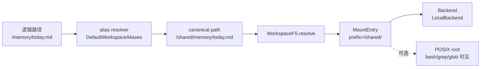

# Agent File System — Agent 看到的虚拟文件树

> AFS（Agent File System）不是一个目录，也不是某个 sandbox 的 mount 方案。它是 agent 面对文件世界时的**逻辑文件系统契约**：agent 只看一棵稳定的虚拟文件树，路径由 `WorkspaceFS` 解析到不同后端，是否能被 bash 看见由 mount entry 的 POSIX 能力决定。
>
> 关联：[Harness](./09-harness.md)（file-driven agent 的文件语义）· [AgentSpec](./13-agent-spec.md)（runner 启动契约）· [Resident Runner](./16-resident-runner.md)（常驻 sandbox 执行体）· [plugin-fs-memory](./06-plugin-fs-memory.md)（workspace 级记忆）· [tools-common](./01-glossary.md#工具层)（read/write/bash/grep/glob 的调用侧）。

---

## 一、一句话

**Agent File System = agent 看到的一棵虚拟文件树。**

它把三个原本混在一起的问题拆开：

1. **路径语义**：agent、plugin、tool 都使用 `/SOUL.md`、`/memory/today.md`、`/skills/x/SKILL.md` 这类逻辑绝对路径。
2. **访问边界**：某段路径属于 shared、private，还是 external。
3. **存储实现**：这段路径背后可以是本地目录、NAS、对象存储、SaaS provider，或测试里的内存 backend。

因此，workspace 不再等价于"宿主机上的一个目录"。目录只是 AFS 的一种 backend。

---

## 二、为什么需要 AFS

File-driven harness 把 agent 的身份、用户偏好、工具说明、长期记忆、技能索引都放在 workspace 文件里。早期实现里，`workspace: string` 同时承担了四个职责：

| 职责 | 早期含义 | 问题 |
|---|---|---|
| 领域语义 | agent 的文件世界 | 与物理目录绑死 |
| 访问控制 | backend 和 agent 都能读同一目录 | backend 容易越界读写 agent 私有产物 |
| 子进程 cwd | bash/grep/glob 的默认目录 | 只有 POSIX backend 能满足 |
| 存储定位 | `path.join(workspace, file)` | 跨 sandbox / NAS / SaaS provider 时不可迁移 |

Resident Runner 以后，backend 在宿主侧，runner-daemon 在 sandbox 内，二者不应再共享同一个宿主路径。继续把 workspace 建模为字符串路径，会把 backend、runner、harness、plugins、tools 全部锁死在同一种部署拓扑上。

AFS 的目标是把"agent 文件世界"提升为一层稳定抽象：部署形态、存储后端、POSIX 暴露策略可以变，但 agent 的逻辑路径不变。

---

## 三、路径模型

AFS 只接受**逻辑绝对路径**：

```text
/SOUL.md
/USER.md
/TOOLS.md
/AGENTS.md
/BOOTSTRAP.md
/memory/2026-06-12.md
/skills/research/SKILL.md
/tmp/output.json
/mnt/drive/spec.md
```

规则：

1. 输入可以从 `foo.md` 规范化为 `/foo.md`，但内部只流转绝对路径。
2. `..`、空 path、无法规范化的 path 一律拒绝。
3. 路径解析只发生在 `WorkspaceFS`，消费者不得自己拼物理路径。
4. 逻辑路径不承诺可被 POSIX 子进程访问；是否可见由 mount entry 的 `posixRoot` 决定。

### 三层路径模型（M14.7 根治）

AFS 内部分为三层：

```text
logical path        agent/tool 看到的路径（/SOUL.md, /memory/x.md）
  ↓ alias resolver
canonical path      AFS 内部 namespace（/shared/SOUL.md, /private/tmp/a.txt）
  ↓ mount table
backend relPath     后端相对路径（SOUL.md, tmp/a.txt）
```

每层职责单一：

| 层 | 职责 | 不做什么 |
|---|---|---|
| logical path | 兼容 agent 心智，保留 `/SOUL.md`、`/memory/` | 不决定 backend |
| alias resolver | 决定 shared/private/external namespace | 不访问存储 |
| mount table | canonical prefix → backend | 不写业务 allowlist |
| backend | read/write/list/stat | 不理解 agent 文件语义 |



---

## 四、Mount table + Alias resolver

AFS 有两层路由：**alias resolver** 把逻辑路径映射到 canonical namespace，**mount table** 把 canonical prefix 映射到 backend。

### PathAliasResolver

```ts
export interface PathAliasResolver {
  toCanonical(path: string): string;
}
```

默认实现（`DefaultWorkspaceAliases`）：

```text
/SOUL.md       → /shared/SOUL.md
/USER.md       → /shared/USER.md
/memory/*      → /shared/memory/*
/skills/*      → /private/skills/*
/tmp/*         → /private/tmp/*
/mnt/drive/*   → /mnt/drive/*（passthrough）
其它根路径      → /private/<path>
```

### MountEntry（仅目录 prefix）

```ts
export type WorkspaceDomain = "shared" | "private" | "external" | "runner_state";

export interface MountEntry {
  prefix: string;                 // "/shared/", "/private/", "/mnt/drive/" — 必须是目录 prefix
  backend: ReadableBackend;
  domain: WorkspaceDomain;
  posixRoot?: string;
}
```

解析规则：

1. `prefix` 必须是规范化绝对目录前缀，以 `/` 结尾（`/` 例外）。
2. 匹配采用**最长前缀优先**；同 prefix 按注册顺序。
3. 不允许 exact file mount（如 `/SOUL.md`）——文件归属由 alias resolver 负责。
3. 同一个 `prefix` 重复注册时，后注册项覆盖前项，方便测试和租户级 override。
4. 读写能力由 backend 类型决定，不额外写 `supportsWrite` 布尔开关。
5. 无 mount 命中是访问边界错误，不是文件不存在。

```ts
export interface ReadableBackend {
  read(relPath: string): Promise<string | null>;
  list(relPath: string): Promise<string[]>;
  stat(relPath: string): Promise<{ mtimeMs: number; size: number } | null>;
  exists(relPath: string): Promise<boolean>;
}

export interface WritableBackend extends ReadableBackend {
  write(relPath: string, content: string): Promise<void>;
  mkdirp(relPath: string): Promise<void>;
  remove(relPath: string): Promise<void>;
}
```

---

## 五、三个域

AFS 用 domain 描述访问边界，而不是描述存储介质。

| Domain | 谁能访问 | 典型路径 | 典型 backend | POSIX 要求 |
|---|---|---|---|---|
| `shared` | backend 和 agent | `/SOUL.md`、`/USER.md`、`/TOOLS.md`、`/AGENTS.md`、`/BOOTSTRAP.md`、`/memory/` | Local / NAS / 对象存储 | 可选 |
| `private` | 只有 agent | `/tmp/`、`/skills/`、bash 工作产物、下载文件 | sandbox 本地目录 / volume | 必须至少有一个 POSIX 根 |
| `external` | 按 provider 授权 | `/mnt/drive/`、`/mnt/calendar/`、`/mnt/ticket/` | SaaS provider / API adapter | 通常无 |

关键点：

- **shared 不是"所有人可写"**。它只是 backend 和 agent 都有合法访问需求，实际读写权限仍由 backend 能力和业务策略控制。
- **private 是 agent 的工作区**。backend 不应为了 UI 或调试直接读取它。
- **external 是未来扩展口**。Drive、Calendar、工单系统等都应作为 mount provider 进入 AFS，而不是为每类资源新造一套 tool 私有路径规则。

---

## 六、WorkspaceFS

`WorkspaceFS` 是结构化 IO 门面。harness、plugin、read/write/edit 等结构化工具只依赖它，不直接依赖 `node:fs`、`Bun.file` 或宿主路径。

```ts
export class WorkspaceFS {
  #mounts: MountEntry[];

  constructor(mounts: MountEntry[]) {
    this.#mounts = normalizeMounts(mounts);
  }

  #resolve(path: string): { mount: MountEntry; relPath: string } {
    const p = normalizeAbs(path);
    const mount = this.#mounts.find((m) => p === m.prefix.slice(0, -1) || p.startsWith(m.prefix));
    if (!mount) throw new WorkspaceAccessError(`no mount for path: ${path}`);
    return { mount, relPath: stripPrefix(p, mount.prefix) };
  }

  read(path: string)             { const r = this.#readable(path); return r.backend.read(r.relPath); }
  list(path: string)             { const r = this.#readable(path); return r.backend.list(r.relPath); }
  stat(path: string)             { const r = this.#readable(path); return r.backend.stat(r.relPath); }
  exists(path: string)           { const r = this.#readable(path); return r.backend.exists(r.relPath); }
  write(path: string, content: string) { const r = this.#writable(path); return r.backend.write(r.relPath, content); }
  mkdirp(path: string)           { const r = this.#writable(path); return r.backend.mkdirp(r.relPath); }
  remove(path: string)           { const r = this.#writable(path); return r.backend.remove(r.relPath); }

  mountsForDomain(domain: WorkspaceDomain): MountEntry[] {
    return this.#mounts.filter((m) => m.domain === domain);
  }

  posixRoots(): string[] {
    return this.#mounts.flatMap((m) => m.posixRoot ? [m.posixRoot] : []);
  }
}
```

错误语义必须稳定：

| 场景 | 语义 |
|---|---|
| mount 命中但文件不存在 | `read()` 返回 `null`，`exists()` 返回 `false` |
| 无 mount 命中 | `WorkspaceAccessError("no mount")` |
| 写只读 backend | `WorkspaceAccessError("read-only mount")` |
| 非法路径 | `WorkspaceAccessError("invalid path")` |
| backend 内部异常 | 原样上抛，由调用层转成 tool error 或 HTTP error |

---

## 七、WorkspaceHandle

`WorkspaceHandle` 把结构化 IO 和 POSIX 子进程桥接在一起。

```ts
export interface WorkspaceHandle {
  fs: WorkspaceFS;
  privateRoot: string;       // bash/grep/glob 默认 cwd
  posixRoots: string[];      // sandbox path allowlist
}
```

分工：

- `fs`：给 harness、plugins、read/write/edit、backend shared view 使用。
- `privateRoot`：给 bash 默认 cwd 使用，保证 agent 总有一个可写的 POSIX 工作目录。
- `posixRoots`：给 sandbox path 校验使用，允许 bash/grep/glob 访问所有可 POSIX 化的 mount。

这意味着**结构化 IO 能访问的路径集合**和**子进程能访问的路径集合**可以不同。对象存储或 SaaS provider 可以被 `WorkspaceFS.read()` 访问，但如果没有 `posixRoot`，bash 就看不见它。

---

## 八、默认挂载布局

Resident Runner 的默认布局使用 canonical namespace + alias resolver。mount table 只挂目录 prefix：

```ts
export function makeDefaultMounts(o: {
  sharedRoot: string;
  privateRoot: string;
  sharedPosix?: boolean;
}): MountEntry[] {
  return [
    { prefix: "/shared/", domain: "shared", backend: new LocalBackend(o.sharedRoot), posixRoot: o.sharedPosix ? o.sharedRoot : undefined },
    { prefix: "/private/", domain: "private", backend: new LocalBackend(o.privateRoot), posixRoot: o.privateRoot },
  ];
}
```

alias resolver 负责逻辑路径到 canonical path 的映射：

```ts
class DefaultWorkspaceAliases implements PathAliasResolver {
  toCanonical(path: string): string {
    if (path.startsWith("/shared/") || path.startsWith("/private/") || path.startsWith("/mnt/")) return path;
    if (isSharedLogicalPath(path)) return `/shared${path}`;
    return `/private${path}`;
  }
}
```

效果：

| 逻辑路径 | canonical path | 命中 mount | Domain |
|---|---|---|---|
| `/SOUL.md` | `/shared/SOUL.md` | `/shared/` | shared |
| `/memory/today.md` | `/shared/memory/today.md` | `/shared/` | shared |
| `/skills/foo/SKILL.md` | `/private/skills/foo/SKILL.md` | `/private/` | private |
| `/tmp/out.json` | `/private/tmp/out.json` | `/private/` | private |
| `/mnt/drive/spec.md` | `/mnt/drive/spec.md` | `/mnt/drive/`（若注册） | external |

---

## 九、runner-daemon 如何挂载

runner-daemon 是 agent-scoped（一个 agent 一个 daemon），不从 backend 接收 `workspace` 路径。

```bash
bun packages/runner-daemon/src/bin.ts \
  --agent-id "$AGENT_ID" \
  --socket "$RUNNER_SOCK" \
  --shared-root "$WS_SHARED_ROOT" \
  --private-root "$WS_PRIVATE_ROOT" \
  --state-root "$RUNNER_STATE_ROOT"
```

```ts
class RunnerDaemon {
  #agentId: string;
  #workspace: WorkspaceHandle;     // 单 agent，无 MultiMap
  #checkpointer: Checkpointer;     // 单 checkpointer
  #modelFactory: ModelFactory;

  constructor(opts: RunnerDaemonOptions) {
    this.#agentId = opts.agentId;
    this.#workspace = makeWorkspaceHandle({ sharedRoot: opts.sharedRoot, privateRoot: opts.privateRoot });
    this.#checkpointer = sqliteCheckpointer({ db: path.join(opts.stateRoot, "checkpointer.sqlite") });
  }
}
    if (handle) return handle;

    const sharedRoot = join(this.#sharedRoot, agentId);
    const privateRoot = join(this.#privateRoot, agentId);
    const mounts: MountEntry[] = [
      ...makeDefaultMounts({ sharedRoot, privateRoot, sharedPosix: true }),
      { prefix: "/mnt/drive/", domain: "external", backend: new MemoryBackend(), posixRoot: undefined },
    ];

    const fs = new WorkspaceFS(mounts);
    handle = { fs, privateRoot, posixRoots: fs.posixRoots() };
    this.#handles.set(agentId, handle);
    return handle;
  }
}
```

dev 可以一个 daemon 服务多个 agent；prod 可以一 agent 一个 sandbox。两种拓扑的差异只体现在 daemon roots 和调度策略，不进入 harness API。

---

## 十、backend 的 shared-only view

backend 不能再把 workspace 当宿主目录直接读写。需要访问 agent 身份、用户偏好、记忆文件时，backend 构造 shared-only `WorkspaceFS`：

```ts
const fs = new WorkspaceFS(makeSharedOnlyMounts({
  sharedRoot: join(sharedRoot, agentId),
  sharedPosix: false,
}));

await fs.read("/SOUL.md");
await fs.write("/USER.md", nextUserProfile);
await fs.list("/memory/");
```

shared-only view 不注册 `/` 私有根，因此 backend 访问 `/tmp/out.json`、`/skills/foo/SKILL.md` 这类路径会得到 `no mount`，而不是误读 sandbox 内部文件。

---

## 十一、消费者迁移原则

AFS 不是兼容层。本项目迁移时应一次性删除旧契约：

1. `createGenericAgent` 不再接受 `workspace: string`，只接受 `WorkspaceHandle`。
2. harness bootstrap 用 `ws.fs.read("/SOUL.md")` 等逻辑路径读取静态文件。
3. `plugin-fs-memory` 不再接受 `dir`，改为固定读写 `/memory/`。
4. `plugin-progressive-skill` 不再接受 `dir`，默认技能目录为 `/skills/`。
5. tools-common 的 `read/write/edit` 不再 `Bun.file(path)` 直读 workspace，统一走 `WorkspaceFS`。
6. tools-common 的 `bash/grep/glob` 使用 `privateRoot` 作为 cwd，并用 `posixRoots` 做 path allowlist。
7. backend identity/memory HTTP handler 只使用 shared-only `WorkspaceFS`。
8. CLI 和测试也必须显式构造 `WorkspaceHandle`，不保留 "传一个 root string" 的快捷入口。
9. ephemeral runner entry（如 stdio 子进程模式）若不再承担真实部署形态，直接删除，不重命名成兼容适配层。

---

## 十二、安全不变量

1. **backend 是策略面，不是 agent 私有文件浏览器。** backend 只能通过 shared-only view 访问共享域。
2. **run 进程/daemon 不直接打开 backend DB。** 事件、checkpoint、interrupt 经 Transport 回 backend 落库。
3. **路径规范化先于 backend 调用。** 不允许把 `..`、空路径、未规范化路径交给 LocalBackend 自己处理。
4. **结构化 IO 不等于 POSIX 可见。** 没有 `posixRoot` 的 mount 不能被 bash/grep/glob 访问。
5. **访问失败要可区分。** `not_found`、`no_mount`、`read_only`、`invalid_path` 不能混成同一种错误。
6. **mount table 是唯一运行时路由。** `isShared(path)` 只能用于审计和测试，不能参与实际读写分支。

---

## 十三、与其它架构文档的关系

| 文档 | AFS 如何影响它 |
|---|---|
| [09-harness](./09-harness.md) | file-driven harness 的 `workspace` 从物理目录升级为 `WorkspaceHandle`；领域文件仍是 harness 的输入，但读取方式改为 `WorkspaceFS` |
| [13-agent-spec](./13-agent-spec.md) | AgentSpec v2 不再下发 `workspace`、`storage`、`apiKey`；runner 用 `agentId + daemon roots` 构造 AFS |
| [16-resident-runner](./16-resident-runner.md) | Resident Runner 通过 AFS 获得跨 sandbox 的稳定 workspace 视图；daemon 按 agentId 缓存 `WorkspaceHandle` |
| [06-plugin-fs-memory](./06-plugin-fs-memory.md) | memory 是 `/memory/` mount 下的 shared domain，而不是插件私有目录 |
| [01-glossary](./01-glossary.md) | `Workspace`、`Runner`、`tools-common` 等术语需要逐步从路径心智迁到 AFS 心智 |

AFS 的判断标准很简单：当未来把 shared domain 从本地目录换成 NAS，或把 `/mnt/drive/` 接到 SaaS provider 时，harness、plugins、tools 的业务代码不应改动；只应替换 mount table 和 backend 实现。
