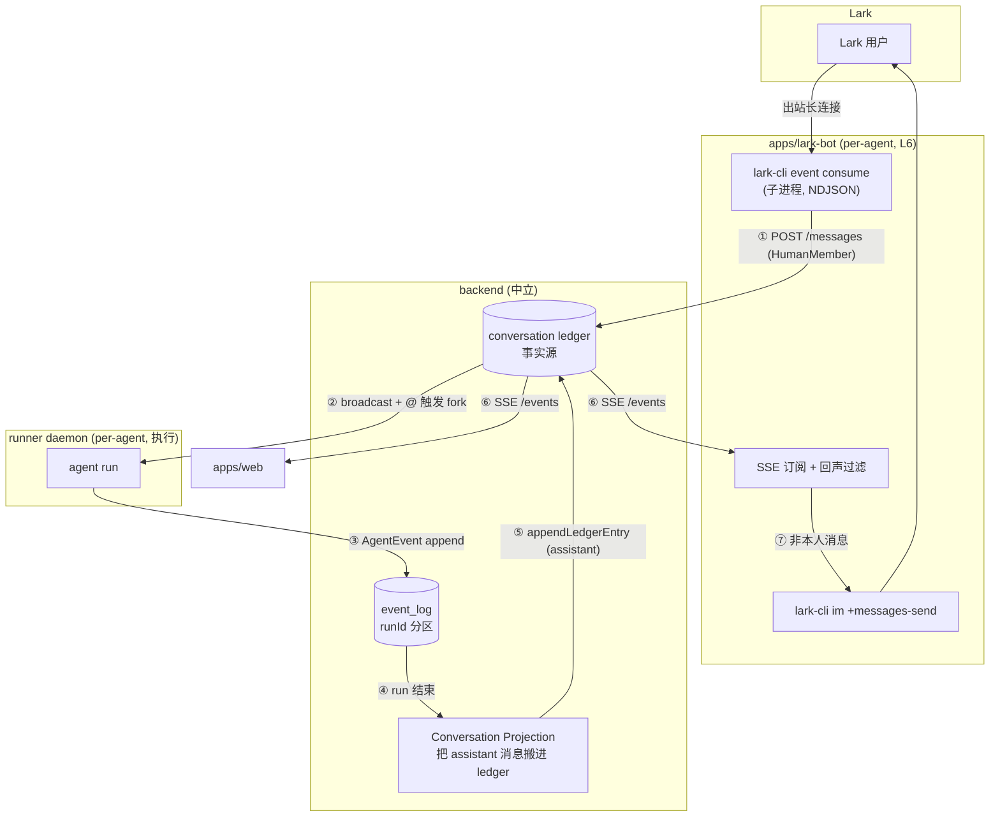
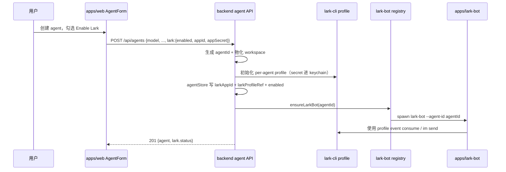
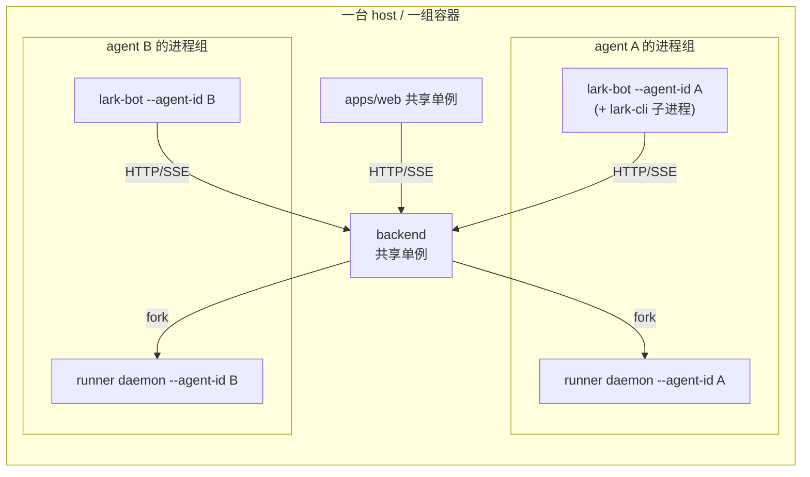

# IM Adapter — 把一个 agent 接成一个 Lark bot（per-agent L6 surface）

> 第一性问题：**一个真人在 Lark 里跟 bot 说话，消息进到系统、agent 跑、回复推回 Lark；同一段对话还要能在 web UI 上以历史消息看到。**
>
> 一句话机制：**lark-bot 是 per-agent 的 L6 surface 进程，借 [`lark-cli`](https://github.com/larksuite/cli) 当 Lark 传输层。入站消息以 HumanMember 身份 `POST` 进 backend 的 [conversation ledger](./15-conversation.md)（与 web/CLI 同一入口）；出站回复由 backend 经 event_log → Conversation Projection回 ledger，再经 SSE 同时喂给 web 和 lark-bot。两个方向都终于 ledger——这就是双向历史一致的根。**
>
> 关联：[15-conversation](./15-conversation.md)（被投影到的会话模型 + ledger/event_log 分工） · [12-backend](./12-backend.md)（消费的 HTTP/SSE 契约 + Conversation Projection） · [16-resident-runner](./16-resident-runner.md)（per-agent daemon，与本层是兄弟而非同居） · [00-vision](./00-vision.md#四当前分层架构)（L6 surface 分层）。
>
> 本轮只交付 **Lark**；用户在 **web UI 创建 / 编辑 agent 时绑定这个 agent 的 Lark bot**。模型是 surface 级的，换 IM = 换一个同形 adapter，下层零改动。

---

## 一、定位：层是 L6，份数是 per-agent（两个正交的轴）

「放哪」这个问题里藏着**两个独立的轴**，必须拆开看，否则会把它们糊成一团：

| 轴 | 问的是 | apps/web | lark-bot |
|---|---|---|---|
| **依赖方向（层）** | 在 backend **之上**消费它的 HTTP/SSE，还是在其**下**被它 fork | 之上 → L6 | **之上 → L6** |
| **多重性（归属）** | 全局**共享**一份，还是 **per-agent** 一份 | 共享 | **per-agent** |

web 是「L6 + 共享」，容易让人误以为 L6 就等于「中心化的一份」。lark-bot 是「**L6 + per-agent**」——**层在 L6，份数 per-agent**，两件事不矛盾。

### 为什么是 L6（依赖方向向上）

lark-bot 实际只做三件事：① 把 Lark 收到的消息 `POST /api/conversations/:id/messages`；② 订阅 `GET /api/conversations/:id/events`（SSE）把 agent 回复发回 Lark；③ 维护 `larkChatId ↔ conversationId` 映射。它**只说 backend 的公开 HTTP/SSE**，从不碰 ledger 表 / checkpointer / event_log / runner 子进程。这正是 [L6 surface 的定义](./00-vision.md#四当前分层架构)，和 `apps/web`、`apps/cli` 完全同类。

它**必须**依赖 backend，且这恰恰证明它是 L6：你的硬需求是「Lark 消息要在 web 看到历史」，而 web 读的是 backend 那条**中立的 conversation ledger**。要让 Lark 消息出现在 web，它就必须落进 backend 的 ledger → adapter 必须 `POST` 到 backend。没有第二条路径。「依赖 backend HTTP/SSE、对外投影一个接触面」就是 surface=L6 的定义。

### 为什么是 per-agent（多重性 per-agent）

因为 **appId/appSecret 就是这个 agent 在 Lark 里的身份**，不是「连接参数」。一个 bot = 一个 Lark app = 一个 agent，这条等式里 `appId` **是** agent 对外的脸——就像 workspace / SOUL / memory 是 agent 的一部分，Lark app 凭据也是它身份的一部分。身份不可共享，所以 adapter 必然 per-agent。这不是部署便利，是内在属性。

| 候选放法 | 评价 |
|---|---|
| backend 里 | ❌ 破坏 backend「对 surface 无感、不接 IM 业务逻辑」的不变量（[12-backend "Backend 不是什么"](./12-backend.md#backend-不是什么)）。一旦认识 `chat_id`/`open_id`/encrypt key 就越界 |
| runner daemon 里 | ❌ 依赖成环（见 §七），范畴错误 |
| harness plugin | ❌ plugin 是 agent loop **内部**的横切扩展（4 个钩子），adapter 是 loop **外部**的入口（见 §八） |
| **独立的 per-agent L6 进程 `apps/lark-bot`** | ✅ 层向上、份 per-agent，与 web/cli 同形 |

---

## 二、传输层：`lark-cli` 接管全部 Lark 协议

这是整套设计的 Occam 支点。Lark 集成天然包含：OAuth/token 刷新、长连接/webhook、消息加解密（encrypt key）、事件 schema、消息发送 API、凭据存储。**这些我们一行都不写**，全部委托给 [`lark-cli`](https://github.com/larksuite/cli)——官方 Lark CLI，「为 human 和 AI agent 而建」[[larksuite/cli]](https://github.com/larksuite/cli)。

两个命令构成完整双向桥：

**入站** — `lark-cli event consume im.message.receive_v1` 以 NDJSON 把每条收到的消息打到 stdout，是一条**出站长连接**（无需监听端口）、自带 stderr ready-marker 契约、专为 AI 子进程设计[[lark-event skill]](https://github.com/larksuite/cli/blob/main/skills/lark-event/SKILL.md)。这与 backend 读 runner 子进程 stdout 的 NDJSON 模式**结构同构**——按行读子进程输出，已有的成熟套路。

**出站** — `lark-cli im +messages-send --chat-id <oc_...> --text <reply>` 一条命令发回。

> **关键约束选择：只取长连接，不要 webhook。** openclaw 的 feishu extension 支持 `websocket | webhook` 双入站模式[[openclaw/feishu]](https://github.com/openclaw/openclaw/tree/main/extensions/feishu)。我们**只取出站长连接**——webhook 需要监听端口 + 公网回调，沙箱明令禁止监听端口。`lark-cli event consume` 的出站长连接恰好绕开这条红线。少一种模式 = 少一个攻击面、少一份 secret 自管。

---

## 三、投影：Lark 概念 → 我们的 Conversation / Member

用户要求「把 Lark 原生的 conversation 投影进系统」。映射是**字段直映**，因为 [15-conversation §八](./15-conversation.md#八surfaces-这套逻辑在用户接触面的形态) 早已论证：IM 的「群 + @ + 成员」与会话模型结构同构。

| Lark 原生概念 | 我们的模型 | 说明 |
|---|---|---|
| 一个 chat（P2P DM / 群） | 一个 **Conversation** | `larkChatId → conversationId` 绑定；首见新 chat → 建 Conversation |
| 发消息的 Lark 用户（`open_id`） | **HumanMember**（`userRef = open_id`） | [15 §二](./15-conversation.md#二核心抽象) 的 HumanMember |
| 这个 bot 背后的 agent | **AgentMember** | 一个 bot = 一个 agent（§一） |
| `@bot` | `addressedTo = [agentMemberId]` | [15 §三](./15-conversation.md#三核心机制广播可见--触发执行) 的 @ 触发执行 |
| 群成员进出 | `member.joined` / `member.left` ledger 事件 | 同构注入各 thread |

**触发语义直接落到现有机制**（[15 §三 广播可见 + @ 触发](./15-conversation.md#三核心机制广播可见--触发执行)）：

- **P2P DM**：每条消息隐式点名 agent → `addressedTo=[agentMemberId]`，无需显式 @。
- **群聊**：仅 `@bot` 时 `addressedTo=[agentMemberId]` 触发起 run；未 @ 的消息只广播可见、不起 run——**不回应靠机制，不靠 prompt**。

---

## 四、数据流：入站直写 ledger，出站经 event_log 绕一圈

这是本文最核心的一节。两条 log 分工不同，方向不同，**不可混淆**：

- **conversation ledger** = 会话语义层（谁对谁说了什么、谁进谁出），是会话**事实源**；**web 的 `GET /conversations/:id/events` 只投影 ledger**[[15-conversation]](./15-conversation.md)。
- **event_log** = run 执行层（一次 agent loop 的 AgentEvent 流），按 `runId` 分区[[15-conversation]](./15-conversation.md)。



### 入站（①②）：Lark 用户 = HumanMember，`POST /messages` 直写 ledger

会话模型的第一性就是：**任何 member 发一条消息 → append ledger → 广播 →（按 @）触发**[[15-conversation]](./15-conversation.md)。真人发言的同构形式是 `ledger 消息 {sender:H, addressedTo:[X]} → 触发 X`[[15-conversation]](./15-conversation.md)，这正是 `POST /messages`（`postMessage → appendLedgerEntry → broadcast → fork`）做的事。

一个 Lark 用户在模型里就是一个 HumanMember；他在 Lark 里说话，就是「真人 member 发言」。所以 adapter 调 `POST /messages` 不是「硬造消息」，而是和 **web、CLI 走完全同一条入口**——它们仨都「主动创建消息」，这恰是 conversation 作为 **surface 中立容器**的全部意义。adapter 没有任何特殊路径，只是第三个调同一公开 API 的 surface。

**为什么入站不能借 runner 双工 / event_log**（三个硬伤）：

1. **层级倒置 + 成环**：runner 双工是 backend **向下** fork、服务**一次 run** 的执行通道[[16-resident-runner]](./16-resident-runner.md)。但入站消息**是触发 run 的输入，此刻还没有任何 run**——没有 run 就没有通道可借。用「run 的通道」运「创建 run 的消息」，逻辑成环。
2. **进错 log，需求落空**：event_log 按 `runId` 分区，真人输入**没有 runId**。即便硬塞，web 读的是 ledger 不是 event_log，消息照样不出现在历史。
3. **语义错配**：event_log 装的是 AgentEvent（执行事件）。真人说话是会话事件，不是任何 agent 的执行产物，塞进执行层就是污染。

### 出站（③④⑤⑥⑦）：agent 回复经 event_log → Conversation Projection → ledger → SSE

agent run 在 daemon 里跑，它**根本不知道 conversation 存在**——[协作语义停在 backend，绝不下沉到 runner；agent 子进程只认 checkpointer/event_log，不认识 ledger/conversation](./15-conversation.md)[[15-conversation]](./15-conversation.md)。run 只会把 AgentEvent append 进 event_log。

run 结束 → backend `onRunComplete` 触发：`completeRun` 放会话锁；**Conversation Projection** 用 `eventLog.read({runId})` 取本 run 的 assistant 消息，逐条 `appendLedgerEntry` + `broadcastMessage` 写回 ledger（backend `main.ts` Conversation Projection 路径）。于是 ledger 多出一条 `{sender:agentMemberId, kind:"message"}`，所有订阅 `/conversations/:id/events` 的 surface 同时收到——**web 渲染成历史，lark-bot `im send` 推回 Lark**。

> **为什么出站要绕 event_log 这一圈，而不是 run 直写 ledger？** 因为「runner 不认识会话」是铁律。把「执行产物 event_log」翻译成「会话消息 ledger」是 backend 的 Conversation Projection 职责，不是 run 的。入站直写 ledger、出站绕 event_log 的**不对称不是 smell**，是「runner 不认识会话」+「真人输入先于 run」两条事实的必然结果。两个方向**都终于 ledger**，所以 web 双向历史一致。

### 回声过滤：adapter 出站只发「非本 chat 真人」的消息

adapter 订 ledger SSE 会收到**所有** member 的消息，包括它自己刚 `POST` 进去的那条真人消息。推回 Lark 前必须过滤，否则用户会看到自己的话被 bot 复读：

```
for each ledger entry from GET /conversations/{cid}/events:
    if entry.kind != "message": continue            # todo/系统事件默认跳过
    if entry.senderMemberId == thisChatHumanMemberId:
        continue                                     # 来自本 chat 的真人 → 回推会回声
    # 走到这 = agent 回复 / 其他 member / 其他 surface 发来的
    lark-cli im +messages-send --chat-id {larkChatId} --text render(entry.content)
```

判据干净：**消息来源方向**。来自 Lark 的（本 chat 真人发的）不回推；来自系统内部的（agent 回复、未来的其他 agent、web 端发言）才推到 Lark。这天然支持「web 上有人发言、Lark 端也看得到」，因为那条消息 sender 不是本 chat 真人。

### 回复粒度：MVP 发最终回复，流式作为后续旋钮

Conversation Projection 是 **run 结束后**一次性把 assistant 消息写进 ledger（非流式逐 token）。所以默认形态是「agent 跑完，Lark 收到一条完整回复」：

- **MVP**：run 结束发**最终**回复。简单、闭环、无消息编辑复杂度。长任务期间 Lark 端安静，但 web 端可看 `/runs/:id/events` 的流式增量。
- **后续旋钮**：流式回显（adapter 额外订 run 级 event_log delta → `im` 发占位消息再反复 edit）。即便如此，**事实源仍是 ledger 那条最终消息**；流式只是 adapter 的视觉优化，不改变「回复以 ledger 为准」。

---

## 五、设置入口：在 web UI 创建 / 编辑 agent 时绑定 Lark bot

前面说「凭据 = agent 身份」，那设置入口也必须落在 **agent 的创建与编辑流程**，而不是藏在部署脚本里。用户心智应该是：**我创建一个 agent，同时决定它有没有一个 Lark bot 身份**。

### UI 形态

web UI 的 agent 表单增加一个 **Lark Bot** 区块：

| 字段 | 说明 | 存放位置 |
|---|---|---|
| `enableLark` | 是否给这个 agent 启用 Lark bot | agentStore 明文字段 |
| `larkAppId` | 这个 agent 对应的 Lark app id，公开身份标识 | agentStore 明文字段 |
| `larkAppSecret` | 只在创建 / 更新时输入一次，用来初始化 lark-cli profile | **不入库** |
| `larkProfileRef` | per-agent lark-cli profile 引用，例如 `agent:<agentId>` | agentStore 明文字段 |
| 连接状态 | `not_configured / configured / running / error`，展示给用户排障 | 由 backend registry / lark-bot health 汇总 |

创建 agent 时可以不启用 Lark；启用时必须提供 appId/appSecret。编辑 agent 时允许打开 / 关闭 Lark，或轮换 appSecret。关闭 Lark 只停止该 agent 的 lark-bot 进程，不删除 agent 本体、不影响 web 会话历史。

### 后端契约

`POST /api/agents` 和 `PATCH /api/agents/:id` 扩展一个可选的 `lark` 块：

```json
{
  "name": "coding assistant",
  "model": { "provider": "anthropic", "model": "claude-sonnet-4" },
  "permissionMode": "ask",
  "lark": {
    "enabled": true,
    "appId": "cli_xxx",
    "appSecret": "*** only in request ***"
  }
}
```

backend 只做三件事：

1. 生成 / 更新 agent 元数据：`lark.enabled`、`larkAppId`、`larkProfileRef`。
2. 把 `appSecret` 交给该 agent 的 lark-cli profile 初始化命令，写入 OS keychain；请求结束后不保留明文。
3. 通知 lark-bot registry：enabled=true 则 ensure running，enabled=false 则 stop。

返回体只回显非敏感字段：

```json
{
  "id": "agent_123",
  "name": "coding assistant",
  "lark": {
    "enabled": true,
    "appId": "cli_xxx",
    "profileRef": "agent:agent_123",
    "status": "configured"
  }
}
```

### 生命周期流



这个流程里，web 是**设置入口**，backend 是**元数据与进程编排面**，lark-cli 是**secret 存储面**，lark-bot 是**运行面**。四者边界清楚：web 不保存 secret，backend 不解析 Lark 消息，lark-bot 不管理 agent 生命周期。

### 校验与错误

- 创建时 `enabled=true` 但缺 appId/appSecret → 400。
- appSecret 只接受写入，不提供读取接口；编辑页只能显示「已配置 / 轮换」状态。
- 初始化 lark-cli profile 失败 → agent 可创建，但 `lark.status=error`，错误展示在 UI；用户可在编辑页重试绑定。
- appId 变更视为换 bot 身份：停止旧 lark-bot → 初始化新 profile → 启动新 lark-bot。
- agent 删除 / archive 时同步停止 lark-bot；hard delete 时可删除本地 profile / keychain namespace。

---

## 六、凭据与 per-agent 归属

顺着「凭据 = agent 身份」这条线，appId/appSecret 这样管：

1. **元数据进 agentStore**：扩展为 `agentId → { ..., larkAppId, larkProfileRef }`。`larkAppId` 是公开身份标识，明文存无妨。
2. **secret 不进我们的 DB**：`lark-cli` 本就把凭据存在 **OS keychain**[[larksuite/cli]](https://github.com/larksuite/cli)。我们不重造 secret 层，只为每个 agent 准备一份**隔离的 lark-cli profile**（per-agent 的 config dir / keychain namespace，用 `agentId` 区分），token 刷新与存储天然按 agent 隔离。
3. **进程 agent-scoped 启动**：`lark-bot --agent-id <id>`，用该 agent 的 lark-cli profile 去 `event consume` / `im send`。
4. **backend 不持久化 secret**：它持久化知道 `agentId → larkAppId`（公开）+ `larkProfileRef`。在 agent 创建/更新的请求生命周期内，backend 会**短暂接触** `appSecret`，仅用于通过 stdin 初始化 `lark-cli` profile——请求结束后不保留明文。secret 不入库、不入日志、不入错误响应、不进 trace、不以 argv 暴露。这保住了 12-backend「对 surface 语义无感」的不变量（不解析 Lark 消息、不接触 chat_id/open_id），同时承认 profile 初始化的实现事实。

> 这里说的是 **bot 自身的 app 凭据**（appId/appSecret + bot token），用来收发该 agent 作为机器人的消息；与「工具调用时以哪个用户身份鉴权」是两回事。

---

## 七、为什么不并入 per-agent 的 runner daemon

[16-resident-runner](./16-resident-runner.md) 里已有一个 **per-agent、常驻、`--agent-id` 的 daemon**[[16-resident-runner]](./16-resident-runner.md)，生命周期和 adapter 看似一模一样。诱人，但不能合：

**依赖会成环。** daemon 是 backend **向下 fork** 的（backend → daemon）[[16-resident-runner]](./16-resident-runner.md)。若 adapter 住进 daemon，它为写 ledger 就得**向上**调 backend HTTP（daemon → backend），形成 `backend ↔ daemon` 双向依赖环，打破「backend 之上是 surface、之下是 runner」的分层。

**职责相反。** daemon 的职责是**执行 run**（持有 checkpointer + 写 event_log，向内）；adapter 的职责是**当入口**（收 Lark 消息、`POST` 给 backend，向外）。一个向内一个向外，合并即职责污染。

> **结论**：per-agent 常驻 ≠ 住在 daemon 里。lark-bot 是**独立的 per-agent L6 进程**，与该 agent 的 daemon 是**兄弟**（都 per-agent），但分属 surface 层与 runner 层，各自只通过 backend 公开接口间接相关。

---

## 八、为什么不是 harness plugin

plugin 的存在性来自一个第一性事实：**有些扩展逻辑必须看到 agent 内部的执行节点，且跨多个节点**[[03-plugin]](./03-plugin.md)。plugin 只能在 4 个时机被 framework **被动**调用：`beforeModel/afterModel/beforeTool/afterTool`[[03-plugin]](./03-plugin.md)。用 [plugin 设计自检 checklist](./03-plugin.md) 逐条对：

| checklist | lark-bot |
|---|---|
| 真的需要看 agent 内部执行节点吗？ | **否**——它在 loop 外，run 没起时就要存在、收消息 |
| 逻辑能用 4 个钩子表达吗？ | **否**——「收 Lark→建 Conversation→POST→订 SSE→回推」无一对得上 before/after |
| 依赖什么？ | backend HTTP/SSE + `lark-cli` 子进程——既非 `core` 类型（framework）也非具体 model/tool（harness） |
| 失败该不该阻塞？ | plugin 失败=阻塞某轮 model 调用；adapter 失败=整个 bot 进程重启 |

更根本：plugin 是 L3 framework 的扩展点，随**单次 run** 实例化、run 结束即销毁；而一个 Lark chat 对应一条**长期 Conversation**，跨无数次 run。生命周期差一个数量级。plugin 向内（L3）、adapter 向外（L6），方向相反。

> 反方向的「**agent 主动**读 Lark 日历 / 发文档」才可能是 tool/skill（LLM 主动调用）——但那被明确划在本次范围外，由成熟的 IM skill 承担。本层是真人**把消息推进系统**，是入口不是工具。

---

## 九、部署形态

### 进程拓扑



- **backend / web**：全局**共享单例**（一份服务所有 agent / 会话）。
- **lark-bot / runner daemon**：**per-agent**，各 agent 一组。两者是兄弟进程，互不直接通信，都只经 backend。
- **要跑 N 个 bot**：起 N 个 `lark-bot` 进程，各配各的 `--agent-id` + lark-cli profile。**横向复制进程，而不是进程内多租户**——这把 openclaw 的 multi-account / agentId-routing 整段删掉。

### 生命周期与谁来拉起

lark-bot 是长活进程，崩了要能重启。两种归属，建议**后者**：

| 方案 | 评价 |
|---|---|
| 各自独立 systemd / supervisor 单元 | 可行，但 agent 增删要手动加单元，运维割裂 |
| **backend 启动时按 agentStore 里「启用了 Lark」的 agent 拉起对应 lark-bot**（类似它 fork daemon 的方式） | ✅ 与「daemon 由 registry 管理」一致[[16-resident-runner]](./16-resident-runner.md)；agent 开关 Lark = 增删一个 lark-bot，单一控制面 |

> 注意这里 backend「**拉起**」lark-bot（进程编排）与「**不认识** Lark 业务逻辑」（语义无感）不冲突：它只是 spawn 一个进程并传 `--agent-id`，从不解析 Lark 消息、不碰 appSecret。如同它 fork daemon 却不解析 checkpoint payload。

### 沙箱与 `lark-cli` 的位置

`event consume` 是**出站**长连接，**不监听端口**，满足沙箱红线。lark-bot + 它的 lark-cli 子进程可与该 agent 的 daemon 同沙箱（同 per-agent 边界），也可独立沙箱。凭据隔离靠 per-agent lark-cli profile，不依赖沙箱边界——两层防护正交。

### 失败模式

| 失败 | 影响 | 处置 |
|---|---|---|
| lark-cli `event consume` 退出 | 该 agent 入站断流 | 监 stderr 的 exit reason[[lark-event skill]](https://github.com/larksuite/cli/blob/main/skills/lark-event/SKILL.md)，重启子进程；**勿 `kill -9`**（会漏掉服务端取消订阅[[lark-event skill]](https://github.com/larksuite/cli/blob/main/skills/lark-event/SKILL.md)） |
| backend 不可达 | `POST`/SSE 失败 | adapter 退避重试；入站消息可短暂缓冲，**不自建持久队列**（rule of three 未到） |
| lark-bot 进程崩溃 | 该 agent 的 Lark 通道全断；**web / 其他 agent 不受影响**（per-agent 隔离的收益） | 由编排面（backend registry）重启 |
| SSE 重连 | 可能漏推 | 用 ledger `seq` 做 `Last-Event-ID` 续读（[15 ledger seq 续读](./15-conversation.md#五ledger-vs-threadmessages--事实源与派生态)），出站幂等性见下 |

> **出站幂等**：SSE 重连续读可能重发同一 ledger entry。adapter 记录「已推到 Lark 的最大 ledger seq」做去重水位，避免重复 `im send`。这是 per-agent 的小状态，存在 adapter 本地即可。

---

## 十、未来扩展（每个都说清楚落点，不只留口子）

| 扩展 | 怎么接（具体落点） | 触发条件 |
|---|---|---|
| **流式回复** | adapter 在订 ledger SSE 之外，**额外**订 run 级 `/runs/:id/events` 的 delta；`im` 发占位消息 + 反复 edit。事实源仍是 ledger 最终消息，流式只是视觉层 | 用户对长任务「静默期」不满时 |
| **富交互卡片** | 出站 `render()` 从纯文本升级为 Lark interactive card；卡片回调（按钮点击）作为**新的入站事件类型**走同一 `POST /messages`（点击=一种 HumanMember 发言） | 需要审批/确认类交互时 |
| **群里多 agent** | 模型已支持（[15 多成员](./15-conversation.md)）。一个 Lark 群 = 一个 Conversation，挂多个 AgentMember；每个 agent 仍是独立 lark-bot 进程，但**同一个群需要协调谁发 `im send`**——否则 N 个 bot 各推一遍。落点：群级「出站 owner」选举，或退化为每 agent 用**各自的 bot 身份**发言（Lark 端显示不同 bot） | 多方 conversation 就位后 |
| **绑定 TTL 回收** | `larkChatId→conversationId` 映射加 idle timeout + max age（参考 openclaw thread-bindings[[openclaw/feishu]](https://github.com/openclaw/openclaw/tree/main/extensions/feishu)）；过期解绑，下次消息重建 Conversation | 长期运行后 stale 绑定累积时 |
| **其它 IM（Slack 等）** | 换一个同形 adapter：`slack-cli`/SDK 当传输层，Slack channel↔Conversation、Slack user↔HumanMember。**backend / ledger / runner 零改动**——这是 surface 中立性的兑现 | 有 Slack 需求时 |
| **入站附件 / 图片** | `event consume` 给的是 message_id；adapter 用 `lark-cli` 下载媒体 → 上传到 agent workspace（[AFS](./17-agent-file-system.md) 的 `/shared/` 域）→ ledger 消息带文件引用 | 用户发非文本消息时 |
| **多 agent 共用一个 Lark app** | **不做**。一个 app=一个 bot 身份是硬约束；要多 agent 就多 app。若 Lark 侧出现「一个 app 多 bot 身份」能力，再议 | — |

---

## 十一、不变量

- **adapter 只吃 backend 公开 HTTP/SSE** — 不碰 ledger 表 / checkpointer / event_log / runner。换 IM = 换这一层，下层零改动。
- **入站直写 ledger，出站经 event_log → Conversation Projection → ledger** — 两方向都终于 ledger（事实源），web 双向历史一致由此成立；不对称是「runner 不认识会话」+「真人输入先于 run」的必然结果。
- **Lark 用户 = HumanMember，`POST /messages` 与 web/CLI 同一入口** — adapter 无特殊路径。
- **入站绝不借 runner 双工 / event_log** — 入站先于 run，无 runId、无通道、语义错配。
- **backend 对 surface 语义无感** — 不认识 Lark 任何概念（chat_id/open_id/event_id）；不在持久化层接触 appSecret（请求生命周期内短暂接触仅用于 profile 初始化，不入库/不入日志/不入错误/不进 argv）；它可 spawn lark-bot（进程编排）但不解析其业务。
- **per-agent = 因为凭据即身份** — appId/secret 是 agent 的脸，不可共享；多 bot 靠多进程横向复制。
- **lark-bot 与 runner daemon 是兄弟，不同居** — 合并会让 backend↔daemon 依赖成环。
- **Lark 协议全部委托 `lark-cli`，不监听端口** — 入站走出站长连接（沙箱红线）。

---

## 十二、与 openclaw 的取舍

openclaw 的 feishu channel plugin 是成熟参考[[openclaw/feishu]](https://github.com/openclaw/openclaw/tree/main/extensions/feishu)，但它为**通用多渠道平台**而建、且**自己实现 Lark 客户端**。取舍：

| openclaw 概念 | 取舍 | 理由 |
|---|---|---|
| channel 与 core 解耦 | ✅ 吸收 | = 我们的 L6 surface 与 backend 解耦 |
| chat→session 绑定记录 | ✅ 吸收为 `larkChatId→conversationId` 表 | 投影必须有这张映射 |
| 绑定 idle/max-age TTL | 🟡 留口子（§十） | rule of three 未到 |
| renderMode raw\|card | 🟡 MVP 取 raw | 卡片后续（§十） |
| streaming / typing | 🟡 后置（§四/§十） | 先发最终回复闭环 |
| connectionMode ws\|webhook | ❌ 只取长连接 | webhook 要监听端口（沙箱禁止） |
| 自管 secret（secretRef） | ❌ 用 lark-cli keychain | 不重造 secret 层 |
| SDK 事件 ingestion | ❌ 用 `lark-cli event consume` | NDJSON 子进程 = 已有 runner-stdio 同构模式，零 SDK |
| multi-account / agentId routing / subagent | ❌ 删 | 一 bot=一 app=一 agent，路由层整段消去 |

> 吸收其**概念分解**（channel=surface、chat↔conversation 绑定、render/stream 当旋钮），拒绝其**通用平台机器**（多账号/多 agent 路由、双连接模式、自管 secret）。因为 `lark-cli` 接管了全部 Lark 协议、且「一 agent 一 bot」消去了路由层——我们的 adapter 因此比 openclaw 的 feishu extension 薄一个数量级。
