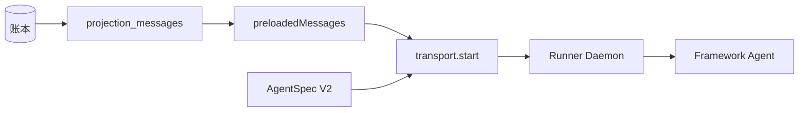

# AgentSpec

AgentSpec 是后端下发给 Runner 的序列化指令：跑哪个 Agent、在哪个 thread、什么模式、用什么模型。它是 Backend 编排与 Runner 执行之间的边界对象，刻意不携带后端数据库句柄和端的细节。现行代码只用 V2（discriminatedUnion on mode）。

## V2 模式（现行）

Runner daemon 用 `AgentSpecV2.safeParse` 解析。V2 是按 `mode` 区分的可辨识联合，共享字段 `V2Common`：

```ts
{
  schemaVersion: "2",
  agentId: string,
  runId: string,
  threadId: string,
  model: { provider: "anthropic", model: string, baseURL?: string },
  permissionMode?: "ask" | "auto" | "deny",
  maxSteps?: number,
  conversationId?: string,
  senderMemberId?: string
}
```

按模式追加：

| mode | 追加字段 |
|---|---|
| `run` | `input: string` |
| `resume` | `resumeCommand: { approved: boolean, message?: string }` |
| `reflect` | `input: string`, `parentRunId: string` |

## V2 刻意「不」包含的东西

- `preloadedMessages` —— 它走的是传输层 `start` 消息，不在 spec 里。
- workspace / AFS 物理路径。
- `apiKey`、`storage`/checkpointer 配置、系统提示词、工具列表、`isGenesis`。
- 模型配置只有 provider/model/baseURL 三项。

这条边界很重要：spec 里没有任何能让 Runner 反向触达后端库或端状态的东西，Runner 拿到的只够「执行一个 Agent」。

## V1（遗留）

`AgentSpecV1` 额外带 `workspace`、`apiKey`、`isGenesis` 和一个 `storage` 对象（eventLog/checkpointer 的 kind 与路径）。它是历史形态，现行 daemon 不解析它。`/workspace` 这个逻辑根也只在 V1 的 `workspace` 字段、README 和测试夹具里出现——运行时真实的根是 `/shared` 和 `/private`（见 [Agent 文件系统](../runner/agent-file-system.md)）。

## 生命周期



## 关联页面

- [常驻 Runner](../runner/resident-runner.md)
- [RunSupervisor](./run-supervisor.md)
- [Runner 协议](../runner/runner-protocol.md)
- [Agent 文件系统](../runner/agent-file-system.md)
