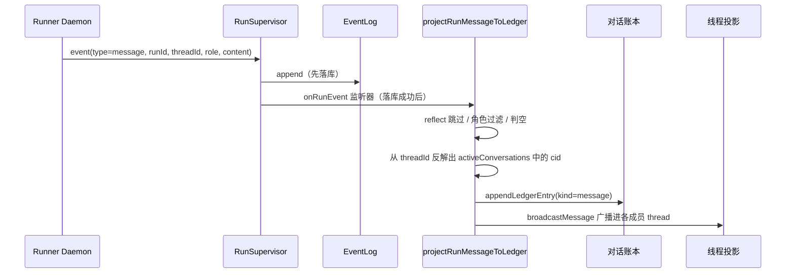

# 会话投影

会话投影是后端独占的那座桥：它把一次运行产出的 `message` 事件，转成对话账本里一条对话可见的消息。它由 `apps/backend/src/main.ts` 里的 `projectRunMessageToLedger` 实现，注册成 `RunSupervisor` 的 `onRunEvent` 监听器，按事件增量触发——也就是说，运行还没结束，中途的每条消息就已经在投影了。

## 这页解决什么问题

Agent 的产出最先诞生在一次「运行」里，而运行不等于「对话」。如果让每个消费者（Web、飞书、完成钩子）各自把产出往账本里写，结果必然是重复和各端行为不一致。会话投影把这件事收敛成一个唯一决策点：

- 哪些运行事件该变成对话消息？
- 这条消息算哪个成员发的？
- 落库的内容该长什么形状？
- 各端怎么根据它去重卡片和最终文本？
- 各 Agent 的专属 thread 怎么拿到这条新消息？

## 现在代码怎么做的

投影是**增量**的。它挂在 `RunSupervisor` 的事件路径上，对每条已落库的 `message` 事件触发一次。注册处（`main.ts`）只放行 `type==="message"` 的事件：

```ts
supervisor.onRunEvent(async (threadId, runId, event) => {
  if (event.type !== "message") return;
  const payload = event.payload as { role?: string; content?: unknown } | undefined;
  if (!payload) return;
  await projectRunMessageToLedger(threadId, runId, payload.role ?? "", payload.content);
});
```

`projectRunMessageToLedger` 的真实主体：

```ts
async function projectRunMessageToLedger(threadId, runId, role, content) {
  // reflect 运行不投影进任何对话
  if (threadId.startsWith("reflect:")) return;
  if (role !== "assistant" && role !== "user") return;
  if (typeof content === "string" && content.trim().length === 0) return;
  if (Array.isArray(content) && content.length === 0) return;

  const cid = [...activeConversations].find((c) => threadId.startsWith(`${c}:`));
  if (!cid) return;
  const senderMemberId = threadId.includes(":") ? threadId.split(":").pop()! : threadId;

  const contentWithRunId =
    role === "assistant"
      ? typeof content === "string"
        ? { text: content, runId }
        : Array.isArray(content)
          ? { blocks: content, runId }
          : (typeof content === "object" && content !== null)
            ? { ...content, runId }
            : content
      : content;                       // user 角色原样透传，不加 runId

  const ts = Date.now();
  const serialized = JSON.stringify(contentWithRunId);
  const seq = convPort.appendLedgerEntry({
    conversationId: cid, senderMemberId, addressedTo: [],
    kind: "message", content: serialized, ts,
  });
  await convSvc.broadcastMessage({ seq, conversationId: cid, senderMemberId,
    addressedTo: [], kind: "message", content: serialized, ts });
}
```

投影在 `RunSupervisor` 的 `"event"` 分支里被调用，**且一定在 `eventLog.append(...)` 成功之后**；监听器报错只会被 `catch` 记日志，不会中断运行。

与此相对，`onRunComplete` 已经**不再批量补写 assistant 消息**了。它现在只做三件收尾：放掉对话锁（`convSvc.completeRun`）、把最后一次 `todo_update` 快照写进账本（`convSvc.appendTodo`）、消费运行期间累进的 @提及集合并触发对应 Agent（`convSvc.triggerMentionedAgents`）。

@提及的收集是增量的：每次 `onRunEvent` tick 遇到 `role === "assistant"` 的消息事件，就从文本内容中提取 `@displayName` 或 `@memberId`，与当前对话的 agent 成员名册匹配，命中的 memberId 写入 `RunAccumulator.mentionedMemberIds`。`onRunComplete` 时直接消费该累加器，无需第二次 EventLog 扫描。



## 输入

| 输入 | 来源 | 含义 |
|---|---|---|
| threadId | RunSupervisor 事件上下文 | 对话运行里通常是 `conversationId:memberId` |
| runId | 同上 | 标识产出这条消息的运行 |
| role | AgentEvent message.payload | 只有 `assistant` / `user` 是投影候选 |
| content | 同上 | 字符串、内容块数组，或对象 |
| activeConversations | 后端运行时的 `Set<string>` | 用来从 threadId 反解出会话 id |

## 输出

| 输出 | 去向 | 含义 |
|---|---|---|
| 账本条目 | conversation_ledger | 持久、对话可见的消息 |
| runId 信封 | 账本 content | 让端能把最终文本关联回某次运行 |
| 线程投影更新 | checkpoint_messages | 让未来的运行 hydrate 到这条对话消息 |

## 投影算法（与代码一一对应）

1. `threadId` 以 `reflect:` 开头 → 跳过（reflect 运行与主投影物理隔离）。
2. `role` 不是 `assistant` 也不是 `user` → 跳过。注意：注册处只放行 `message` 事件，所以工具/todo 事件根本到不了这里。
3. 字符串 trim 后为空、或空数组 → 跳过。
4. 在 `activeConversations` 里找 `threadId.startsWith(cid + ":")` 得到 `cid`；找不到就返回。
5. `senderMemberId` = `threadId` 最后一个 `:` 之后的部分。
6. assistant 文本 → `{ text, runId }`；assistant 数组 → `{ blocks, runId }`；assistant 对象 → `{ ...content, runId }`；user 角色原样透传。
7. `JSON.stringify` 后以 `kind="message"`、`addressedTo: []` 追加账本条目。
8. `broadcastMessage` 广播，更新各成员的线程投影——调用时传 `{ excludeMemberId: senderMemberId }`，防止把发送者自己的 assistant 产出二次写入其 checkpoint（Runner 已通过 `rt.save()` 保存了真实消息，广播再写入会导致上下文重复和 checkpoint 锁争用）。

## 关键数据结构

### 账本内容信封

```ts
{ text: string, runId: string, _preliminary: true }          // assistant 文本（运行中）
{ blocks: ContentBlock[], runId: string, _preliminary: true } // assistant 内容块（运行中）
```

增量投影期间，所有 assistant 内容信封均加 `_preliminary: true` 标记。Web/飞书端用此标记区分「运行中途消息」与「最终消息」：`run_done` 后可替换草稿、去重等。

### 账本条目字段

```ts
{
  seq: number,                 // 自增 rowid
  conversationId: string,
  senderMemberId: string,
  addressedTo: string[],       // 投影写入时恒为 []
  kind: 'message',
  content: string,             // 上面信封的 JSON 字符串
  ts: number
}
```

## 不变量

1. 一条逻辑运行消息，最多产生一条账本消息。
2. Runner 不直接写对话账本。
3. Web/飞书不独立把运行产出当对话历史持久化。
4. 纯工具块不该变成对话可见消息。
5. reflect 运行在物理与语义上都与主投影隔离。
6. 投影失败必须可观测、可重试。

## 失败模式

### 账本重复行

同一条 EventLog 消息若被投递两次，由于账本是纯自增 INSERT、无幂等键，就会重复。需要一个稳定投影键（最好绑定 runId 与 EventLog seq）。

### 飞书最终文本重复

增量投影可能在 run 状态变成 `done`**之前**就把最终文本写进账本，而飞书的跳过逻辑要求 `done`，于是卡片最终文本和账本文本都发了一遍。详见 [飞书适配器](../surfaces/lark-adapter.md)。

### Web 草稿闪烁

Web 目前在「同一个 Agent 的账本消息到达」时清掉草稿，而不是按 runId 匹配。增量投影产生的中途同 Agent 消息，会过早清掉实时草稿。详见 [Web 端](../surfaces/web.md)。

### 飞书出现不支持的内容

纯工具块是非空数组，能绕过简单的空数组判空；一旦被投影，飞书 `render.ts` 抽不出文本块，会回退成字面量 `[Unsupported content]`。

### 发送者检查点污染

已通过 `broadcastMessage(entry, { excludeMemberId: senderMemberId })` 解决——广播时跳过发送者自身，因为 Runner 已通过 `rt.save()` 保存了同一段 assistant 产出，再写入会造成上下文重复和 checkpoint 锁争用。

## 例子：先工具、后回答

1. Agent 发出只含 `tool_use` 的 assistant 消息。
2. 投影检测到 `role === "assistant"` 且数组内无 `type: "text"` 块，直接跳过（已实现纯工具块过滤）。
3. Agent 随后发出 assistant 回答文本。
4. 投影包上 runId 写进账本。
5. Web 用账本文本替换草稿。
6. 若卡片已交付同一次运行的产出，飞书应跳过重复的最终文本。

## 当前缺口

- 加投影幂等键（当前 `hasLedgerContent(runId, serialized)` 仅做去重，非真正幂等键）。
- 在增量路径里保留 `addressedTo`（当前恒为 `[]`）。
- 把投影从同步的 `onRunEvent` 监听器挪进独立队列。
- 让 Web 草稿与飞书去重都改成「按 runId 感知」。

## 关联页面

- [事实与投影](../foundations/facts-and-projections.md)
- [EventLog](./event-log.md)
- [RunSupervisor](./run-supervisor.md)
- [对话账本](../conversation/ledger.md)
- [Web 端](../surfaces/web.md)
- [飞书适配器](../surfaces/lark-adapter.md)
- [未来工作](../roadmap/future-work.md)
