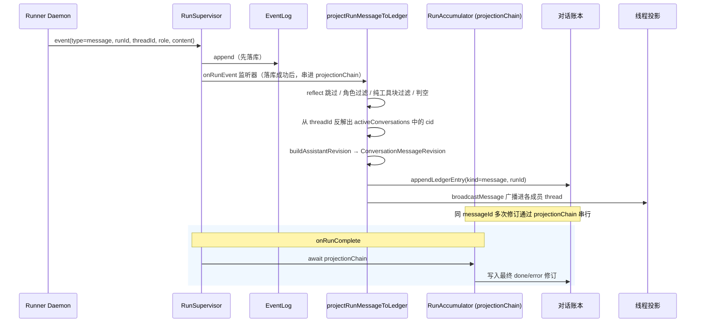

# 会话投影

会话投影是后端独占的那座桥：它把一次运行产出的 `message` 事件，转成对话账本里一条带 `messageId` 的 `ConversationMessageRevision` 修订信封（state=streaming/done/error）。同一个逻辑消息的多次修订（流式中间态→最终 done/error）共享相同的 `messageId`，消费者按 `messageId` upsert 进同一个气泡/卡片。增量投影通过 `projectionChain` 串行写入；`onRunComplete` await projectionChain 后写入最终 done/error 修订。

## 这页解决什么问题

Agent 的产出最先诞生在一次「运行」里，而运行不等于「对话」。如果让每个消费者（Web、飞书、完成钩子）各自把产出往账本里写，结果必然是重复和各端行为不一致。会话投影把这件事收敛成一个唯一决策点：

- 哪些运行事件该变成对话消息？
- 同一条逻辑消息在流式过程中会发多次修订——怎么按 `messageId` 串行写入？
- 这条消息算哪个成员发的？
- 落库的 `ConversationMessageRevision` 信封长什么形状？
- 各端怎么按 `messageId` upsert 进同一个气泡/卡片？
- 各 Agent 的专属 thread 怎么拿到这条新消息？

## 现在代码怎么做的

投影是**增量**的。它挂在 `RunSupervisor` 的事件路径上，对每条已落库的 `message` 事件触发一次。注册处（`main.ts`）只放行 `type==="message"` 的事件：

```ts
supervisor.onRunEvent((threadId, runId, event) => {
  if (event.type !== "message") return;
  const payload = event.payload as { role?: string; content?: unknown } | undefined;
  if (!payload) return;

  // 通过 projectionChain 串行：同 messageId 的修订有序
  const acc = getOrCreateAccumulator(runId, senderMemberId(threadId));
  acc.projectionChain = acc.projectionChain
    .then(() => projectRunMessageToLedger(threadId, runId, role, content))
    .catch((err) => { console.error(err); });
});
```

`projectRunMessageToLedger` 的真实主体（M17 修订信封版）：

```ts
async function projectRunMessageToLedger(threadId, runId, role, content) {
  // reflect 运行不投影进任何对话
  if (threadId.startsWith("reflect:")) return;
  if (role !== "assistant" && role !== "user") return;
  if (typeof content === "string" && content.trim().length === 0) return;
  if (Array.isArray(content) && content.length === 0) return;

  // 纯工具块过滤（已实现）
  if (role === "assistant" && Array.isArray(content)) {
    const hasText = content.some((b) => b?.type === "text");
    if (!hasText) return;
  }

  const cid = [...activeConversations].find((c) => threadId.startsWith(`${c}:`));
  if (!cid) return;
  const senderMemberId = threadId.includes(":") ? threadId.split(":").pop()! : threadId;

  // M17: Build ConversationMessageRevision 信封，替换旧 { text/blocks, runId, _preliminary: true }
  const revision =
    role === "assistant"
      ? buildAssistantRevision(runId, content, "streaming")
      : { messageId: `s-${runId}-${role}`, state: "done", role: "user", text: String(content) };

  const ts = Date.now();
  const serialized = JSON.stringify(revision);
  if (convPort.hasLedgerContent?.(runId, serialized)) return; // 去重

  // 让 onRunComplete 能拿到最新修订
  if (role === "assistant") runAccumulator.latestAssistantRevision = revision;

  const seq = convPort.appendLedgerEntry({
    conversationId: cid, senderMemberId, addressedTo: [],
    kind: "message", content: serialized, ts, runId,
  });
  await convSvc.broadcastMessage({ seq, conversationId: cid, senderMemberId,
    addressedTo: [], kind: "message", content: serialized, ts },
    { excludeMemberId: senderMemberId },
  );
}
```

投影在 `RunSupervisor` 的 `"event"` 分支里被调用，**在 `eventLog.append(...)` 成功之后**，通过 `projectionChain` Promise 链串行，保证同一 `messageId` 的 `streaming → done/error` 修订顺序正确。监听器报错只记日志，不中断运行。

`onRunComplete` 的收尾顺序：**await projectionChain** → 写入最终 done/error 修订 → 放掉对话锁（`convSvc.completeRun`）→ 把最后一次 `todo_update` 快照写进账本（`convSvc.appendTodo`）→ 消费运行期间累进的 @提及集合并触发对应 Agent（`convSvc.triggerMentionedAgents`）。

@提及的收集是增量的：每次 `onRunEvent` tick 遇到 `role === "assistant"` 的消息事件，就从文本内容中提取 `@displayName` 或 `@memberId`，与当前对话的 agent 成员名册匹配，命中的 memberId 写入 `RunAccumulator.mentionedMemberIds`。`onRunComplete` 在写入 done/error 修订后直接消费该累加器，无需第二次 EventLog 扫描。



## 输入

| 输入 | 来源 | 含义 |
|---|---|---|
| threadId | RunSupervisor 事件上下文 | 对话运行里通常是 `conversationId:memberId` |
| runId | 同上 | 标识产出这条消息的运行 |
| role | AgentEvent message.payload | 只有 `assistant` / `user` 是投影候选 |
| content | 同上 | 字符串、内容块数组，或对象 |
| activeConversations | 后端运行时的 `Set<string>` | 用来从 threadId 反解出会话 id |

## 输出

| 输出 | 去向 | 含义 |
|---|---|---|
| 账本条目 | conversation_ledger | 持久、对话可见的消息 |
| runId 信封 | 账本 content | 让端能把最终文本关联回某次运行 |
| 线程投影更新 | checkpoint_messages | 让未来的运行 hydrate 到这条对话消息 |

## 投影算法（与代码一一对应）

1. `threadId` 以 `reflect:` 开头 → 跳过（reflect 运行与主投影物理隔离）。
2. `role` 不是 `assistant` 也不是 `user` → 跳过。注意：`onRunEvent` 只对 `message` 和 `todo_update` 事件注册投影逻辑，工具/todo 事件不到投影函数。
3. 字符串 trim 后为空、或空数组 → 跳过。
4. `role === "assistant"` 且数组内容无 `type: "text"` 块 → 纯工具块，跳过。
5. 在 `activeConversations` 里找 `threadId.startsWith(cid + ":")` 得到 `cid`；找不到就返回。
6. `senderMemberId` = `threadId` 最后一个 `:` 之后的部分。
7. 构建 `ConversationMessageRevision` 信封：assistant → `{ messageId: assistantMessageId(runId), state: "streaming", role: "assistant", text/blocks, runId }`；user → `{ messageId: s-${runId}-${role}, state: "done", role: "user", text }`。
8. 去重：`convPort.hasLedgerContent?.(runId, serialized)` 已存在则跳过。
9. 更新 `RunAccumulator.latestAssistantRevision` 供 `onRunComplete` 写最终修订。
10. `JSON.stringify` 后以 `kind="message"`、`addressedTo: []`、`runId` 追加账本条目。
11. `broadcastMessage` 广播，更新各成员的线程投影——调用时传 `{ excludeMemberId: senderMemberId }`，防止把发送者自己的 assistant 产出二次写入其 checkpoint。

## 关键数据结构

### ConversationMessageRevision 信封（M17）

```ts
// assistant 流式中间态
{ messageId: string, state: "streaming", role: "assistant", text: string, runId: string }
{ messageId: string, state: "streaming", role: "assistant", blocks: ContentBlock[], runId: string }

// assistant 最终态（onRunComplete 写入）
{ messageId: string, state: "done", role: "assistant", text: string, runId: string }
{ messageId: string, state: "error", role: "assistant", text: string, runId: string, error: string }

// user 消息（一次性 done，不经历 streaming）
{ messageId: string, state: "done", role: "user", text: string }
```

同一个逻辑 assistant 消息的所有修订共享相同的 `messageId`（由 `assistantMessageId(runId)` 生成）。Web/飞书端按 `messageId` upsert：同一 `messageId` 的新修订替换旧修订，保证一个气泡/卡片里始终只有最新内容。

### projectionChain 串行

```ts
interface RunAccumulator {
  latestAssistantRevision: ConversationMessageRevision | null;
  projectionChain: Promise<void>;  // 初始为 Promise.resolve()
}
```

每次 `onRunEvent` 调用把投影串在 `projectionChain` 后：`acc.projectionChain = acc.projectionChain.then(...)`。`onRunComplete` 先 `await acc.projectionChain`，再写入最终 done/error 修订——确保终端修订一定排在所有 streaming 修订之后。

### 账本条目字段

```ts
{
  seq: number,                 // 自增 rowid
  conversationId: string,
  senderMemberId: string,
  addressedTo: string[],       // 投影写入时恒为 []
  kind: 'message',
  content: string,             // ConversationMessageRevision 的 JSON 字符串
  ts: number,
  runId: string                // M17 新增：关联到运行
}
```

## 不变量

1. 一条逻辑运行消息对应一个 `messageId`，可有多条修订（streaming → done/error），端按 `messageId` upsert。
2. Runner 不直接写对话账本。
3. Web/飞书不独立把运行产出当对话历史持久化。
4. reflect 运行在物理与语义上都与主投影隔离。
5. 投影失败必须可观测、可重试。

## 失败模式

### 投影修订乱序

同一 `messageId` 的 streaming/done/error 修订通过 `projectionChain` 串行保证顺序。若绕过 chain 直接写入（已通过代码设计杜绝），端可能看到 done 后再看到 streaming 修订，导致草稿残留。

### Web/飞书按 messageId upsert 竞态

消费者在收到 done/error 修订后若因网络延迟又收到旧的 streaming 修订（`state` 字段非终态），需忽略——端应按 messageId 保持「终态优先」语义。

### 发送者检查点污染

已通过 `broadcastMessage(entry, { excludeMemberId: senderMemberId })` 解决——广播时跳过发送者自身，因为 Runner 已通过 `rt.save()` 保存了同一段 assistant 产出，再写入会造成上下文重复和 checkpoint 锁争用。

### 账本重复行

`appendLedgerEntry` 前通过 `convPort.hasLedgerContent?.(runId, serialized)` 去重；同一 `(runId, serialized)` 对不会被写入两次。

## 例子：先工具、后回答

1. Agent 发出只含 `tool_use` 的 assistant 消息。
2. 投影检测到 `role === "assistant"` 且数组内无 `type: "text"` 块，直接跳过（纯工具块过滤已实现）。
3. Agent 随后发出 assistant 回答文本。
4. 投影构建 `ConversationMessageRevision`，通过 `projectionChain` 串行写入账本。
5. Web 按 `messageId` upsert 到气泡中。
6. `onRunComplete` await projectionChain 后写入 done/error 修订，关闭该消息。

## 当前缺口

- 在增量路径里保留 `addressedTo`（当前恒为 `[]`）。
- 把投影从 `onRunEvent` 监听器（当前已用 `projectionChain` 串行但仍在事件路径里）挪进独立持久队列，提升容错与可重试性。
- 端侧按 messageId upsert 的「终态优先」语义需加固（见失败模式）。

## 关联页面

- [事实与投影](../foundations/facts-and-projections.md)
- [EventLog](./event-log.md)
- [RunSupervisor](./run-supervisor.md)
- [对话账本](../conversation/ledger.md)
- [Web 端](../surfaces/web.md)
- [飞书适配器](../surfaces/lark-adapter.md)
- [未来工作](../roadmap/future-work.md)
