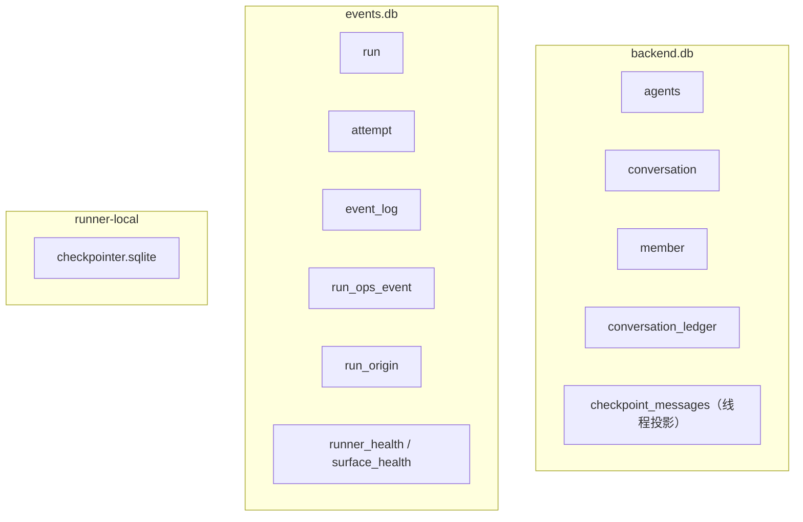
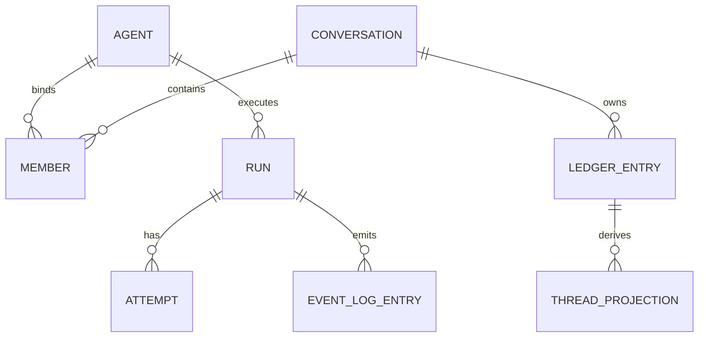

# 数据模型

持久状态分布在三处：backend.db 拥有 agents、对话、成员、账本和线程投影；events.db 拥有运行、尝试、事件日志和各类 ops/健康表；Runner 本地的 checkpointer.sqlite 拥有续跑检查点。下面给出与代码对齐的真实表结构。

## 存储分组



## conversation_ledger（账本）

```ts
LedgerRow = {
  seq: number,                 // 自增
  conversationId: string,
  senderMemberId: string,
  addressedTo: string[],       // 以 JSON 存进 addressed_to TEXT 列
  kind: LedgerKind,
  content: string,             // JSON
  ts: number,
  runId?: string               // 产出该账本条目的运行 ID
}
LedgerKind = "message" | "member.joined" | "member.left" | "todo" | "surface.control"
```

账本 seq 是对话历史的序，**不要和 EventLog seq 混**。

增量投影期间，assistant 内容信封会加 `_preliminary: true` 标记——表示该消息是运行中途写入的，最终文本会在 `run_done` 后由 Web/飞书端按 runId 替换。

## member（成员）

`MemberRow.kind` 是 `"agent" | "human"`；系统发送者用哨兵字符串 `"__system__"`。Agent 成员绑 `agent_id`，human 成员绑 `user_ref`。

## conversation（对话）

存触发模式、标题、`hop_count`（连续 Agent 跳数）。触发模式枚举在 `packages/conversation` 是 `["mention","all"]`，默认 `mention`。thread_id 由 `deriveThreadId(conversationId, memberId)` = `` `${conversationId}:${memberId}` `` 推导，不持久化。

## events.db 真实表结构

| 表 | 关键列 |
|---|---|
| `run` | `run_id PK, thread_id, status DEFAULT 'running', started_at, ended_at`；后续迁移加 `kind DEFAULT 'main'`、`parent_run_id`、`agent_id DEFAULT ''` |
| `attempt` | `attempt_id PK, run_id FK→run ON DELETE CASCADE, pid, heartbeat_at, started_at, ended_at` |
| `event_log` | `seq PK AUTOINCREMENT, thread_id, run_id, event, ts` |
| `run_ops_event` | `seq PK, run_id, attempt_id, kind, payload DEFAULT '{}', trace_id, ts` |
| `run_origin` | `run_id PK, conversation_id, source_ledger_seq, agent_member_id, surface DEFAULT 'web', trace_id, traceparent, idempotency_key, created_at`；索引：`idx_run_origin_idem`（唯一） + `idx_run_origin_trace` |
| `runner_health` | `agent_id PK, last_seen_at, uptime_ms, active_run_count, active_run_ids, checkpointer_ok, workspace_ok, last_error, updated_at` |
| `surface_health` | 复合主键 `(agent_id, surface)`, `status, last_seen_at, payload, last_error, updated_at` |

> 注意：`RunRow` 接口只暴露 `runId/threadId/status/startedAt/endedAt`，而 `agent_id`/`kind`/`parent_run_id` 是 DB 列、不在该接口里。

## checkpoint_messages（线程投影）

`checkpoint_messages(thread_id, messages, updated_at)`，`messages` 是 JSON 数组。它由账本广播推导而来，可重建。写入用 `BEGIN IMMEDIATE` 读出旧数组、拼接、`ON CONFLICT(thread_id) DO UPDATE` upsert；JSON 损坏则从头开始。

## Runner Checkpointer

Runner 本地 `checkpointer.sqlite`，存 Agent 执行恢复状态，**不属于 backend.db**。

## 实体关系



## 当前缺口

- 增量投影里 `addressedTo` 恒为 `[]`，需完整保留。
- `checkpoint_messages` 这个表名易和 Runner checkpointer 混淆。
- 缺一份自动生成的 schema 字典，代码与 Wiki 容易漂移。

## 关联页面

- [对话账本](../conversation/ledger.md)
- [EventLog](./event-log.md)
- [事实与投影](../foundations/facts-and-projections.md)
- [AgentSpec](./agent-spec.md)
