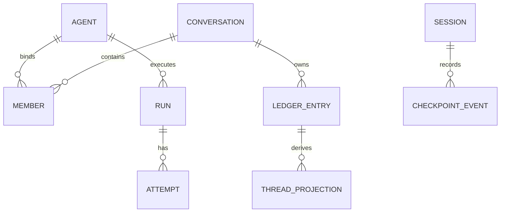

# 数据模型


## conversation_ledger（账本）

```ts
LedgerEntry = {
  seq: number,                 // 自增
  conversationId: string,
  senderMemberId: string,
  addressedTo: string[],       // 以 JSON 存进 addressed_to TEXT 列
  kind: LedgerKind,
  content: string,             // JSON
  ts: number,
  runId?: string               // 追溯消息到运行，属domain entity字段（packages/conversation zod）
}
LedgerKind = "message" | "member.joined" | "member.left" | "todo" | "surface.control"
```
`todo` 是 Agent 任务列表的 ledger 快照条目，`surface.control` 是端侧控制指令（如 Lark 的新对话请求）。详见到 [对话账本](../conversation/ledger.md)。

类型已从后端本地手抄 `LedgerRow` 收敛为 `packages/conversation` 的 canonical `LedgerEntry` zod schema（single source of truth）。`runId` 现在是 `LedgerEntry` 的可选字段——assistant 消息写入时携带，人类/系统消息不填。

账本 seq 是对话历史的序，**不要和 checkpoint_events seq 混**。

assistant 消息现在经 `appendAssistantMessage` 直写账本（不再通过增量projection bridge从外部事件流派生）。streaming 修订和 terminal 修订共享同一个 `messageId`，端按 `messageId` upsert。

## member（成员）

`MemberRow.kind` 从 `packages/conversation` 的 canonical `Member["kind"]`（`"agent" | "human"`）派生。系统发送者用哨兵字符串 `"__system__"`。

## conversation（对话）

存触发模式、标题、`hop_count`（连续 Agent 跳数）。触发模式枚举在 `packages/conversation` 是 `["mention","all"]`，默认 `mention`。thread_id 由 `deriveThreadId(conversationId, memberId)` = `` `${conversationId}:${memberId}` `` 推导，不持久化。

## ConversationLock（并发控制）

统一的会话/线程级并发闸门（`apps/backend/src/features/conversation/lock.ts`），替代了两套互不感知的 busy 体系：

- 旧：`threads: Set<string>` + `ThreadBusyError`（HTTP 直发路径）
- 旧：`activeConversations` + `pendingRuns`（@ 触发路径）
- 新：`ConversationLock.acquire(cid, n)` / `acquireThread(tid, cid)` / `releaseOne(cid)` / `releaseThread(tid, cid)`

两条入口路径（HTTP 直发、@ 触发）经同一闸门判定 busy，不再各算一套。

## events.db 真实表结构

| 表 | 关键列 |
|---|---|
| `run` | `run_id PK, thread_id, status DEFAULT 'running', started_at, ended_at`；加 `kind DEFAULT 'main'`、`parent_run_id`、`agent_id DEFAULT ''` |
| `attempt` | `attempt_id PK, run_id FK→run ON DELETE CASCADE, pid (deprecated), heartbeat_at (deprecated), started_at, ended_at` |
| `run_ops_event` | `seq PK, run_id, attempt_id, kind, payload DEFAULT '{}', trace_id, ts` |
| `run_origin` | `run_id PK, conversation_id, source_ledger_seq, agent_member_id, surface DEFAULT 'web', trace_id, traceparent, idempotency_key, created_at` |

| `surface_health` | 复合主键 `(agent_id, surface)`, `status, last_seen_at, payload, last_error, updated_at` |

> `parent_run_id` 在 reflect run 缺父时存 NULL（不再写空串 `""`），`TEXT` 列无 NOT NULL 约束。
> `run`/`attempt`/`run_origin` 等列名沿用 `run` 词，待工程按[标识符体系](../foundations/identifiers.md)收敛为 span 词汇（`run_id` → `span_id`）。
> events.db 里**已无 `event_log` 表**：执行事实流回归 checkpointer 的 `checkpoint_events`（见下「Checkpointer」与 [EventLog tombstone](./event-log.md)）。


## issue（M18.1 工作单元）

`issue(issue_id, project_id, title, status, thread_id, created_at, updated_at)`。DDL 在 `migrations.ts` 的 `backend_v23_issue`(id:5009)。status 只能经 `applyTransition` 写入（CAS 单写者），CRUD 仅有建/读/列。

## Checkpointer（checkpointer.db）

进程内全局 `checkpointer.db`（`config.dataDir/checkpointer.db`），按 sessionId（现 threadId）分区，**不属于 backend.db**。它持有 session 的完整运行档案：

| 表 | 角色 |
|---|---|
| `checkpoint_messages` | 恢复：重建上下文（按 sessionId upsert） |
| `checkpoint_interrupts` | 恢复：中断 / resume |
| `checkpoint_events` | 执行事实流 / 观测 / 审计（按 sessionId + spanId 切） |

`checkpoint_events` 承接了原 `event_log` 表的职责——执行事实流本就是 session 运行档案的一部分，runner daemon 时代才被临时剥离出去（见 [EventLog tombstone](./event-log.md)）。它由 framework run-loop 经 `appendEvent(sessionId, spanId, event)` 写入，Ops/排障经 `readEvents` 读。

## 实体关系



> RUN 在追踪词汇下即 span（root span），CHECKPOINT_EVENT 按 spanId 归集。

## 关联页面

- [标识符体系](../foundations/identifiers.md)
- [对话账本](../conversation/ledger.md)
- [EventLog（已废止）](./event-log.md)
- [事实与投影](../foundations/facts-and-projections.md)
- [后端总览](./overview.md)
