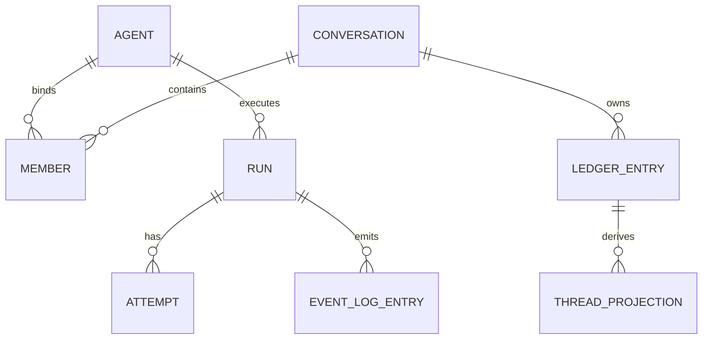

# 数据模型

持久状态分布在三处：backend.db 拥有 agents、对话、成员、账本和线程投影；events.db 拥有运行、尝试、事件日志和各类 ops/健康表；Runner 本地的 checkpointer.sqlite 拥有续跑检查点。

## conversation_ledger（账本）

```ts
LedgerEntry = {
  seq: number,                 // 自增
  conversationId: string,
  senderMemberId: string,
  addressedTo: string[],       // 以 JSON 存进 addressed_to TEXT 列
  kind: LedgerKind,
  content: string,             // JSON
  ts: number,
  runId?: string               // 追溯消息到运行，属领域本体字段（packages/conversation zod）
}
LedgerKind = "message" | "member.joined" | "member.left" | "todo" | "surface.control"
```

类型已从后端本地手抄 `LedgerRow` 收敛为 `packages/conversation` 的 canonical `LedgerEntry` zod schema（单一本体）。`runId` 现在是 `LedgerEntry` 的可选字段——assistant 消息写入时携带，人类/系统消息不填。

账本 seq 是对话历史的序，**不要和 EventLog seq 混**。

assistant 消息现在经 `appendAssistantMessage` 直写账本（不再通过增量投影桥从 EventLog 派生）。streaming 修订和 terminal 修订共享同一个 `messageId`，端按 `messageId` upsert。

## member（成员）

`MemberRow.kind` 从 `packages/conversation` 的 canonical `Member["kind"]`（`"agent" | "human"`）派生。系统发送者用哨兵字符串 `"__system__"`。

## conversation（对话）

存触发模式、标题、`hop_count`（连续 Agent 跳数）。触发模式枚举在 `packages/conversation` 是 `["mention","all"]`，默认 `mention`。thread_id 由 `deriveThreadId(conversationId, memberId)` = `` `${conversationId}:${memberId}` `` 推导，不持久化。

## ConversationLock（并发控制）

统一的会话/线程级并发闸门（`apps/backend/src/features/conversation/lock.ts`），替代了两套互不感知的 busy 体系：

- 旧：`threads: Set<string>` + `ThreadBusyError`（HTTP 直发路径）
- 旧：`activeConversations` + `pendingRuns`（@ 触发路径）
- 新：`ConversationLock.acquire(cid, n)` / `acquireThread(tid, cid)` / `releaseOne(cid)` / `releaseThread(tid, cid)`

两条入口路径（HTTP 直发、@ 触发）经同一闸门判定 busy，不再各算一套。

## events.db 真实表结构

| 表 | 关键列 |
|---|---|
| `run` | `run_id PK, thread_id, status DEFAULT 'running', started_at, ended_at`；加 `kind DEFAULT 'main'`、`parent_run_id`、`agent_id DEFAULT ''` |
| `attempt` | `attempt_id PK, run_id FK→run ON DELETE CASCADE, pid, heartbeat_at, started_at, ended_at` |
| `event_log` | `seq PK AUTOINCREMENT, thread_id, run_id, event, ts`（仅执行细节：tool_start/tool_end/text_delta，不再含对话消息内容） |
| `run_ops_event` | `seq PK, run_id, attempt_id, kind, payload DEFAULT '{}', trace_id, ts` |
| `run_origin` | `run_id PK, conversation_id, source_ledger_seq, agent_member_id, surface DEFAULT 'web', trace_id, traceparent, idempotency_key, created_at` |
| `runner_health` | `agent_id PK, last_seen_at, uptime_ms, active_run_count, active_run_ids, checkpointer_ok, workspace_ok, last_error, updated_at` |
| `surface_health` | 复合主键 `(agent_id, surface)`, `status, last_seen_at, payload, last_error, updated_at` |

> `parent_run_id` 在 reflect run 缺父时存 NULL（不再写空串 `""`），`TEXT` 列无 NOT NULL 约束。

## projection_messages（线程投影）

`projection_messages(thread_id, messages, updated_at)`，`messages` 是 JSON 数组。它由账本广播推导而来，可重建。曾用名 `checkpoint_messages`。

## issue（M18.1 工作单元）

`issue(issue_id, project_id, title, status, thread_id, created_at, updated_at)`。DDL 在 `migrations.ts` 的 `backend_v23_issue`(id:5009)。status 只能经 `applyTransition` 写入（CAS 单写者），CRUD 仅有建/读/列。

## Runner Checkpointer

Runner 本地 `checkpointer.sqlite`，存 Agent 执行恢复状态，**不属于 backend.db**。

## 实体关系



## 关联页面

- [对话账本](../conversation/ledger.md)
- [EventLog](./event-log.md)
- [事实与投影](../foundations/facts-and-projections.md)
- [AgentSpec](./agent-spec.md)
