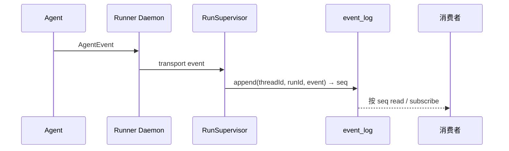

# EventLog

EventLog（packages/event-log）是单次运行历史的持久事实。后端 RunSupervisor 把 Runner 上报的事件追加进来，运行事件 SSE 从它按 seq 续读，会话投影也从它消费 message 事件。Runner 自己不直接打开这个库。

## 这页解决什么问题

一次运行产出的远不止最终文本：还有工具调用、中断、todo 更新、错误、可观测进度。这些必须挺过重连、支持排障。EventLog 就是某条 run/thread 的有序持久记录。

## 写入路径



写入由后端在收到 daemon 传输事件后完成。`EventLog` 接口同时是 `EventSink`（写）和 `EventSource`（读）。

## 条目形状

```ts
EventRecord = {
  seq: number,        // 自增 rowid
  threadId: string,
  runId: string,
  event: AgentEvent,  // 以 JSON 存储
  ts: number
}
```

表 `event_log(seq PK AUTOINCREMENT, thread_id, run_id, event, ts)`，建有 `(run_id, seq)` 与 `(thread_id, seq)` 索引。

## 读 / 订阅 API

- `append(threadId, runId, event): Promise<number>` —— 返回新 seq。
- `read({ runId?, threadId?, afterSeq?, limit? })` —— 一次性读。
- `subscribe(query, opts?, signal?)` —— 异步可迭代：先重放历史，再以 250ms 轮询追尾。

实现有 `sqliteEventLog({db})` 与 `inMemoryEventLog()`。

## 事件分类与是否进账本

| 类别 | 例子 | 进账本？ |
|---|---|---|
| 对话可见 | 最终 assistant/user 消息 | 仅经会话投影 |
| 执行细节 | tool_start/tool_end | 否 |
| 控制 | interrupted、error、todo_update | 个别经专门 UI 账本条目 |
| 仅流 | text_delta | 不进 EventLog（走 delta 通道） |

## SSE 续读用的是 EventLog seq

运行事件 SSE（`GET /api/runs/:id/events`）以 EventLog 的 `seq` 作为 SSE `id`，并接受 `?afterSeq=` 或 `Last-Event-ID`，所以断线能精确续读。**这与对话账本的 seq 是两条独立时间线，不要混用。** 运行的 delta 流（`/stream`）则是纯内存扇出、不带 seq、断线即丢。

## EventLog 与投影的关系

会话投影消费已落库的 `message` 事件。投影应把 EventLog 当作输入事实：投影失败时，运行事件仍然存在，理论上可重试——但当前重试不持久（见缺口）。

## 失败模式

- append 成功但投影失败：运行历史完整，但对话缺这条 assistant 消息，需要投影重试/修复。
- append 失败：事件不持久，Supervisor 不该假装它被投影了。
- 事件重投递：投影无幂等键时会产生账本重复行。

## 当前缺口

- 事件 schema 应独立版本化并单独成文。
- 投影重试不持久。
- 个别旧设计文档写过「Runner 直写 EventLog」；当前实现是后端 append，本 Wiki 以此为准。

## 关联页面

- [RunSupervisor](./run-supervisor.md)
- [会话投影](./conversation-projection.md)
- [事实与投影](../foundations/facts-and-projections.md)
- [Runner 协议](../runner/runner-protocol.md)
