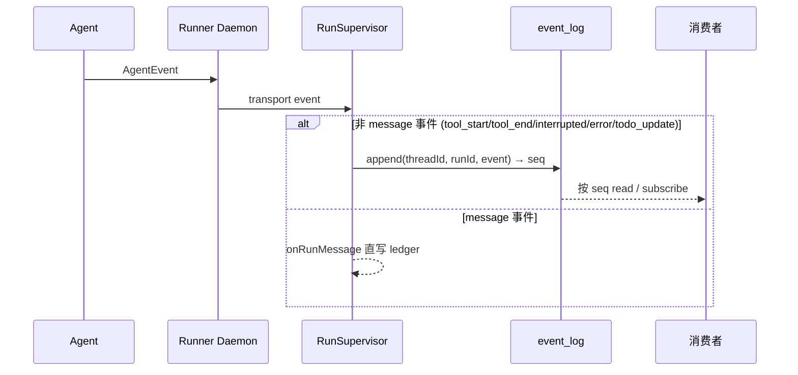

# EventLog

EventLog 只存 execution detail：tool_start、tool_end、interrupted、error、todo_update。这些是从 [Runner](../runner/resident-runner.md)（执行 Agent 的常驻进程）上报、由 [RunSupervisor](./run-supervisor.md)（后端运行生命周期管理器）写入的。

message 事件不经过这里。assistant 产出经 `onRunMessage` 直写 [ledger](../conversation/ledger.md)，不走 EventLog。text_delta 也不进——走 `onRunEvent` 做 best-effort fan-out。

## 写入路径



## 条目结构

```ts
EventRecord = {
  seq: number,        // 自增 rowid
  threadId: string,
  runId: string,
  event: AgentEvent,  // JSON 存储
  ts: number
}
```

表 `event_log(seq PK AUTOINCREMENT, thread_id, run_id, event, ts)`，索引 `(run_id, seq)` 和 `(thread_id, seq)`。

## API

- `append(threadId, runId, event): Promise<number>` — 返回新 seq
- `read({ runId?, threadId?, afterSeq?, limit? })` — 一次性读
- `subscribe(query, opts?, signal?)` — async iterable，先回放历史，再 250ms 轮询

实现：`sqliteEventLog({db})`、`inMemoryEventLog()`。

## 事件去向

| 类别 | 例子 | 去向 |
|---|---|---|
| 对话可见 | assistant/user message | `onRunMessage` 直写 ledger |
| execution detail | tool_start/tool_end | EventLog |
| 控制 | interrupted、error、todo_update | EventLog（todo 另由 onRunComplete 写 ledger 条目） |
| streaming 增量 | text_delta | 不进 EventLog（走 `onRunEvent` best-effort） |

## 失败模式

- 非 message 事件 append 失败：execution history 缺一条，run 不标完成（上抛）。
- message 直写 ledger 失败：`onRunMessage` critical path，run 标 error。和 EventLog 无关。
- 事件重投：EventLog 无幂等键，可能产生重复行。只影响排障视图，不影响对话事实。

## 关联页面

- [RunSupervisor](./run-supervisor.md)
- [会话投影](./conversation-projection.md)
- [事实与投影](../foundations/facts-and-projections.md)
- [Runner 协议](../runner/runner-protocol.md)
