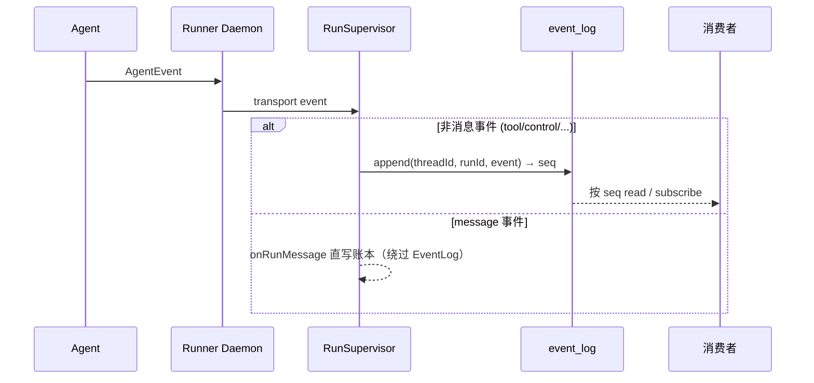

# EventLog

EventLog（packages/event-log）是单次运行内部执行细节的持久事实——它只含非消息的执行事件（tool_start/tool_end/interrupted/error/todo_update）。后端 RunSupervisor 把 Runner 上报的非消息事件追加进来，供排障/replay 用。**assistant 消息不再经它**：message 事件经 `onRunMessage` 直写对话账本，绕过 EventLog。Runner 自己不直接打开这个库。

## 这页解决什么问题

一次运行产出的远不止最终文本：还有工具调用、中断、todo 更新、错误、可观测进度。这些必须挺过重连、支持排障。EventLog 就是某条 run/thread 的有序持久记录。

## 写入路径



写入由后端在收到 daemon 传输的**非消息**事件后完成。`EventLog` 接口同时是 `EventSink`（写）和 `EventSource`（读）。

## 条目形状

```ts
EventRecord = {
  seq: number,        // 自增 rowid
  threadId: string,
  runId: string,
  event: AgentEvent,  // 以 JSON 存储
  ts: number
}
```

表 `event_log(seq PK AUTOINCREMENT, thread_id, run_id, event, ts)`，建有 `(run_id, seq)` 与 `(thread_id, seq)` 索引。

## 读 / 订阅 API

- `append(threadId, runId, event): Promise<number>` —— 返回新 seq。
- `read({ runId?, threadId?, afterSeq?, limit? })` —— 一次性读。
- `subscribe(query, opts?, signal?)` —— 异步可迭代：先重放历史，再以 250ms 轮询追尾。

实现有 `sqliteEventLog({db})` 与 `inMemoryEventLog()`。

## 事件分类与去向

| 类别 | 例子 | 去向 |
|---|---|---|
| 对话可见 | 最终 assistant/user 消息 | 经 `onRunMessage` 直写账本，**不进 EventLog** |
| 执行细节 | tool_start/tool_end | EventLog |
| 控制 | interrupted、error、todo_update | EventLog（todo 另由 onRunComplete 写专门 UI 账本条目） |
| 仅流 | text_delta | 不进 EventLog（走 delta 通道） |

## EventLog 与账本的关系

assistant 消息已不再经 EventLog——它们经 `onRunMessage` 直写账本，账本是对话消息的唯一事实来源。EventLog 只保存运行内部的非消息执行细节，供 audit / replay / troubleshooting。两类事实物理分离，互不充当对方。

## 失败模式

- 非消息事件 append 失败：运行执行历史缺一条，run 不被当成完成（异常上抛）。
- assistant 消息直写账本失败：属 `onRunMessage` critical 路径，run 标记为 error；与 EventLog 无关。
- 事件重投递：EventLog 无幂等键时会产生重复执行事件行（仅影响排障视图，不影响对话事实）。

## 当前缺口

- 事件 schema 应独立版本化并单独成文。
- 个别旧设计文档写过「Runner 直写 EventLog」或「会话投影从 EventLog 消费 message 事件」；当前实现是后端 append 非消息事件、message 事件直写账本，本 Wiki 以此为准。

## 关联页面

- [RunSupervisor](./run-supervisor.md)
- [会话投影](./conversation-projection.md)
- [事实与投影](../foundations/facts-and-projections.md)
- [Runner 协议](../runner/runner-protocol.md)
