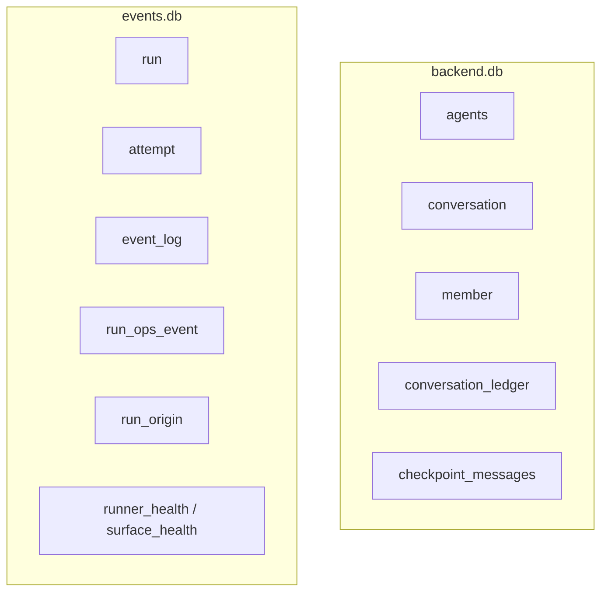

# 后端总览

后端（apps/backend）是整个系统的事实持有者：它拥有 agents、对话、成员、运行、事件、账本和投影。它对外是一组 HTTP/SSE 接口，对内由几个相互独立的 feature 模块组成，存储分成 backend.db 和 events.db 两个库。

## 模块切分

后端按 feature 目录组织（`apps/backend/src/features/`），每个 feature 自带 `service.ts`（纯逻辑端口）、`adapter-sqlite.ts`（持久化）、`http.ts`（路由）、`ports.ts`（接口定义）：

| feature | 负责 | 关键符号 |
|---|---|---|
| `conversation` | 对话、成员、账本、触发、锁、跳数 | `appendLedgerEntry`、`broadcastMessage`、`deriveThreadId` |
| `thread-projection` | 按成员把账本投影成 Agent 的 thread | `getMessages`、`appendMessages`（路由已定义但 router.ts 未派发 HTTP 请求，仅作为内部 service 使用） |
| `run` | 运行/尝试生命周期、EventLog 写入、SSE | `RunSupervisor`、`runRoutes` |
| `runtime-ops` | 运行可观测性查询 | run_ops_event / runner_health 查询层 |
| `agent` | Agent 注册与配置 | agents 表 |
| `lark-bot` | 后端侧飞书绑定与触发 | 见 [飞书适配器](../surfaces/lark-adapter.md) |

`apps/backend/src/main.ts` 是组合根：它把这些 service 接起来，并在这里注册 **assistant 消息直写**（`supervisor.onRunMessage(...)`，critical, awaited）、**best-effort 扇出/todo 累积**（`supervisor.onRunEvent(...)`）和完成钩子（`supervisor.onRunComplete(...)`），把 `maxConsecutiveAgentHops` 设为 8。

## 两个库的分工

- **backend.db**：对话域的持久事实——谁在对话里、说了什么、各成员该看到什么。
- **events.db**：运行域的持久事实——哪次运行、几次尝试、产生了哪些事件、健康如何。

这条切分线和 [事实与投影](../foundations/facts-and-projections.md) 里「对话事实 vs 运行事实」是同一条线，只是落到了物理存储上。

## 一条消息进来后，后端做的事

1. `conversation/http.ts` 收到 `POST /api/conversations/:id/messages`，把人的消息 `appendLedgerEntry` 进账本。
2. Conversation Service 按触发模式（`mention`/`all`）、`addressedTo`、锁与跳数，决定要 fork 哪些 Agent 运行。
3. 对每个目标成员，`deriveThreadId(conversationId, memberId)` 得到 thread，从对话账本按 memberId 构建 `preloadedMessages`（`buildPreloadedMessages`），交给 `RunSupervisor.startMainRun`。
4. Runner 回传事件，`RunSupervisor` 按类型分流：`message` 事件经 `onRunMessage` 直写账本（不进 EventLog），其它事件才写 EventLog。
5. `run_done` 时跑 `onRunComplete`：写终端修订、放锁、todo 快照、消费累进的 @提及（`RunAccumulator` 在 `onRunMessage` 终端修订上增量收集，不再批量扫描 EventLog）。

## 关联页面

- [RunSupervisor](./run-supervisor.md)
- [EventLog](./event-log.md)
- [会话投影](./conversation-projection.md)
- [数据模型](./data-model.md)
- [对话与成员](../conversation/conversation-and-members.md)
