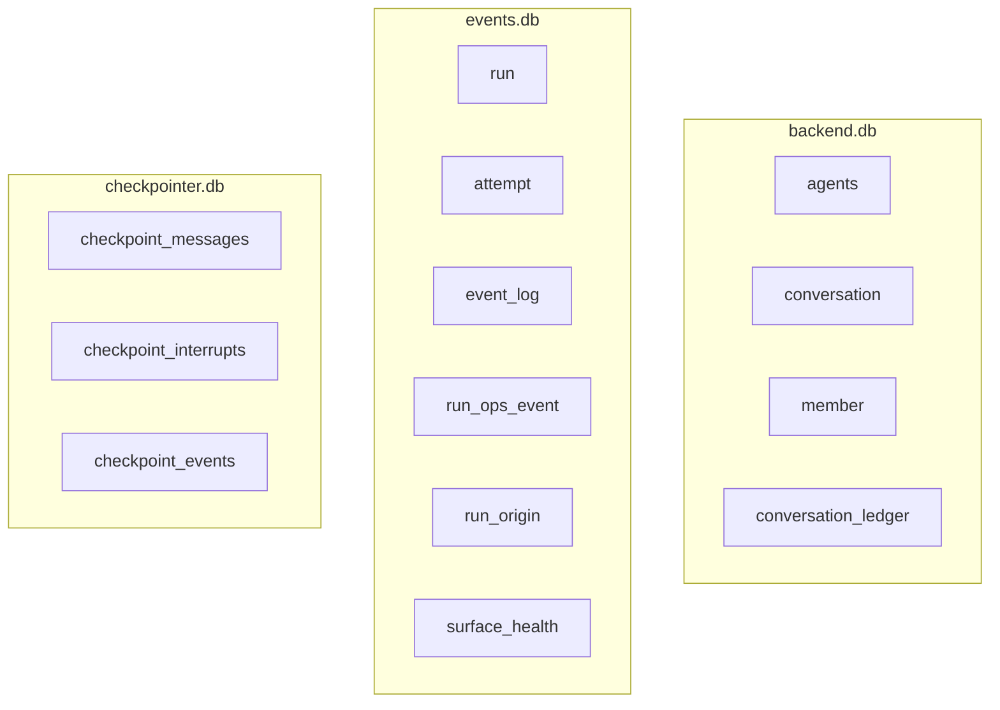

# 后端总览

后端（apps/backend）是整个系统的事实持有者：它拥有 agents、对话、成员、运行、事件、conversation ledger。它对外是一组 HTTP/SSE 接口，对内由几个相互独立的 feature 模块组成。

## 模块切分

后端按 feature 目录组织（`apps/backend/src/features/`），每个 feature 自带 `service.ts`、`adapter-sqlite.ts`、`http.ts`、`ports.ts`：

| feature | 负责 | 关键符号 |
|---|---|---|
| `conversation` | 对话、成员、账本、触发、锁、跳数 | `appendLedgerEntry`、`broadcastMessage`、`deriveThreadId`、`startAgentRun` |
| `run` | 运行/尝试生命周期、EventLog 写入 | `startAgentRun`、`runRoutes`、`RunLifecycleTracker` |
| `runtime-ops` | 运行可观测性查询 | ops 事件和 run origin 查询 |
| `agent` | Agent 注册与配置 | agents 表 |
| `lark-bot` | 后端侧飞书绑定与触发 | 见 [飞书适配器](../surfaces/lark-adapter.md) |

`apps/backend/src/main.ts` 是组合根：它把 service 接起来，注册 assistant 消息的回调逻辑和完成钩子，设定 `maxConsecutiveAgentHops` 为 8。

## 存储

- **backend.db**：对话域的持久事实——谁在对话里、说了什么。
- **events.db**：运行域的持久事实——哪次运行、几次尝试、产生了哪些事件。
- **checkpointer.db**：Agent 运行时恢复状态，按 threadId 分区。不属于对话事实，可从 ledger 重建。

## 一条消息的处理流程

1. `conversation/http.ts` 收到 `POST /api/conversations/:id/messages`，把人类消息 `appendLedgerEntry` 写入账本。
2. Conversation Service 按触发模式（`mention`/`all`）、`addressedTo`、锁与跳数，决定要触发哪些 Agent。
3. 对每个目标 Agent，`startAgentRun` 创建 AgentSession，注入 ConversationContextPlugin（含触发上下文和渐进加载工具）。
4. AgentSession 的 `onEvent("message")` 回调将 assistant 消息经 `appendAssistantMessage` 直写账本。非消息事件（tool_call 等）写入 EventLog。
5. `agent_end` 时回调写入 terminal revision、释放 ConversationLock。成功则 fire-and-forget 启动 reflection run。

## 关联页面

- [AgentSession](../harness/harness.md)
- [EventLog](./event-log.md)
- [会话消息流](./conversation-projection.md)
- [数据模型](./data-model.md)
- [对话与成员](../conversation/conversation-and-members.md)
- [依赖注入](../foundations/dependency-injection.md) —— 组合根与 executeAgentRun 的诊断
- [标识符体系](../foundations/identifiers.md) —— sessionId/runId 的归属与 AgentSession 生命周期
