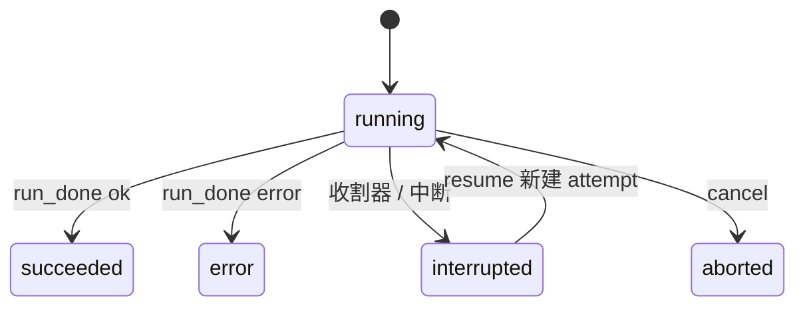

# RunSupervisor

RunSupervisor（apps/backend/src/features/run/supervisor.ts）是后端里运行与尝试生命周期的唯一拥有者。新增 `onRunMessage` 回调（critical，直写账本）、`run_finalized` 控制信号优先、reaper 与 run_done 共享 `finalizeRun` 入口。

## 内部状态

`RunSupervisor` 持有：`#active: Map<runId, RunSession>`、`#db`（events.db，WAL，busy_timeout=5000）、`#onRunComplete[]`、`#onRunEvent[]`、**`#onRunMessage[]`**（Assistant 消息直写账本的 critical 回调，与 `#onRunEvent` 物理分离）、`#reaperTimer`、`#boundTransports`、`#transportQueues`。

## 启动类方法

- `startMainRun(runId, threadId, spec, opts?: RunRequestOptions)`：INSERT `run`（status `running`）→ `#beginAttempt`。第 4 个参数 `opts` 携带 `preloadedMessages`、`surfaceContext`、`trace`，透传至 `transport.send({ type: "start" })`。
- `resumeRun(runId, threadId, spec)`：`UPDATE run SET status='running'` 后 `#beginAttempt`——**不新建 run 行，只新建 attempt**。
- `beginReflectRun(...)`：INSERT run（`kind='reflect'`、带 `parent_run_id`）→ `#beginAttempt`。
- `#beginAttempt`：`transport = await registry.transportFor(agentId)` → 绑定 transport → INSERT `attempt`（attemptId 为随机 UUID，heartbeat_at=now）→ 注册会话 → 发 ops 事件 `attempt_started` → `transport.send({type:"start", runId, spec, preloadedMessages, surfaceContext, trace})`。

## 事件处理顺序（按事件类型分流）

`"event"` 分支按事件类型分流——消息事件走 `onRunMessage`（critical，直写账本），非消息事件走 EventLog：

```ts
case "event": {
  const threadId = this.#threadIdFor(runId);
  const event = msg.event as AgentEvent;
  if (event.type === "message" && this.#onRunMessage.length > 0) {
    // 消息事件 → onRunMessage（critical, awaited）— 直写账本
    for (const fn of this.#onRunMessage) await fn(threadId, runId, event.payload, kind);
    // onRunEvent 仅用于 best-effort fan-out
    for (const fn of this.#onRunEvent) void Promise.resolve(fn(...)).catch(...);
  } else {
    // 非消息事件 → EventLog（critical, throws） + onRunEvent（best-effort）
    await this.#opts.eventLog.append(threadId, runId, event);
    for (const fn of this.#onRunEvent) void Promise.resolve(fn(...)).catch(...);
  }
}
```

## 完成处理顺序（控制信号优先）

`"run_done"` 分支先发 `run_finalized`，再 fire-and-forget 业务 listener：

```ts
case "run_done": {
  // 1. ops 记 run_done_received
  // 2. UPDATE attempt SET ended_at; UPDATE run SET status, ended_at
  // 3. #active.delete(runId)
  // 4. transport.send({ type: "run_finalized", runId })     // 控制信号优先
  // 5. ops 记 run_finalized_sent
  // 6. // 业务 listener fire-and-forget, 各自 catch, 不阻塞控制信号
  //    for (const fn of this.#onRunComplete)
  //      void Promise.resolve(fn(threadId, runId, status, kind)).catch(logError)
}
```

`run_finalized` 是 Host→Runner 消息，告诉 daemon「后端已经把终态完全持久化了」。daemon 收到后触发 reflect。

## 输入与输出

| 操作 | 输入 | 输出 |
|---|---|---|
| start | AgentSpec, threadId, agentId | run 行、attempt 行、向 Runner 发 start |
| event | Runner 传输事件 | message 事件经 `onRunMessage` 直写账本（ConversationMessageRevision → 账本 SSE）；非消息事件写 EventLog 行 |
| delta | Runner 流式 delta | 内部 SSE（`subscribeDelta`，仅供后端日志/运维消费；不再暴露 HTTP 路由给端） |
| heartbeat | Runner 心跳 | 更新 attempt 心跳时间 |
| run_done | Runner 终态消息 | 更新 run 状态、跑完成钩子、发 run_finalized |
| cancel | runId | 向 Runner 发 abort |
| resume | runId | 新 attempt，daemon resume |

## 运行 vs 尝试

**运行（run）** 是一项逻辑工作；**尝试（attempt）** 是这项工作的一次具体执行。`resume` 会为同一个 run 新建一个 attempt。run 的状态枚举（精确字符串）是：`running | succeeded | error | aborted | interrupted`。



## 心跳与收割器

收割间隔 = `config.reaperIntervalMs`（>0 时），否则取 `min(heartbeatTimeoutMs/2, 30_000)`。每个 tick 由 `#reaping` 守门，避免重入。`#reapStaleRuns` 扫描 `ended_at IS NULL` 的 attempt：`age = now - heartbeat_at`，`age < heartbeatTimeoutMs` 视为新鲜、跳过；僵死的则先写一条 `reaper_marked_interrupted` ops 事件（含 `age`、`heartbeatTimeoutMs`、`reason`），再事务性地把 run 置 `interrupted`、attempt 置 ended，并尽力 append 一条 `interrupted` 事件，再跑 `onRunComplete`（收割器里不 await）。daemon 运行没有后端 pid，所以**心跳超时是唯一的存活信号**。

## 取消的降级

`cancel(runId)`：无活动会话直接返回 `false`；否则 `abortController.abort` + 向 transport 发 `abort`。如果该会话的 transport 是 `NOOP_TRANSPORT`（后端重启重连失败时的兜底），`send` 是空操作，取消会**静默降级**——这次运行只能等收割器超时才结束。

## 重启重发现

`rediscover(eventSource)` 两阶段：阶段一把新鲜运行重新登记进 `#active`，尝试 `registry.attachExisting(agentId)`，成功用真 transport，失败回退 `NOOP_TRANSPORT`（ops 记 `reattach_failed{mode:"noop_until_reaper"}`）；阶段二对僵死运行跑 `#reapStaleRuns`。

## 失败模式

- `onRunMessage` 直写账本失败：assistant 消息不算持久，run 标记为 error（异常上抛）。
- EventLog append 失败（非消息事件）：事件不算持久，run 不被当成完成（异常上抛）。
- `onRunEvent` 监听器失败：当前只记日志继续，扇出/todo 累积可能丢失（不影响事实）。
- 完成钩子卡住：`run_finalized` 已先于业务 listener 发出，不受影响。
- 心跳僵死：收割器把运行置为 interrupted。
- `service.eventStream` 注册的 `onRunComplete(onDone)` 在 finally 里没注销，每个事件 SSE 连接都会让监听器数组增长（已知泄漏）。

## 当前缺口

- assistant 消息直写已去掉 `projectionChain`；终端修订与扇出仍在 `onRunComplete`/`onRunMessage` 监听器路径里，若要更强容错可挪进独立持久队列。
- 收割器只看心跳，做不到「步骤级」僵死检测。
- run 状态名应在后端与 Web 之间统一（Web 用 `idle/running/interrupted/done/error`）。

## 关联页面

- [Runner 协议](../runner/runner-protocol.md)
- [EventLog](./event-log.md)
- [会话投影](./conversation-projection.md)
- [常驻 Runner](../runner/resident-runner.md)
- [排障手册](../operations/troubleshooting.md)
