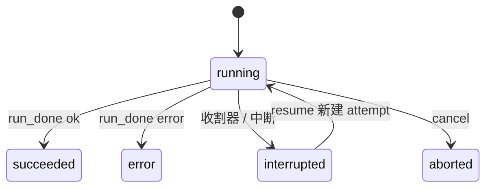

# RunSupervisor

RunSupervisor（apps/backend/src/features/run/supervisor.ts）是后端里运行与尝试生命周期的唯一拥有者。它启动/恢复/取消运行，接收 Runner 的传输消息，写 EventLog，推流，更新运行状态，跑收割器恢复，并按确定的顺序回调 onRunEvent / onRunComplete。

## 这页解决什么问题

Agent 执行是异步且易失败的。后端需要一个唯一拥有者来负责：建运行与尝试、把运行接到 Runner 会话、收心跳、落事件、处理取消/恢复、检测僵死、通知投影与完成钩子。这个拥有者就是 `RunSupervisor`。

## 内部状态

`RunSupervisor` 持有：`#active: Map<runId, RunSession>`、`#db`（events.db，WAL，busy_timeout=5000）、`#onRunComplete[]`、`#onRunEvent[]`、`#reaperTimer`、`#deltaSubs`（runId → 一组 SSE controller）、`#boundTransports`、`#transportQueues`（每个 transport 一条串行 Promise 链，保证 `run_started`/`event`/`run_done` 不会抢在建行之前）。构造时跑 `runEventsDbMigrations` 并启动收割器。

## 启动类方法

- `startMainRun(runId, threadId, spec, opts?: RunRequestOptions)`：INSERT `run`（status `running`）→ `#beginAttempt`。第 4 个参数 `opts` 携带 `preloadedMessages`、`surfaceContext`、`trace`，透传至 `transport.send({ type: "start" })`。
- `resumeRun(runId, threadId, spec)`：`UPDATE run SET status='running'` 后 `#beginAttempt`——**不新建 run 行，只新建 attempt**。
- `beginReflectRun(...)`：INSERT run（`kind='reflect'`、带 `parent_run_id`）→ `#beginAttempt`。
- `#beginAttempt`：`transport = await registry.transportFor(agentId)` → 绑定 transport → INSERT `attempt`（attemptId 为随机 UUID，heartbeat_at=now）→ 注册会话 → 发 ops 事件 `attempt_started` → `transport.send({type:"start", runId, spec, preloadedMessages, surfaceContext, trace})`。

## 事件处理顺序：先落库，后回调

`#handleRunnerMessage` 的 `"event"` 分支体现了那条贯穿全系统的顺序——**EventLog 先 append，成功后才跑 `onRunEvent`**：

```ts
case "event": {
  try {
    await this.#opts.eventLog.append(this.#threadIdFor(runId), runId, msg.event);
  } catch (err) { /* 重新抛出，阻止 run 在日志不完整时算完成 */ throw err; }
  // Fire-and-forget: 投影必须不阻塞同 transport 的心跳/delta/run_done
  if (this.#onRunEvent.length > 0) {
    const threadId = this.#threadIdFor(runId);
    for (const fn of this.#onRunEvent) {
      void Promise.resolve(fn(threadId, runId, event)).catch((err) => {
        console.error(err);
      });
    }
  }
}
```

其他分支：`"delta"` → `#pushEphemeral`（纯内存，永不进 EventLog）；`"heartbeat"` → `UPDATE attempt SET heartbeat_at=now`；`"daemon_health"` → 写 `runner_health`；`"run_started"` → 注册 daemon 自发起的 reflect 运行。

## 完成处理顺序

`"run_done"` 分支：

```ts
case "run_done": {
  // 1. ops 记 run_done_received
  // 2. UPDATE attempt SET ended_at; UPDATE run SET status, ended_at
  // 3. #closeDeltaSubs(runId)
  // 4. #active.delete(runId)
  // 5. await Promise.all(#onRunComplete.map(fn => fn(threadId, runId, status)))
  // 6. transport.send({ type: "run_finalized", runId })
  // 7. ops 记 run_finalized_sent
}
```

`run_finalized` 是 Host→Runner 消息，告诉 daemon「后端已经把终态完全持久化/投影完了」，daemon 收到后才会去触发反思。

## 输入与输出

| 操作 | 输入 | 输出 |
|---|---|---|
| start | AgentSpec, threadId, agentId | run 行、attempt 行、向 Runner 发 start |
| event | Runner 传输事件 | EventLog 行，随后可能触发投影 |
| delta | Runner 流式 delta | 临时 SSE，不持久 |
| heartbeat | Runner 心跳 | 更新 attempt 心跳时间 |
| run_done | Runner 终态消息 | 更新 run 状态、跑完成钩子、发 run_finalized |
| cancel | runId | 向 Runner 发 abort |
| resume | runId | 新 attempt，daemon 续跑 |

## 运行 vs 尝试

**运行（run）** 是一项逻辑工作；**尝试（attempt）** 是这项工作的一次具体执行。`resume` 会为同一个 run 新建一个 attempt。run 的状态枚举（精确字符串）是：`running | succeeded | error | aborted | interrupted`。



## 心跳与收割器

收割间隔 = `config.reaperIntervalMs`（>0 时），否则取 `min(heartbeatTimeoutMs/2, 30_000)`。每个 tick 由 `#reaping` 守门，避免重入。`#reapStaleRuns` 扫描 `ended_at IS NULL` 的 attempt：`age = now - heartbeat_at`，`age < heartbeatTimeoutMs` 视为新鲜、跳过；僵死的则先写一条 `reaper_marked_interrupted` ops 事件（含 `age`、`heartbeatTimeoutMs`、`reason`），再事务性地把 run 置 `interrupted`、attempt 置 ended，并尽力 append 一条 `interrupted` 事件，再跑 `onRunComplete`（收割器里不 await）。daemon 运行没有后端 pid，所以**心跳超时是唯一的存活信号**。

## 取消的降级

`cancel(runId)`：无活动会话直接返回 `false`；否则 `abortController.abort` + 向 transport 发 `abort`。如果该会话的 transport 是 `NOOP_TRANSPORT`（后端重启重连失败时的兜底），`send` 是空操作，取消会**静默降级**——这次运行只能等收割器超时才结束。

## 重启重发现

`rediscover(eventSource)` 两阶段：阶段一把新鲜运行重新登记进 `#active`，尝试 `registry.attachExisting(agentId)`，成功用真 transport，失败回退 `NOOP_TRANSPORT`（ops 记 `reattach_failed{mode:"noop_until_reaper"}`）；阶段二对僵死运行跑 `#reapStaleRuns`。

## 失败模式

- EventLog append 失败：事件不算持久，run 不被当成完成（异常上抛）。
- `onRunEvent` 监听器失败：当前只记日志继续，投影可能丢失。
- 完成钩子卡住：`run_finalized` 延迟下发。
- 心跳僵死：收割器把运行置为 interrupted。
- `service.eventStream` 注册的 `onRunComplete(onDone)` 在 finally 里没注销，每个事件 SSE 连接都会让监听器数组增长（已知泄漏）。

## 当前缺口

- `onRunEvent` 在消息路径里被 await，投影应挪进队列。
- 收割器只看心跳，做不到「步骤级」僵死检测。
- run 状态名应在后端与 Web 之间统一（Web 用 `idle/running/interrupted/done/error`）。

## 关联页面

- [Runner 协议](../runner/runner-protocol.md)
- [EventLog](./event-log.md)
- [会话投影](./conversation-projection.md)
- [常驻 Runner](../runner/resident-runner.md)
- [排障手册](../operations/troubleshooting.md)
