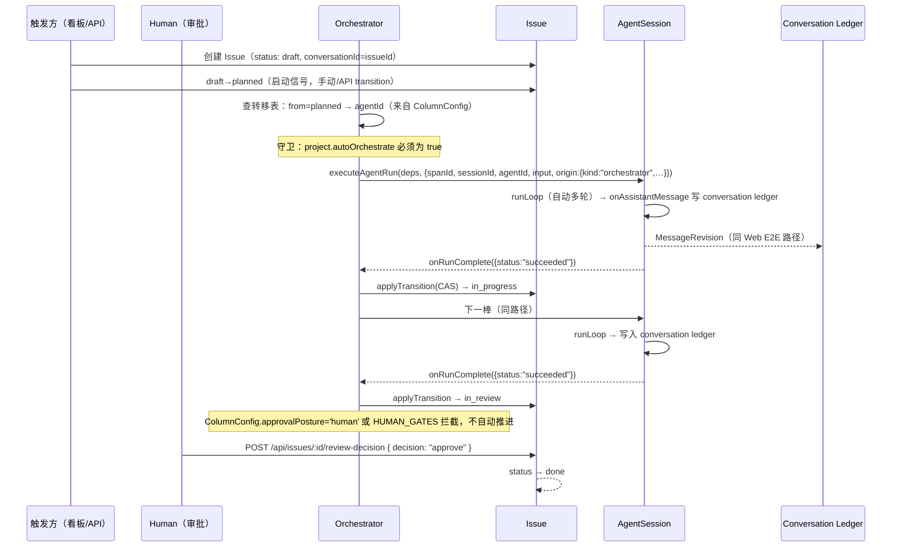

# Issue 生命周期端到端

Issue 是一次跨多次 Agent 运行的工作单元。每个状态由对应的 Agent 执行一次 AgentSession 运行，完成后的回调推进 Issue 到下一状态。agent 的输出写入 Issue 关联的 conversation ledger，前端通过 conversation 页面展示。

## 时序图

## 一步的流程

1. **查转移表**：Orchestrator 用 Issue 当前 `status` + `projectId` 查询 `ColumnConfig`，找到适配的 `agentId` 和 `promptTemplate`。
2. **起 AgentSession**：用 `renderPrompt` 将模板变量插值为实际 prompt，调用 `startAgentRun` 在 Issue 的 `threadId` 上创建 AgentSession。
3. **回填推进**：`onEvent("agent_end", { willRetry: false })` 回调触发 `applyTransition`，将 Issue 推进到 `transition.to`。若存在下一条转移且不在 `HUMAN_GATES` 中，回到第 2 步起下一棒。

## 与 @提及自动流的对照

| | @提及自动流（单次触发） | Issue 生命周期 |
|---|---|---|
| 驱动单位 | 一条消息一次往返 | 一个 Issue 跨多次运行 |
| 下一棒来源 | `onRunComplete` 扫描 assistant 文本中的 `@` | 固定转移表（ColumnConfig） |
| 推进状态 | 无显式状态 | Issue.status 显式推进 |
| 终点判定 | 无人再被 @ / 跳数触顶 | 转移表走完（done） |

## 失败模式

- **卡在某状态不推进**：run 未到 succeeded 终态（error/aborted），`agent_end` 回调不触发。
- **同一状态起两次**：`applyTransition` 用 CAS 作为防线，`issue.status !== fromStatus` 时跳过。
- **prompt 缺变量**：`renderPrompt` 对缺失的 `{{path}}` 回退为空串。

## 关联页面

- [Issue](../foundations/issue.md)
- [Orchestrator](../backend/orchestrator.md)
- [AgentSession](../harness/harness.md)
- [Web 消息端到端](./e2e-web-message.md)
