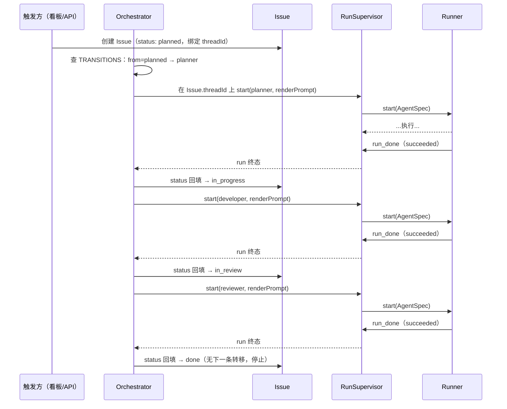

# Issue 生命周期端到端

> 本页 `status: current`：已落地，回填监听器经 `applyTransition`/`startMainRun` 实际调用。

这条流把一个 [Issue](../foundations/issue.md) 从创建到完成串成一条时间线。[Issue](../foundations/issue.md) 页讲的是「一件活有哪些状态」（静态结构），[Orchestrator](../backend/orchestrator.md) 页讲的是「转移表 + 两个纯函数」（驱动机制）；这页把两者合起来,画出**动起来的样子**：一个 Issue 如何跨多次运行被一步步推进。

## 时序图

## 一步是怎么走的

每一步状态推进都是同一个三拍循环，不随状态变化：

1. **查转移表**：Orchestrator 用 Issue 当前 `status` 去 `TRANSITIONS` 里找 `from` 匹配的那条，拿到该状态对应的 `agent`。
2. **起运行**：用纯函数 `renderPrompt` 把模板里的 `{{}}` 插值成实际 prompt，经 [RunSupervisor](../backend/run-supervisor.md) 在 **Issue 自带的 `threadId`** 上起一次运行——执行层完全复用，Orchestrator 不发明新机制。
3. **回填推进**：run 走到终态（succeeded），status 回填监听器把 Issue 写成 `transition.to`；若还有下一条转移，回到第 1 步起下一棒，否则到 `done` 停止。

整条链路里,「下一步该谁干」始终来自**显式转移表**,而不是上一个 Agent 产出文本里的 `@`。

## 与现状 @提及自动流的对照

把这页和现状的 [Web 消息端到端](./e2e-web-message.md) / [飞书消息端到端](./e2e-lark-message.md) 摆在一起就看出差别：

| | 现状：单消息 + @提及自动流 | 本设计：Issue 生命周期 |
|---|---|---|
| 驱动单位 | 一条消息一次往返 | 一个 Issue 跨多次运行 |
| 下一棒从哪来 | `onRunComplete` 扫 assistant 文本里的 `@` | 固定转移表 |
| 推进状态 | 无显式状态，只有连串运行 | Issue.status 显式推进 |
| 终点判定 | 没人再被 @ / 跳数触顶 | 转移表走完（done） |

## 失败模式

- **卡在某状态不推进**：run 没到 succeeded 终态（error/aborted），status 回填监听器不触发——查这次 run 而非 Issue。
- **同一状态被起两次**：run 终态被重复消费,或 status 回填不是单一写者。回填监听器须保证「一次终态推进一格」。
- **prompt 缺变量**：`renderPrompt` 对缺失的 `{{var}}` 回退为空串（见 [Orchestrator](../backend/orchestrator.md)），表现为 Agent 收到空白占位——查模板与变量字典,不是查执行层。

## 关联页面

- [Issue](../foundations/issue.md)
- [Orchestrator](../backend/orchestrator.md)
- [RunSupervisor](../backend/run-supervisor.md)
- [Web 消息端到端](./e2e-web-message.md)
- [飞书消息端到端](./e2e-lark-message.md)
