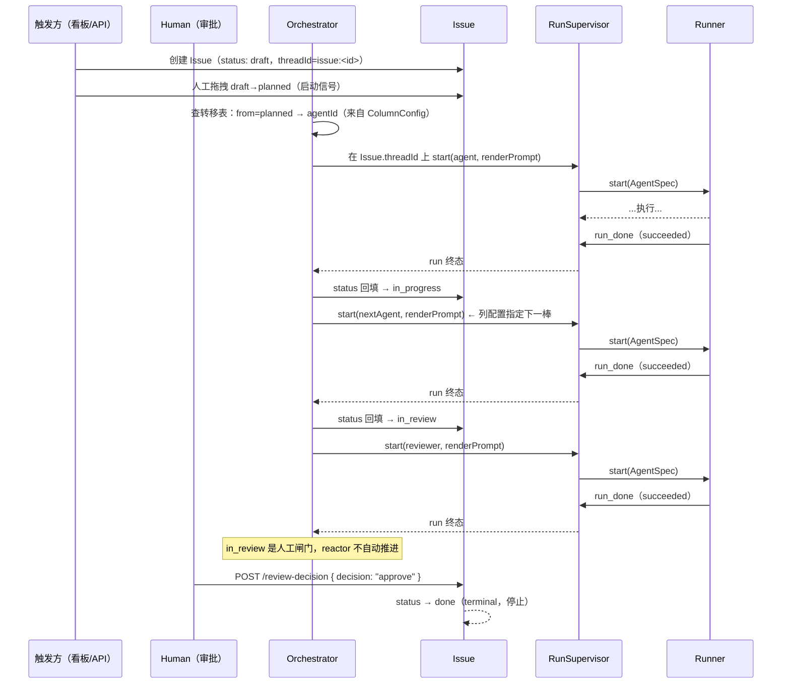

# Issue 生命周期端到端

> 本页 `status: current`：已落地，回填监听器经 `applyTransition`/`startMainRun` 实际调用。

这条流把一个 [Issue](../foundations/issue.md) 从创建到完成串成一条时间线。[Issue](../foundations/issue.md) 页讲的是「一件活有哪些状态」（静态结构），[Orchestrator](../backend/orchestrator.md) 页讲的是「转移表 + 两个纯函数」（驱动机制）；这页把两者合起来,画出**动起来的样子**：一个 Issue 如何跨多次运行被一步步推进。

## 时序图

## 一步是怎么走的

每一步状态推进的循环（auto-push）：

1. **查转移表**：Orchestrator 用 Issue 当前 `status` + `projectId` 经 `columnConfigSvc.transitionsForProject()` 查列配置，找到 `from` 匹配的转移定义（含 `agentId` + `promptTemplate`）。
2. **起运行**：用 `renderPrompt` 把模板里的 `{{var}}` / `{{path.to.var}}` 插值成实际 prompt，经 [RunSupervisor](../backend/run-supervisor.md) 在 **Issue 自带的 `threadId`**（`issue:<issueId>`）上起一次运行。
3. **回填推进**：run 走到终态（succeeded），回填监听器通过 `applyTransition` 把 Issue 推进到 `transition.to`；若存在下一条转移且当前状态**不在 HUMAN_GATES** 中，回到第 1 步起下一棒。`in_review` 是唯一的 `HUMAN_GATES`——到此停止，等待 `POST /api/issues/:id/review-decision` 人工裁决（approve→done / reject→in_progress）。

整条链路里，「下一步该谁干」始终来自**显式转移表**，而不是上一个 Agent 产出文本里的 `@`。转移表已从 M18.2 的硬编码常量升级为 per-project 的 `ColumnConfig`（M18.4），agentId 指向真实 Agent ULID。

## 与现状 @提及自动流的对照

把这页和现状的 [Web 消息端到端](./e2e-web-message.md) / [飞书消息端到端](./e2e-lark-message.md) 摆在一起就看出差别：

| | 现状：单消息 + @提及自动流 | 本设计：Issue 生命周期 |
|---|---|---|
| 驱动单位 | 一条消息一次往返 | 一个 Issue 跨多次运行 |
| 下一棒从哪来 | `onRunComplete` 扫 assistant 文本里的 `@` | 固定转移表 |
| 推进状态 | 无显式状态，只有连串运行 | Issue.status 显式推进 |
| 终点判定 | 没人再被 @ / 跳数触顶 | 转移表走完（done） |

## 失败模式

- **卡在某状态不推进**：run 没到 succeeded 终态（error/aborted），status 回填监听器不触发——查这次 run 而非 Issue。
- **同一状态被起两次**：run 终态被重复消费。回填监听器用 `run_origin.from_status` 做幂等守卫（`issue.status !== fromStatus` → 跳过），配合 `applyTransition` 的 CAS 做最后防线。
- **prompt 缺变量**：`renderPrompt` 对缺失的 `{{path}}` 回退为空串，嵌套路径逐段 reduce 到 `undefined` 时返回 `""`。

## 关联页面

- [Issue](../foundations/issue.md)
- [Orchestrator](../backend/orchestrator.md)
- [RunSupervisor](../backend/run-supervisor.md)
- [Web 消息端到端](./e2e-web-message.md)
- [飞书消息端到端](./e2e-lark-message.md)
