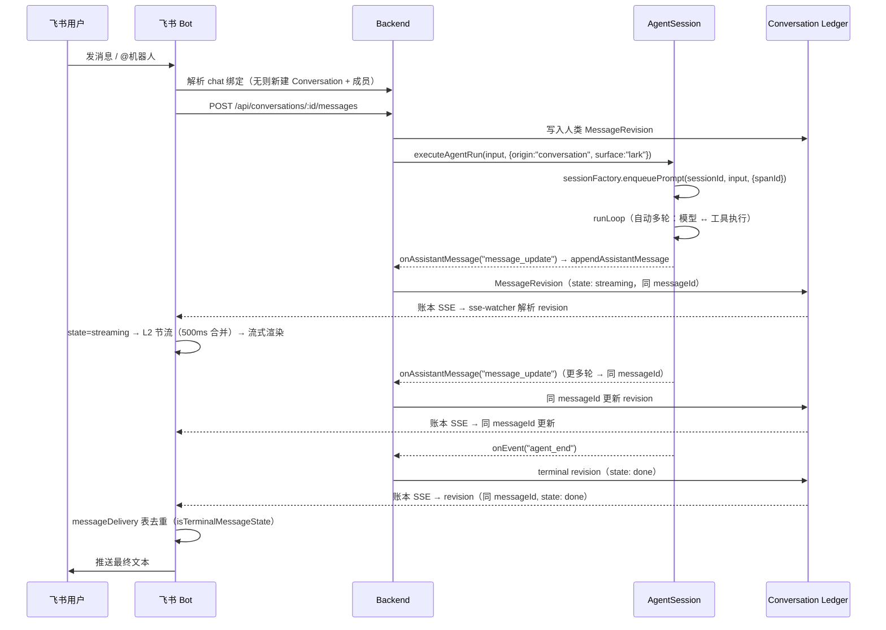

# 飞书消息端到端

飞书用户发消息后，lark-bot 作为中继：解析飞书 chat 绑定，将消息 POST 到 Backend 的 conversation API，Backend 通过 AgentSession 执行 Agent，assistant 消息写入 conversation ledger。lark-bot 的 sse-watcher 监听账本 SSE，解析 MessageRevision，去重后推送到飞书。

## 时序图

## 绑定模型

飞书适配器维护四组映射：飞书 chat → conversationId；飞书 user → human member；Bot/Agent 身份 → agent member；飞书消息 ID → 投递状态。

## 流式输出

sse-watcher 是飞书端唯一出站流入口。它监听 conversation SSE，解析 MessageRevision。`state: "streaming"` 的 revision 驱动实时流式渲染，`state: "done"` 的 revision 触发最终文本推送。

## 去重模型

同一个 `messageId` 的多次 revision（streaming → done）通过 **`messageDelivery` SQLite 表**去重。`processEntry` 先查 `getMessageDelivery(conversationId, messageId, larkChatId)`：若已投递终端态（`isTerminalMessageState`），跳过。未投递则 `upsertMessageDelivery` 记录投递意图后再发送——即使发送失败，重连后也不会重复推送。

非终端帧（streaming）经 **L2 节流**（500ms 合并，同 messageId 覆盖），终端帧立即发送 + 最多 3 次指数退避重试。

## surface.control — 对话重置

Agent 可调用 `start_new_conversation` 工具请求开启新对话。Backend 创建新的 Conversation，在旧 conversation 的 ledger 中写入 `surface.control` entry。sse-watcher 检测到此 entry，将飞书 chat 重新绑定到新 conversation。

## 出问题先看哪层

| 症状 | 可能成因 | 接着读 |
|---|---|---|
| 最终答案重复 | terminal revision 重放 / 去重未命中 | [飞书适配器](../surfaces/lark-adapter.md) |
| 流式输出不更新 | conversation SSE 断连 | [会话消息流](../backend/conversation-projection.md) |
| Agent 没触发 | 绑定/成员/提及问题 | [对话与成员](../conversation/conversation-and-members.md) |

## 关联页面

- [飞书适配器](../surfaces/lark-adapter.md)
- [会话消息流](../backend/conversation-projection.md)
- [对话与成员](../conversation/conversation-and-members.md)
- [排障手册](../operations/troubleshooting.md)
