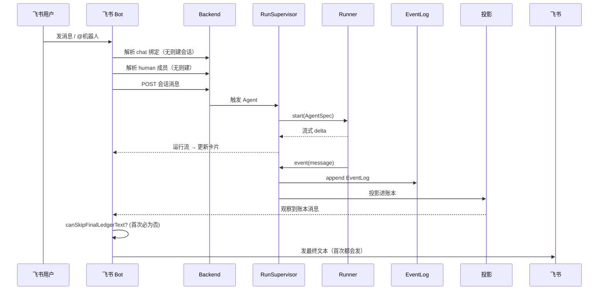

# 飞书消息端到端

这条流追踪一条飞书消息：从会话绑定、成员映射、账本追加、Agent 运行、流式卡片渲染、投影，到最终文本去重。它解释了为什么飞书用户有时会收到两遍同一个答案。

## 时序图

## 绑定模型

飞书适配器要维护四组映射：飞书 chat → 对话；飞书 user → human 成员；Bot/Agent 身份 → agent 成员；飞书卡片/消息 ID → 投递状态。

## 去重模型与为什么会重

一个最终答案能从「流式卡片」和「账本最终文本」两条路出现。去重需要：账本 content 里的 runId 信封、卡片已交付最终内容的记录、可靠的运行终态、以及「账本消息就是最终可读答案」这个认知。

但当前 `completeFromLedger` 只在最终文本成功发出**一次之后**才置 1，所以首次必然发一遍——拿到卡片的用户至少会再收到一次纯文本。详见 [飞书适配器](../surfaces/lark-adapter.md)。

## 出问题先看哪层

| 症状 | 可能成因 | 接着读 |
|---|---|---|
| 最终答案重复 | 投影早于 done / 跳过条件没满足 | [飞书适配器](../surfaces/lark-adapter.md) |
| 不支持的内容 | 纯工具块被投影 | [会话投影](../backend/conversation-projection.md) |
| Agent 没触发 | 绑定/成员/提及问题 | [对话与成员](../conversation/conversation-and-members.md) |
| 消息进错线程 | chat 绑定错 | [数据模型](../backend/data-model.md) |

## 关联页面

- [飞书适配器](../surfaces/lark-adapter.md)
- [会话投影](../backend/conversation-projection.md)
- [对话与成员](../conversation/conversation-and-members.md)
- [排障手册](../operations/troubleshooting.md)
