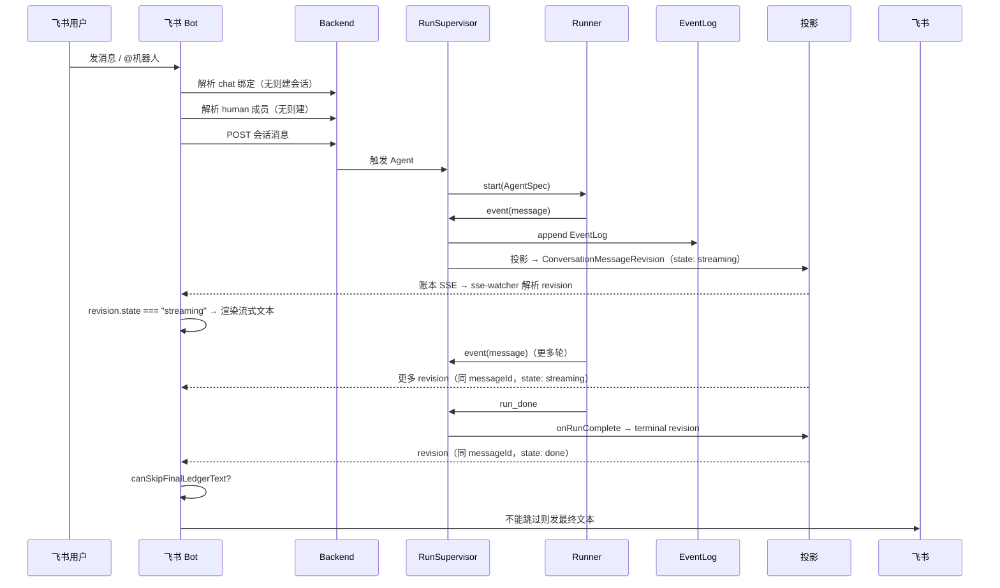

# 飞书消息端到端

这条流追踪一条飞书消息：从会话绑定、成员映射、账本追加、Agent 运行、sse-watcher 解析 ConversationMessageRevision，到最终文本去重。不再有 run-delta-watcher 和流式卡片——sse-watcher 是唯一出站流入口。

## 时序图

## 绑定模型

飞书适配器要维护四组映射：飞书 chat → 对话；飞书 user → human 成员；Bot/Agent 身份 → agent 成员；飞书卡片/消息 ID → 投递状态。

## 流式输出路径

飞书不再使用 `run-delta-watcher` 监听运行流。`sse-watcher` 是唯一出站流入口：它监听账本 SSE，通过 `parseRevision` 解析 `ConversationMessageRevision` 信封。

`state === "streaming"` 的 revision 表示 run 仍在进行——sse-watcher 可将文本实时投递为流式消息。`state === "done"` 的 terminal revision 表示 run 已完成——这是最终答案投递时机。

不再有 `_preliminary` 标记：revision 的 `state` 字段本身就表达消息生命周期阶段（streaming / done / error / waiting），取代了旧的 `_preliminary: true` 压制机制。

## 去重模型与为什么会重

一个最终答案可能从「流式渐进渲染」和「terminal revision 最终文本」两条路可见。去重依赖：revision 的 `messageId`（同 run 的 revision 共享同一 messageId）、runId 匹配、以及 `canSkipFinalLedgerText` 的 `completeFromLedger` 标志。

`sse-watcher` 对 `state === "streaming"` 的 revision 仅做渐进渲染更新，不单独发最终文本。terminal revision（`state === "done"`）到达时查 `canSkipFinalLedgerText`——首次到达时 `completeFromLedger` 必为 0，跳不掉，所以至少发一次最终文本。后续重连重放时 `completeFromLedger === 1` 才跳过。详见 [飞书适配器](../surfaces/lark-adapter.md)。

## 出问题先看哪层

| 症状 | 可能成因 | 接着读 |
|---|---|---|
| 最终答案重复 | terminal revision 重放 / canSkipFinalLedgerText 没命中 | [飞书适配器](../surfaces/lark-adapter.md) |
| 不支持的内容 | 纯工具块被投影 | [会话投影](../backend/conversation-projection.md) |
| Agent 没触发 | 绑定/成员/提及问题 | [对话与成员](../conversation/conversation-and-members.md) |
| 消息进错线程 | chat 绑定错 | [数据模型](../backend/data-model.md) |

## 关联页面

- [飞书适配器](../surfaces/lark-adapter.md)
- [会话投影](../backend/conversation-projection.md)
- [对话与成员](../conversation/conversation-and-members.md)
- [排障手册](../operations/troubleshooting.md)
