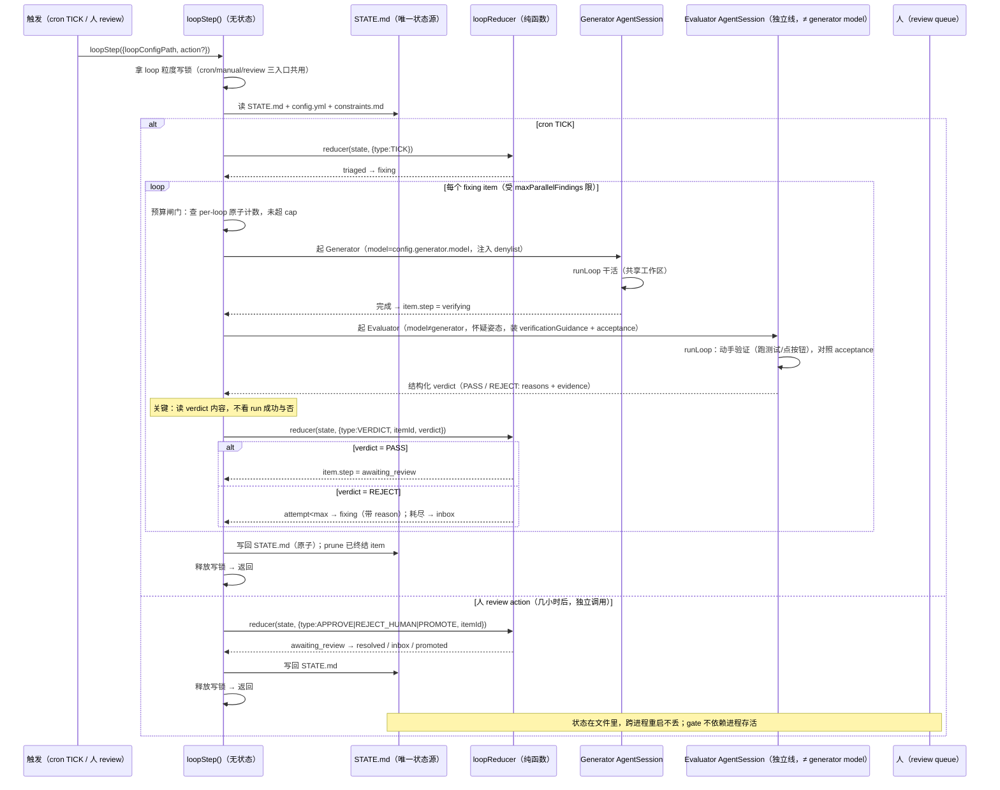

# Loop 验证端到端

这页画一次触发里 [loopStep()](../backend/loop-runner.md) 读 [STATE.md](../foundations/loop.md)、对 `fixing` item 起 Generator 干活、再起**独立 Evaluator** 动手验证「产出是否满足 config 的 `acceptance`」、evaluator 的结构化 verdict 经 `loopReducer` 转移 `item.step` 的完整时序。它是 [Loop Engineering](../foundations/loop-engineering.md) 验证动作的运行时视角。先读 [Loop Engineering](../foundations/loop-engineering.md) 拿到内层/外层 loop、五动作、maker-checker 的定义，再读 [Loop](../foundations/loop.md) 拿 item step 状态机，本页只讲它们在一次 `loopStep()` 调用里怎么串起来。

> `status: design`：尚未进代码。

## 时序图

## 一步的流程

1. **拿锁 + 读状态**：`loopStep()` 先拿 loop 粒度写锁（三条入口共用），读 STATE.md + config.yml + constraints.md。
2. **cron TICK → 起 Generator**：`loopReducer` 把 `triaged` 推到 `fixing`；对每个 `fixing` item，先过预算闸门（查 per-loop 原子计数），再起 Generator AgentSession 干活。generator 完成 → `item.step = verifying`。
3. **独立 Evaluator**：在**另一条 AgentSession**（≠ generator model、不 fork 生成者上下文）上起怀疑姿态 Agent，装配 `verificationGuidance()` + config 的 `acceptance`，靠动手（跑测试、点按钮）验证。
4. **verdict 转移 step**：Evaluator 产出结构化 verdict。loopStep **不看 run 成功与否**，读 verdict 内容喂 `loopReducer`：
   - `PASS` → `item.step = awaiting_review`，等人拍板。
   - `REJECT` 且 `attempt < maxRetries` → 回 `fixing`（reason 作返工反馈）；attempt 耗尽 → `inbox`。
5. **写回 + prune**：写回 STATE.md，prune 已终结（resolved/inbox/promoted）item，释放锁返回。
6. **人 review（独立调用）**：几小时后人在 review queue 拍板，`loopStep({action})` 独立调用一次，`loopReducer` 把 `awaiting_review` 转成 `resolved`/`inbox`/`promoted`。因为状态全在 STATE.md，中间进程重启不影响。

## 为什么读 verdict 而不是读 run 终态

这是整条流的关键判断。对 evaluator 这一步，run succeeded 只意味着**验证者这个进程跑完了**，不意味着**产出满足了 acceptance**——验证者完全可以跑完并判定「没达标」。

所以 step 的推进从「run 终态」换成「verdict 内容」：run 是执行事实，verdict 是对照 `acceptance` 的业务裁决。这守住[设计哲学](../design-philosophy.md)「terminal state 在业务本体上表达，不靠旁路事件推断」——「这件 item 达标没有」落在 verdict + acceptance 上，不靠 run 状态硬猜。这也是点头回路的治本处：checker 终于有了显式对照的靶子（config.yml 的 `acceptance` 字段，见 [Loop Engineering](../foundations/loop-engineering.md)「Goal 是过渡态」）。

这一判断有内层视角的独立佐证：Claude Code 的一次 agent run 结束时，`ResultMessage.subtype` / `stop_reason` 只描述**内层循环为何停**（自认干完 / 撞 maxSteps / 被中断），并不承诺**任务达标**——正对应本设计「run succeeded ≠ item 达标」。内层的「停」和外层的「达标」是两码事，把它们混成一个信号就是点头回路的技术根因。

### Evaluator 为什么是独立 AgentSession，而不是 Stop 钩子或 subagent

- **不能放进 Stop 钩子**：Stop 钩子与生成者同进程、同上下文，等于让写代码的人自己判自己的活——违反 maker-checker。验证必须换一条独立线。
- **比 subagent 更隔离**：Claude Code 的 subagent 仍活在父 run 的生命周期里、结果以 `tool_result` 回灌父上下文；本设计的 Evaluator 是一条**平级的独立 AgentSession**（不同 sessionId `loop:<loopId>:eval:<itemId>:<attempt>`、可绑不同更小模型），不 fork 生成者上下文，结果落成结构化 verdict 供 loopReducer 转移 step。两者都避免自评，但本设计隔离更彻底——评审者看不到生成者的思维链，只对照产出与 `acceptance`。

## 返工回路怎么闭合

`REJECT` 把 item 送回 `fixing`，同时把 verdict 的 `reason` 作为返工反馈带上；下一轮 generator 的 prompt 注入这条反馈，据此改。整条 REJECT 路径与人工驳回（`REJECT_HUMAN`）复用**同一套 loopReducer 转移**，不为验证单开一条通道。attempt 耗尽则进 `inbox` 挂起，等人处理——不静默死循环。

## 失败模式（带严重度）

按「撞上会有多糟」排：S1 = 静默烧钱 / 静默错交 / 数据丢失，S2 = 回路卡死或退化，S3 = 局部瑕疵。前两行是四轮 grilling 直接落下来的结论。

| 严重度 | 失败模式 | 触发场景 | 缓解 |
|---|---|---|---|
| **S1** | **STATE.md 并发写丢更新（grill Round 1）** | cron 正跑时人点 Run Now 或提交 review，两路各读旧 STATE.md、各写回，后写覆盖先写 | **loop 粒度写锁**串行化 cron/manual/review 三入口——**不能只靠 [CronJob 单飞锁](../foundations/cron-job.md)，它只在自然 cron 触发时拿 `inFlight` 锁，手动/review 不经过 `CronScheduler.fire()`** |
| **S1** | **预算 cap 被冲穿（无声烧钱）** | 「读已用 token → 加本轮 → 比 cap」是非原子 read-modify-write，落 STATE.md 必然竞态，cron 与手动并发各放行一轮 | token 计数**不落 STATE.md**，走带锁/CAS 的 per-loop 原子计数器；超 cap 熔断 |
| **S1** | **Verifier Theater（假验证）** | evaluator 光读不动手，或产出空 `evidence` 就判 PASS | `verificationGuidance()` 怀疑姿态 + `evidence` 字段强制交出「跑了什么」；evidence 空一律视为未验证，不许 PASS |
| **S1** | **非代码类无靶子（grill Round 4）** | changelog / 依赖升级这类 item，acceptance 写不出「可跑的测试」，evaluator 退化回点头 | config.yml 每类 item 的 `acceptance` 必填**可观测的完成定义**；写不出可验收标准的 item 类型先只跑到 L1 报告、不自动 resolve |
| **S1** | **Escalation Failure（升级失灵）** | budget_exceeded 或 verdict 缺失后回路默默停住，没人知道 | 熔断必须留一扇门：暂停调度 + 追加 run-log + 给人开 review / 发通知，绝不静默死掉 |
| **S2** | **State Rot（状态腐烂）** | STATE.md 堆满已 resolved/inbox 的陈旧 item，新一轮据此误判 | 每轮写回前 prune 已终结 item；投影层（看板/review queue）按 step 过滤 |
| **S2** | **verdict 缺失** | evaluator run 成功但没吐出可解析 verdict | 视为「未裁决」，item 停在 `verifying` 等人，不盲目转 step |
| **S3** | **同 item 重入撞键** | 返工重入同一 item | sessionId 带 `:<attempt>` 序号做幂等键，不撞 |

## 关联页面

- [Loop Engineering](../foundations/loop-engineering.md) — 第一性原理入口
- [Loop](../foundations/loop.md) — item step 状态机、STATE.md 格式
- [LoopRunner](../backend/loop-runner.md) — `loopStep()` 与 loopReducer
- [定时任务](../foundations/cron-job.md) — 调度者与单飞锁的边界
- [架构设计哲学](../design-philosophy.md)
