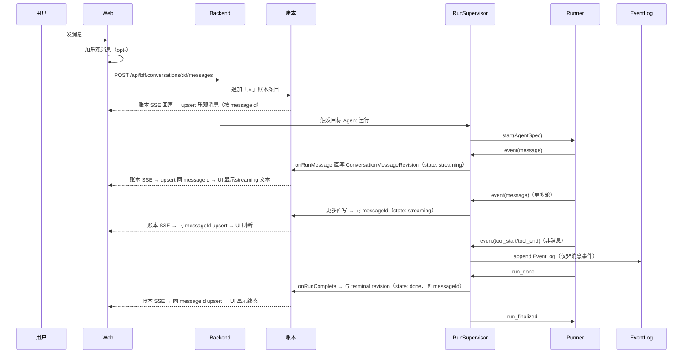

# Web 消息端到端

这条流追踪一条 Web 用户消息：从乐观 UI，经账本追加、运行触发、Runner 执行、onRunMessage 直写 ConversationMessageRevision，到账本 SSE upsert 对账。不再有运行 SSE 和草稿——所有消息输出经由账本 SSE，按 messageId upsert。

## 时序图

## BFF 路由前缀

Web 端全部 API 调用经 `/api/bff` 前缀（Next.js rewrite 到后端）：账本 SSE 走 `/api/bff/conversations/:id/events`，消息 POST 走 `/api/bff/conversations/:id/messages`。不再有 `/runs/:id/events` 运行 SSE——所有消息输出都由账本 SSE 承载。

## 消息 revision upsert 模型

Web 不再维护 draft/run 状态。`ConversationMessageRevision` 携带 `messageId`（assistant 消息用 `assistantMessageId(runId)`，human 消息用 `s-${seq}`），Web reducer 按 `messageId` upsert 到 `items[]`（元素是 `kind: "message"` 的 UiItem）。同一 run 的多轮incremental projection shares同一个 `messageId`——每次账本 SSE 到达时 `upsertAuthoritative` 找到同 id 就替换，UI 自然刷新。

`busy` 不再由 `RunPhase` 推导，改为 `isBusy()`：先看 `pendingSendCount > 0`，再检查是否有 agent 消息的 `state` 满足 `isOpenMessageState`。run 结束后 `state: "done"` / `state: "error"` 使得 busy 自然变 false。

## 直写与 terminal revision

`onRunMessage` 把每条 assistant message 事件直接 `appendAssistantMessage` 写进账本（critical, awaited），同一 run 的多轮增量共用同一 `messageId`，按到达顺序依次写入。`onRunComplete` 取该 run 的最新 assistant revision 作为 base，追加 terminal revision（`state: done`），确保 done 永远是最后一条同 messageId revision。base 可从账本重建，不依赖进程内存；`projectionChain` 已删除。

## 几条边界

- 乐观「人」消息是临时的；账本「人」消息是持久的——通过 messageId upsert 替换。
- assistant 消息从 streaming → done/error 是同一 messageId 的多次 upsert，UI 不会看到两份独立消息。
- 工具进度属于运行 UI，除非被显式总结进文本，否则不进账本。

## 数据形状的逐步变换

1. Web 表单文本 → POST body。
2. POST body → 账本 `kind=message`（human 成员）。
3. `buildPreloadedMessages` 从账本直接构建 Message[] → `start` 消息的 `preloadedMessages`。
4. Agent 产出 → message 事件经 `onRunMessage` 直写账本（非消息事件才进 EventLog）。
5. assistant message → `buildAssistantRevision` → `ConversationMessageRevision`（`{ messageId, state, role, text/blocks, runId }`）经 `appendAssistantMessage` 落账本。
6. Revision → Web reducer `parseRevision` → `UiItem`（`kind: "message"`，`content: ConversationMessageRevision`）。

## 出问题先看哪层

| 症状 | 可能层 | 接着读 |
|---|---|---|
| 用户消息消失 | 账本/乐观替换 | [对话账本](../conversation/ledger.md) |
| 消息不更新 | onRunMessage 直写 / messageId | [会话投影](../backend/conversation-projection.md) |
| 最终答案缺失 | onRunComplete terminal 写入 | [会话投影](../backend/conversation-projection.md) |
| Agent 没跑 | 触发 / RunSupervisor | [对话与成员](../conversation/conversation-and-members.md) |
| 同 run 出现多条 agent 消息 | messageId 不匹配 | [Web 端](../surfaces/web.md) |

## 关联页面

- [Web 端](../surfaces/web.md)
- [RunSupervisor](../backend/run-supervisor.md)
- [会话投影](../backend/conversation-projection.md)
- [事实与投影](../foundations/facts-and-projections.md)
