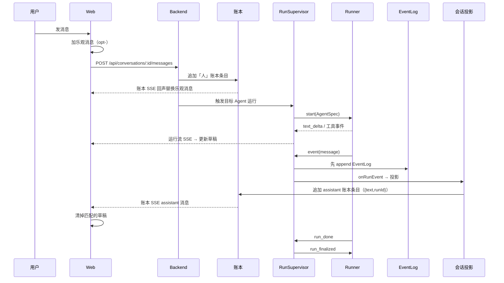

# Web 消息端到端

这条流追踪一条 Web 用户消息：从乐观 UI，经账本追加、运行触发、Runner 执行、EventLog 追加、会话投影，到最终 UI 对账。它把前面几页的概念串成一次完整往返。

## 时序图

## 几条边界

- 乐观「人」消息是临时的；账本「人」消息是持久的。
- 运行流草稿是临时的；被投影的 assistant 账本消息是持久的。
- 工具进度属于运行 UI，除非被显式总结进文本，否则不进账本。

## 数据形状的逐步变换

1. Web 表单文本 → POST body。
2. POST body → 账本 `kind=message`（human 成员）。
3. 账本 → 目标 Agent 的线程投影。
4. 线程投影 → `start` 消息的 `preloadedMessages`。
5. Agent 产出 → EventLog `message` 事件。
6. EventLog 消息 → 投影信封 `{ text, runId }`。
7. 信封 → Web reducer 账本消息（`norm` 解出内层文本）。

## 出问题先看哪层

| 症状 | 可能层 | 接着读 |
|---|---|---|
| 用户消息消失 | 账本/乐观替换 | [对话账本](../conversation/ledger.md) |
| 草稿闪烁 | Web reducer + 投影 | [Web 端](../surfaces/web.md) |
| 最终答案缺失 | EventLog 或投影 | [会话投影](../backend/conversation-projection.md) |
| Agent 没跑 | 触发 / RunSupervisor | [对话与成员](../conversation/conversation-and-members.md) |

## 关联页面

- [Web 端](../surfaces/web.md)
- [RunSupervisor](../backend/run-supervisor.md)
- [会话投影](../backend/conversation-projection.md)
- [事实与投影](../foundations/facts-and-projections.md)
