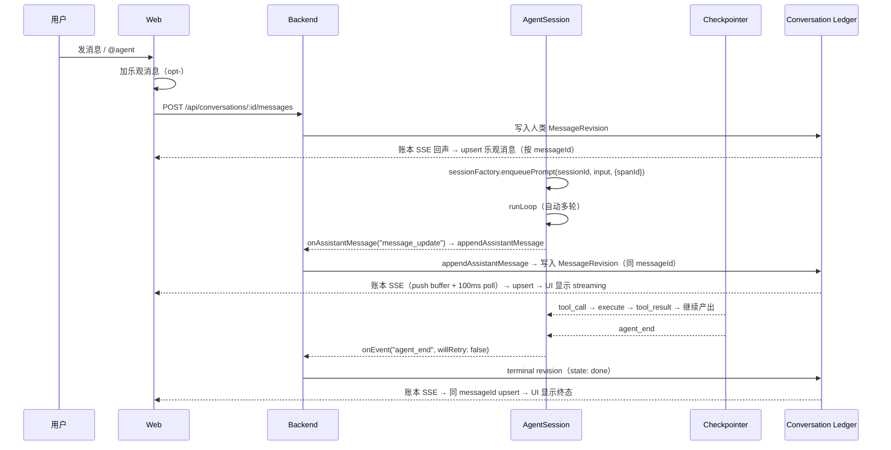

# Web 消息端到端

Web 用户在对话中发消息后，经过以下几个阶段完成往返：消息写入 conversation ledger，AgentSession 在 Backend 进程内执行 Agent，assistant 消息通过账本 SSE 推送到前端，前端按 messageId upsert 渲染。

## 时序图

## BFF 路由

Web 端 API 调用直接挂载在 `/api` 前缀下（无 `/bff` 中间层）。conversation SSE 走 `/api/conversations/:id/events`，消息 POST 走 `/api/conversations/:id/messages`。

前端维护一份按 `messageId` 索引的消息列表。assistant 消息从 streaming 到 done 是同一 `messageId` 的多次 revision，每次账本 SSE 到达时按 `messageId` upsert。

`MessageRevision` 携带 `runStatus` 字段，可取值："running"（正常执行中）、"retrying"（自动重试中）、"compacting"（压缩上下文中）、"waiting"（等待审批）。前端从当前 revision 的 `runStatus` 推导状态指示器。

前端不维护独立的 run 阶段状态——消息的 `state`（streaming/done/error/waiting）和 `runStatus` 字段本身就是状态来源。

## 关联页面

- [Web 端](../surfaces/web.md)
- [AgentSession](../harness/harness.md)
- [会话消息流](../backend/conversation-projection.md)
- [Framework 运行循环](../runtime/framework.md)
