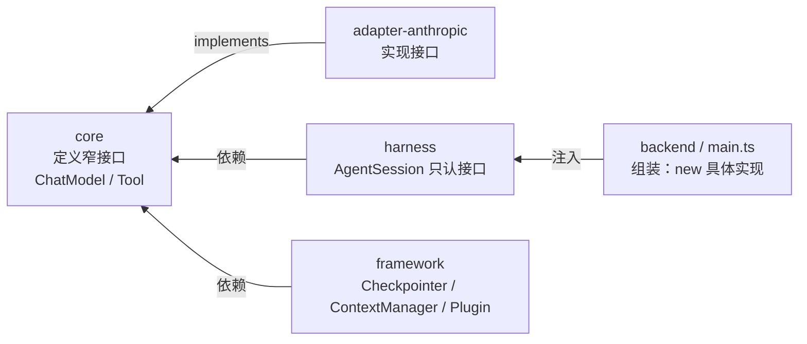

# 依赖注入

依赖注入（DI）回答一个很朴素的问题：**一个函数想用某个能力，它应该「自己造」还是「让别人给」？** 这个仓的统一答案是——让别人给。具体实现（哪个模型、哪种 checkpointer、哪套工具）由顶层组装，逐层注入下去；中间每一层只认抽象接口，不认具体类。

这不是风格偏好，而是控制复杂度的手段。它和[架构设计哲学](../design-philosophy.md)里「暴露业务、隐藏机制」是同一件事在协作关系上的投影：**谁创建谁，就是一种依赖；依赖箭头的方向，决定了系统能不能被替换和测试。**

## 为什么需要这一层

设想没有 DI 的世界：执行一次 agent run 的函数，自己 `new AnthropicChatModel()`、自己 `new Database()` 落盘、自己 `new` 一套工具。三个后果立刻出现：

1. **测不了**。想单测「执行编排」这段逻辑，却被迫连真实 Anthropic API、真实 sqlite 落盘一起拖进来——你测的不再是编排，而是一整套集成。
2. **换不了**。想换个模型厂商、换个存储后端、用测试替身跑，都得改函数体——没有注入点。
3. **职责糊了**。「造能力」和「用能力」挤在一个函数里，任何一边变化都要动它。

DI 把「造」和「用」切开：**造的责任上移到组装根，用的责任留在业务函数。** 业务函数从此只声明「我需要一个 `ChatModel`」，至于它背后是 Anthropic 还是一个 mock，函数不知道也不关心。

## 主轴：依赖箭头指向内层

这个仓最值得记住的一件事，不是某个函数怎么写，而是整个 monorepo 的**依赖方向**：



读法：**箭头全部指向内层的接口包（core / framework）。** 高层模块（harness）和低层模块（adapter）都依赖抽象，而不是互相依赖具体。这正是 DIP（依赖反转原则）的标准形态——抽象在内，实现在外，组装在顶。

落到代码：

- `packages/core/src/chat-model.ts:20` 定义 `interface ChatModel { stream(...): AsyncIterable<AIMessageChunk> }`——一个纯抽象，**不知道 Anthropic 的存在**。
- `packages/adapter-anthropic/src/anthropic-chat-model.ts` 里 `class AnthropicChatModel implements ChatModel`——具体实现被推到**最外层**。
- `packages/harness/src/agent-session.ts` 的 `AgentSession` 构造只收 `ChatModel` 接口，不认任何具体厂商。
- `apps/backend/src/main.ts` 在顶层 `new AnthropicChatModel(...)`，再把它注入下去。

> 这条链是全仓 DI 的「宪法」。下面 5 类局部手法，都是它在不同粒度上的投影。

## 5 类可复用的注入手法

### 1. 面向接口编程（Port-Adapter）

核心抽象都定义成**极窄的接口**，实现放在外层包：

| 接口 | 位置 | 方法 |
|------|------|------|
| `ChatModel` | `packages/core/src/chat-model.ts:20` | 必填只有 `stream()`，`countTokens` 可选 |
| `Tool` | `packages/core/src/tool.ts:6` | — |
| `Checkpointer` | `packages/framework/src/checkpointer.ts:45` | load/save + 可选 interrupt/event |
| `ContextManager` | `packages/framework/src/context-manager.ts:22` | 只有一个 `shape()` |
| `Plugin` | `packages/framework/src/plugin.ts:51` | — |

窄到这种程度，**写测试桩几乎零成本**：一个 `{ stream: async function*(){...} }` 字面量就能替身一整个模型。接口越窄，可替换性和可测性越强——这同时满足 ISP（接口隔离）与 DIP。

### 2. 函数式策略注入（把行为当参数传）

不是所有依赖都得是「对象」，行为本身也能注入。`pipeContextManagers` 是范本：

```ts
// packages/framework/src/context-manager.ts:26
export function pipeContextManagers(...managers: ContextManager[]): ContextManager {
  return {
    async shape(ctx, messages) {
      let current = [...messages];
      for (const m of managers) current = await m.shape(ctx, current);
      return current;
    },
  };
}
```

要加一种新的上下文裁剪策略，**不用改任何现有代码**，只要再写一个 `ContextManager` 塞进 pipe——这是 OCP（对扩展开放、对修改关闭）的干净落地。详见[上下文管理器](../runtime/context-manager.md)。

同类：`apps/backend/src/features/agent/agent-svc-factory.ts:30` 把「如何物化工作区」作为函数 `materializeWorkspace: async (agentId) => {...}` 注入，测试时换成内存实现即可，不碰 `createAgentService` 本体。

**另一个正面案例（2026-06-26 重构落地）：**`ExecuteAgentRunOpts.onRunStatus`（`apps/backend/src/features/run/run-executor.ts:57-62`）把「run 生命周期状态如何投影」作为回调注入，执行层不关心投影格式是 SSE frame 还是 SSE comment——它只调用 `onRunStatus?.({ runId, phase, detail, updatedAt })`。这替代了此前 `buildRunStatusRevision` 的 hack（把 run 状态强塞成 `MessageRevision`，污染消息流）。回调接口只有 4 个字段，测试时传入 `jest.fn()` 即可断言状态序列。

### 3. 工厂函数注入 + 窄依赖

`createAgentSvc`（`apps/backend/src/features/agent/agent-svc-factory.ts:16`）全部依赖参数注入，内部再用 `createAgentService({ port, idGen, materializeWorkspace, ... })` 把端口与行为一并注入。

`createOrchestrator`（`apps/backend/src/features/orchestrator/reactor.ts`）更进一步——它的 `OrchestratorDeps.projectSvc` **只声明 `getById` 一个方法**，而非整个 ProjectService：

```ts
projectSvc: { getById(id: string): { autoOrchestrate: boolean; projectId: string } }
```

调用方只需提供真正被用到的能力，测试时给一个 `{ getById: () => fakeProject }` 就够了。

### 4. 构造函数注入（端口聚合 + 合理缺省）

`AgentSession`（`packages/harness/src/agent-session.ts`）通过一个 config 对象聚合所有协作者，每一项都是接口而非具体类：

```ts
new AgentSession({ model, threadId, plugins, tools, checkpointer, contextManager })
```

构造里对 `maxSteps / retry / compaction` 给默认值再 `...config` 覆盖——**注入但有合理缺省**，调用方只在需要时覆写。见[Harness](../harness/harness.md)。

### 5. 组合根（Composition Root）

所有 `new 具体实现` 集中在 `apps/backend/src/main.ts` 一处完成，再向下注入；其余模块全程「只接收、不创建」。这就是为什么任何在业务函数体里出现的 `new AnthropicChatModel` / `sqliteCheckpointer` 都是 DI 漏洞——它把本该留在组合根的 `new` 漏到了执行层。

## 判断准则

设计或 review 一个函数/类时，按这五条自检：

1. **注入「能力」，而不是「造能力的原料」**。要一个能跑的 session，就收 `AgentSession`，而不是收 `agentId + agentSvc` 自己现拼。判据：函数体里有几个 `new Concrete()` / 具名落盘实现，就有几个 DIP 漏洞。
2. **注入抽象（接口），被注入方不知道实现是谁**。依赖 `ChatModel`，不依赖 `AnthropicChatModel`。
3. **依赖接口要「窄」**。只暴露真正调用的方法。声明的依赖必须等于实际用到的依赖，多一个都是噪音与误导。
4. **区分 composition root 与 business logic**。所有 `new` 集中到组装根，业务函数全程只接收、不创建。
5. **倾向「构造期注入」而非「调用期透传」**。依赖在稳定边界一次性绑定，调用期只传真正每次都变的输入（如 `input` / `runId`）。

## Good case ↔ Bad case 镜像对照

> Bad case 来自 backend 现状的 SOLID 盘点。本表只定位病灶并给出同仓正面样板，不含改法。

| 维度 | Bad case（现状） | Good case（仓内样板） | 状态 |
|------|-----------------|----------------------|------|
| 注入粒度 | `executeAgentRun` 收 `agentId + agentSvc`，函数体内 `agentSvc.getById` 现造 session（`run-executor.ts:42-43`、`:120`） | `createAgentSvc` 收造好的 db/supervisor，行为以函数注入（`agent-svc-factory.ts:16`） | ⚠️ 待修 |
| 依赖宽窄 | `ExecuteAgentRunOpts` 18 字段大袋子（`run-executor.ts:37-65`） | `OrchestratorDeps.projectSvc` 只暴露 `getById`（`reactor.ts`） | ⚠️ 待修 |
| `new` 的位置 | 函数体内 `new AnthropicChatModel`（`:124`）、`sqliteCheckpointer`（`:175`） | `main.ts` 组装根集中 `new`，其余只接收 | ⚠️ 待修 |
| 角色边界 | 组装 + 执行 + 投影混在一个 fire-and-forget 函数（`run-executor.ts:77`） | `session-registry.ts` 纯 register/get/dispose，单一职责 | ⚠️ 待修 |
| 协议泄漏 | ~~`buildRunStatusRevision` 把执行层绑死 `MessageRevision` 线协议~~ | `onRunStatus` 回调注入（`:57-62`），执行层不感知投影格式 | ✅ 已修（2026-06-26） |
| 组装层 | `executeAgentRun` 收 `agentId + agentSvc` 在函数体内查 agent 组装 session | `AgentSession` 构造函数收已组装好的接口直接使用 | ⚠️ 待修 |

### 病灶详解：executeAgentRun

`apps/backend/src/features/run/run-executor.ts:77` 的 `executeAgentRun` 是全仓最集中的 DI 反例。一个 fire-and-forget 函数依次做了七件事：写 run origin → 申请生命周期 → **查 agent 并 `new` 模型**（`:120`、`:124`）→ 拼 tools → 拼 plugins → 造 checkpointer/contextManager（`:175`）→ new AgentSession + 订阅事件 + 执行。

它收的是 `agentId: string` + `agentSvc: AgentService`（`:42-43`），然后在函数体里 `agentSvc.getById(agentId)` 把 agent 查出来现造 session——**它不依赖「一个已经造好的 `AgentSession`」这个抽象，而是依赖一堆具体类 + 一个能查 agent 的 service**。这违反准则 1、2、4。

> **已修复项（2026-06-26）：** 协议泄漏——`buildRunStatusRevision` 被 `onRunStatus` 回调替代（`:57-62`）。执行层不再把 run 状态硬塞成 message 格式，而是通过函数式策略注入回调，由调用方决定投影格式。这是准则 2（注入抽象）的正面落地。

### 其余 bad case

- **`SpanSupervisor`**（`span/supervisor.ts`）：一个类同时管生命周期、直接 SQL、reaper 定时器、三组监听器。SRP + DIP 双踩。**S1 已修复**：不再管理独立 events.db 连接及迁移（统一由 `openDb` 注入）。
- **`RunSupervisorOptions`**（`supervisor.ts:11`）：6 字段 fat options，其中 `eventLog` 重构后类内**从不 `.append()`**——声明了依赖却不用。
- **`RuntimeOpsService`**（`runtime-ops/service.ts:104` 起）：12 方法上帝对象，运行管理 / 监控 / 诊断 / 报表四类关注点挤一处；`listRuns` 内 if 链拼 SQL 过滤（OCP）。
- **`getSetupManager`**（`main.ts:203`）：函数体内 `new CliSetupProvisioner()`（`:205`），焊死具体 provisioner。
- **`createCronScheduler`**（`cron/scheduler.ts:164`）：直接 `Bun.cron(...)`，绑死运行时，无法注入假调度器做时间相关测试。

## 红旗信号

出现以下情况时，应暂停审视 DI 设计：

- 业务函数体里出现 `new` 一个具体的模型 / 存储 / 调度器实现。
- 一个函数同时收「id」和「能查这个 id 的 service」，然后在体内查出来现造对象。
- options 接口的字段数远多于任一条调用路径实际用到的数量。
- 一个 wrapper 函数的全部工作就是把字段逐行手抄进另一个函数。
- 接口声明了某个依赖，但实现里从不调用它。
- 想给一个函数写单测，发现必须连带 mock 真实模型 API + 真实落盘。

## 给 executeAgentRun 的目标形态

改它时不用去外面找范式——**照着同仓的 `createAgentSvc` 和 `AgentSession` 抄**：接收已构造好的能力（注入 `AgentSession` 或 `SessionFactory` 抽象）、依赖窄接口、把 `new` 还给 `main.ts`、把投影 wire 格式移出执行层、18 字段袋子按「会话 / cron / 编排」三类拆成各自的窄接口。具体改法是另一份重构 spec 的事，本页只立准则。

## 关联页面

- [架构设计哲学](../design-philosophy.md) —— 暴露业务、隐藏机制；DI 是它在协作关系上的投影
- [上下文管理器](../runtime/context-manager.md) —— 函数式策略注入 + pipe 组合的范本
- [Framework 运行循环](../runtime/framework.md) —— 接口在内层的定义处
- [Harness](../harness/harness.md) —— 构造函数注入 + 合理缺省
- [Backend 总览](../backend/overview.md) —— 组合根与各 service 工厂
