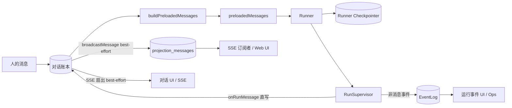

# 事实与投影

系统里有好几个结构都叫「messages」，但它们回答的是不同的问题。对话账本是对话消息的**唯一**事实来源。EventLog 现在是纯执行细节，不再承载对话消息内容。`buildPreloadedMessages` 从账本直接构建 Agent 的 thread，不经过 `projection_messages`；`projection_messages` 现在只是广播缓存，供 SSE 订阅者轮询。Runner 本地的 Checkpointer 则是执行恢复用的状态。

## 六个「消息」分别回答什么问题

- 「这个共享对话里发生了什么？」→ **对话账本（conversation_ledger）** — 唯一权威
- 「这一次运行内部发生了什么？」→ **EventLog（event_log）** — 仅执行细节
- 「这个 Agent 要从哪恢复执行？」→ **Runner Checkpointer（checkpointer.sqlite）**
- 「这个 Agent 这次该看到怎样的 thread？」→ **buildPreloadedMessages（从账本直接构建）**
- 「界面此刻该显示什么？」→ **SSE 流 / Web 草稿**
- 「SSE 订阅者怎么轮询历史？」→ **线程投影（projection_messages）** — 广播缓存，最佳交付

## 数据层对照表

| 层 | 持久 | 是否事实来源 | 写者 | 主要读者 | 可重建 |
|---|---:|---:|---|---|---:|
| 对话账本 | 是 | **是（唯一）** | Conversation Service（人类消息）/ Supervisor onRunMessage（assistant 消息） | Web、飞书、buildPreloadedMessages | 否 |
| EventLog | 是 | **是（仅执行细节）** | RunSupervisor | 运行 UI、Ops | 否 |
| Runner Checkpointer | 是 | 对「恢复」而言是 | Framework / Runner | Runner 恢复 | 部分 |
| buildPreloadedMessages | 否（纯函数） | 否 | forkRun 调用方 | Runner 启动（preloadedMessages） | 是，随时可从账本重新计算 |
| projection_messages（线程投影） | 是（广播缓存） | 否 | broadcastMessage（best-effort 扇出） | SSE 订阅者 / threadProjection HTTP API | 是，可从账本重建 |
| 运行流 SSE（delta） | 否 | 否 | RunSupervisor | Web/飞书实时 UI | 否（纯内存扇出，断线即丢） |
| 会话 SSE | 否 | 否 | Conversation Service | Web/飞书 | 是，可从账本重放 |

> **关键变化**：assistant 消息的"事实来源"标记从 EventLog **撤销**，改标账本为唯一来源。EventLog 的"事实来源"现在仅指**执行细节**（tool_start/tool_end/text_delta），不再包含对话消息内容。

## 关系图

> **关键变化**：旧路径 `EventLog → Projection → Ledger` 已删除。assistant 消息现在是 `Supervisor → Ledger`（直写），EventLog 只接收非消息事件（tool_start/tool_end/text_delta）。`buildPreloadedMessages` 从账本直接构建 preloadedMessages，不再经过 `projection_messages` 中间层。`projection_messages` 降级为纯广播缓存（SSE 订阅者轮询用）。

## 账本 vs EventLog：为什么不能合并

账本是「对话可见历史」，EventLog 是「执行历史」。一次 `tool_start`/`tool_end` 对 EventLog 是必需的（排障要看），但放进账本就是噪音甚至会让飞书渲染出 `[Unsupported content]`。反过来，一条「成员加入」通知对账本有意义，却根本不属于任何一次运行。

此前的硬边界是："只有会话投影这一个地方，能把一次运行事件变成对话可见消息。" 现在这句话修正为：**assistant 消息由 Supervisor 经与人类消息同一入口直写账本**，EventLog 退回到纯执行细节的角色。投影桥仍然存在，但它不再产生事实——它只做 best-effort 扇出（broadcastMessage → projection_messages → SSE 订阅者）。

## Checkpointer vs buildPreloadedMessages vs projection_messages：三个投影，用途不同

- **Runner Checkpointer**（`checkpointer.sqlite`，在 Runner 进程的 `stateRoot` 下）属于「正在执行的 Agent」，保存它的内部续跑状态，给 `resume` 用。
- **buildPreloadedMessages**（纯函数，在 `conv-svc-factory.ts` 的 `forkRun` 闭包内调用）在一次运行**开始前**，从账本直接读取对话历史，按 member 视角折叠（same memberId → assistant，other → user），构建 `preloadedMessages` 数组灌给 Agent。**不走 `projection_messages` 表**。
- **projection_messages**（后端 DB 表，M17.4 从 `checkpoint_messages` 改名）是 `broadcastMessage` 的落盘缓存——每次 ledger 写入后，best-effort 扇出到各 agent member 的 thread。仅由 SSE 订阅者通过 `threadProjectionRoutes` HTTP API 轮询消费。

如果用户报「Agent 看到了重复消息」，要分开查这几处：

- 运行**开始前**就重复 → 多半是 `buildPreloadedMessages` 的折叠逻辑 / 账本内有重复行的问题。
- `resume` 之后才重复 → 多半是 Runner checkpointer 的问题。
- 只有 UI 上重复 → 多半是 Web/飞书合并的问题。
- SSE 轮询到重复 → 多半是 `broadcastMessage` / `projection_messages` 的问题。

## 输入与输出

### buildPreloadedMessages（preloadedMessages 构建）

- 调用方：`conv-svc-factory.ts` 的 `forkRun` 闭包，每次 fork agent run 时调用。
- 输入：`ConversationPort`（提供 `getLedgerEntries`）、conversationId、memberId。
- 输出：`Message[]`，直接传给 `supervisor.startMainRun({ preloadedMessages })`。
- 关键规则：同一条账本行，对**发送者本人**投影成 `{role:"assistant"}`，对**别人**投影成 `{role:"user"}`。`kind` 不为 `message` 的条目直接跳过。同一 `messageId` 的后写覆盖先写（折叠 streaming/done revision 为一条）。

### broadcastMessage → projection_messages（广播缓存）

- 调用方：`appendAndBroadcast`（postMessage）、`onRunMessage` 回调（main.ts 的 best-effort 扇出）。
- 输入：已直写进账本的条目（LedgerEntry）。
- 输出：对每个 agent member，调用 `projectForMember` 将账本条投影为 `{role, content}`，写入 `projection_messages` 表。
- 读者：SSE 订阅者（通过 `threadProjectionRoutes` HTTP API → `threadProjectionSvc.getMessages()`）。
- 关键规则：`kind` 为 `todo` 和 `surface.control` 的条目直接跳过、不投影。`broadcastMessage` 的 `excludeMemberId` 参数排除发送者本人，避免把自己的产出写回自己的 thread。
- 不再是 preloadedMessages 的来源——preloadedMessages 由 `buildPreloadedMessages` 从账本直接构建。

### 会话投影（当前角色）

- 输入：已直写进账本的消息条目（来自 `onRunMessage` 回调）。
- 输出：best-effort broadcast 给各成员的 SSE 订阅者；best-effort ops 记录。
- 不再是事实来源——事实已经由直写路径持久化到账本。

## 失败模式

### 事件被重复写进账本

成因：投影被重放（例如 SSE 重连、事件重投递），而 `appendLedgerEntry` 是纯自增 INSERT。
当前状态：直写路径使这个问题缩小了范围——assistant 消息不再通过投影桥写入，只有人类消息和系统消息走 `appendAndBroadcast`。`hasLedgerContent` 和 `ledgerHasTerminalForMessage` 提供了幂等保护。

### preloadedMessages 包含重复/残留消息

成因：`buildPreloadedMessages` 按 messageId 折叠，但如果同一消息有两种不同的 messageId（如 streaming 中途 messageId 变化），折叠就会失效。
当前状态：messageId 由 `assistantMessageId(runId, index)` 生成，同一 run 内 index 固定为 0，messageId 稳定。

### 飞书渲染出不支持的内容

成因：纯 `tool_use`/`tool_result` 的 assistant 块进了账本。它是非空数组，能绕过「空数组」判空。
当前状态：直写路径中，`appendAssistantMessage` 在写入前不做内容过滤——过滤应在调用方（`onRunMessage`）或渲染方（`renderRevision`）完成。

## 不变量

1. 账本是对话消息的**唯一**事实来源（assistant 消息直写，不再从 EventLog 派生）。
2. EventLog 仅含执行细节（tool_start/tool_end/text_delta），不含对话消息内容。
3. `buildPreloadedMessages` 从账本直接构建 thread，不经过 `projection_messages` 中间表。
4. `projection_messages` 是广播缓存，仅用于 SSE 订阅者轮询，可随时从账本重建。
5. Checkpointer 不是对话历史库。
6. SSE 流不定义事实。

## 关联页面

- [对话账本](../conversation/ledger.md)
- [EventLog](../backend/event-log.md)
- [会话投影](../backend/conversation-projection.md)
- [常驻 Runner](../runner/resident-runner.md)
- [Web 端](../surfaces/web.md)
