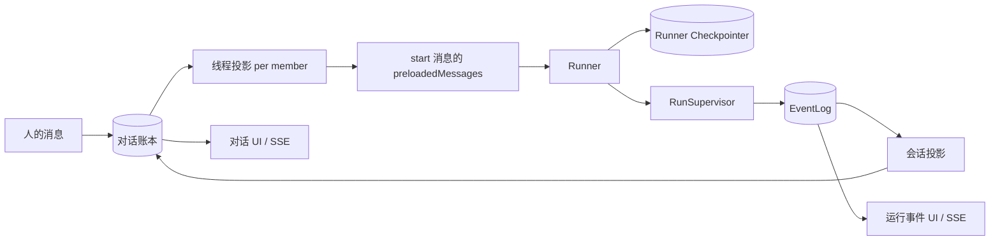

# 事实与投影

系统里有好几个结构都叫「messages」，但它们回答的是不同的问题。对话账本和 EventLog 是持久的「事实」；线程投影和各种 SSE 流是从事实推导出来的「投影」；Runner 本地的 Checkpointer 则是执行恢复用的状态。把它们混为一谈，正是重复消息、检查点污染、UI 丢事件这类 bug 的根源。

## 五个「消息」分别回答什么问题

- 「这个共享对话里发生了什么？」→ **对话账本（conversation_ledger）**
- 「这一次运行内部发生了什么？」→ **EventLog（event_log）**
- 「这个 Agent 要从哪恢复执行？」→ **Runner Checkpointer（checkpointer.sqlite）**
- 「这个 Agent 这次该看到怎样的 thread？」→ **线程投影（checkpoint_messages）**
- 「界面此刻该显示什么？」→ **SSE 流 / Web 草稿**

## 数据层对照表

| 层 | 持久 | 是否事实来源 | 写者 | 主要读者 | 可重建 |
|---|---:|---:|---|---|---:|
| 对话账本 | 是 | 是 | Conversation Service / 会话投影 | Web、飞书、线程投影 | 否 |
| EventLog | 是 | 是 | RunSupervisor | 运行 UI、投影、Ops | 否 |
| Runner Checkpointer | 是 | 对「恢复」而言是 | Framework / Runner | Runner 恢复 | 部分 |
| 线程投影 checkpoint_messages | 是（更像缓存） | 否 | Conversation Service 广播 | 运行启动时 hydrate | 是，可从账本重建 |
| 运行流 SSE（delta） | 否 | 否 | RunSupervisor | Web/飞书实时 UI | 否（纯内存扇出，断线即丢） |
| 会话 SSE | 否 | 否 | Conversation Service | Web/飞书 | 是，可从账本重放 |

## 关系图

## 账本 vs EventLog：为什么不能合并

账本是「对话可见历史」，EventLog 是「执行历史」。一次 `tool_start`/`tool_end` 对 EventLog 是必需的（排障要看），但放进账本就是噪音甚至会让飞书渲染出 `[Unsupported content]`。反过来，一条「成员加入」通知对账本有意义，却根本不属于任何一次运行。

所以代码里有一条硬边界：**只有会话投影这一个地方，能把一次运行事件变成对话可见消息。** 任何端、任何插件都不许绕过它直接往账本写 Agent 产出。

## Checkpointer vs 线程投影：同样叫 checkpoint，用途相反

- **Runner Checkpointer**（`checkpointer.sqlite`，在 Runner 进程的 `stateRoot` 下）属于「正在执行的 Agent」，保存它的内部续跑状态，给 `resume` 用。
- **线程投影**（后端 `checkpoint_messages` 表）属于「后端的对话语义」，在一次运行**开始前**，把该成员视角下的对话历史灌给 Agent 作为 `preloadedMessages`。

如果用户报「Agent 看到了重复消息」，要分开查这两处：

- 运行**开始前**就重复 → 多半是线程投影 / 广播的问题。
- `resume` 之后才重复 → 多半是 Runner checkpointer 的问题。
- 只有 UI 上重复 → 多半是 Web/飞书合并的问题。

## 输入与输出

### 线程投影

- 输入：账本条目、成员身份、`packages/conversation` 里的 `projectForMember` 规则。
- 输出：某个成员的 `messages` 数组（写进 `checkpoint_messages`，下次运行作为 `preloadedMessages`）。
- 关键规则：同一条账本行，对**发送者本人**投影成 `{role:"assistant"}`，对**别人**投影成带前缀的 `{role:"user", text:"[名字]: ..."}`，对 `__system__` 投影成 `{role:"user", text:"[系统] ..."}`。`kind` 为 `todo` 和 `surface.control` 的条目直接跳过、不投影。

### 会话投影

- 输入：EventLog 的 `message` 事件、`runId`、`activeConversations` 映射。
- 输出：一条 `kind=message` 的账本条目，并广播进各成员线程投影。

## 失败模式

### 事件被重复写进账本

成因：投影被重放（例如 SSE 重连、事件重投递），而 `appendLedgerEntry` 是纯自增 INSERT，没有幂等键。
需要的修复：给投影加一个稳定键，例如 `(runId, eventSeq, conversationId)`。

### Agent 的检查点被自己的产出污染两次

成因：广播把运行产出写进了「发送者本人那条正在跑的 thread」，而 Runner 稍后又会保存同一段 assistant 产出。
需要的修复：不要把投影广播回当前正在运行的发送者线程，或者为这次写入指定唯一的归属者。

### 飞书渲染出不支持的内容

成因：纯 `tool_use`/`tool_result` 的 assistant 块进了账本。它是非空数组，能绕过「空数组」判空。
需要的修复：投影按「是否对话可见」过滤内容。

## 不变量

1. 账本行是对话事实。
2. EventLog 行是运行事实。
3. 线程投影是推导出来的，可重建。
4. Checkpointer 不是对话历史库。
5. SSE 流不定义事实。

## 关联页面

- [对话账本](../conversation/ledger.md)
- [EventLog](../backend/event-log.md)
- [会话投影](../backend/conversation-projection.md)
- [常驻 Runner](../runner/resident-runner.md)
- [Web 端](../surfaces/web.md)
