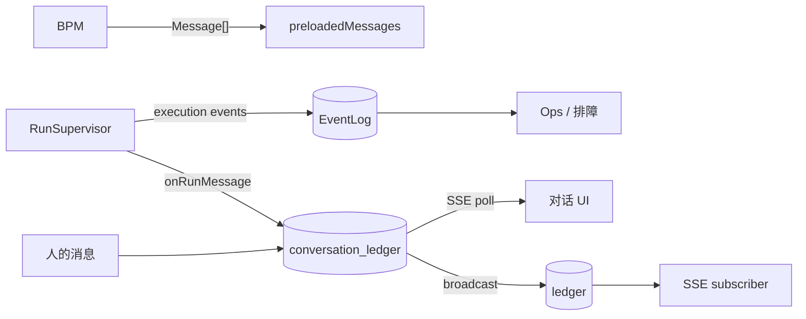

# 事实与投影

**Message 领域类型只有一处定义**：`@my-agent-team/message` 的 `Message` / `MessageRevision`。其它层都引用这个类型，没有自己再造一个 "Message"。

```
@my-agent-team/message
 ├── Message          { role, text?, blocks? }        ← Agent 看到的对话轮次
 ├── MessageRevision  { messageId, state, ... }       ← 带生命周期的消息 envelope
 └── ContentBlock     { type, text?, tool_use?, ... } ← 消息内容块
```

## 事实层与 infrastructure

| 层 | 持久 | 角色 | 写者 | 读者 | 可重建 |
|---|---:|---|---|---|---|
| **事实** | | | | | |
| **infrastructure** | | | | | |
| EventLog | 是 | execution detail 记录 | RunSupervisor（非 message 事件） | Ops、排障 | 否 |
| ledger | 是 | broadcast cache | broadcastMessage（best-effort） | SSE subscriber 轮询 | 是 |
| SSE 流 | 否 | transport | RunSupervisor / ConvService | Web / Lark 实时 UI | 否 |

### 为什么这些不能合并

- **ledger vs EventLog**：ledger 存对话可见内容，EventLog 存 execution detail（tool_start/tool_end 等）。tool call 细节排障需要，但进了 ledger 会让 Lark 消息卡片渲染出 `[Unsupported content]`。反过来，成员加入通知属于 ledger，跟哪次 run 都没关系。

## 数据流



## 关键路径

- **人发消息**：`postMessage → appendAndBroadcast`（写 ledger + broadcastMessage fan-out）
- **assistant 产出**：`onRunMessage → appendAssistantMessage`（直写 ledger）→ `broadcastMessage`（best-effort fan-out，fire-and-forget）
- **UI 怎么更新**：`subscribeConversation` SSE 从 ledger 直接 poll


|---|---|---|
| 触发时机 | forkRun（运行开始前） | 每次 ledger 写入后 |
| 输入 | ledger 全量 `getLedgerEntries` | 单条 LedgerEntry |
| 可靠性 | critical（读失败上抛） | best-effort（失败只记日志） |
| 消费方 | Agent（preloadedMessages） | SSE subscriber / Web UI |

## 失败模式

### ledger 写入成功但 broadcast 失败

前端 SSE 有延迟/缺失，但事实已持久化。重连后从 ledger 重放。


按 messageId 折叠（后写覆盖先写）。如果同一消息有两个 messageId 则折叠失效导致重复。当前 messageId 由 `assistantMessageId(runId, 0)` 生成，同一 run 内 stable。

### Lark 渲染出 `[Unsupported content]`

纯 `tool_use`/`tool_result` block 进了 ledger。过滤应在 `onRunMessage` 回调或 Lark adapter 的 `renderRevision` 做。

## 不变量

1. Message 领域类型只有 `@my-agent-team/message` 一处定义。
2. conversation_ledger 是对话消息的 canonical fact store。
3. EventLog 只含 execution detail（tool_start/tool_end/text_delta），不含对话内容。
5. ledger 是 broadcast cache，可随时从 ledger 重建。
6. Checkpointer 不是对话历史库。
7. SSE 流不定义事实。

## 关联页面

- [对话账本](../conversation/ledger.md)
- [EventLog](../backend/event-log.md)
- [会话投影](../backend/conversation-projection.md)
- [Web 端](../surfaces/web.md)
