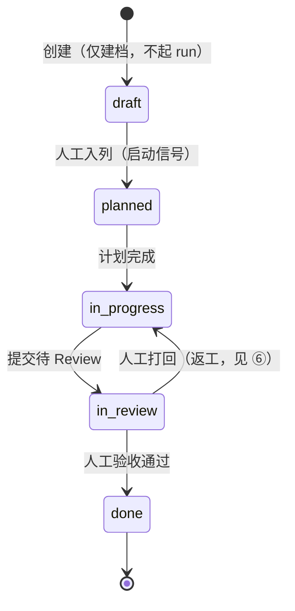
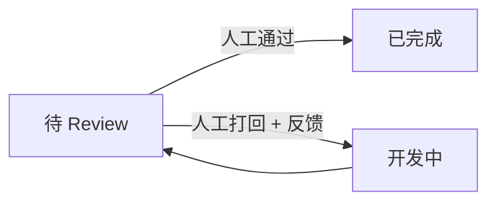

# Issue 协作工作流

> 本页 `status: design`：描述的是已锁定、**尚未进代码**的演进设计。现状以 `status: current` 页为准——[Issue](./issue.md) 定义本体、[Orchestrator](../backend/orchestrator.md) 定义当前的固定线性推进、[Issue 生命周期端到端](../flows/e2e-issue-lifecycle.md) 描述当前跑法。本页落地时，这些 current 页随之回填。

[Issue](./issue.md) 本体已经立住，[Orchestrator](../backend/orchestrator.md) 已经能用一张固定转移表把它从计划推到完成。但要让一组 Agent 真的**协作**完成一件活，现状还缺几块：活一建好就自动跑（建档与启动耦合）、跑什么写死在常量里、上一棒的产出只能靠扫自由文本喂给下一棒、没有人来验收和打回、也没有「这件活到底经历了什么」的可观测视角。这页把这些缺口合成一版连贯的演进设计。

## 这页解决什么问题

现状的 Issue 流程是「**建即跑、写死、单向、看不见**」：

- **建即跑**：`createIssue` 一返回，`onIssueCreated` 立刻 `startStep` 起第一棒——没有「先建好、等人决定何时开跑」的空档。
- **写死**：转移表是常量，`agentId` 是字面量、`promptTemplate` 是硬编码字符串，`renderPrompt` 只认 `title` / `issueId` 两个变量。
- **单向**：转移表线性、只进不退，没有「Review 不通过 → 退回开发」的回路，「是否完成」没有人来拍板。
- **看不见**：除了 Issue 自身那一行 `status`，没有「这件活发生过哪些事」的时间线；run 级可观测（M16）虽已按 `run_origin.issue_id` 记录，却没有从 Issue 反查的入口。

下面八节，每节按第一性原理讲清「为什么要改、改成什么、契约是什么」。

## ① threadId 由 issueId 派生，不再人填

`threadId` 是 [Runner checkpointer](../backend/run-supervisor.md) 的分区键，决定一段执行历史落在哪。[Issue](./issue.md) 创建时数据库已经分配了稳定的 `issueId`，再让用户额外填一个 `threadId`，既冗余又易错（填错就把两件活的执行历史搅到一个分区里）。

设计：**`threadId` 从 `issueId` 派生**，不进创建表单。

```text
threadId = "issue:" + issueId
```

这和对话侧 `cid:<memberId>` 的派生是同一套思路——分区键是机制产物，不是用户输入。创建表单因此只剩「选 Project + 填标题」两件事。

## ② 创建即「草稿」态，人工入列才启动

现状把「建档」和「启动」绑在一起：`createIssue` → `onIssueCreated` → `startStep` 一气呵成。但这两件事语义不同——建档是「登记有这么件活」，启动是「现在开始干」。耦合的代价是：你无法先攒一批活、再决定先跑哪件。

设计：拆开。创建落在一个**可启动的草稿态**，不起任何 run；人把卡片从草稿拖进「计划中」列，这个**人工动作本身**就是启动信号。



草稿态是状态机新增的**起点**，不是新本体——它仍是 Issue 的一个 `status` 取值。Kanban 多出一列「草稿」，拖拽语义不变（卡片入列 = 改 `status`，事实仍在 Issue 上）。

## ③ 列可配置：绑定已有 Agent + prompt 模板

现状转移表是写死的常量，每条转移的 `agentId` 是字面量（`"planner"` / `"developer"` / `"reviewer"`），而真实 Agent 拿的是 `idGen()` 生成的 id——两者对不上，`getById("planner")` 会抛错。这是现状的一处**结构性断裂**：没有播种数据时，Issue 一启动就卡在第一棒。

设计：每一列（状态）的执行配置**可配置、存库**，且绑定的是**已存在的 Agent**（用真实 Agent id），外加一份 prompt 模板。Orchestrator 从配置读，不再从常量读。

```ts
// 设计形态：每个状态列绑定一条执行配置（存 DB，归属 Project，见 ⑦ 与未来工作）
ColumnConfig = {
  status: IssueStatus,        // 这一列对应的状态
  agentId: string,            // 必须指向一个真实存在、未归档的 Agent
  promptTemplate: string,     // {{}} 插值模板，变量来自 Issue 上下文（见 ⑤）
}
```

这正是 [Orchestrator](../backend/orchestrator.md) 「设计取舍」里预留的演进：转移从「写死的常量」长成「可配置」，**在同一个 Orchestrator 名字下替换转移表的形态**，不新增概念。绑定时校验 Agent 真实存在，把现状那处断裂从根上消除。

## ④ 交付物结构化捕获：submitDeliverable + 指针化

要让上一棒的产出喂给下一棒，不能靠扫 Agent 的自由文本（模型换个说法、少打个标记，链路就断——这正是 @提及自动流的老毛病）。下一棒需要的是**结构化、可寻址**的交付物。

设计：给 Agent 一个 `submitDeliverable` 工具，让它在干完时**显式提交**结构化交付物（典型流：planner 交付计划文档、developer 交付 MR、reviewer 交付 review 文档）。交付物落库，并在 Issue 上下文里**指针化**——存引用而非全文，避免把整篇文档塞进后续 prompt 把上下文撑爆。

```ts
// Agent 显式提交，而非把结论埋在自由文本里
submitDeliverable({
  issueId: string,
  kind: "plan" | "mr" | "review" | string,
  fields: Record<string, string>,   // 结构化字段，供 ⑤ 提取
  ref?: string,                       // 大产物存引用（doc/MR 链接），指针化
})
```

这条契约把「下一步是什么」从模型的措辞里彻底拿走：下一棒读的是结构化交付物，不是上一棒说了什么。

## ⑤ Issue 上下文累积 + 模板变量提取

有了结构化交付物，prompt 就能从**累积的 Issue 上下文**里取变量，而不是只有 `title` / `issueId`。

Issue 上下文 = **创建信息**（标题、所属 Project 等）+ **历棒交付物**（每个执行器 `submitDeliverable` 的结构化字段）。`renderPrompt` 的变量字典从这份上下文构建，支持按路径提取交付物字段：

```text
renderPrompt 变量字典（设计）：
  {{title}}                        ← 创建信息
  {{issueId}}                      ← 创建信息
  {{deliverables.plan.summary}}    ← planner 交付物的字段
  {{deliverables.mr.url}}          ← developer 交付物的字段
  ...
```

`renderPrompt` 仍是**纯字符串 `{{}}` 插值**，不引入模板 DSL——这条 [Orchestrator](../backend/orchestrator.md) 不变量保留。变化只在「变量字典从哪来」：从两个写死变量，扩成从 Issue 上下文动态构建。缺失变量仍回退空串。

## ⑥ 人工验收闸门 + 返工

「这件活算不算干完」是**人**的判断，不是某次 run succeeded 就等于完成。reviewer 交付 review 文档后，需要一个人来拍板：通过则进 `done`，不通过则**打回返工**。

设计：在 `in_review` 上加一个**显式人工闸门**。打回意味着转移表不再是纯线性——它长出一条**回退边** `in_review → in_progress`，并带上打回反馈（作为下一棒上下文的一部分，见 ⑤）。转移表的形态从「线性」变成「图」（带回退边的有限图，仍非任意 DAG）。



闸门是**人工**的：它不靠 run 终态自动推进，而是等一个明确的人类裁决事件。这是整条流里唯一刻意保留的人类决策点——其余推进都自动。

## ⑦ Issue 不是会话账本——它有自己的 Timeline

> 这一节专门回答「Issue 流程能不能当成一种会话账本」：**不能**，但 Issue 该有自己的追加式时间线。

[会话账本](../conversation/ledger.md) 的不变量是「账本是追加式的**对话**真相」「账本只该装**对话可见**内容」「不该装纯工具执行内部细节」，且**按 conversation 聚合**。而 Issue 要记的是**工作事件**（创建、启动、每棒起止、交付提交、状态推进、人工裁决），**按 issue 聚合**。两者本体不同、聚合维度不同、不变量不同——把工作事件塞进会话账本，会违反账本「只装对话可见内容」的硬约束，也和 [Issue 与 Conversation 解耦](./issue.md) 的边界冲突。

所以 Issue 需要的是**自己的一条追加式工作事件流**——Issue Timeline，而不是复用会话账本：

```ts
// Issue Timeline：按 issueId 聚合的追加式工作事件，独立于会话账本
IssueEvent = {
  seq: number,
  issueId: string,
  kind: "created" | "started" | "run.started" | "run.ended"
      | "deliverable.submitted" | "status.advanced" | "human.decided",
  payload: object,
  ts: number,
}
```

它与会话账本是**两套并行的事实**：账本管「对话里说了什么」，Timeline 管「这件活发生了什么」。二者互不混入。

## ⑧ Issue 可观测性：复用 M16

Issue 级可观测 = **Issue Timeline（活的视角）** + **复用 M16 的 run 级可观测**。不发明新的可观测机制。

关键复用点已经就位：M16 的 `run_origin` 表**已有 `issue_id` 列**，Orchestrator 起每一棒时都会写入（`idempotencyKey = issue:<id>:<status>:run`）。因此「这件活的所有 run」是可反查的，M16 现有的 Run Insights / trace 视图 / 心跳诊断可以直接挂到 Issue 上。

设计需补三处接缝：

- **Issue → runs 反查**：现状 `run_origin` 只有按 `runId` / `idempotencyKey` 正查，缺 `getRunOriginsByIssueId`。
- **前端 Issue 详情抽屉**：聚合展示 Timeline + 该 Issue 名下各 run 的 M16 观测入口。
- **Issue 级诊断聚合**：把 run 级心跳/诊断按 issue 汇总，回答「这件活为什么卡住」。

## 不变量（设计契约）

1. `threadId` 由 `issueId` 派生，单一来源，不收用户输入。
2. 建档与启动解耦：创建落草稿态、不起 run；人工入列才是启动信号。
3. 列执行配置可配置、存库，但绑定的 `agentId` 必须指向**真实存在、未归档**的 Agent。
4. 下一棒的输入来自**结构化交付物 + Issue 上下文**，不靠扫上一棒的自由文本。
5. `renderPrompt` 仍只做 `{{}}` 字符串插值，变量字典从 Issue 上下文构建，不引入模板 DSL。
6. 「是否完成」由人工闸门裁决；返工是转移表上的显式回退边，而非旁路。
7. Issue Timeline 与会话账本是两套事实，互不混入；Timeline 按 issue 聚合、装工作事件。
8. 不发明新的执行/可观测机制：run 复用 [RunSupervisor](../backend/run-supervisor.md) 与 checkpointer，可观测复用 M16 经 `run_origin.issue_id`。

## 关联页面

- [Issue](./issue.md)
- [Orchestrator](../backend/orchestrator.md)
- [Issue 生命周期端到端](../flows/e2e-issue-lifecycle.md)
- [会话账本](../conversation/ledger.md)
- [RunSupervisor](../backend/run-supervisor.md)
- [未来工作](../roadmap/future-work.md)
