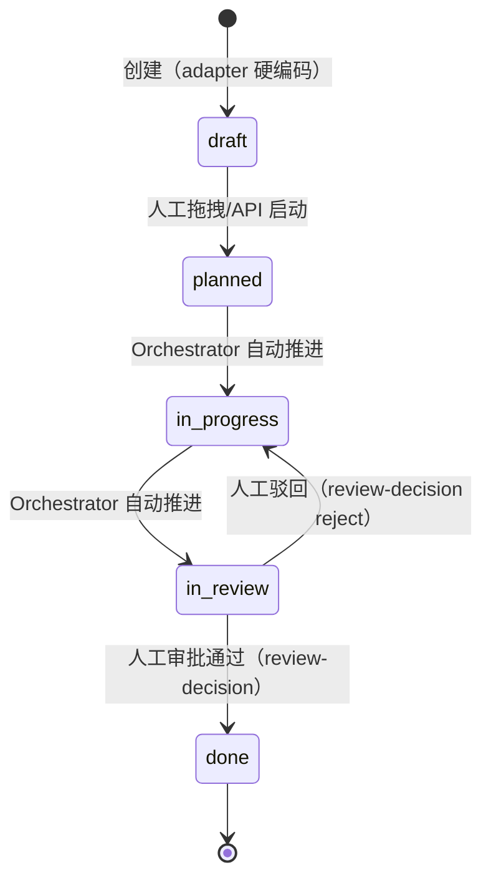
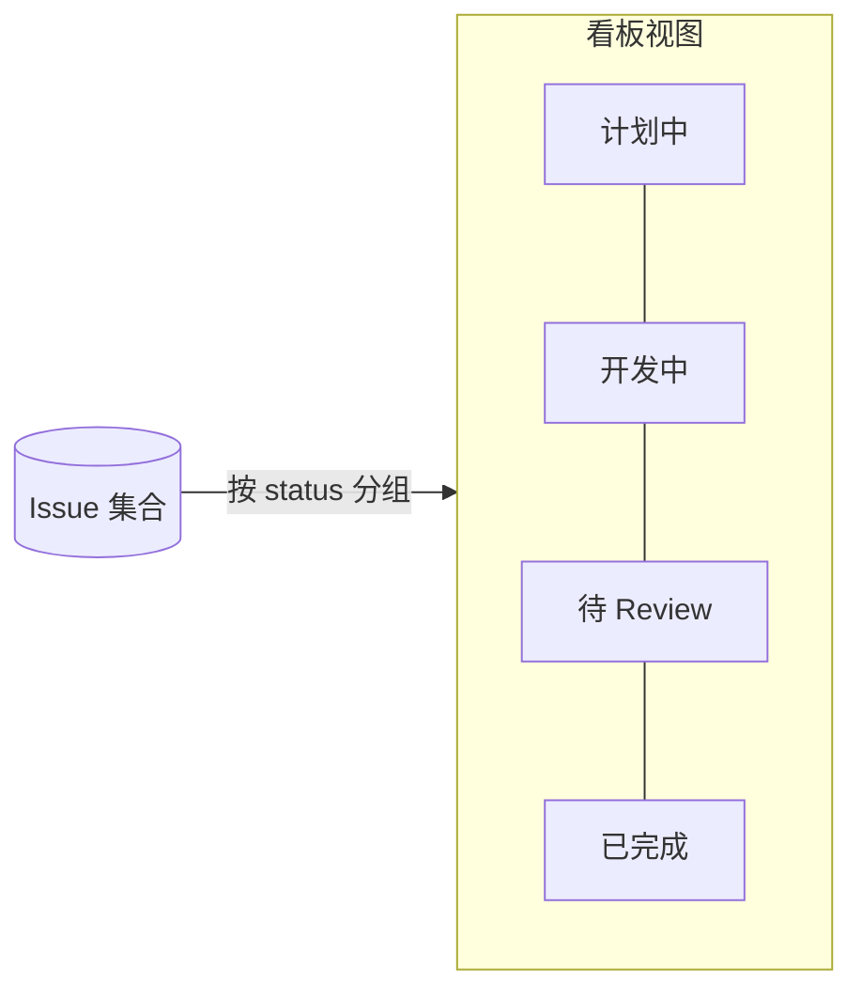

# Issue（将被 Loop 吸收）

> 本页 `status: current`：已落地为代码。[Loop](./loop.md)（`status: design`）将吸收 Issue——手动工作成为 trigger=manual 的 Loop 特例。本页在 Loop 迁移完成后降为 tombstone。

Issue 是「一个有独立状态机生命周期的工作单元」。它从「计划中」开始，经「开发中」「待 Review」走到「已完成」。

## 这页解决什么问题

系统已经能跑单次对话、单次运行。但「让一组 Agent 协作完成一件需要多轮推进的活」缺一个承载体：这件活有自己的状态（还没开始 / 正在做 / 等人验收 / 做完了），会跨越多次运行，会被看板呈现，会被编排器驱动着往前走。

这件事属于哪个已有领域对象？按[设计哲学](../design-philosophy.md)的硬要求——**每个新概念必须说明为什么已有概念不能表达**——逐条检查：

- **Conversation** 回答「谁在一个共享空间里说话」。它的生命周期是「开着 / 归档」，没有「待 Review」这种工作推进态。一个 Conversation 里可以并行讨论好几件活，Conversation 粒度太粗，承不住单件活的状态机。
- **Run** 回答「一次执行从发起到收尾」。它的 terminal state 是 succeeded / error / aborted，描述的是「这一次跑完没跑完」，不是「这件活推进到哪一步」。一件活通常要好几次 Run（计划一次、开发一次、Review 一次），Run 粒度太细。
- **Message** 回答「一条话的内容与状态」。它的状态是 streaming / done / error，是渲染态，不是工作态。

三者都表达不了「一件需要跨多次运行、按状态推进的活」。这个语义没有现成本体能装，所以 Issue 作为new entity成立，Kanban 和 Project 都不是（见下）。（[Loop](./loop.md) 是后来的统一容器——Loop issue 和 manual issue 是同一实体，只是 origin 和推进路径不同。）

## Issue 的身份与字段

```ts
Issue = {
  issueId: string,           // ULID，由 createIssueService 通过 idGen() 生成
  projectId: string,         // 所属 Project，见下文
  title: string,
  status: "draft" | "planned" | "in_progress" | "in_review" | "done"
          // Loop 扩展状态（status: design）：
          | "triaged" | "fixing" | "verifying" | "awaiting_review" | "resolved" | "inbox",
  source: "loop" | "manual",   // 新增（status: design）
  loopId: string | null,       // 新增（status: design），manual issue 为 null
  threadId: string,          // "issue:<issueId>"，service 内部派生
  createdAt: number,
  updatedAt: number
}
```

关键设计点：**Issue 直接绑定一个 `threadId`**。它不发明新的执行机制——一旦某个状态需要 Agent 干活，就用这个 `threadId` 经现有 [run feature](../backend/overview.md) 的 `startAgentRun` 起运行、用现有 checkpointer resume。Issue 只新增「工作态」这一层语义，执行层完全复用。

## 生命周期



这是一条**固定的线性推进**。每一步状态转移由谁触发、转移时跑什么——由 [Orchestrator](../backend/orchestrator.md) 负责（转移表定义在 `apps/backend/src/features/orchestrator/transitions.ts`），本页只定义 Issue 这个本体本身。M18.2 起，状态推进的自动驱动由 Orchestrator 经 `run_origin.issue_id` 关联实现。

> 为什么转移表是固定线性的、而不是可配置的工作流图：这是有意的设计取舍，理由见 [Orchestrator](../backend/orchestrator.md) 的「设计取舍」小节。

## 与 Conversation 解耦

Issue 不挂在某个 Conversation 下，它自带 `threadId`、自管状态机。这条边界是硬的：

- Conversation 变了（归档、成员进出）不影响 Issue 的推进。
- 一个 Issue 的执行历史在它自己的 `threadId` 里，不和对话历史搅在一起。
- 看板（Kanban）按 Issue 聚合，不按 Conversation 聚合。

解耦的代价是：Issue 与对话之间若要联动（例如对话里 @ 出一个 Issue），需要显式的引用关系，而不是隐式的从属。这个取舍是值得的——它让 Issue 的状态机保持纯粹。

## Kanban：Issue 的视图，不是new entity

Kanban（看板）= 把 Issue 按 `status` 分组渲染：每一列是一个状态，列里是处于该状态的 Issue 卡片。



按[设计哲学](../design-philosophy.md)「Projection is mechanism, not the main thread」：Kanban **零本体影响**——它不持久化新事实，不定义新生命周期，只是 Issue 集合的一种读模型。卡片在列间移动 = Issue 的 `status` 变了，事实仍在 Issue 上。所以 Kanban 是本页的一个小节，而不是独立概念页。

## Project：Issue 的归属，近乎纯机制

Project = Issue 的归属标记（`projectId` + `name` + `repoUrl` + `defaultBranch`），定义在 `apps/backend/src/features/project/domain.ts`。Issue 通过 `projectId` 归属到某个 Project。Project 在这套设计里**近乎纯机制**：它不克隆仓库、不引入新的执行语义，只是「这件活在哪个代码库里干」的归属标记。所以 Project 同样是小节而非独立本体——它回答「归属于哪个仓库」，不回答「这是什么活」。

## 不变量

1. Issue 是新增的domain entity；Kanban 是它的视图，Project 是它的归属，二者都不是new entity。[Loop](./loop.md) 是 Issue 的超集——共享同一实体，不新增 Issue 的平行概念。
2. Issue 的 terminal state 在 Issue 自身（`status: done`）表达，不靠旁路事件推断。
3. Issue 直接绑定 `threadId`，执行层复用现有 supervisor / checkpointer，不发明新执行机制。
4. Issue 与 Conversation 解耦：彼此生命周期互不从属。

## 关联页面

- [Loop](./loop.md) — Issue 的超集容器
- [Loop Pattern](./loop-pattern.md) — Loop 的预制配置模板
- [LoopRunner](../backend/loop-runner.md) — Loop 的编排引擎
- [Orchestrator](../backend/orchestrator.md)
- [事实与投影](../foundations/facts-and-projections.md)
- [后端总览](../backend/overview.md)
- [架构设计哲学](../design-philosophy.md)
